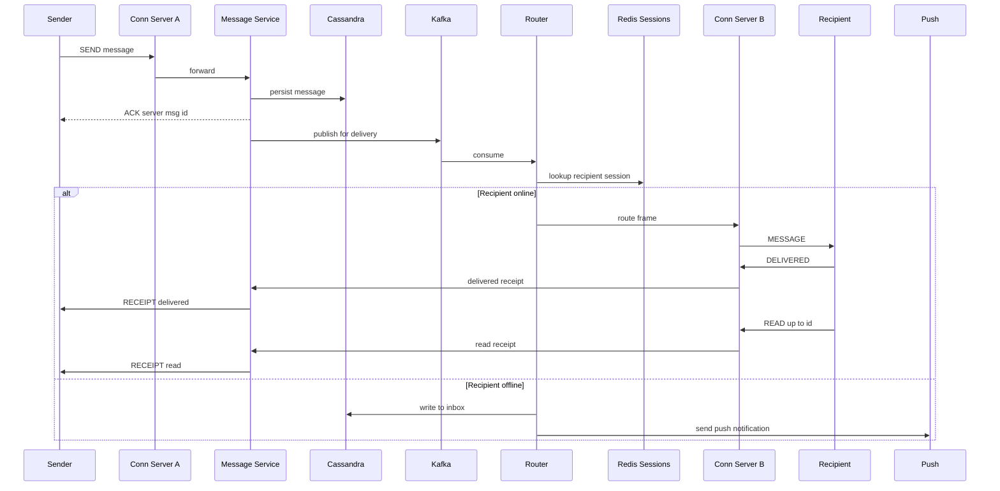

# Design a Chat System (WhatsApp / Messenger)

A chat system looks simple — send a string from A to B — but the moment you add billions of always-connected users, delivery guarantees, read receipts, presence, and group fanout, it becomes a study in **stateful connections** and **message routing**. This case study designs a WhatsApp/Messenger-style system.

## 1. Requirements

### Functional
- **1:1 messaging** in real time.
- **Group messaging** (up to ~500 members).
- **Delivery state**: sent → delivered → read (the single/double/blue tick model).
- **Presence**: online / offline / last-seen.
- **Offline delivery**: messages sent while the recipient is offline are stored and delivered on reconnect; a push notification is sent.
- Message history persisted and synced across a user's devices.
- Media messages (images, voice, video).

### Non-functional
- **Low latency**: end-to-end delivery for online users < 200 ms.
- **High availability**: chat must not go down.
- **Reliability**: messages are never lost and never duplicated (exactly-once *as perceived by the user*).
- **Ordering**: messages within a conversation appear in a consistent order on all devices.
- **Scale**: hundreds of millions of concurrent persistent connections.
- **Security**: end-to-end encryption for message contents.

### Clarifying questions
- Persistent connection or polling? (Persistent — WebSocket.)
- Are receipts and presence required? (Yes.)
- Max group size? (~500.)
- Is E2E encryption in scope? (Note the design; the server routes ciphertext.)
- Multi-device sync? (Yes — messages fan out to all of a user's devices.)

## 2. Capacity Estimation

Assume **500M DAU**, ~50% concurrently connected.

**Concurrent connections:**
- 500M × 0.5 = **250M concurrent WebSocket connections**.
- If one connection server holds ~100K connections, we need **~2,500 connection servers** (plus headroom).

**Messages:**
- 40 messages/user/day → 500M × 40 = **20B messages/day**.
- Write QPS = 20B / 86,400 ≈ **~230,000 msgs/sec**, peak ~3x → **~700,000/sec**.

**Storage:**
- Per message ≈ 300 bytes (ids, ciphertext, timestamps, status).
- 20B/day × 300 B ≈ **6 TB/day** ≈ **~2.2 PB/year** before replication.
- With RF=3 → **~6.5 PB/year**. Older messages tier to cheaper storage; some deployments keep server history short and rely on device-local storage.

**Media:** ~10% of messages carry media, avg 300 KB → 2B × 300 KB = **600 TB/day**, stored in object storage (S3) + CDN, referenced by a key in the message.

**Bandwidth (presence):** presence/heartbeat traffic is small per message (~tens of bytes) but constant across 250M connections — a real cost that drives the design toward efficient pub/sub rather than per-user polling.

## 3. API Design

The hot path is a **WebSocket** carrying typed frames, not REST; supporting REST/gRPC endpoints cover non-real-time operations like history sync and group creation.

```api
{
  "endpoints": [
    {
      "method": "WS",
      "path": "frame: SEND (client -> server)",
      "desc": "Client sends a message over the persistent socket.",
      "request": { "client_msg_id": "uuid", "conversation_id": "bigint", "ciphertext": "blob", "media_ref": "string?" },
      "responses": [
        { "status": "ACK", "body": { "client_msg_id": "uuid", "server_msg_id": "bigint", "ts": "timestamp" }, "desc": "server persisted it" }
      ]
    },
    {
      "method": "WS",
      "path": "frame: MESSAGE (server -> client)",
      "desc": "Server pushes an inbound message frame to the recipient device.",
      "responses": [
        { "status": "MESSAGE", "body": { "server_msg_id": "bigint", "conversation_id": "bigint", "from": "bigint", "ciphertext": "blob", "ts": "timestamp" } }
      ]
    },
    {
      "method": "WS",
      "path": "frame: DELIVERED / READ (client -> server)",
      "desc": "Recipient device reports delivery and read state.",
      "request": { "DELIVERED": { "server_msg_id": "bigint" }, "READ": { "conversation_id": "bigint", "up_to_msg_id": "bigint" } }
    },
    {
      "method": "WS",
      "path": "frame: RECEIPT / PRESENCE (server -> client)",
      "desc": "Server pushes receipts back to the sender and presence updates.",
      "responses": [
        { "status": "RECEIPT", "body": { "server_msg_id": "bigint", "state": "delivered|read" } },
        { "status": "PRESENCE", "body": { "user_id": "bigint", "state": "online|offline", "last_seen": "timestamp" } }
      ]
    },
    {
      "method": "WS",
      "path": "frame: HEARTBEAT (client -> server)",
      "desc": "Keepalive that refreshes the session TTL and presence.",
      "request": {}
    },
    {
      "method": "GET",
      "path": "/v1/conversations/{id}/messages?before=&limit=50",
      "auth": "bearer",
      "desc": "History sync (single-partition clustering scan).",
      "responses": [
        { "status": "200 OK", "body": { "messages": "[Message]" } }
      ]
    },
    {
      "method": "POST",
      "path": "/v1/groups",
      "auth": "bearer",
      "desc": "Create a group.",
      "request": { "name": "string", "member_ids": "[bigint]" },
      "responses": [
        { "status": "201 Created", "body": { "group_id": "bigint" } }
      ]
    },
    {
      "method": "POST",
      "path": "/v1/media",
      "auth": "bearer",
      "desc": "Request a pre-signed S3 upload URL.",
      "responses": [
        { "status": "200 OK", "body": { "media_id": "bigint", "upload_url": "string" } }
      ]
    }
  ]
}
```

## 4. Data Model

Messages are an append-only, time-ordered log per conversation with enormous write volume — a textbook fit for a **wide-column store (Cassandra / HBase)**. We partition by conversation so fetching a chat's history is a single-partition, clustering-ordered scan. We deliberately avoid a relational store on the hot path: we don't need joins, we do need linear write scaling and tunable consistency.

```datamodel
{
  "entities": [
    {
      "name": "messages_by_conversation",
      "store": "Cassandra",
      "fields": [
        { "name": "conversation_id", "type": "bigint", "key": "PK", "note": "partition with bucket" },
        { "name": "bucket", "type": "int", "key": "PK", "note": "e.g. day epoch, caps partition size" },
        { "name": "message_id", "type": "bigint", "key": "CK", "note": "Snowflake, time-sortable, DESC" },
        { "name": "sender_id", "type": "bigint" },
        { "name": "ciphertext", "type": "blob", "note": "server never sees plaintext" },
        { "name": "media_ref", "type": "text" },
        { "name": "created_at", "type": "timestamp" }
      ],
      "partitionKey": "(conversation_id, bucket) -> message_id DESC",
      "notes": "Bucketing prevents unbounded partitions in busy chats."
    },
    {
      "name": "message_status",
      "store": "Cassandra",
      "fields": [
        { "name": "message_id", "type": "bigint", "key": "PK" },
        { "name": "recipient_id", "type": "bigint", "key": "CK" },
        { "name": "state", "type": "text", "note": "delivered | read" },
        { "name": "updated_at", "type": "timestamp" }
      ],
      "notes": "Per-recipient state so receipts don't rewrite the message row."
    },
    {
      "name": "group_members",
      "store": "Cassandra",
      "fields": [
        { "name": "group_id", "type": "bigint", "key": "PK" },
        { "name": "user_id", "type": "bigint", "key": "CK" },
        { "name": "role", "type": "text" }
      ]
    },
    {
      "name": "inbox",
      "store": "Cassandra",
      "fields": [
        { "name": "user_id", "type": "bigint", "key": "PK", "note": "per-user pending offline messages" },
        { "name": "message_id", "type": "bigint", "key": "CK", "note": "DESC" }
      ],
      "partitionKey": "(user_id) -> message_id DESC"
    },
    {
      "name": "session:{user_id}",
      "store": "Redis",
      "fields": [
        { "name": "value", "type": "server_id", "note": "which connection server holds the user" },
        { "name": "ttl", "type": "seconds", "note": "short TTL refreshed by heartbeats" }
      ],
      "notes": "Ephemeral routing state; expires on disconnect."
    }
  ],
  "relationships": [
    { "from": "messages_by_conversation", "to": "message_status", "kind": "1:N", "label": "one message -> per-recipient state" },
    { "from": "group_members", "to": "messages_by_conversation", "kind": "N:1", "label": "members resolve fanout targets" },
    { "from": "messages_by_conversation", "to": "inbox", "kind": "1:N", "label": "offline copy per recipient" }
  ]
}
```

Connection routing state — *which connection server currently holds user X* — lives in **Redis** (`session:{user_id} -> server_id`) with a short TTL refreshed by heartbeats. It is ephemeral, so Redis (not Cassandra) is correct.

## 5. High-Level Architecture

Each device holds a long-lived WebSocket to a connection server; the message service persists and publishes to Kafka, and a router resolves the recipient's session in Redis to deliver online or fall back to inbox plus push.

```arch
{
  "title": "Chat system — 1:1 send, online routing vs offline inbox + push",
  "nodes": [
    { "id": "devA", "label": "Device A", "type": "client", "col": 0, "row": 0, "meta": "sender, persistent WS" },
    { "id": "devB", "label": "Device B", "type": "client", "col": 0, "row": 2, "meta": "recipient device" },
    { "id": "connA", "label": "Connection Server A", "type": "gateway", "col": 1, "row": 0, "meta": "holds sender socket" },
    { "id": "connB", "label": "Connection Server B", "type": "gateway", "col": 1, "row": 2, "meta": "holds recipient socket" },
    { "id": "msg_svc", "label": "Message Service", "type": "service", "col": 2, "row": 0, "meta": "assigns snowflake, ACKs" },
    { "id": "presence", "label": "Presence Service", "type": "service", "col": 2, "row": 2, "meta": "heartbeat -> online TTL" },
    { "id": "msg_db", "label": "Cassandra Messages", "type": "db", "col": 3, "row": 0, "meta": "bucketed by conversation" },
    { "id": "kafka", "label": "Kafka", "type": "queue", "col": 3, "row": 1, "meta": "partition by conversation" },
    { "id": "redis", "label": "Redis Sessions", "type": "cache", "col": 3, "row": 2, "meta": "user -> server, TTL" },
    { "id": "router", "label": "Router", "type": "worker", "col": 4, "row": 1, "meta": "session lookup + route" },
    { "id": "inbox", "label": "Inbox Store", "type": "db", "col": 4, "row": 2, "meta": "pending offline messages" },
    { "id": "push", "label": "APNs / FCM", "type": "external", "col": 4, "row": 3, "meta": "wake offline app" }
  ],
  "edges": [
    { "from": "devA", "to": "connA", "step": 1, "label": "SEND (WebSocket)" },
    { "from": "connA", "to": "msg_svc", "step": 2, "label": "forward" },
    { "from": "msg_svc", "to": "msg_db", "step": 3, "label": "persist + snowflake" },
    { "from": "msg_svc", "to": "kafka", "step": 4, "label": "publish for delivery" },
    { "from": "kafka", "to": "router", "step": 5, "label": "consume" },
    { "from": "router", "to": "redis", "step": 6, "label": "lookup session" },
    { "from": "router", "to": "connB", "step": 7, "label": "online: route frame" },
    { "from": "connB", "to": "devB", "step": 8, "label": "MESSAGE (WebSocket)" },
    { "from": "router", "to": "inbox", "step": 9, "label": "offline: write" },
    { "from": "router", "to": "push", "step": 10, "label": "offline: notify" },
    { "from": "msg_svc", "to": "connA", "label": "ACK to sender" },
    { "from": "connA", "to": "presence", "label": "heartbeat" },
    { "from": "presence", "to": "redis", "label": "online TTL" }
  ],
  "groups": [
    { "label": "Delivery pipeline", "nodes": ["kafka", "router"] },
    { "label": "Data tier", "nodes": ["msg_db", "redis", "inbox"] }
  ]
}
```

**Walkthrough.** Each device holds a long-lived **WebSocket** to a stateless-but-connection-stateful **connection server**.
1. On `SEND`, Device A's frame reaches **connection server A**.
2. The connection server forwards it to the **message service**.
3. The message service assigns a Snowflake `message_id`, persists to Cassandra, and ACKs the sender.
4. It publishes the message to **Kafka** for delivery, decoupling send from deliver.
5. The **router** consumes the event.
6. It looks up the recipient's session in **Redis**.
7. If the recipient is **online**, it routes the frame to the connection server holding that recipient (connection server B).
8. Connection server B pushes the `MESSAGE` frame down Device B's socket; the recipient's `DELIVERED`/`READ` frames flow back through the same pipeline as receipts.
9. If the recipient is **offline**, the router writes the message to the recipient's **inbox**; on reconnect the device drains it.
10. It also fires a **push notification** (APNs/FCM) to wake the app. (Heartbeats from connection servers keep presence and the Redis session map current.)

The primary flow — a 1:1 send with delivery/read receipts when online, or inbox plus push when offline:



## 6. Deep Dives

### 6.1 Persistent connections and connection servers

The defining property is **stateful fanin/fanout**: a connection server holds millions of open TCP/WebSocket connections in memory, each mapped to a user/device. These servers are kept thin — they do not own business logic; they translate between sockets and the internal message bus. Because the connection is the routing key, we maintain a **session registry** in Redis mapping `user_id/device_id -> connection_server_id`, refreshed by heartbeats and expired on disconnect. A load balancer that supports long-lived connections (L4, or L7 with WebSocket upgrade) fronts the fleet. Heartbeats (every ~30 s) detect dead connections so presence and the session map stay accurate.

### 6.2 Message routing and ordering

Delivery is a routing problem: given a `message_id` and recipient, find the connection server holding them and push. We route through a **queue/bus** (Kafka, partitioned by recipient or conversation) so that producers (chat service) and consumers (connection servers) are decoupled and the system tolerates a recipient's server being briefly unavailable.

**Ordering** within a conversation is guaranteed by (a) Snowflake `message_id`s that are monotonic per generator and time-sortable, and (b) partitioning Kafka by `conversation_id` so all of a conversation's messages flow through one partition in order. Clients also carry a `client_msg_id` so the server can **dedupe** retries — giving the user-perceived exactly-once semantics on top of at-least-once transport.

### 6.3 Delivery & read receipts, presence

A message moves through **sent** (server persisted, ACK to sender), **delivered** (recipient device acknowledged with a `DELIVERED` frame, written to `message_status`), and **read** (recipient sent `READ up_to`). Each transition is itself a small message routed back to the original sender's connection — receipts reuse the same delivery pipeline.

**Presence** is derived from connection state: a connect/heartbeat marks a user online in Redis with a TTL; expiry flips them to offline and records `last_seen`. Broadcasting presence naively is expensive (a popular user's status change fans out to everyone). Mitigations: only push presence to users with an open conversation/thread visible, debounce flapping, and let clients pull presence on demand rather than subscribing globally.

### 6.4 Offline delivery, push, and group fanout

When a recipient is offline, the message is appended to their **inbox** table and a **push notification** (APNs for iOS, FCM for Android) is sent to wake the app. On reconnect the client requests messages since its last known `message_id` and the inbox is drained, then trimmed.

**Group messaging** is fanout: a message to a 500-member group expands to per-recipient delivery. We resolve membership from `group_members`, then for each member route-if-online / inbox-if-offline. For large groups this fanout is done by workers off Kafka so a single group blast doesn't block the sender. (Server-side fanout is the common model; client-side fanout exists in some E2E designs but multiplies client encryption work.)

**E2E encryption note.** With the Signal protocol, the server only ever sees **ciphertext** — message bodies are encrypted with per-conversation keys negotiated via the Double Ratchet, and the server distributes public prekeys but cannot read content. This is why our schema stores `ciphertext blob`: routing, receipts, presence, and ordering all work on metadata, never plaintext.

## 7. Bottlenecks & Scaling

- **Connection fleet scaling.** Connections, not CPU, are the limiting resource. Scale connection servers horizontally; use consistent hashing / the Redis session map to find a user's server. Graceful drain on deploy so reconnects spread out instead of a thundering herd.
- **Sharding.** Cassandra partitions messages by `(conversation_id, bucket)`; bucketing caps hot-conversation partition size. Kafka partitions by conversation for ordering. Redis session map is sharded by user.
- **Hotspots.** Huge/active groups and viral broadcasts. Mitigate with worker-pool fanout, rate limits, and batching of receipts.
- **Presence cost.** The constant heartbeat/presence chatter across 250M connections dwarfs message volume; debounce and scope presence subscriptions tightly.
- **Failure handling.** A connection server crash drops its sockets; clients auto-reconnect (to a new server, re-registering in Redis) and resync via inbox + `client_msg_id` dedupe. Kafka + Cassandra RF=3 ensure no message is lost in flight. At-least-once delivery + idempotent client dedupe = no user-visible duplicates.

## 8. Trade-offs & Follow-ups

- **WebSocket vs long-poll:** WebSocket gives true push and lower overhead but requires stateful servers and connection-aware load balancing. Worth it at this scale.
- **Server-side fanout vs client-side fanout** for groups: server-side is simpler and scales operationally; client-side suits strict E2E but multiplies device work.
- **Message retention:** keep full history server-side (storage cost, multi-device sync ease) vs short server retention with device-local storage (WhatsApp's leaner model). A capacity/privacy trade-off.

**Likely follow-ups:**
- *How do you guarantee ordering across devices?* Snowflake ids + per-conversation Kafka partition + client sort by id.
- *How do you avoid duplicate delivery?* `client_msg_id` dedupe; at-least-once transport made idempotent at the client.
- *How does multi-device sync work?* Each device is a delivery target; messages fan out to all of a user's active sessions and the inbox covers offline devices.
- *What happens on reconnect?* Resync from last acked `message_id`, drain inbox.

## Key takeaways
- The hard part is **stateful persistent connections**: thin connection servers + a Redis **session registry** mapping users to the server holding their socket.
- **Decouple send from deliver** with a queue (Kafka); route to the recipient's connection server if online, else **inbox + push notification**.
- **Ordering and dedupe** come from time-sortable Snowflake ids, per-conversation partitioning, and a `client_msg_id` for idempotency.
- **Receipts and presence reuse the delivery pipeline**; presence broadcast is the sneaky scaling cost — debounce and scope it.
- **Cassandra/HBase** partitioned and bucketed by conversation handles the append-heavy message log; media goes to S3 + CDN.
- **E2E encryption** means the server routes ciphertext only — metadata is enough for delivery, receipts, and ordering.
