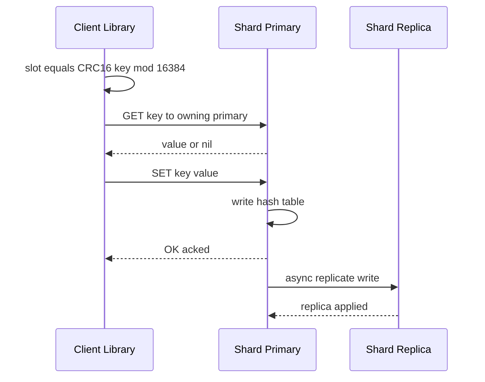

# Design a Distributed Cache

A distributed cache is an **in-memory key-value store spread across many nodes**, sitting between applications and slow backing stores (databases, object stores, microservices) to serve hot data with sub-millisecond latency. The goal is to scale capacity and throughput **horizontally** across a cluster while staying highly available when nodes fail. This is the design behind systems like **Redis Cluster**, **Memcached**, and **Amazon ElastiCache**.

The interesting problems are all about **distribution**: how to place keys, how to add/remove nodes without massive remapping, how to replicate for HA, what to evict, and how the cluster heals itself.

## 1. Requirements

### Functional

- `GET key`, `SET key value [TTL]`, `DELETE key`—the core key-value contract.
- Support **expiration (TTL)** so stale entries self-evict.
- **Eviction** when memory is full (LRU/LFU).
- Scale to many nodes; clients should reach the right node with minimal hops.
- Replication so a node failure doesn't lose all its data or cause a cache stampede.

### Non-functional

- **Low latency:** p99 read/write < 1 ms within a datacenter.
- **High throughput:** millions of ops/sec aggregate across the cluster.
- **High availability:** survive single-node (and ideally rack) failures with automatic failover.
- **Horizontal scalability:** add nodes to grow capacity/throughput near-linearly.
- **Elasticity:** adding/removing a node should remap only a **small fraction** of keys.
- The cache is an **optimization, not the source of truth**—it may lose data; correctness is the backing store's job. This relaxes durability and lets us favor speed and availability (an **AP-leaning** design).

### Clarifying questions

- Is the cache **shared** (lookaside) or **inline** (read-through/write-through)?
- Consistency expectation between replicas—eventual is usually fine for a cache.
- Eviction policy preference (LRU vs LFU) and value size limits?
- Single region or geo-replicated? (Assume single region, multi-AZ for v1.)
- Smart clients (cluster-aware) or a proxy layer?

## 2. Capacity Estimation

Target a sizable cache tier:

- **Working set:** 2 TB of hot data to cache.
- **Per-node RAM usable for data:** ~64 GB (leave headroom for overhead/replication buffers).
- **Nodes (primaries):** 2 TB / 64 GB ≈ **32 primary shards**. With one replica each → **64 nodes**.
- **Throughput target:** 2,000,000 ops/sec. Per node: 2M / 32 ≈ **62,500 ops/sec**, well within a single in-memory node's capability (Redis handles 100k+ ops/s/core).

**Object math:** average value 4 KB, key 50 B, plus ~60 B overhead per entry. 2 TB / ~4.1 KB ≈ **500M entries**. A hash slot map of 16,384 slots (Redis Cluster) comfortably distributes these.

**Network:** at 4 KB values and 2M reads/s → 2M × 4 KB ≈ **8 GB/s** aggregate egress, or ~250 MB/s per primary—within a 10/25 GbE NIC. Hot keys can blow past this on a single node (see deep dive 6.4).

**Memory overhead of replication:** one full replica doubles RAM to ~4 TB total provisioned; the trade is HA for cost.

## 3. API Design

The client protocol is a thin RESP-like (REdis Serialization Protocol) command set. Crucially, **clients are cluster-aware**: they know the slot→node map and route directly.

```api
{
  "endpoints": [
    {
      "method": "GET",
      "path": "GET key",
      "desc": "Fetch the value for a key; routed directly to the owning shard.",
      "responses": [
        { "status": "value", "desc": "value bytes" },
        { "status": "nil", "desc": "key absent or expired" }
      ]
    },
    {
      "method": "PUT",
      "path": "SET key value",
      "desc": "Store a key/value pair.",
      "responses": [ { "status": "OK" } ]
    },
    {
      "method": "PUT",
      "path": "SETEX key ttl_seconds value",
      "desc": "Store a key/value pair with a TTL in seconds.",
      "responses": [ { "status": "OK" } ]
    },
    {
      "method": "DELETE",
      "path": "DEL key",
      "desc": "Delete a key.",
      "responses": [ { "status": "(integer)", "desc": "number of keys removed" } ]
    },
    {
      "method": "PUT",
      "path": "EXPIRE key ttl_seconds",
      "desc": "Set or refresh a TTL on an existing key.",
      "responses": [ { "status": "(integer)", "desc": "1 if set, 0 if key missing" } ]
    },
    {
      "method": "POST",
      "path": "INCR key",
      "desc": "Atomically increment an integer value.",
      "responses": [ { "status": "(integer)", "desc": "the new value" } ]
    },
    {
      "method": "GET",
      "path": "MGET key1 key2 ...",
      "desc": "Multi-key get; all keys must map to the same shard or be scattered.",
      "responses": [ { "status": "array", "desc": "values in request order" } ],
      "notes": "Use hash tags like {user123}:profile to co-locate related keys in one slot."
    },
    {
      "method": "GET",
      "path": "CLUSTER SLOTS",
      "auth": "control plane",
      "desc": "Client fetches the slot->node mapping.",
      "responses": [ { "status": "array", "desc": "slot ranges -> nodes" } ]
    },
    {
      "method": "GET",
      "path": "CLUSTER NODES",
      "auth": "control plane",
      "desc": "Fetch the cluster membership view.",
      "responses": [ { "status": "text", "desc": "node list with state and slots" } ]
    }
  ]
}
```

Wrong-node ops get a redirection reply: `-MOVED <slot> <ip:port>` (permanent—client updates its map) or `-ASK <slot> <ip:port>` (transient, during slot migration).

When a client sends a key to the wrong node, the node replies `-MOVED`/`-ASK` and the client refreshes its slot map—so routing self-corrects after topology changes.

## 4. Data Model

Inside each node, data is a flat **hash table** of key → value with per-key metadata. There is no relational structure—this is the canonical use case for an in-memory key-value design, where O(1) hash lookup and tight memory layout matter far more than query flexibility.

```datamodel
{
  "entities": [
    {
      "name": "Entry",
      "store": "Redis (in-memory hash table, per node)",
      "fields": [
        { "name": "key", "type": "bytes", "key": "PK", "note": "hashed to a slot via CRC16" },
        { "name": "value", "type": "bytes", "note": "opaque payload" },
        { "name": "expires_at", "type": "int64", "note": "epoch ms, 0 = no TTL" },
        { "name": "last_access", "type": "int64", "note": "for LRU" },
        { "name": "freq", "type": "uint8", "note": "approximate counter for LFU" }
      ],
      "notes": "Flat key->value record with metadata; O(1) hash lookup, no relational structure."
    },
    {
      "name": "NodeState",
      "store": "Redis (in-memory structures, per node)",
      "fields": [
        { "name": "hash_table", "type": "Map<keyhash, Entry>", "key": "PK", "note": "main store, O(1)" },
        { "name": "eviction_index", "type": "LRU list / LFU min-heap", "note": "candidates to evict" },
        { "name": "expiry_sampler", "type": "random sample of TTL keys", "note": "proactive expiry" },
        { "name": "slot_ownership", "type": "Set<slot_id>", "note": "which of 16384 slots this node serves" }
      ]
    }
  ],
  "relationships": [
    { "from": "NodeState", "to": "Entry", "kind": "1:N", "label": "one node holds many entries in its hash table" }
  ]
}
```

A key's home is computed as `slot = CRC16(key) mod 16384`, and slots are assigned to nodes. The two-level mapping (**key → slot → node**) is what makes resharding cheap: you move *slots*, not individual keys, and you never have to rehash every key.

## 5. High-Level Architecture

The cluster is a set of primary shards, each owning a disjoint range of the 16,384 hash slots, with an async replica per primary. A cluster-aware client routes each op directly to the owning node, so there is no proxy in the hot path.

```arch
{
  "title": "Redis Cluster — direct-routed reads/writes with async replication and quorum failover",
  "nodes": [
    { "id": "app", "label": "Application", "type": "client", "col": 0, "row": 1, "meta": "issues GET/SET" },
    { "id": "router", "label": "Cluster-aware Client", "type": "service", "col": 1, "row": 1, "meta": "caches slot map, routes by CRC16 slot" },
    { "id": "pa", "label": "Shard A Primary", "type": "cache", "col": 2, "row": 0, "meta": "slots 0–5460" },
    { "id": "pb", "label": "Shard B Primary", "type": "cache", "col": 2, "row": 1, "meta": "slots 5461–10922" },
    { "id": "pc", "label": "Shard C Primary", "type": "cache", "col": 2, "row": 2, "meta": "slots 10923–16383" },
    { "id": "ra", "label": "Replica A", "type": "cache", "col": 3, "row": 0, "meta": "async follower" },
    { "id": "rb", "label": "Replica B", "type": "cache", "col": 3, "row": 1, "meta": "async follower" },
    { "id": "rc", "label": "Replica C", "type": "cache", "col": 3, "row": 2, "meta": "async follower" },
    { "id": "quorum", "label": "Quorum Failover", "type": "service", "col": 4, "row": 1, "meta": "PFAIL→FAIL, promotes a replica" }
  ],
  "edges": [
    { "from": "app", "to": "router", "step": 1, "label": "GET/SET key" },
    { "from": "router", "to": "pa", "step": 2, "label": "route by slot" },
    { "from": "router", "to": "pb", "label": "slot 5461–10922" },
    { "from": "router", "to": "pc", "label": "slot 10923–16383" },
    { "from": "pa", "to": "ra", "step": 3, "label": "async replicate" },
    { "from": "pb", "to": "rb", "label": "async replicate" },
    { "from": "pc", "to": "rc", "label": "async replicate" },
    { "from": "pa", "to": "pb", "label": "gossip" },
    { "from": "pb", "to": "pc", "label": "gossip" },
    { "from": "pa", "to": "quorum", "label": "health" },
    { "from": "pb", "to": "quorum", "label": "health" },
    { "from": "pc", "to": "quorum", "label": "health" }
  ],
  "groups": [
    { "label": "Shard primaries", "nodes": ["pa", "pb", "pc"] },
    { "label": "Replicas", "nodes": ["ra", "rb", "rc"] }
  ]
}
```

1. The **cluster-aware client** caches the slot map and hashes each key (`slot = CRC16(key) mod 16384`) to find the owning node.
2. It routes the op straight to the **owning primary**—one network hop, no proxy in the hot path (Redis Cluster model): Shard A owns slots 0–5460, B owns 5461–10922, C owns 10923–16383.
3. Each **primary** asynchronously streams its writes to its **replica**; on primary failure that replica is promoted.
- Primaries exchange **gossip** to spread membership and health, so the topology converges with no central bottleneck.
- A **quorum** of primaries confirms a node is down (`PFAIL → FAIL`) before promoting its replica, avoiding split-brain. A proxy-based design (e.g., Twemproxy/Mcrouter for Memcached) instead trades a hop for simpler, dumb clients.

A `GET` hashes the key to its slot and routes directly to the owning primary; a `SET` writes the primary, which then streams the change to its replica asynchronously:



## 6. Deep Dives

### 6.1 Data distribution via consistent hashing

Naive `hash(key) mod N` is a trap: changing `N` (adding a node) remaps **almost every key**, causing a catastrophic cache miss storm. **Consistent hashing** solves this by mapping both nodes and keys onto a ring (hash space `0..2^32`); a key belongs to the next node clockwise. Adding/removing a node only reassigns the keys in **one arc**, i.e., ~`K/N` keys.

To avoid uneven load (some arcs much larger than others), each physical node owns many **virtual nodes** (vnodes) scattered around the ring, smoothing distribution. Redis Cluster uses a discretized variant: a fixed **16,384 hash slots** assigned to nodes; resharding moves slots between nodes. Slots are essentially pre-baked vnodes that make ownership explicit and migration scriptable. The win is the same: **scaling moves a small, bounded fraction of keys.**

### 6.2 Replication for HA: primary/replica and failover

Each primary has one or more **replicas** that receive an async stream of writes. Reads can optionally be served from replicas to scale read throughput (accepting slightly stale data). On primary failure:

1. Replicas/peers detect the primary is unreachable (gossip + timeout).
2. A **quorum** of primaries agrees the node is down (avoids split-brain from a transient blip).
3. A replica is **promoted** to primary; it claims the dead primary's slots and gossips the new map.
4. Clients receive `-MOVED` on stale routes and update.

Replication is **asynchronous**, so a primary can ack a write and die before the replica receives it—**a few writes can be lost on failover.** For a cache this is acceptable (re-fetch from the DB on miss). Synchronous replication would add latency and hurt availability for marginal benefit. This is the deliberate **AP over CP** choice: stay available and fast, tolerate rare lost writes.

### 6.3 Eviction (LRU/LFU) and TTL

Memory is finite, so when a node hits its `maxmemory` limit it must **evict**. Policies:

- **LRU (Least Recently Used):** evict the entry not touched for longest. Great for recency-skewed workloads. True LRU needs a doubling-linked list per access; production caches use **approximate LRU** (sample K random keys, evict the oldest) to save memory and CPU.
- **LFU (Least Frequently Used):** evict the least-*frequently* accessed, using a small probabilistic counter with decay. Better when popularity is stable and some keys are perennially hot but accessed in bursts.
- **TTL-based:** entries with `expires_at` are removed lazily (on access, if expired) and proactively via **random sampling** of TTL keys—Redis samples a batch periodically and deletes the expired fraction, repeating if too many were expired.

The choice matters: **LRU** suits "recently used = likely reused" (sessions, feeds); **LFU** suits skewed long-tail popularity (product catalog). Many systems default to `allkeys-lru`.

### 6.4 Hot keys and cache stampede

A **hot key** (one viral item) concentrates traffic on a single shard, overwhelming one node regardless of how well the cluster is balanced—consistent hashing doesn't help because it's *one* key. Mitigations:

- **Client-side local cache** (near cache) for ultra-hot keys, with short TTL.
- **Key splitting / replication of the hot key** across N copies (`hotkey#0..hotkey#N`), reads pick a random copy—spreads load across shards.
- **Read from replicas** to multiply read capacity for that shard.

A related failure is the **cache stampede / thundering herd**: a popular key expires and thousands of concurrent misses all hit the DB simultaneously. Fixes: **request coalescing** (single-flight—one fetch, others wait), **probabilistic early expiration** (refresh slightly before TTL), and **mutex/lock on recompute**.

### 6.5 Cache-aside integration and write consistency

The common pattern is **cache-aside (lookaside)**: the app reads cache; on miss, loads from DB and populates the cache. On writes, the app updates the DB and **invalidates** (deletes) the cache key—delete rather than update, to avoid races where a stale write overwrites a fresh one. Alternatives:

- **Write-through:** write cache and DB synchronously—consistent but slower writes.
- **Write-behind:** write cache, async flush to DB—fast but risks loss.

The eternal hazard is **stale data** from interleaving (read populates an old value after a concurrent invalidate). The standard "delete on write + short TTL as backstop" keeps inconsistency bounded. Because the backing store is authoritative, **eventual consistency** in the cache is acceptable.

### 6.6 Cluster membership, failure detection, and cold start

Nodes track each other via a **gossip protocol**: each node periodically pings a few peers, piggybacking its view of the cluster (who's up, who owns which slots). Failures are detected with **PFAIL → FAIL** escalation (one node suspects, a quorum confirms), preventing a single laggy link from triggering spurious failover. Gossip scales because no node needs a connection to all others, and the topology converges in `O(log N)` rounds.

**Cold start / warming:** a freshly added or restarted node has an empty cache; routing traffic to it causes a miss spike against the DB. Mitigations: **gradual slot migration** (move slots in batches, warming as you go), **replica promotion** instead of cold primaries (the replica already holds data), and **pre-warming** by replaying a recent key access log or snapshot before taking traffic.

## 7. Bottlenecks & Scaling

- **Single-shard hotspot:** the dominant real-world failure. Handle with hot-key replication, near caches, and replica reads (see 6.4).
- **Resharding cost:** slot migration moves data and briefly serves `-ASK` redirects; throttle migration to avoid latency spikes.
- **Memory pressure:** tune `maxmemory` below physical RAM to leave room for replication buffers and fragmentation; fragmentation can waste 20–30% RAM.
- **Network saturation:** big values + high QPS can saturate a NIC before CPU; cap value sizes, compress, and shard hot data.
- **Failover correctness:** require a primary quorum to promote, avoiding **split-brain** where two nodes both think they own a slot.
- **Connection storms:** thousands of clients × many nodes = huge connection counts; use connection pooling or a proxy tier.

## 8. Trade-offs & Follow-ups

| Decision | Chosen | Alternative | Why |
|---|---|---|---|
| Key placement | Consistent hashing / hash slots | `hash mod N` | Adding nodes remaps ~K/N keys, not all |
| Replication | Async primary/replica | Synchronous | Speed + availability; cache can lose a few writes |
| Consistency | Eventual (AP) | Strong (CP) | Backing store is source of truth |
| Topology awareness | Smart client | Proxy layer | One hop, no proxy bottleneck (Redis model) |
| Eviction default | LRU (approx) | LFU | Recency suits most workloads |

**Redis Cluster vs Memcached:** Redis Cluster offers built-in sharding via hash slots, replication, failover, rich data types, and optional persistence—at higher per-op overhead and operational complexity. **Memcached** is simpler: pure key-value, multithreaded, no built-in replication or cluster protocol (sharding is client/proxy-side via consistent hashing), making it leaner for a plain lookaside cache. Choose Redis when you need HA, data structures, or atomic ops; Memcached when you want a minimal, multi-core, ephemeral cache.

**Likely follow-ups:**

- *How do you do an atomic multi-key op across shards?* You generally can't—use **hash tags** (`{user123}:profile`) so related keys share a slot.
- *Geo-distribution?* Active-passive replication across regions with conflict-free, last-writer-wins semantics for a cache.
- *How big should a value be?* Keep values small (<100 KB); large blobs belong in object storage with the cache holding pointers.

## Key takeaways

- A distributed cache is an **AP-leaning, in-memory KV store**: it favors speed and availability because the database remains the source of truth.
- **Consistent hashing / hash slots** are the heart of the design—they let you add and remove nodes while remapping only a small, bounded fraction of keys.
- **Async primary/replica replication** plus quorum-based failover gives high availability at the cost of rare lost writes—an acceptable trade for a cache.
- **Eviction (LRU/LFU) and TTL** keep memory bounded; pick the policy to match the workload's access skew.
- **Hot keys and cache stampedes** are the real-world scaling pain, mitigated by key replication, near caches, and request coalescing—not by sharding alone.
- **Gossip-based membership** lets the cluster detect failures and converge on topology without a central coordinator, and warming strategies avoid cold-start miss storms.
