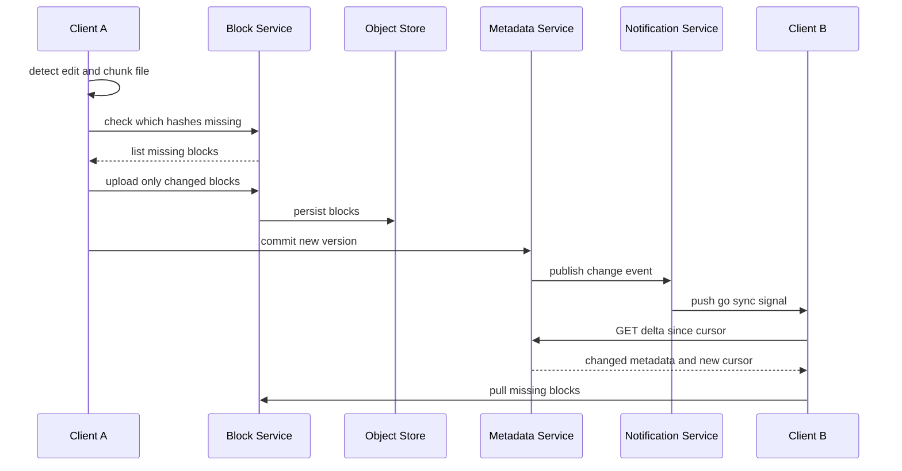

A cloud file-sync service keeps a set of files identical across all of a user's devices and the cloud, plus enables sharing. The interesting engineering is not "store a file" — it's syncing efficiently (don't re-upload a 2 GB file when one byte changed), deduplicating across users, detecting changes quickly, and resolving conflicts when two devices edit while offline. We design a Dropbox/Drive-style system around **content-addressed chunks**, a **metadata service**, and a **notification-driven sync** loop.

## 1. Requirements

### Functional
- Upload/download files; sync changes automatically across devices.
- Efficient sync: transfer only changed parts (delta sync).
- Deduplication so identical content is stored once.
- File versioning and history.
- Sharing with permissions (view/edit) for users and links.
- Offline edits that reconcile on reconnect.

### Non-functional
- **Durability** of file data (11 nines).
- **Strong consistency** of metadata (a file's version order must be unambiguous); file blocks can be eventually consistent.
- **Low sync latency**: a change on one device appears on others within seconds.
- **Bandwidth efficiency** — minimize bytes on the wire.
- Scale to hundreds of millions of users and billions of files.

### Clarifying questions
- Max file size? (Support large files via chunking; cap at, say, 50 GB.)
- Real-time collaborative editing (Google Docs-style OT/CRDT) in scope? We focus on file sync, not character-level co-editing.
- Do we need full version history forever or a rolling window? Assume 30-day history (configurable).

## 2. Capacity Estimation

Assume **100M DAU**, each with **200 files** synced and making **10 file changes/day**.

- **Writes**: 100M × 10 = **1B file-change events/day** ≈ **11.5K write QPS** avg (1B ÷ 86,400 s), ~3x peak ≈ **35K**. Each change touches only a few chunks thanks to delta sync.
- **Reads (metadata polls/notifications)**: clients hold persistent connections; assume effective metadata read QPS ~50K.

**Storage**:
- Total files = 100M users × 200 files × avg 1 MB = **20 PB** logical.
- **Dedup** typically reclaims 30–50% across users (shared documents, OS files, app installers) → ~12 PB physical.
- Growth: 1B changes/day × avg 200 KB changed = **200 TB/day** of new chunk data before dedup; say ~120 TB/day after dedup → **~44 PB/year** (120 TB × 365).

**Bandwidth**: delta sync is the whole point. Without it, a 1 MB file re-uploaded on every edit = 1B × 1 MB = **1 PB/day**. With chunk-level delta, only changed 4 MB blocks move — often a single block — cutting upload bandwidth by an order of magnitude.

| Metric | Estimate |
|---|---|
| Change write QPS (avg/peak) | 11.5K / 35K |
| Metadata read QPS | ~50K |
| Logical / physical storage | 20 PB / ~12 PB |
| New data/year (post-dedup) | ~44 PB |

## 3. API Design

```api
{
  "endpoints": [
    {
      "method": "POST",
      "path": "/v1/files",
      "auth": "bearer",
      "desc": "Create a new file metadata record.",
      "request": { "path": "string", "size": "int", "mimeType": "string" },
      "responses": [
        { "status": "201 Created", "body": { "fileId": "string", "version": 1 } }
      ]
    },
    {
      "method": "GET",
      "path": "/v1/files/{fileId}",
      "auth": "bearer",
      "desc": "Fetch metadata, ordered chunk list, and current version.",
      "responses": [
        { "status": "200 OK", "body": { "fileId": "string", "version": "int", "chunks": ["hash"] } },
        { "status": "404 Not Found", "desc": "Unknown fileId" }
      ]
    },
    {
      "method": "PATCH",
      "path": "/v1/files/{fileId}",
      "auth": "bearer",
      "desc": "Commit a new version pointing at uploaded chunks.",
      "request": { "newChunks": ["hash"], "removedChunks": ["hash"], "parentVersion": "int" },
      "responses": [
        { "status": "200 OK", "body": { "version": "int" } },
        { "status": "409 Conflict", "desc": "parentVersion != latest_version; a conflicted copy is created" }
      ]
    },
    {
      "method": "DELETE",
      "path": "/v1/files/{fileId}",
      "auth": "bearer",
      "desc": "Soft-delete a file (recoverable within retention window).",
      "responses": [
        { "status": "204 No Content" }
      ]
    },
    {
      "method": "GET",
      "path": "/v1/files/{fileId}/versions",
      "auth": "bearer",
      "desc": "List the version history for a file.",
      "responses": [
        { "status": "200 OK", "body": { "versions": ["int"] } }
      ]
    },
    {
      "method": "POST",
      "path": "/v1/blocks/check",
      "auth": "bearer",
      "desc": "Ask which content hashes the server is missing.",
      "request": { "hashes": ["sha256"] },
      "responses": [
        { "status": "200 OK", "body": { "missing": ["sha256"] } }
      ]
    },
    {
      "method": "PUT",
      "path": "/v1/blocks/{hash}",
      "auth": "bearer",
      "desc": "Upload a single block; only sent if reported missing.",
      "request": { "body": "binary block" },
      "responses": [
        { "status": "201 Created" }
      ]
    },
    {
      "method": "GET",
      "path": "/v1/blocks/{hash}",
      "auth": "bearer",
      "desc": "Download a block by content hash.",
      "responses": [
        { "status": "200 OK", "body": { "body": "binary block" } }
      ]
    },
    {
      "method": "GET",
      "path": "/v1/cursor",
      "auth": "bearer",
      "desc": "Get the client's current sync cursor.",
      "responses": [
        { "status": "200 OK", "body": { "cursor": "opaque token" } }
      ]
    },
    {
      "method": "GET",
      "path": "/v1/delta?cursor=...",
      "auth": "bearer",
      "desc": "Fetch all changes since the supplied cursor.",
      "responses": [
        { "status": "200 OK", "body": { "changes": ["change"], "newCursor": "opaque token" } }
      ]
    },
    {
      "method": "WS",
      "path": "/v1/notify",
      "auth": "bearer",
      "desc": "Long-poll / WebSocket channel for lightweight 'go sync' push signals.",
      "responses": [
        { "status": "101 Switching Protocols" }
      ]
    },
    {
      "method": "POST",
      "path": "/v1/files/{fileId}/share",
      "auth": "bearer",
      "desc": "Grant a user access to a file.",
      "request": { "granteeId": "string", "role": "viewer|editor" },
      "responses": [
        { "status": "200 OK" }
      ]
    },
    {
      "method": "POST",
      "path": "/v1/files/{fileId}/links",
      "auth": "bearer",
      "desc": "Create a shareable link with a role and expiry.",
      "request": { "role": "viewer|editor", "expiry": "ISO-8601" },
      "responses": [
        { "status": "201 Created", "body": { "url": "string" } }
      ]
    }
  ]
}
```

The two-phase upload is key: the client first asks `/blocks/check` which hashes the server already has, then uploads **only the missing blocks**, then commits new metadata pointing at those blocks.

## 4. Data Model

We separate **metadata** (small, transactional, queried) from **blocks** (large, immutable, content-addressed). Metadata goes in a sharded SQL database because version ordering, sharing ACLs, and the file/chunk index need transactions and secondary indexes. Blocks go in object storage (S3), keyed by content hash, which gives free dedup and immutability.

```datamodel
{
  "entities": [
    {
      "name": "files",
      "store": "Sharded SQL (PostgreSQL / MySQL)",
      "fields": [
        { "name": "file_id", "type": "bigint", "key": "PK" },
        { "name": "owner_id", "type": "bigint", "note": "shard key; indexed with path" },
        { "name": "path", "type": "varchar(1024)" },
        { "name": "latest_version", "type": "bigint" },
        { "name": "is_deleted", "type": "boolean", "note": "default false (soft delete)" }
      ],
      "notes": "Sharded by owner_id so a user's activity stays on one shard."
    },
    {
      "name": "file_versions",
      "store": "Sharded SQL (PostgreSQL / MySQL)",
      "fields": [
        { "name": "file_id", "type": "bigint", "key": "PK" },
        { "name": "version", "type": "bigint", "key": "PK", "note": "monotonically increasing" },
        { "name": "size", "type": "bigint" },
        { "name": "device_id", "type": "varchar(64)" },
        { "name": "created_at", "type": "timestamp" }
      ],
      "notes": "Each commit appends an immutable version row, enabling history and restore."
    },
    {
      "name": "version_chunks",
      "store": "Sharded SQL (PostgreSQL / MySQL)",
      "fields": [
        { "name": "file_id", "type": "bigint", "key": "PK" },
        { "name": "version", "type": "bigint", "key": "PK" },
        { "name": "seq", "type": "int", "key": "PK", "note": "chunk order within version" },
        { "name": "chunk_hash", "type": "char(64)", "key": "FK", "note": "SHA-256, points into block store" }
      ],
      "notes": "Ordered chunk list per version."
    },
    {
      "name": "chunks",
      "store": "Sharded SQL (PostgreSQL / MySQL)",
      "fields": [
        { "name": "chunk_hash", "type": "char(64)", "key": "PK", "note": "SHA-256 content hash" },
        { "name": "size", "type": "int" },
        { "name": "object_key", "type": "varchar(512)", "note": "key into S3 block store" },
        { "name": "ref_count", "type": "bigint", "note": "GC deletes block at zero" }
      ],
      "notes": "Global dedup index + refcount."
    },
    {
      "name": "shares",
      "store": "Sharded SQL (PostgreSQL / MySQL)",
      "fields": [
        { "name": "file_id", "type": "bigint", "key": "PK" },
        { "name": "grantee_id", "type": "bigint", "key": "PK" },
        { "name": "role", "type": "varchar(16)", "note": "viewer | editor" }
      ],
      "notes": "Sharing ACLs."
    },
    {
      "name": "blocks",
      "store": "S3 (object storage)",
      "fields": [
        { "name": "object_key", "type": "string", "key": "PK", "note": "the key IS the content hash" },
        { "name": "data", "type": "binary", "note": "immutable, content-addressed block" }
      ],
      "notes": "Cheap, durable, infinitely scalable; content-addressing gives free dedup."
    }
  ],
  "relationships": [
    { "from": "files", "to": "file_versions", "kind": "1:N", "label": "one file -> many versions" },
    { "from": "file_versions", "to": "version_chunks", "kind": "1:N", "label": "one version -> ordered chunks" },
    { "from": "version_chunks", "to": "chunks", "kind": "N:1", "label": "many references -> one dedup entry" },
    { "from": "chunks", "to": "blocks", "kind": "1:1", "label": "index row -> stored block" },
    { "from": "files", "to": "shares", "kind": "1:N", "label": "one file -> many grants" }
  ]
}
```

Why SQL for metadata: a file commit must atomically bump `latest_version`, insert the version row, and write the chunk list — a transaction. Why object storage for blocks: cheap, durable, infinitely scalable, and content-addressing means the key *is* the hash.

## 5. High-Level Architecture

```arch
{
  "title": "File sync — missing-block upload, transactional commit, push-driven delta",
  "nodes": [
    { "id": "clienta", "label": "Client A", "type": "client", "col": 0, "row": 0, "meta": "file watcher, chunks locally" },
    { "id": "clientb", "label": "Client B", "type": "client", "col": 0, "row": 3, "meta": "other device of same user" },
    { "id": "blocksvc", "label": "Block Service", "type": "service", "col": 1, "row": 0, "meta": "missing-block detection + transfer" },
    { "id": "metasvc", "label": "Metadata Service", "type": "service", "col": 1, "row": 2, "meta": "transactional version commits" },
    { "id": "store", "label": "Object Store", "type": "blob", "col": 2, "row": 0, "meta": "S3 content-addressed blocks" },
    { "id": "dedup", "label": "Dedup Index", "type": "db", "col": 2, "row": 1, "meta": "chunk hash -> object_key + refcount" },
    { "id": "notify", "label": "Notification Service", "type": "service", "col": 2, "row": 3, "meta": "long-poll / WebSocket push" },
    { "id": "db", "label": "Metadata DB", "type": "db", "col": 3, "row": 2, "meta": "sharded SQL, versions + ACLs" }
  ],
  "edges": [
    { "from": "clienta", "to": "blocksvc", "step": 1, "label": "check missing blocks" },
    { "from": "blocksvc", "to": "store", "step": 2, "label": "put new blocks" },
    { "from": "clienta", "to": "metasvc", "step": 3, "label": "commit version" },
    { "from": "metasvc", "to": "db", "step": 4, "label": "transactional write" },
    { "from": "metasvc", "to": "notify", "step": 5, "label": "publish change" },
    { "from": "notify", "to": "clientb", "step": 6, "label": "push 'go sync'" },
    { "from": "clientb", "to": "metasvc", "step": 7, "label": "fetch delta" },
    { "from": "clientb", "to": "blocksvc", "step": 8, "label": "pull missing blocks" },
    { "from": "blocksvc", "to": "dedup", "label": "dedup by hash" }
  ],
  "groups": [
    { "label": "Block storage", "nodes": ["store", "dedup"] },
    { "label": "Metadata tier", "nodes": ["db"] }
  ]
}
```

**Walkthrough**:
1. **Client A**'s file watcher detects a local change, chunks the file, and asks the **Block Service** which chunk hashes are missing.
2. The Block Service stores only the missing blocks in the **Object Store** (S3), recording each hash in the **Dedup Index** so identical content is kept once.
3. Client A then commits a new version to the **Metadata Service**.
4. The Metadata Service writes the version transactionally to the **Metadata DB** (bump `latest_version`, insert version row, write chunk list).
5. It publishes a change event to the **Notification Service**.
6. The Notification Service pushes a lightweight "go sync" signal to the user's other connected device, **Client B**.
7. Client B calls `/delta` against the Metadata Service to fetch the changed metadata since its cursor.
8. Client B pulls any missing blocks from the Block Service. Decoupling block transfer from the metadata commit lets large uploads proceed independently of the small, fast metadata path.

The delta-sync flow — upload only changed chunks, then wake the other device — looks like this:



## 6. Deep Dives

### 6.1 Chunking: fixed vs. content-defined
Files are split into chunks (~4 MB) before upload. **Fixed-size chunking** is simple but suffers the *boundary-shift problem*: inserting one byte at the start of a file shifts every subsequent block boundary, so every chunk hash changes and the whole file re-uploads. **Content-defined chunking (CDC)** — using a rolling hash (Rabin fingerprint) to place boundaries at content-determined points — keeps boundaries stable across insertions, so an edit only changes the chunks it actually touches. Dropbox historically used fixed 4 MB blocks (good enough for append/overwrite patterns); CDC shines for files edited in the middle. We use CDC for better delta efficiency at the cost of slightly more CPU on the client.

### 6.2 Deduplication via content hashes
Each chunk is identified by its **SHA-256**. The Block Service keeps a global `chunks` table; before uploading, the client sends hashes and receives the set the server lacks. Identical content — whether re-uploaded by the same user or shared across millions (a common PDF, an OS image) — is stored exactly once. A `ref_count` tracks how many versions reference each chunk; garbage collection deletes a block only when its count hits zero. Cross-user dedup raises a privacy consideration (a hash-existence oracle can confirm someone has a file), which some providers mitigate by scoping dedup per user or per namespace.

### 6.3 Delta sync and the notification loop
Polling every file for changes doesn't scale. Each client holds a **cursor** representing its last-seen state. On reconnect it calls `/delta?cursor=...` and receives only changes since that cursor, plus a new cursor. For real-time propagation, clients keep a **long-poll or WebSocket** connection to the Notification Service; when a commit publishes, the service pushes a lightweight "go sync" signal and the client pulls the delta. This keeps the heavy metadata-diff work pull-based and the push channel cheap. The combination — content-defined chunking + missing-block detection + cursor deltas — means a one-character edit to a large doc transfers one block and a few hundred bytes of metadata.

### 6.4 Conflict resolution and versioning
Two devices edit the same file offline, both based on version 5. The first to commit wins version 6. The second commit's `parentVersion` (5) no longer equals the server's `latest_version` (6) — a **conflict**. Rather than silently overwrite, we keep both: the loser is saved as a *conflicted copy* (`report (Alice's conflicted copy).docx`), and the user reconciles manually. This is last-writer-wins with conflict preservation — simple, predictable, and never loses data. (True concurrent co-editing would need OT/CRDTs, out of scope here.) Every commit creates an immutable version, enabling history and restore within the retention window.

## 7. Bottlenecks & Scaling
- **Metadata DB hot shards**: shard by `owner_id` (or namespace) so one user's activity stays on one shard; this also localizes the commit transaction. Heavy sharers (large shared folders) can hotspot — replicate read paths and cache ACLs.
- **Notification fanout**: a shared folder with thousands of members generates large fanout per change; use a pub/sub layer (Redis/Kafka) and per-namespace topics so only subscribed devices wake.
- **Block service hotspots**: popular public blocks are read-heavy; front the object store with a CDN/edge cache.
- **Connection scale**: tens of millions of persistent connections; use lightweight connection servers with consistent-hash routing of user → notification node.
- **Consistency between metadata and blocks**: always commit metadata *after* blocks are durably stored, so a version never references a missing chunk. Orphaned blocks (uploaded but never committed) are reclaimed by GC.
- **Failure handling**: chunked uploads are resumable; metadata commits are idempotent (keyed by client-supplied change id).

## 8. Trade-offs & Follow-ups
- **Fixed vs. content-defined chunking**: CDC saves bandwidth on mid-file edits but costs client CPU and complexity; fixed blocks are simpler.
- **Cross-user vs. per-user dedup**: cross-user saves the most storage but leaks existence; per-user is safer.
- **Strong metadata consistency vs. availability**: we chose strong (transactional versions) and accept that block storage is eventually consistent.
- **Conflict policy**: conflicted-copy preserves data but pushes resolution to the user; auto-merge risks corruption.

Likely follow-ups: How do you support **shared folders with thousands of members** efficiently? How do you handle a **rename of a 100K-file folder** (metadata-only move, not re-upload)? How does **GC** safely reclaim unreferenced blocks under concurrent writes? How would you add **real-time collaborative editing**? How do you **encrypt** blocks while preserving dedup (convergent encryption)?

## Key takeaways
- Separate small transactional **metadata** (sharded SQL) from large immutable **content-addressed blocks** (object storage).
- **Content-defined chunking** plus missing-block detection means only changed chunks travel — the core of bandwidth-efficient delta sync.
- **Dedup** falls out of content hashing for free; `ref_count` + GC manage block lifetime.
- A **cursor-based delta** API with a **push notification** channel gives near-real-time sync without polling every file.
- Conflicts are resolved by **last-writer-wins with a preserved conflicted copy**, never losing user data.
- Always persist blocks before committing metadata so versions never dangle.
