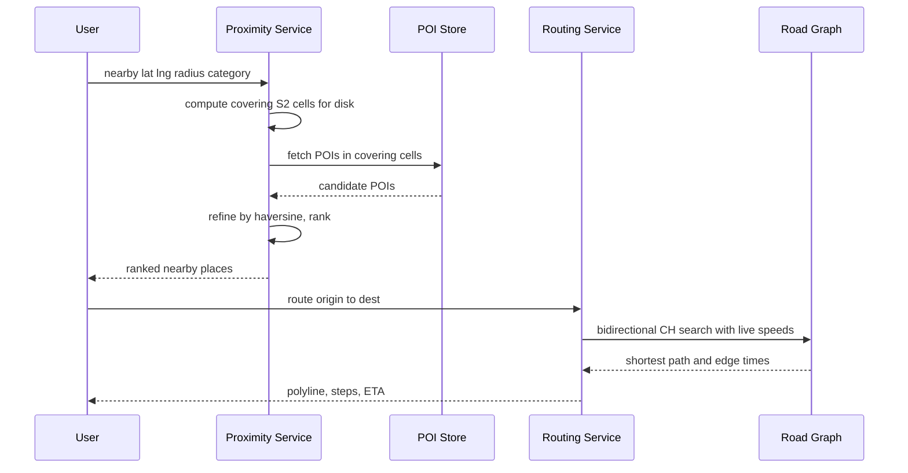

# Design Google Maps / Proximity Service

Google Maps bundles several distinct systems: **map rendering** (tiles), **proximity search** ("coffee shops near me"), and **routing** (fastest path A→B with live traffic). Each has a different shape: rendering is a CDN/tiling problem, proximity is a **geospatial indexing** problem, and routing is a **graph shortest-path** problem over a planet-scale road network. This study covers all three and clarifies the related **nearby-friends** proximity variant (think Uber/Find My Friends), which is a moving-objects version of the same indexing challenge.

## 1. Requirements

### Functional

- **Render the map:** pan/zoom over the world at multiple zoom levels.
- **Search places:** find businesses/POIs by name or category near a location, ranked by distance/relevance.
- **Routing:** compute the fastest route between two points for driving/walking/transit, with turn-by-turn directions.
- **ETA:** estimate travel time using current and historical **traffic**.
- (Variant) **Nearby friends/drivers:** show moving entities within radius R, updated in near real time.

### Non-functional

- **Low latency:** map tiles < 100 ms (CDN), proximity search < 200 ms, routing < 1 s for typical trips.
- **Planet scale:** billions of road segments, hundreds of millions of POIs, billions of requests/day.
- **High availability** and global reach (multi-region, edge caching).
- **Freshness:** traffic updates within seconds; map data updates daily/weekly.
- Mostly **read-heavy**; the moving-objects variant adds high write volume (location pings).

### Clarifying questions

- Static map (tiles) only, or interactive vector maps?
- Real-time traffic in scope for ETA, or free-flow speeds only? (Assume yes.)
- For proximity: static POIs, moving objects, or both?
- Multi-modal routing (transit/bike) or driving only for v1?
- Personalization (tolls, avoid highways)?

## 2. Capacity Estimation

- **DAU:** 1B. Average 5 sessions/day → 5B sessions/day.
- **Map tile requests:** each pan/zoom fetches ~10–20 tiles; say 50 tile loads/session × 5B = **250B tile requests/day** ≈ **2.9M tile req/s**. Almost all served from **CDN/edge cache** (tiles are static per zoom/version).
- **Proximity searches:** 1 per session × 5B/day ≈ **58k searches/s**.
- **Route requests:** 0.5 per session ≈ **29k routes/s**—the most CPU-intensive path.

**Storage:**

- **Road graph:** ~100M intersections (nodes) and ~200M road segments (edges). At ~100 B/edge for geometry + attributes → ~20 GB core graph, but with geometry polylines and metadata it's a few hundred GB; precomputed routing structures (contraction hierarchies) multiply this several-fold to single-digit TB.
- **POIs:** 250M places × ~2 KB (name, geo, hours, reviews ptr) = **500 GB**.
- **Map tiles:** the full pre-rendered raster pyramid across ~20 zoom levels is **petabytes**, which is why vector tiles + on-device rendering are increasingly used to shrink it.

**Traffic ingestion (variant + ETA):** 10M active drivers pinging location every 5 s = **2M location writes/s**—a firehose handled by a streaming pipeline, not the serving DB.

## 3. API Design

The surface spans the three subsystems—tiles, proximity search, and routing—plus the moving-objects variant. Tiles are CDN-fronted and immutable per version; location pings are a high-volume write into the streaming pipeline.

```api
{
  "endpoints": [
    {
      "method": "GET",
      "path": "/tiles/{z}/{x}/{y}.pbf?v={mapVersion}",
      "desc": "Fetch a vector map tile; CDN-fronted, immutable per map version.",
      "responses": [
        { "status": "200 OK", "body": { "tile": "vector tile (pbf)" } }
      ],
      "notes": "Cached at the edge; near-zero origin load."
    },
    {
      "method": "GET",
      "path": "/v1/places/nearby",
      "desc": "Find POIs near a point, ranked by distance/relevance.",
      "request": { "lat": "double", "lng": "double", "radius": "1500 (meters)", "category": "cafe", "limit": 20 },
      "responses": [
        { "status": "200 OK", "body": [ { "placeId": "string", "name": "string", "lat": "double", "lng": "double", "distanceM": "number", "rating": "float" } ] }
      ]
    },
    {
      "method": "GET",
      "path": "/v1/places/{placeId}",
      "desc": "Fetch full POI detail.",
      "responses": [
        { "status": "200 OK", "body": { "placeId": "string", "name": "string", "category": "string", "hours": "object", "rating": "float" } }
      ]
    },
    {
      "method": "POST",
      "path": "/v1/route",
      "desc": "Compute the fastest route between two points, traffic-aware.",
      "request": { "origin": { "lat": "double", "lng": "double" }, "dest": { "lat": "double", "lng": "double" }, "mode": "drive", "departAt": "now", "options": { "avoidTolls": false } },
      "responses": [
        { "status": "200 OK", "body": { "distanceM": "number", "etaSec": "number", "polyline": "string", "steps": "array", "trafficAware": true } }
      ]
    },
    {
      "method": "POST",
      "path": "/v1/location",
      "desc": "Ingest a location ping from a moving entity (high write volume).",
      "request": { "entityId": "string", "lat": "double", "lng": "double", "ts": "epoch ms" },
      "responses": [
        { "status": "202 Accepted", "desc": "queued to the streaming pipeline, not the serving DB" }
      ]
    },
    {
      "method": "GET",
      "path": "/v1/nearby",
      "desc": "Find moving entities within radius (nearby-friends/drivers variant).",
      "request": { "lat": "double", "lng": "double", "radius": "500 (meters)", "type": "driver" },
      "responses": [
        { "status": "200 OK", "body": [ { "entityId": "string", "lat": "double", "lng": "double", "distanceM": "number" } ] }
      ]
    }
  ]
}
```

## 4. Data Model

The system mixes stores by access pattern—**polyglot persistence**:

- **POI store (proximity):** a document/columnar store with a **geospatial index**. Read-heavy, large, needs spatial queries → e.g., **Cassandra/Elasticsearch** keyed by a geohash prefix, or PostGIS for smaller scale.
- **Road graph (routing):** loaded into **memory-resident graph structures** on routing servers (not queried row-by-row from a DB); the canonical copy lives in object storage / a graph build pipeline.
- **Tiles:** **object storage (S3/GCS) + CDN**, immutable, versioned.
- **Live traffic:** **time-series / in-memory** edge-speed table updated continuously.

```datamodel
{
  "entities": [
    {
      "name": "places",
      "store": "Cassandra / Elasticsearch (geo-indexed)",
      "fields": [
        { "name": "place_id", "type": "BIGINT", "key": "PK" },
        { "name": "name", "type": "TEXT" },
        { "name": "category", "type": "TEXT" },
        { "name": "lat", "type": "DOUBLE" },
        { "name": "lng", "type": "DOUBLE" },
        { "name": "geohash", "type": "TEXT", "note": "e.g. '9q8yyk8', precision tunable; indexed for prefix scans" },
        { "name": "s2_cell_id", "type": "BIGINT", "note": "Google S2 cell at chosen level" },
        { "name": "rating", "type": "FLOAT" },
        { "name": "attrs", "type": "JSONB" }
      ],
      "partitionKey": "(geohash prefix) for spatial locality",
      "notes": "~250M POIs; eventual consistency is fine since POI data changes slowly."
    },
    {
      "name": "Node",
      "store": "In-memory graph (routing servers)",
      "fields": [
        { "name": "node_id", "type": "BIGINT", "key": "PK", "note": "an intersection" },
        { "name": "lat", "type": "DOUBLE" },
        { "name": "lng", "type": "DOUBLE" }
      ],
      "notes": "~100M intersections; canonical copy lives in object storage / the graph build pipeline."
    },
    {
      "name": "Edge",
      "store": "In-memory graph (routing servers)",
      "fields": [
        { "name": "edge_id", "type": "BIGINT", "key": "PK" },
        { "name": "from_node", "type": "BIGINT", "key": "FK", "note": "-> Node.node_id" },
        { "name": "to_node", "type": "BIGINT", "key": "FK", "note": "-> Node.node_id" },
        { "name": "length_m", "type": "INT" },
        { "name": "base_speed_kmh", "type": "INT", "note": "free-flow speed" },
        { "name": "road_class", "type": "TEXT" },
        { "name": "polyline", "type": "TEXT", "note": "edge geometry" },
        { "name": "live_speed_kmh", "type": "INT", "note": "updated from the traffic pipeline" }
      ],
      "notes": "~200M road segments forming a weighted directed graph."
    }
  ],
  "relationships": [
    { "from": "Node", "to": "Edge", "kind": "1:N", "label": "a node is the from/to endpoint of many edges" }
  ]
}
```

**SQL vs NoSQL:** POIs at 250M rows with spatial + category filtering scale better on a **distributed NoSQL/search engine** partitioned by geohash than a single relational DB; we accept eventual consistency since POI data changes slowly. The **graph** isn't a "database" query problem at all—it's an in-memory algorithm problem, so it's served from purpose-built structures.

## 5. High-Level Architecture

The three subsystems fan out from the client to their own stores: tiles via CDN, proximity via a geo-indexed POI store, and routing over an in-memory road graph. A separate streaming pipeline ingests location pings and feeds live edge speeds back into routing.

```arch
{
  "title": "Google Maps — tiles, proximity, routing, and the traffic pipeline",
  "nodes": [
    { "id": "client", "label": "Client", "type": "client", "col": 0, "row": 1, "meta": "map/search/route requests" },
    { "id": "pings", "label": "Location Pings", "type": "client", "col": 0, "row": 3, "meta": "10M drivers, ~2M pings/s" },
    { "id": "cdn", "label": "CDN", "type": "cdn", "col": 1, "row": 0, "meta": "immutable tiles, edge-cached" },
    { "id": "pipe", "label": "Traffic Pipeline", "type": "queue", "col": 1, "row": 3, "meta": "Kafka -> Flink map-match" },
    { "id": "tiles", "label": "Tile Object Storage", "type": "blob", "col": 2, "row": 0, "meta": "S3/GCS, versioned origin" },
    { "id": "prox", "label": "Proximity Service", "type": "service", "col": 2, "row": 1, "meta": "geohash/S2 covering cells + haversine refine" },
    { "id": "route", "label": "Routing Service", "type": "service", "col": 2, "row": 2, "meta": "A* + Contraction Hierarchies, region-sharded" },
    { "id": "poi", "label": "POI Store", "type": "search", "col": 3, "row": 1, "meta": "geo-indexed, sharded by cell" },
    { "id": "graph", "label": "Road Graph", "type": "db", "col": 3, "row": 2, "meta": "in-memory + CH index, sharded by geo" }
  ],
  "edges": [
    { "from": "client", "to": "cdn", "step": 1, "label": "tiles" },
    { "from": "cdn", "to": "tiles", "step": 2, "label": "origin on miss" },
    { "from": "client", "to": "prox", "step": 3, "label": "search" },
    { "from": "prox", "to": "poi", "step": 4, "label": "covering cells" },
    { "from": "client", "to": "route", "step": 5, "label": "route" },
    { "from": "route", "to": "graph", "step": 6, "label": "CH search w/ live speeds" },
    { "from": "pings", "to": "pipe", "label": "location pings" },
    { "from": "pipe", "to": "graph", "label": "live edge speeds" }
  ],
  "groups": [
    { "label": "Data tier", "nodes": ["tiles", "poi", "graph"] }
  ]
}
```

1. The **client** requests map tiles from the **CDN**, which serves them from the edge with near-zero origin load.
2. On a cache miss the CDN pulls the immutable, versioned tile from **tile object storage** (origin).
3. A nearby-search goes to the **Proximity Service**, which converts lat/lng+radius into geohash/S2 covering cells.
4. It looks those cells up in the geo-indexed **POI store**, then refines candidates by true (haversine) distance and ranks.
5. A route request goes to the **Routing Service**, which holds the road graph in memory, sharded by region.
6. It runs accelerated shortest-path (CH/CRP + A*, bidirectional) over the **road graph** using live edge speeds, returning a polyline, steps, and ETA.
- Separately, the **Traffic Pipeline** ingests the location-ping firehose, **map-matches** pings to road edges, aggregates current speeds, and pushes live edge speeds into the road graph for traffic-aware ETAs.

A nearby-search resolves the query disk to covering cells and refines by exact distance; a route request runs accelerated shortest-path over the in-memory graph with live speeds:



## 6. Deep Dives

### 6.1 Geospatial indexing for nearby search

The core problem: efficiently answer "all POIs within R of (lat,lng)" without scanning 250M rows. A 2D B-tree on (lat,lng) fails because range queries on two independent dimensions are inefficient. Three standard approaches:

- **Geohash:** interleave latitude/longitude bits into a single Z-order string; nearby points share a **common prefix**. A query becomes a **prefix scan** on the geohash column, and prefix length controls the cell size. Caveat: points near a cell boundary may be close in reality but differ in prefix, so you must also **query the 8 neighboring cells**.
- **Quadtree:** recursively subdivide space into 4 quadrants until each leaf holds ≤ K points. Dense areas (Manhattan) get deep subdivision; sparse areas (desert) stay shallow—**adaptive density**, great for skewed distributions. Search descends to the cell containing the point and gathers neighbors.
- **Google S2:** projects the sphere onto a cube and uses a **Hilbert curve** to assign every cell a 64-bit ID. Hilbert ordering preserves locality better than Z-order (Hilbert curve has no long jumps), and S2 handles the sphere correctly (no pole/meridian distortion). A radius query maps to a **set of S2 cell-ID ranges** that cover the disk.

In practice: store each POI's geohash/S2 cell, **shard the index by cell**, look up the covering cells for the query disk, fetch candidates, then **refine by exact haversine distance** and rank. This turns an O(N) scan into an O(candidates) lookup.

### 6.2 Routing: shortest path over a planet-scale graph

The road network is a weighted directed graph; edge weight = travel time. Plain **Dijkstra** finds the shortest path but explores outward in all directions—far too slow across a continent (it might visit millions of nodes). Improvements:

- **A\*** adds a **heuristic** (straight-line distance / max speed) to bias search toward the destination, drastically pruning the explored set while staying optimal if the heuristic is admissible.
- **Contraction Hierarchies (CH):** a **preprocessing** technique that ranks nodes by importance and adds "shortcut" edges that bypass less-important nodes. At query time, search only ever moves "upward" in the hierarchy, turning a continental query into a few hundred node visits—**milliseconds** instead of seconds. The cost is a heavy offline preprocessing step and extra storage for shortcuts.
- **Region precomputation / partitioning:** divide the map into regions; precompute boundary-to-boundary distances so long routes stitch together region-level results (related: Customizable Route Planning / transit-node routing). This also enables **geographic sharding** of the graph.

Production systems combine these: CH (or CRP) for the long-haul backbone, A* for local stitching, plus **bidirectional search** (expand from both origin and destination, meet in the middle) to roughly halve the work.

### 6.3 ETA with live traffic

A route's edge weights must reflect **current** conditions, not free-flow speed. The traffic pipeline:

1. Drivers' apps emit location pings (lat/lng/heading/speed) into **Kafka**.
2. A stream processor (**Flink**) performs **map-matching**—snapping noisy GPS points to the most likely road edge using the road geometry and recent trajectory.
3. It aggregates per-edge **current speed** over sliding windows and blends with **historical** speed profiles (rush-hour patterns) for robustness when live data is sparse.
4. Updated `live_speed_kmh` per edge is pushed to routing servers' in-memory graph.

ETA = sum of (edge length / effective speed) along the route, with adjustments for turns, traffic signals, and predicted future conditions for long trips (a route an hour long must use *predicted* speeds for its later legs). The challenge: CH preprocessing assumes static weights, so **traffic-aware routing** uses techniques like CRP that allow fast **weight customization** without full re-preprocessing.

### 6.4 Map tiles and CDN

The visible map is a pyramid of **tiles**, typically 256×256, indexed by `(z, x, y)`—zoom level and tile coordinates. Higher zoom = exponentially more tiles (4x per level). Two models:

- **Raster tiles:** pre-rendered images. Simple to serve, huge to store (petabytes), slow to update.
- **Vector tiles:** ship geometry + styling, rendered on-device. Smaller, restyleable (dark mode), and only the changed data re-ships.

Tiles are **immutable per map version**, so they cache beautifully at the **CDN/edge**—origin sees almost no traffic, and the 2.9M tile-req/s estimate is absorbed globally. A new map data release bumps the version, invalidating caches lazily.

### 6.5 The nearby-friends / moving-objects variant

Static-POI indexing assumes points rarely move. For **moving entities** (friends, drivers), 2M location updates/s would thrash a disk index. Adaptations:

- Hold the spatial index **in memory** (e.g., a quadtree/geohash bucket map in Redis), partitioned by region.
- Treat updates as cheap **bucket reassignments**: when an entity moves, remove it from its old geohash cell and add it to the new one—no global rebuild.
- For "who is near me," read the subscriber's cell + neighbors and filter by exact distance.
- Use a **pub/sub** layer so a client subscribes to its current cells and receives pushes when friends/drivers enter/leave, rather than polling.

This is the **Uber/proximity** pattern: same geospatial indexing as POIs, but optimized for a write-heavy, real-time, in-memory workload.

## 7. Bottlenecks & Scaling

- **Geographic sharding:** partition POIs, the road graph, and the moving-objects index **by region** (S2 cells / geohash prefixes). Most queries are local, so they hit one shard. Cross-region routes query a few shards and stitch.
- **Hotspots:** dense cities (NYC, Tokyo) get vastly more traffic than rural cells. Use **adaptive cells** (quadtree depth) and replicate hot shards; cache popular POI lookups and common routes (airport↔downtown) in Redis.
- **CDN for tiles** removes the largest read volume from origin entirely.
- **Routing CPU:** CH/CRP precomputation keeps per-query work tiny; scale routing servers horizontally and pin each to a region's graph held in RAM.
- **Traffic firehose:** Kafka partitioned by geo absorbs 2M pings/s; backpressure and approximate aggregation prevent overload.
- **Failure handling:** if live traffic is stale, **fall back** to historical/free-flow speeds; if a routing shard is down, reroute via neighboring shards with degraded optimality.

## 8. Trade-offs & Follow-ups

| Decision | Chosen | Alternative | Why |
|---|---|---|---|
| Proximity index | Geohash / S2 / quadtree | (lat,lng) B-tree | 2D range scans are inefficient |
| Cell strategy | Adaptive (quadtree) | Fixed grid | Handles density skew (cities vs deserts) |
| Routing | CH/CRP + A* | Plain Dijkstra | Continental queries in ms, not seconds |
| Tiles | Vector + CDN | Raster only | Smaller, restyleable, cache-friendly |
| Moving objects | In-memory geo-index | Disk index | 2M writes/s needs RAM + bucket swaps |

**Likely follow-ups:**

- *Geohash boundary problem?* Query neighboring cells and refine by exact distance; S2's Hilbert ordering reduces but doesn't eliminate it.
- *How does CH handle live traffic if weights change?* Use **CRP** (separates topology preprocessing from weight customization) so traffic updates don't require full re-preprocessing.
- *Multi-modal routing?* Model transit as a time-expanded graph layered onto the road graph.
- *How fresh is "nearby friends"?* Tunable: trade ping frequency and push latency against battery and write cost.

## Key takeaways

- Google Maps is **three systems**: tiles (CDN problem), proximity (geospatial indexing), and routing (graph shortest-path)—each with a different data store and scaling strategy.
- **Geohash, quadtrees, and S2 cells** turn "find nearby" from an O(N) scan into a cell-lookup plus exact-distance refinement; quadtrees adapt to density, S2's Hilbert curve preserves locality on the sphere.
- Planet-scale routing needs **preprocessing** (Contraction Hierarchies / CRP) and heuristic search (A*, bidirectional) to answer in milliseconds—plain Dijkstra is far too slow.
- **Traffic-aware ETA** is a streaming pipeline: map-match GPS pings to edges, aggregate live speeds, and blend with historical profiles, feeding dynamic edge weights into routing.
- **Geographic sharding** (by S2/geohash region) is the unifying scaling axis, since most queries are spatially local; hotspots in dense cities are handled with adaptive cells and replication.
- The **moving-objects (nearby-friends) variant** reuses the same indexing but shifts to an in-memory, write-heavy, pub/sub design to absorb millions of location updates per second.
