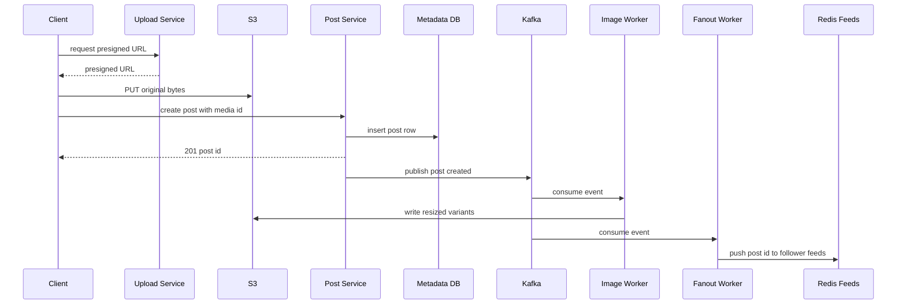

# Design Instagram / Photo Sharing

Instagram is the canonical "read-heavy media + social feed" problem. It combines a large-object storage and delivery challenge (photos) with the news-feed fanout challenge (timelines). This case study designs the upload pipeline, metadata layer, feed generation, and the CDN-backed serving path.

## 1. Requirements

### Functional
- A user can **upload a photo** with a caption and location.
- A user can **follow / unfollow** others.
- A user sees a **home feed** of posts from accounts they follow (reverse-chron / ranked).
- A user can view a **profile/user feed** (grid of their posts).
- Like and comment on posts.
- **Explore/search**: discover popular or relevant content.

### Non-functional
- **Extremely read-heavy**: viewing vastly outnumbers posting (~100:1+).
- **Low latency**: feed and image load must feel instant; images served from edge.
- **High availability** over strong consistency; eventual consistency for feeds is fine.
- **Durable storage** of original media — photos must never be lost.
- Scale to hundreds of millions of users and petabytes of media.

### Clarifying questions
- Photos only or video too? (Photos primary; same pipeline extends to video.)
- Chronological or ranked feed? (Support ranking on top of a chronological base.)
- Max following? (Practically bounded, ~7,500.)
- Do we need stories/DMs? (Out of scope; focus on posts + feed.)

## 2. Capacity Estimation

Assume **500M DAU**.

**Writes (posts):**
- ~0.1 posts/user/day → 50M posts/day.
- Write QPS = 50M / 86,400 ≈ **~580 posts/sec**, peak ~3x → **~1,700/sec**.

**Reads (feed + image views):**
- Each user opens the feed ~20×/day → 500M × 20 = **10B feed loads/day**.
- Feed read QPS = 10B / 86,400 ≈ **~116,000/sec** of feed assembly, peak ~3x → **~350,000/sec**. Most loads are cache hits (a `ZREVRANGE` over a precomputed Redis feed).
- Each load renders ~10 images → ~100B image GETs/day ≈ **~1.2M/sec** — these dwarf feed assembly and are **overwhelmingly served by the CDN, not the origin**.

**Media storage:**
- Original + resized variants (thumbnail, medium, full) ≈ 2 MB total per post after compression.
- 50M/day × 2 MB = **100 TB/day** ≈ **~36 PB/year** in object storage (before replication; S3 already replicates internally).

**Metadata storage:**
- Per post row ≈ 500 bytes (ids, caption, media keys, counts, timestamps).
- 50M/day × 500 B = **25 GB/day** ≈ **~9 TB/year** — small; the bytes live in object storage, the metadata DB stays lean.

**Bandwidth (serving):**
- ~100B image GETs/day at a blended ~150 KB average (mostly small thumbnail/medium variants) → ~15 PB/day egress, of which **>95% is served from CDN edge** (plus client-side caching of already-seen images), sparing the origin.

## 3. API Design

```api
{
  "endpoints": [
    {
      "method": "POST",
      "path": "/v1/media",
      "auth": "bearer",
      "desc": "Request a pre-signed S3 URL for direct byte upload.",
      "responses": [
        { "status": "200 OK", "body": { "media_id": "string", "upload_url": "presigned S3 PUT URL" } }
      ]
    },
    {
      "method": "POST",
      "path": "/v1/posts",
      "auth": "bearer",
      "desc": "Create a post referencing already-uploaded media.",
      "request": { "media_ids": "string[]", "caption": "string", "location": "string?" },
      "responses": [
        { "status": "201 Created", "body": { "post_id": "string", "created_at": "timestamp" } }
      ]
    },
    {
      "method": "GET",
      "path": "/v1/feed?cursor=&limit=20",
      "auth": "bearer",
      "desc": "Personalized home feed of followed accounts.",
      "responses": [
        { "status": "200 OK", "body": { "posts": "Post[]", "next_cursor": "string" } }
      ]
    },
    {
      "method": "GET",
      "path": "/v1/users/{id}/posts?cursor=",
      "auth": "bearer",
      "desc": "A user's profile grid, newest first.",
      "responses": [
        { "status": "200 OK", "body": { "posts": "Post[]", "next_cursor": "string" } }
      ]
    },
    {
      "method": "POST",
      "path": "/v1/follows",
      "auth": "bearer",
      "desc": "Follow another user.",
      "request": { "followee_id": "string" },
      "responses": [
        { "status": "201 Created" }
      ]
    },
    {
      "method": "DELETE",
      "path": "/v1/follows/{followee_id}",
      "auth": "bearer",
      "desc": "Unfollow a user.",
      "responses": [
        { "status": "204 No Content" }
      ]
    },
    {
      "method": "POST",
      "path": "/v1/posts/{id}/like",
      "auth": "bearer",
      "desc": "Like a post.",
      "responses": [
        { "status": "200 OK" }
      ]
    },
    {
      "method": "POST",
      "path": "/v1/posts/{id}/comments",
      "auth": "bearer",
      "desc": "Comment on a post.",
      "request": { "text": "string" },
      "responses": [
        { "status": "201 Created" }
      ]
    },
    {
      "method": "GET",
      "path": "/v1/explore",
      "auth": "bearer",
      "desc": "Discover popular/relevant content the user does not follow.",
      "responses": [
        { "status": "200 OK", "body": { "posts": "Post[]" } }
      ]
    }
  ]
}
```

Note the **two-step upload**: the client first gets a pre-signed URL and uploads bytes directly to S3, then creates the post referencing the resulting `media_id`. The post is only created after the bytes are safely stored.

## 4. Data Model

Post **metadata** is relational-friendly and modest in size; the **feed** is a precomputed cache; the **bytes** live in object storage. We use a sharded relational/wide-column store for metadata and the graph, Redis for feeds and counters, and S3 for media.

**SQL vs NoSQL:** post and user metadata have clear structure and benefit from secondary indexes (by user, by location), so a sharded relational store (Postgres/Vitess) or Cassandra both work; Instagram historically used **sharded Postgres**. The follower graph and feed cache, being huge and access-pattern-specific, lean NoSQL (Cassandra + Redis). The key point is that the heavy bytes never enter the database — only keys.

```datamodel
{
  "entities": [
    {
      "name": "posts",
      "store": "Sharded PostgreSQL (Vitess)",
      "fields": [
        { "name": "post_id", "type": "bigint", "key": "PK", "note": "time-sortable id" },
        { "name": "user_id", "type": "bigint", "note": "author; shard key" },
        { "name": "caption", "type": "text" },
        { "name": "media_keys", "type": "jsonb", "note": "S3 keys for each variant" },
        { "name": "location", "type": "varchar(128)" },
        { "name": "like_count", "type": "bigint", "note": "default 0" },
        { "name": "created_at", "type": "timestamptz" }
      ],
      "notes": "Sharded by user_id; index (user_id, post_id DESC) makes a profile grid one shard."
    },
    {
      "name": "follows",
      "store": "Sharded PostgreSQL / Cassandra",
      "fields": [
        { "name": "follower_id", "type": "bigint", "key": "PK", "note": "composite PK part" },
        { "name": "followee_id", "type": "bigint", "key": "PK", "note": "composite PK part; index for 'who follows X'" },
        { "name": "created_at", "type": "timestamptz" }
      ],
      "notes": "Two indexed views: who follows X (fanout) and who X follows (pull/explore)."
    },
    {
      "name": "feed",
      "store": "Redis (sorted set per user)",
      "fields": [
        { "name": "key", "type": "feed:{user_id}", "key": "PK", "note": "ZADD post_id as score" },
        { "name": "members", "type": "post_id[]", "note": "trimmed to newest ~1000 via ZREMRANGEBYRANK" }
      ],
      "notes": "Precomputed feed cache; reads are a cheap ZREVRANGE."
    },
    {
      "name": "counters",
      "store": "Redis",
      "fields": [
        { "name": "like:{post_id}", "type": "integer", "note": "approximate like counter" },
        { "name": "comment:{post_id}", "type": "integer", "note": "comment counter" }
      ]
    },
    {
      "name": "media",
      "store": "S3",
      "fields": [
        { "name": "key", "type": "media/{user_id}/{post_id}/{variant}.jpg", "key": "PK", "note": "variant in {thumb, medium, full}" },
        { "name": "bytes", "type": "blob", "note": "original + resized variants" }
      ],
      "notes": "Heavy bytes never enter the DB — only keys are stored in posts.media_keys."
    }
  ],
  "relationships": [
    { "from": "posts", "to": "media", "kind": "1:N", "label": "one post -> many variants" },
    { "from": "follows", "to": "feed", "kind": "1:N", "label": "fanout pushes post_id to follower feeds" },
    { "from": "posts", "to": "counters", "kind": "1:1", "label": "like/comment counts per post" }
  ]
}
```

## 5. High-Level Architecture

```arch
{
  "title": "Two-phase direct-to-S3 upload with async processing, fanout, and CDN serving",
  "nodes": [
    { "id": "client", "label": "Client", "type": "client", "col": 0, "row": 1, "meta": "mobile/web app" },
    { "id": "cdn", "label": "CDN", "type": "cdn", "col": 1, "row": 0, "meta": "CloudFront/Akamai edge" },
    { "id": "gateway", "label": "API Gateway", "type": "gateway", "col": 1, "row": 1, "meta": "auth, routing" },
    { "id": "uploadSvc", "label": "Upload Service", "type": "service", "col": 2, "row": 0, "meta": "issues presigned URLs" },
    { "id": "postSvc", "label": "Post Service", "type": "service", "col": 2, "row": 1, "meta": "creates post rows" },
    { "id": "feedSvc", "label": "Feed Service", "type": "service", "col": 2, "row": 2, "meta": "assembles + hydrates feed" },
    { "id": "s3", "label": "S3", "type": "blob", "col": 3, "row": 0, "meta": "durable media bytes" },
    { "id": "metaDB", "label": "Postgres Metadata", "type": "db", "col": 3, "row": 1, "meta": "sharded by user_id" },
    { "id": "kafka", "label": "Kafka", "type": "queue", "col": 3, "row": 2, "meta": "post-created events" },
    { "id": "imgWorker", "label": "Image Worker", "type": "worker", "col": 4, "row": 0, "meta": "resizes variants" },
    { "id": "redis", "label": "Redis Feeds", "type": "cache", "col": 4, "row": 1, "meta": "sorted set per user" },
    { "id": "fanoutWorker", "label": "Fanout Worker", "type": "worker", "col": 4, "row": 2, "meta": "push post_id to followers" }
  ],
  "edges": [
    { "from": "client", "to": "uploadSvc", "step": 1, "label": "request presigned URL" },
    { "from": "client", "to": "s3", "step": 2, "label": "PUT original bytes" },
    { "from": "client", "to": "gateway", "step": 3, "label": "create post" },
    { "from": "gateway", "to": "postSvc", "step": 4 },
    { "from": "postSvc", "to": "metaDB", "step": 5, "label": "insert post row" },
    { "from": "postSvc", "to": "kafka", "step": 6, "label": "publish post-created" },
    { "from": "kafka", "to": "imgWorker", "step": 7, "label": "consume" },
    { "from": "imgWorker", "to": "s3", "step": 8, "label": "write variants" },
    { "from": "kafka", "to": "fanoutWorker", "step": 9, "label": "consume" },
    { "from": "fanoutWorker", "to": "redis", "step": 10, "label": "push to follower feeds" },
    { "from": "gateway", "to": "feedSvc", "label": "read feed" },
    { "from": "feedSvc", "to": "redis", "label": "ZREVRANGE post_ids" },
    { "from": "feedSvc", "to": "metaDB", "label": "hydrate" },
    { "from": "s3", "to": "cdn", "label": "cache-fill" },
    { "from": "cdn", "to": "client", "label": "serve images" }
  ],
  "groups": [
    { "label": "Data tier", "nodes": ["s3", "metaDB", "redis"] },
    { "label": "Async workers", "nodes": ["imgWorker", "fanoutWorker"] }
  ]
}
```

**Walkthrough.** Upload is two-phase, with async processing and fanout downstream:
1. The client requests a pre-signed URL from the **upload service**.
2. The client uploads the original bytes **directly to S3**.
3. The client calls the **API gateway** to create the post.
4. The gateway routes to the **post service**.
5. The post service inserts the post row into the **Postgres metadata DB**.
6. The post service publishes a `post-created` event to **Kafka**.
7. An **image worker** consumes the event and (8) generates thumbnail/medium/full variants, writing them back to S3.
9. A **fanout worker** consumes the same event and (10) pushes the new `post_id` into each follower's **Redis feed**.

Reads split cleanly off the write path: feed assembly (**feed service**) reads `post_id`s from Redis and hydrates metadata from Postgres, while the actual image bytes are fetched by the client directly from the **CDN**, never touching the origin.

The primary flow — the two-phase, direct-to-S3 photo upload pipeline with async processing and fanout:



## 6. Deep Dives

### 6.1 Media upload pipeline

App servers must never proxy image bytes — that wastes bandwidth and limits throughput. Instead:
1. Client requests a **pre-signed S3 URL** and `PUT`s the original directly to object storage.
2. S3 emits an event (S3 → Kafka/SNS) that an **image worker** consumes.
3. The worker generates **resized variants** (e.g. 150px thumbnail, 600px medium, 1080px full), applies compression, strips EXIF, and writes them back to S3 under the post's prefix.
4. Only after the post row references valid media keys is the post considered published.

This makes processing **asynchronous** and elastic — a spike in uploads queues in Kafka and scales workers independently, without slowing the user's request.

### 6.2 Feed generation (fanout)

Like Twitter, the home feed is precomputed via **fanout-on-write**: when a post is created, a worker reads the author's followers and inserts the `post_id` into each follower's Redis sorted set (`feed:{user_id}`), trimmed to ~1000 entries. Reads then become a cheap `ZREVRANGE` + metadata hydration.

For **high-follower accounts**, pure push is too expensive, so we apply the same **hybrid** rule: above a follower threshold, skip fanout and **pull** the celebrity's recent posts at read time, merging them into the precomputed feed. We also fan out only to **active users** to cut write amplification, rebuilding dormant users' feeds lazily on next login. (See the Twitter case study for the full push-vs-pull analysis — the trade-off is identical.)

### 6.3 CDN delivery and the read-heavy serving path

The serving path is where Instagram's scale really lives: image GETs dwarf every other operation. The defining decision is to push image bytes to a **CDN** (CloudFront/Akamai) so the same popular photo is cached at edge PoPs near users. The origin (S3) sees only cache-fill traffic. Cache keys are immutable per variant URL, so we set long TTLs and never invalidate (a new edit = a new key). The client picks the right variant for its viewport (thumbnail in the grid, full in the detail view), minimizing bytes transferred. This is what keeps origin load and latency flat as views grow.

### 6.4 Search / Explore and the follow graph

**Explore** surfaces popular and relevant content the user doesn't already follow. It's powered by an offline/near-real-time pipeline that scores posts on engagement velocity and ranks candidates, stored in a search index (**Elasticsearch**) and a precomputed "explore" cache. **Search** (users, hashtags, places) is served from Elasticsearch as well. The **follow graph** is two indexed views — `who follows X` (for fanout) and `who X follows` (for pull/explore seeds) — sharded by user; at extreme scale this becomes a dedicated graph service.

## 7. Bottlenecks & Scaling

- **Caching.** Three layers: **CDN** for image bytes (the big one), **Redis** for feeds and hot post metadata, and counter caches for likes/comments. A high CDN hit ratio is the single most important scaling lever.
- **Sharding.** Metadata DB sharded by `user_id` (so a profile grid is one shard); Redis feeds sharded by user; the follower index sharded and replicated. **Consistent hashing** spreads keys and limits resharding churn.
- **Hotspots.** A viral post concentrates reads on one set of keys — solved at the CDN edge (bytes) and by replicating/locally-caching the hot metadata + counters. Use approximate, batched like-counters under viral load.
- **Read replicas.** The read-heavy metadata workload is served from Postgres **read replicas**; writes go to the primary. Accept slight replication lag on the read path.
- **Failure handling.** Kafka decouples upload, image processing, and fanout, so a backlog in one stage doesn't fail the user request (at-least-once; dedupe by post_id). S3 provides durable, replicated media storage; partial uploads simply never produce a post row.

## 8. Trade-offs & Follow-ups

- **Direct-to-S3 upload** removes a bottleneck but requires pre-signed URL management and a post-processing step before the post is "live."
- **Fanout-on-write** gives fast feeds at the cost of write amplification; the **hybrid** rule for big accounts and active-user filtering keep it bounded.
- **Eventual consistency:** a new post may appear in followers' feeds and a freshly liked count may reconcile with a short delay — acceptable for this product.
- **CDN immutability:** never invalidating edges (new key per variant) trades a little storage for vastly simpler, faster delivery.

**Likely follow-ups:**
- *How do you handle a celebrity with 400M followers?* Skip fanout; pull their recent posts at read time and merge.
- *How do you serve the right image size?* Pre-generate variants; client selects by viewport; all behind the CDN.
- *How do you keep like counts fast and roughly correct?* Cached approximate counters with periodic reconciliation to the DB.
- *What if image processing fails?* Retry from Kafka; the post stays in a pending state until variants exist.
- *How do you build Explore?* Offline ranking pipeline + Elasticsearch + a precomputed cache.

## Key takeaways
- **Separate the bytes from the metadata**: photos live in **S3 + CDN**, the database stores only keys and stays small.
- **Two-phase, direct-to-S3 upload** with **async processing** (Kafka + image workers) keeps app servers out of the byte path.
- The feed reuses the **fanout-on-write + hybrid** pattern from news-feed design, with active-user filtering to bound write cost.
- The **CDN is the dominant scaling lever** for a read-heavy media product — high edge hit ratio keeps the origin flat.
- **Shard metadata by user**, serve reads from replicas, and cache hot feeds/counters in Redis.
- **Explore/search** runs on a separate ranking pipeline backed by Elasticsearch, decoupled from the core serving path.
