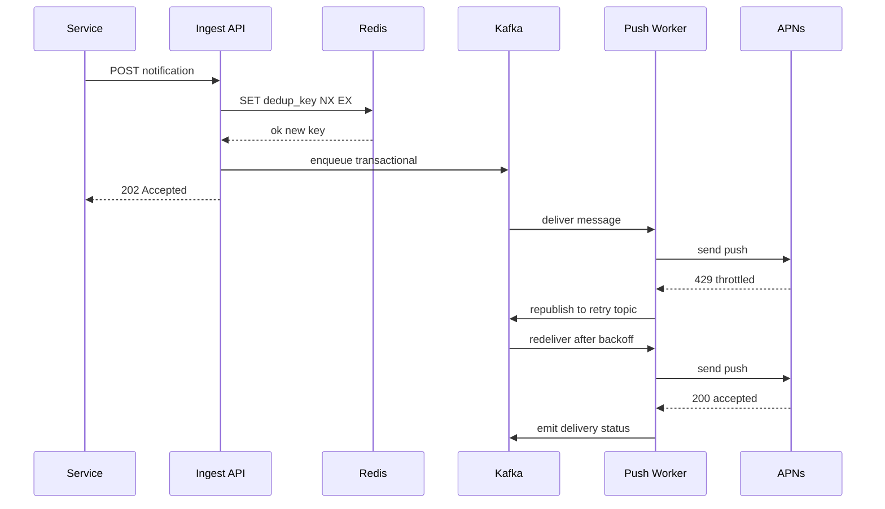

A notification system is shared infrastructure that almost every product needs: it turns an internal event ("your order shipped", "Alice commented on your post", "your verification code is 123456") into a message delivered to a user over one or more channels. The interesting engineering is not in sending a single email — it is in doing so reliably for hundreds of millions of users, across heterogeneous third-party providers, while respecting user preferences, avoiding duplicates, and surviving provider outages.

## 1. Requirements

### Functional

- Accept a notification request from any internal service (order service, social graph, marketing, etc.) via a single API.
- Support multiple channels: **mobile push** (iOS via APNs, Android via FCM), **SMS** (via Twilio/Vonage), **email** (via Amazon SES/SendGrid), and **in-app** notifications.
- Resolve the target: given a `user_id`, look up device tokens, phone number, email, and per-channel preferences.
- Respect **user preferences and opt-outs** (e.g. "no marketing email", "no SMS at night").
- Support **templating** so callers send a template id + variables rather than rendered text.
- Support **priority levels** (transactional/OTP vs. promotional).
- **Retry** transient failures and surface a final delivery status.
- **Deduplicate** so a retried or double-published event is delivered once.

### Non-functional

- **Scale:** ~10M notifications/day baseline, bursting to 50M on campaign days.
- **Latency:** transactional (OTP) end-to-end p99 < 5s; bulk/marketing can be minutes.
- **Reliability:** at-least-once delivery with dedup giving an effectively exactly-once user experience. No lost OTPs.
- **Availability:** 99.95%. One channel/provider failing must not block others.
- **Extensibility:** adding a new channel or provider should not touch caller code.

### Clarifying questions

- Do we own rendering/templates, or do callers send final text? (We own templating.)
- Is ordering required? (Generally no, except OTP freshness.)
- Are we doing analytics/click tracking? (Yes — delivery + open/click status.)
- Who owns rate limiting toward providers vs. toward users? (Both — provider quotas and per-user caps.)

## 2. Capacity Estimation

Assume 30M DAU and 10M notifications/day average, 50M peak.

```
Average write QPS  = 10,000,000 / 86,400 ≈ 116 req/s
Peak write QPS     = 50,000,000 / 86,400 ≈ 580 req/s   (~5x average)
Burst (campaign)   = 50M sent in 1 hour  = 50M / 3,600 ≈ 13,900 req/s
```

So the steady state is tiny, but campaign bursts are ~14k/s — this is why a **queue with buffering** is the core of the design; we absorb spikes and drain at the rate providers allow.

**Storage.** Each notification record (id, user, channel, template, status, timestamps) ≈ 500 bytes. Keeping 90 days of history:

```
10M/day * 500 B = 5 GB/day
5 GB/day * 90  = 450 GB
```

Plus a device-token store: 30M users * ~2 devices * 200 B ≈ 12 GB (fits in Redis/memory easily).

**Bandwidth.** Payloads are small (push ~1 KB, email body a few KB). On a heavy day, 50M * 4 KB ≈ 200 GB/day egress — dominated by email. Fan-in to providers is bounded by their throughput limits, which is why throttling matters more than raw bandwidth.

## 3. API Design

A single ingestion endpoint, channel-agnostic:

```api
{
  "endpoints": [
    {
      "method": "POST",
      "path": "/v1/notifications",
      "auth": "service token",
      "desc": "Channel-agnostic ingestion endpoint; enqueues durably, then delivers async.",
      "request": {
        "user_id": "u_12345",
        "template_id": "order_shipped",
        "channels": "[\"push\",\"email\"] (optional; default = user prefs)",
        "priority": "transactional | high | bulk",
        "data": { "order_id": "A-99", "eta": "Tue" },
        "dedup_key": "order_shipped:A-99:u_12345",
        "ttl_seconds": 3600
      },
      "responses": [
        { "status": "202 Accepted", "body": { "notification_id": "n_abc" } }
      ],
      "notes": "dedup_key is caller-supplied and is the idempotency anchor."
    },
    {
      "method": "GET",
      "path": "/v1/notifications/{id}",
      "auth": "service token",
      "desc": "Per-channel delivery status for a notification.",
      "responses": [
        { "status": "200 OK", "body": { "notification_id": "n_abc", "channels": "[{channel, status}]" } }
      ]
    },
    {
      "method": "POST",
      "path": "/v1/preferences/{user_id}",
      "auth": "bearer",
      "desc": "Update opt-outs / quiet hours.",
      "request": { "channel": "string", "category": "string", "enabled": "boolean", "quiet_start": "int?", "quiet_end": "int?" },
      "responses": [
        { "status": "200 OK" }
      ]
    },
    {
      "method": "GET",
      "path": "/v1/preferences/{user_id}",
      "auth": "bearer",
      "desc": "Read a user's notification preferences.",
      "responses": [
        { "status": "200 OK", "body": { "preferences": "Preference[]" } }
      ]
    },
    {
      "method": "POST",
      "path": "/v1/devices",
      "auth": "bearer",
      "desc": "Register or unregister a device push token.",
      "request": { "token": "string", "platform": "ios | android", "action": "register | unregister" },
      "responses": [
        { "status": "200 OK" }
      ]
    }
  ]
}
```

The API returns `202 Accepted` immediately after durably enqueuing — delivery is asynchronous. `dedup_key` is caller-supplied and is the idempotency anchor.

## 4. Data Model

We use a mix: **Cassandra** for the high-write, time-series notification log and status (wide rows by user, append-heavy), **PostgreSQL** for preferences and templates (low volume, relational, transactional), and **Redis** for device-token lookups and dedup/rate-limit counters.

Why this split? Preferences and templates are small, read-heavy, and benefit from joins and transactions → relational. The notification log is write-heavy, partitioned naturally by user, and queried by recency → Cassandra's `(user_id)` partition + time clustering is ideal and avoids the write amplification a single SQL table would suffer at 580+ QPS sustained.

```datamodel
{
  "entities": [
    {
      "name": "preferences",
      "store": "PostgreSQL",
      "fields": [
        { "name": "user_id", "type": "text", "key": "PK", "note": "composite PK part" },
        { "name": "channel", "type": "text", "key": "PK", "note": "push | sms | email" },
        { "name": "category", "type": "text", "key": "PK", "note": "marketing | transactional | social" },
        { "name": "enabled", "type": "boolean" },
        { "name": "quiet_start", "type": "smallint", "note": "hour 0-23, null = none" },
        { "name": "quiet_end", "type": "smallint", "note": "hour 0-23, null = none" }
      ],
      "notes": "Low volume, read-heavy, transactional; cached write-through in Redis."
    },
    {
      "name": "templates",
      "store": "PostgreSQL",
      "fields": [
        { "name": "template_id", "type": "text", "key": "PK" },
        { "name": "channel", "type": "text" },
        { "name": "category", "type": "text" },
        { "name": "subject", "type": "text", "note": "for email" },
        { "name": "body", "type": "text", "note": "handlebars: Order {{order_id}} ships {{eta}}" },
        { "name": "locale", "type": "text" }
      ]
    },
    {
      "name": "notifications",
      "store": "Cassandra",
      "fields": [
        { "name": "user_id", "type": "text", "key": "PK", "note": "partition key" },
        { "name": "sent_at", "type": "timeuuid", "key": "CK", "note": "clustering, DESC" },
        { "name": "notif_id", "type": "text" },
        { "name": "channel", "type": "text" },
        { "name": "status", "type": "text", "note": "queued|sent|delivered|failed|bounced" },
        { "name": "provider_id", "type": "text", "note": "message id from APNs/Twilio/SES" },
        { "name": "attempts", "type": "int" }
      ],
      "partitionKey": "(user_id) -> sent_at DESC",
      "notes": "Write-heavy time-series log; wide rows by user, queried by recency."
    },
    {
      "name": "device_tokens",
      "store": "Redis (Postgres-backed)",
      "fields": [
        { "name": "user_id", "type": "text", "key": "PK", "note": "Redis set key" },
        { "name": "members", "type": "set<{token, platform}>", "note": "device push tokens" }
      ],
      "notes": "Hot lookups in Redis, durably backed by Postgres."
    },
    {
      "name": "dedup_and_rate",
      "store": "Redis",
      "fields": [
        { "name": "dedup_key", "type": "string", "key": "PK", "note": "SET key 1 NX EX 86400" },
        { "name": "rate:{user_id}:{category}", "type": "counter", "note": "token bucket / sliding window" }
      ],
      "notes": "Idempotency anchors and per-user/per-provider rate limits."
    }
  ],
  "relationships": [
    { "from": "preferences", "to": "notifications", "kind": "1:N", "label": "prefs gate which notifications are sent" },
    { "from": "templates", "to": "notifications", "kind": "1:N", "label": "one template -> many sends" },
    { "from": "device_tokens", "to": "notifications", "kind": "1:N", "label": "tokens are the push delivery target" }
  ]
}
```

## 5. High-Level Architecture

```arch
{
  "title": "Buffered fanout pipeline — priority topics, per-channel workers, status + retry",
  "nodes": [
    { "id": "svc", "label": "Internal Services", "type": "client", "col": 0, "row": 1, "meta": "order/social/marketing callers" },
    { "id": "redis", "label": "Preference + Dedup", "type": "cache", "col": 1, "row": 0, "meta": "Redis (Postgres-backed)" },
    { "id": "api", "label": "Notification Ingest API", "type": "gateway", "col": 1, "row": 1, "meta": "validate, dedup, resolve prefs" },
    { "id": "kafka", "label": "Kafka", "type": "queue", "col": 2, "row": 1, "meta": "topics by priority" },
    { "id": "pushWorker", "label": "Push Worker", "type": "worker", "col": 3, "row": 0, "meta": "batches APNs HTTP/2" },
    { "id": "smsWorker", "label": "SMS Worker", "type": "worker", "col": 3, "row": 1, "meta": "carrier throughput" },
    { "id": "emailWorker", "label": "Email Worker", "type": "worker", "col": 3, "row": 2, "meta": "SES quota/reputation" },
    { "id": "statusSvc", "label": "Status Service", "type": "service", "col": 3, "row": 3, "meta": "captures provider webhooks" },
    { "id": "apns", "label": "APNs / FCM", "type": "external", "col": 4, "row": 0, "meta": "mobile push" },
    { "id": "twilio", "label": "Twilio", "type": "external", "col": 4, "row": 1, "meta": "SMS provider" },
    { "id": "ses", "label": "Amazon SES", "type": "external", "col": 4, "row": 2, "meta": "email provider" },
    { "id": "cassandra", "label": "Cassandra Log", "type": "db", "col": 4, "row": 3, "meta": "notification status log" }
  ],
  "edges": [
    { "from": "svc", "to": "api", "step": 1, "label": "POST notification" },
    { "from": "api", "to": "redis", "step": 2, "label": "dedup + preference check" },
    { "from": "api", "to": "kafka", "step": 3, "label": "enqueue durable by priority" },
    { "from": "kafka", "to": "pushWorker", "step": 4, "label": "deliver" },
    { "from": "pushWorker", "to": "apns", "step": 5, "label": "send push" },
    { "from": "apns", "to": "statusSvc", "step": 6, "label": "delivery/bounce webhook" },
    { "from": "statusSvc", "to": "cassandra", "step": 7, "label": "write status" },
    { "from": "kafka", "to": "smsWorker", "label": "deliver" },
    { "from": "kafka", "to": "emailWorker", "label": "deliver" },
    { "from": "smsWorker", "to": "twilio", "label": "send SMS" },
    { "from": "emailWorker", "to": "ses", "label": "send email" },
    { "from": "twilio", "to": "statusSvc", "label": "webhook" },
    { "from": "ses", "to": "statusSvc", "label": "webhook" },
    { "from": "statusSvc", "to": "kafka", "label": "failures: retry/DLQ backoff replay" }
  ],
  "groups": [
    { "label": "Channel workers", "nodes": ["pushWorker", "smsWorker", "emailWorker"] },
    { "label": "Providers", "nodes": ["apns", "twilio", "ses"] }
  ]
}
```

Walkthrough:
1. An **internal service** posts a notification to the **Ingest API**.
2. The API validates the request, checks the `dedup_key`, and resolves preferences against **Redis** (Postgres-backed).
3. It writes the message to a **Kafka** topic chosen by priority — separate topics mean a 50M-message marketing campaign on the `bulk` topic cannot delay OTPs on the `transactional` topic.
4. A **channel worker** consumes the message, renders the template, and applies throttling.
5. The worker calls the **provider** (push via APNs/FCM, SMS via Twilio, email via SES).
6. Provider **webhooks** report delivery/bounce, captured by the **Status service**.
7. The Status service writes the outcome to the **Cassandra log**.

Failures route back to Kafka as a **retry queue / DLQ** with backoff replay.

The primary flow — sending a push with a transient failure, retry, and final success:



## 6. Deep Dives

### 6.1 Queue-based pipeline with per-channel workers

Decoupling ingestion from delivery is the central decision. Workers are specialized per channel because each provider has different SDKs, payload formats, rate limits, and failure semantics. A push worker batches up to 1000 tokens per APNs HTTP/2 connection; an SMS worker must respect Twilio's per-number throughput and carrier filtering; an email worker manages SES sending quotas and reputation.

Priority topics map to separate consumer groups with independent autoscaling. We size transactional workers for low latency (always warm, low batch) and bulk workers for throughput (large batches, can lag). Because each priority is its own topic, **head-of-line blocking** across priorities is eliminated.

### 6.2 Retries, DLQ, and idempotency/dedup

Provider calls fail transiently (timeouts, 429s, 5xx). We retry with **exponential backoff and jitter**, capped (e.g. 5 attempts over a few minutes for transactional, longer for bulk). Rather than blocking the worker thread, a failed message is republished to a delayed-retry topic keyed by next-attempt time. After max attempts it lands in a **dead-letter queue** for inspection/alerting.

Retries make delivery **at-least-once**, so dedup is mandatory. Two layers:

- **Ingest dedup:** the `dedup_key` is checked against Redis with `SET key 1 NX EX 86400`. If it already exists, we drop the duplicate. This catches double-published events upstream.
- **Send dedup:** before calling a provider, the worker checks/sets a `notif_id:channel` key so a redelivered Kafka message (consumer rebalance, at-least-once consumption) is not sent twice.

This gives an effectively **exactly-once user experience** even on an at-least-once transport.

### 6.3 User preferences, opt-out, and quiet hours

Before fanning out, the ingest layer intersects requested channels with the user's preferences for that notification's category. Marketing categories honor a global unsubscribe (legally required — CAN-SPAM/GDPR). **Quiet hours** defer non-urgent notifications: if it is 2am in the user's timezone and the notification is not transactional, we enqueue it onto a scheduled topic that releases at the quiet-hours boundary. Transactional messages (OTP, security) bypass quiet hours and most preference filters by policy.

Preferences are read on every request, so they are cached in Redis (write-through from Postgres) with short TTL; a preference-store outage falls back to "send transactional only" — fail safe, not fail open.

### 6.4 Rate limiting, throttling, and templating

Two distinct concerns:

- **Per-user rate limiting** prevents notification spam (e.g. max 1 promotional push/hour, 5 transactional/min). Implemented as a Redis **token bucket** or sliding-window counter keyed by `user_id:category`.
- **Per-provider throttling** keeps us under SES/Twilio/APNs quotas. A distributed token bucket keyed by provider lets the worker pool collectively respect a global send rate, avoiding 429s that would just create retries.

**Templating** happens in the worker: fetch the compiled template (cached), substitute variables, localize by user locale, and produce channel-specific output (HTML for email, 160-char-aware text for SMS, JSON payload for push). Pre-compiling and caching templates avoids re-parsing on every send.

## 7. Bottlenecks & Scaling

| Concern | Approach |
|---|---|
| Campaign burst (14k/s) | Kafka buffers; bulk workers drain at provider-allowed rate; transactional unaffected |
| Hot provider quota | Distributed token bucket per provider; shed/delay bulk first |
| Device-token lookups | Redis with Postgres fallback; tokens cached, invalidated on unregister |
| Dedup store load | Redis cluster sharded by key; TTL bounds memory |
| Status write volume | Cassandra partitioned by user_id; analytics streamed to Kafka, not synchronous |
| Provider outage | Circuit breaker per provider; failover to secondary (e.g. SES → SendGrid) |

**Hotspots:** a celebrity/system-wide broadcast (one event → 30M users) is a fanout amplifier. We handle it by fanning out in the ingest/fanout service into batched Kafka messages rather than 30M API calls, and by classifying it as `bulk` so it cannot starve OTPs.

**Failure handling:** circuit breakers wrap each provider; when APNs error rates spike, the breaker opens and messages queue (respecting TTL) or fail over. Workers are stateless and horizontally scalable; Kafka consumer groups rebalance automatically. Idempotency keys make redelivery during rebalance safe.

## 8. Trade-offs & Follow-ups

- **At-least-once + dedup vs. exactly-once.** True exactly-once across third-party providers is impossible (the provider may deliver but the ack is lost). We choose at-least-once transport plus idempotent send dedup — the pragmatic standard.
- **Single API vs. per-channel APIs.** A unified API simplifies callers and centralizes preferences/dedup at the cost of an abstraction layer. Worth it for consistency.
- **Kafka vs. SQS/RabbitMQ.** Kafka gives high throughput, replay, and partition-level ordering, ideal for analytics fanout; SQS is simpler if replay/ordering aren't needed.
- **Push-time rendering vs. precomputed.** We render at send time for personalization/localization, trading a little CPU for flexibility.

**Likely interviewer follow-ups:** How do you guarantee OTP freshness/ordering? (TTL + drop stale, send only the latest.) How do you handle a user with stale device tokens? (APNs/FCM return invalid-token feedback → prune.) How do you prevent a buggy caller from spamming everyone? (Per-user + per-category caps, plus campaign approval.) How do you scale templates across locales? (Template id + locale key, fallback chain.)

## Key takeaways

- A notification system is fundamentally a **buffered, queue-based fanout pipeline** — Kafka absorbs bursts so providers are driven at a sustainable rate.
- **Separate priority topics/workers** prevent marketing floods from delaying transactional messages like OTPs.
- Delivery is **at-least-once**; **idempotency/dedup keys** in Redis turn that into an effectively exactly-once user experience.
- **Retries with backoff + DLQ** plus per-provider **circuit breakers and failover** keep one flaky provider from taking the system down.
- **Preferences, opt-outs, quiet hours, and rate limits** are first-class — they protect users and keep the platform compliant and trusted.
- Use the **right store per workload**: relational for preferences/templates, Cassandra for the write-heavy log, Redis for tokens/counters.
