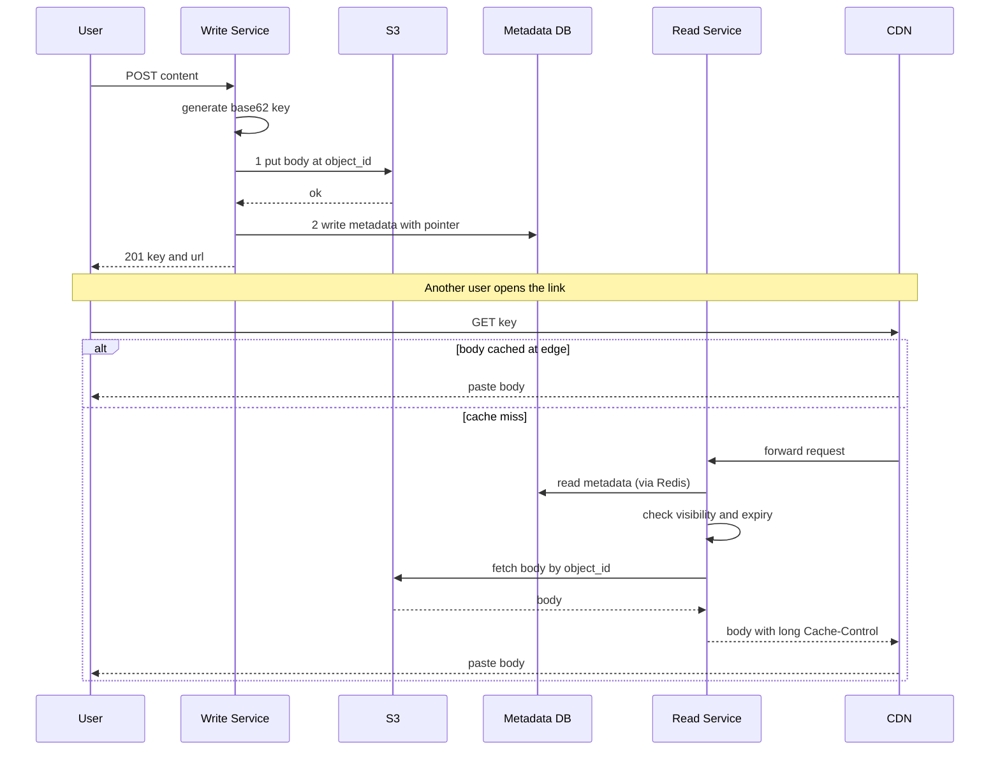

# Design Pastebin

Pastebin lets a user paste a block of text (code, logs, notes), get a unique URL, and share it. Anyone with the link can read the paste in the browser or raw. It resembles a URL shortener — unique-key generation plus a read-heavy fetch — but adds a twist: the payload is **large text** rather than a short string, which forces a decision about *where* to store the content versus the metadata.

## 1. Requirements

### Functional

- A user submits text and receives a **unique URL** (e.g. `pastebin.xyz/aZ4kP9`).
- Anyone with the URL can **retrieve** the paste (HTML view or raw text).
- Pastes can **expire** — never, after a duration (10 min, 1 day, 1 month), or after first read ("burn after reading").
- Support **visibility**: public (listed/searchable), unlisted (link-only), private (owner-only).
- Track basic **analytics**: view count per paste.

### Non-functional

- **Read-heavy** — pastes are written once and read many times (≈10:1 or higher).
- **Low latency** reads, ideally served from cache/CDN.
- **Durability** — don't lose pastes within their lifetime.
- **Scalability** — billions of pastes, large text blobs.
- **Size cap** — limit each paste (e.g. ≤ 10 MB) to bound storage and abuse.

### Clarifying questions to scope it

- Max paste size? This drives blob-vs-DB storage.
- Read:write ratio? (Assume ~10:1.)
- Are pastes editable, or immutable once created? (Assume immutable.)
- Do we need full-text search over public pastes?
- What expiration options, and is "burn after reading" required?

## 2. Capacity Estimation

Assume **10 million** new pastes/day.

```
Writes/sec  = 10M / 86,400              ≈ 116 writes/sec
Reads/sec   = 116 * 10 (10:1)           ≈ 1,160 reads/sec
Peak reads  ≈ 1,160 * 4 (peak factor)   ≈ 4,640 reads/sec
```

**Storage.** Assume an average paste of **10 KB** (logs/code skew larger than tweets).

```
Daily content  = 10M * 10 KB    = 100 GB/day
Yearly content = 100 GB * 365   ≈ 36.5 TB/year
Over 5 years   = 36.5 TB * 5    ≈ 180 TB
```

Metadata is tiny by comparison: ~200 B/paste → `10M * 200 B = 2 GB/day` → ~730 GB/year. So **content dominates storage** and belongs in cheap blob storage, while metadata stays in a fast DB.

**Key space.** base62, 8 chars: `62^8 ≈ 218 trillion` — far more than `10M * 365 * 5 ≈ 18.25B` pastes over 5 years (a ~12,000× margin). An **8-char base62 key** is safe.

**Bandwidth.** Reads: `4,640 * 10 KB ≈ 46 MB/s` outbound; writes: `116 * 10 KB ≈ 1.2 MB/s`. A CDN absorbs most read bandwidth.

| Metric | Value |
|---|---|
| New pastes/day | 10M |
| Write QPS | ~116 |
| Read QPS (peak) | ~4,640 |
| Content storage/year | ~36.5 TB |
| Key length | 8 (base62) |

## 3. API Design

A small REST surface: one create endpoint, read endpoints for the HTML view, raw text, and JSON, plus an owner-only delete.

```api
{
  "endpoints": [
    {
      "method": "POST",
      "path": "/api/v1/pastes",
      "auth": "optional (anonymous or bearer)",
      "desc": "Create a paste and return its unique key and URL.",
      "request": { "content": "....", "expire_in": "1d", "visibility": "unlisted", "burn_after_read": false },
      "responses": [
        { "status": "201 Created", "body": { "key": "aZ4kP9", "url": "https://pastebin.xyz/aZ4kP9", "expires_at": "2026-06-28T00:00:00Z" } },
        { "status": "413 Payload Too Large", "desc": "Content exceeds the size limit." }
      ]
    },
    {
      "method": "GET",
      "path": "/{key}",
      "desc": "HTML view of the paste rendered in the browser.",
      "responses": [
        { "status": "200 OK", "desc": "HTML page of the paste." },
        { "status": "404 Not Found", "desc": "Not found or expired." }
      ]
    },
    {
      "method": "GET",
      "path": "/{key}/raw",
      "desc": "Raw paste body as text/plain.",
      "responses": [
        { "status": "200 OK", "desc": "text/plain raw content." },
        { "status": "404 Not Found", "desc": "Not found or expired." }
      ]
    },
    {
      "method": "GET",
      "path": "/api/v1/pastes/{key}",
      "desc": "Fetch paste content and metadata as JSON.",
      "responses": [
        { "status": "200 OK", "body": { "key": "aZ4kP9", "content": "...", "created_at": "...", "views": 42 } },
        { "status": "403 Forbidden", "desc": "Private paste, requester is not the owner." },
        { "status": "404 Not Found", "desc": "Not found or expired." }
      ]
    },
    {
      "method": "DELETE",
      "path": "/api/v1/pastes/{key}",
      "auth": "owner only",
      "desc": "Delete a paste.",
      "responses": [
        { "status": "204 No Content", "desc": "Deleted." },
        { "status": "403 Forbidden", "desc": "Requester is not the owner." }
      ]
    }
  ]
}
```

## 4. Data Model

The key design choice: **split metadata from content.** Metadata (small, indexed, queried) goes in a database; the large text body goes in an **object store** keyed by an `object_id`. This keeps the DB rows small and lets us scale storage independently and cheaply.

**Metadata DB.** Access is overwhelmingly key-lookup by paste key, so a **NoSQL KV/wide-column store (DynamoDB / Cassandra)** partitioned on `paste_key` fits the hot path; a relational DB also works if we want listing/search via secondary indexes.

```datamodel
{
  "entities": [
    {
      "name": "pastes",
      "store": "DynamoDB / Cassandra",
      "fields": [
        { "name": "paste_key", "type": "varchar(8)", "key": "PK", "note": "base62 id" },
        { "name": "object_id", "type": "varchar(64)", "note": "pointer into blob store / S3 key" },
        { "name": "creator_id", "type": "bigint", "note": "nullable, owner if authenticated" },
        { "name": "visibility", "type": "varchar(10)", "note": "public | unlisted | private" },
        { "name": "created_at", "type": "timestamp" },
        { "name": "expires_at", "type": "timestamp", "note": "NULL = never" },
        { "name": "burn_after_read", "type": "boolean", "note": "default false" },
        { "name": "size_bytes", "type": "int" },
        { "name": "view_count", "type": "bigint", "note": "default 0" },
        { "name": "inline_content", "type": "text", "note": "optional, inlines tiny pastes to skip an S3 round trip" }
      ],
      "partitionKey": "(paste_key)",
      "notes": "Hot path is key-lookup by paste_key; small rows cache densely in Redis."
    },
    {
      "name": "content_objects",
      "store": "S3 / object storage",
      "fields": [
        { "name": "object_key", "type": "varchar", "key": "PK", "note": "s3://pastebin-content/{shard}/{paste_key}.txt" },
        { "name": "body", "type": "blob", "note": "paste text, optionally gzip-compressed" }
      ],
      "notes": "11-nines durability, lifecycle/TTL rules, direct CDN integration."
    }
  ],
  "relationships": [
    { "from": "pastes", "to": "content_objects", "kind": "1:1", "label": "metadata row points to one blob" }
  ]
}
```

**Content store (S3 / object storage).** The object key is the paste key (or a hashed `object_id`), e.g. `s3://pastebin-content/{shard}/{paste_key}.txt`, optionally gzip-compressed.

Why not store the text in the DB? Large `TEXT`/`BLOB` columns bloat rows, hurt cache density, and make replication expensive. **S3** gives 11-nines durability, near-infinite capacity, lifecycle/TTL rules, and direct CDN integration — at a fraction of DB cost. The DB just holds a pointer.

For very small pastes (< ~1 KB) an optimization is to inline the content in the DB to skip an S3 round trip; the schema can carry an optional `inline_content` column.

## 5. High-Level Architecture

Reads flow through a CDN and read service backed by Redis metadata, the DB, and S3 bodies; writes go through a write service that puts the body then the metadata, with a sweeper reclaiming expired data.

```arch
{
  "title": "Pastebin — read path (primary) and write path",
  "nodes": [
    { "id": "reader", "label": "Reader", "type": "client", "col": 0, "row": 0, "meta": "browser opening a link" },
    { "id": "writer", "label": "Writer", "type": "client", "col": 0, "row": 2, "meta": "creates a paste" },
    { "id": "cdn", "label": "CDN", "type": "cdn", "col": 1, "row": 0, "meta": "caches immutable paste bodies at the edge" },
    { "id": "lb", "label": "Load Balancer", "type": "lb", "col": 1, "row": 1 },
    { "id": "read", "label": "Read Service", "type": "service", "col": 2, "row": 0, "meta": "stateless, scales horizontally" },
    { "id": "write", "label": "Write Service", "type": "service", "col": 2, "row": 2, "meta": "body then metadata" },
    { "id": "kgs", "label": "Key Gen Service", "type": "service", "col": 2, "row": 3, "meta": "ZooKeeper counter range + base62" },
    { "id": "cache", "label": "Redis", "type": "cache", "col": 3, "row": 0, "meta": "hot metadata, LRU" },
    { "id": "db", "label": "Metadata DB", "type": "db", "col": 3, "row": 1, "meta": "DynamoDB / Cassandra, sharded on paste_key" },
    { "id": "s3", "label": "S3", "type": "blob", "col": 3, "row": 2, "meta": "content blobs, 11-nines durability" },
    { "id": "kafka", "label": "Kafka", "type": "queue", "col": 3, "row": 3, "meta": "async view-count events" },
    { "id": "sweeper", "label": "Expiry Sweeper", "type": "worker", "col": 4, "row": 2, "meta": "batch cleanup + S3 lifecycle" }
  ],
  "edges": [
    { "from": "reader", "to": "cdn", "step": 1, "label": "GET paste" },
    { "from": "cdn", "to": "lb", "step": 2, "label": "miss" },
    { "from": "lb", "to": "read", "step": 3 },
    { "from": "read", "to": "cache", "step": 4, "label": "metadata" },
    { "from": "cache", "to": "db", "step": 5, "label": "on miss" },
    { "from": "read", "to": "s3", "step": 6, "label": "fetch body" },
    { "from": "writer", "to": "lb", "label": "POST paste" },
    { "from": "lb", "to": "write" },
    { "from": "kgs", "to": "write", "label": "id range" },
    { "from": "write", "to": "s3", "label": "put body" },
    { "from": "write", "to": "db", "label": "write meta" },
    { "from": "read", "to": "kafka", "label": "async view" },
    { "from": "sweeper", "to": "db" },
    { "from": "sweeper", "to": "s3" }
  ],
  "groups": [ { "label": "Data tier", "nodes": ["cache", "db", "s3"] } ]
}
```

**Walkthrough.** The read path is the hot, primary flow (numbered to match the arrows above); the write and sweeper paths run alongside it.

1. A **reader** requests a paste via the **CDN**.
2. On a cache **miss**, the CDN forwards to the **load balancer**.
3. The LB routes the request to a stateless **read service**.
4. The read service loads **metadata** from **Redis**.
5. On a cache miss it falls back to the **metadata DB**.
6. With the pointer in hand it **fetches the body** from **S3**, then returns it with a long `Cache-Control` so the CDN serves repeats from the edge.

Alongside this: the **write service** generates a key (from the **key gen service**'s ZooKeeper-allocated counter range + base62), uploads the body to **S3**, then writes metadata (with the S3 pointer) to the DB — body first, metadata second, so a visible paste always has retrievable content. View counts are emitted asynchronously to **Kafka**, and the **expiry sweeper** plus S3 lifecycle rules remove expired content from the DB and S3.

**Create (write) and read paths:**



## 6. Deep Dives

### 6.1 Key generation

Identical to the URL-shortener trade-off. Hashing the content invites **collisions** and makes identical pastes share a URL (bad for separate expiry/analytics). Instead we use a **distributed counter + base62**: each write node leases a block of IDs from **ZooKeeper** and serves them locally, so there's no per-write coordination and uniqueness is guaranteed by construction. We **scramble** the counter (bijective permutation) so keys aren't sequentially guessable, which matters for *unlisted* pastes whose only protection is an unguessable URL.

### 6.2 Blob storage vs database for content

Storing 10 KB–10 MB blobs in the metadata DB would wreck it: huge rows evict more useful data from the buffer cache, replication and backups balloon, and read amplification grows. Offloading to **S3** gives us:

- **Cost** — object storage is ~5–10× cheaper per GB than primary DB storage.
- **Durability & scale** — 11 nines, effectively unbounded capacity.
- **CDN-friendliness** — bodies are immutable, so they cache perfectly at the edge.
- **Lifecycle TTL** — S3 can auto-delete objects past an expiry, doing cleanup for us.

The DB stays lean — small, fast rows that cache densely in Redis. The one cost is an extra S3 round trip on reads, mitigated by the CDN and by inlining tiny pastes.

### 6.3 Expiration: TTL plus lazy cleanup

Pastes expire by time or by "burn after reading." We enforce expiry with three complementary mechanisms:

1. **Lazy check on read** — the read service compares `expires_at` to now and returns 404 immediately if expired, even before any background job runs. For *burn-after-read*, it deletes the paste in the same request after serving it once (using an atomic conditional delete to handle concurrent reads safely).
2. **Store-native TTL** — set DynamoDB **TTL** (or Cassandra TTL) on the metadata row and an **S3 lifecycle rule** on the object, so storage reclaims expired data automatically without us scanning.
3. **Sweeper job** — a periodic batch job catches anything the above missed and reconciles orphaned S3 objects.

Lazy deletion guarantees correctness (users never see expired pastes); TTL/lifecycle guarantees the storage is actually freed.

### 6.4 CDN caching and read scaling

Because paste bodies are **immutable**, they are ideal for aggressive CDN caching. The read service returns long `Cache-Control` headers for the raw body; the CDN serves repeat reads from the edge, so the origin and S3 see only cache-miss traffic. Metadata (small, hot) is cached in **Redis** with an LRU policy and a TTL bounded by the paste's own expiry. This two-tier **caching** (CDN for bodies, Redis for metadata) keeps the database and object store nearly idle on reads — exactly what a read-heavy system wants.

## 7. Bottlenecks & Scaling

- **Read scaling.** Stateless read services scale horizontally; CDN + Redis absorb the bulk of traffic. The metadata DB shards on `paste_key` via **consistent hashing**, distributing load evenly (scrambled keys avoid hotspots).
- **Storage scaling.** S3 scales independently and effectively without bound; we prefix object keys with a shard token to spread request load across S3 partitions.
- **Hot pastes.** A viral paste is a read hotspot, fully absorbed by the CDN; the origin may see only the first miss per edge.
- **Write path.** Two writes per paste (S3 + metadata). If the metadata write fails after the S3 upload, a reconciliation job garbage-collects the orphan object.
- **Analytics.** View counts are incremented asynchronously via **Kafka** to avoid a write on every read; consumers aggregate `view_count` so reads stay cheap.
- **Failure handling.** Multi-AZ DB replication; S3 is inherently multi-AZ. If Redis is cold, reads fall back to the DB; request coalescing prevents a stampede on a popular key.

## 8. Trade-offs & Follow-ups

| Decision | Choice | Trade-off |
|---|---|---|
| Content location | S3 blob store | Extra round trip vs cheap, durable, CDN-cacheable |
| Metadata store | NoSQL KV | No rich queries, but scales and shards trivially |
| Key generation | Counter + base62 + scramble | Needs ZK, but collision-free + unguessable |
| Expiry | Lazy + TTL/lifecycle | Slight lag in reclaiming storage, but correct on read |
| View counting | Async via Kafka | Eventually consistent counts, but reads stay fast |

**Likely interviewer follow-ups.**

- *How do private pastes work?* Store `visibility` and `creator_id`; the read service authenticates and authorizes the requester. Unlisted pastes rely on the unguessable key; private pastes require ownership and shouldn't be CDN-cached publicly.
- *Full-text search over public pastes?* Index public paste content into **Elasticsearch** asynchronously; keep it out of the hot read path.
- *Burn-after-read races?* Use an atomic conditional delete (compare-and-set on a `read` flag) so exactly one reader wins.
- *Abuse (malware, spam)?* Rate-limit the create API per IP/user (token bucket), enforce the size cap, and scan content against blocklists.
- *Why not just store everything in one DB?* Walk through cost, row bloat, replication, and CDN-cacheability — the split is the whole point.

## Key takeaways

- Pastebin is a **read-heavy, write-once** system; the defining decision is **splitting large content into S3** while keeping small **metadata in a fast DB**.
- **Counter + base62 + scrambling** yields collision-free, unguessable keys — critical for unlisted pastes whose only protection is the URL.
- Enforce expiration with **lazy checks on read** for correctness plus **store-native TTL / S3 lifecycle** for actual reclamation.
- Immutable bodies make **CDN caching** extremely effective; pair it with **Redis** for hot metadata to keep origins idle.
- Shard metadata on the paste key with **consistent hashing**, and increment view counts **asynchronously via Kafka** to keep reads cheap.
- The architecture is a URL shortener plus a blob store — recognize the shared primitives (unique keys, read caching) and the one new axis (large-payload storage).
