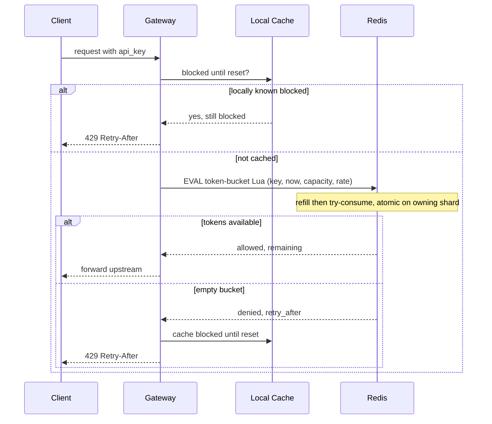

# Design a Distributed Rate Limiter

A rate limiter caps how many requests a client (user, IP, API key, or tenant) may make in a time window, protecting backends from overload, abuse, and runaway costs. The hard part is not the algorithm on one box — it's enforcing a **single shared limit consistently across a fleet** of stateless servers without adding meaningful latency to every request.

## 1. Requirements

### Functional

- Limit requests per identity (user ID / IP / API key) to **N requests per window** (e.g. 100 req/min).
- Support multiple, composable rules (per-second burst + per-day quota; per-endpoint overrides).
- On limit breach, reject with **HTTP 429 Too Many Requests** and a **`Retry-After`** header.
- Limits must hold **globally** across all application servers, not per-server.

### Non-functional

- **Low latency** — the check adds < 5 ms; it runs on every request.
- **High availability** — the limiter must not become a single point of failure that takes down the API.
- **Accuracy** — avoid both over-counting (rejecting legit traffic) and large under-counting.
- **Scalability** — millions of distinct keys, hundreds of thousands of checks/sec.
- A clear **failure policy** (fail-open vs fail-closed).

### Clarifying questions to scope it

- What's the limit dimension — per user, IP, API key, or a combination?
- Is a strict cap required, or is approximate enforcement acceptable for performance?
- Hard reject, or throttle/queue?
- Single region or global? Global makes a shared counter much harder.
- What should happen if the limiter store (Redis) is down?

## 2. Capacity Estimation

Assume an API serving **1 million DAU**, each making ~100 requests/day, with a fleet of API servers.

```
Total requests/day = 1M * 100              = 100M requests/day
Avg QPS            = 100M / 86,400         ≈ 1,160 req/sec
Peak QPS           ≈ 1,160 * 5 (peak factor) ≈ 5,800 req/sec
```

Every request triggers exactly one rate-limit check, so the limiter store must handle **~5,800 ops/sec** at peak. A single Redis node handles 100k+ ops/sec, so throughput is not the constraint — **latency and availability** are.

**State size.** One bucket per active key. With ~1M active users + API keys:

```
Per key: ~64 B (key string + token count + last-refill timestamp)
1M keys * 64 B = 64 MB
```

Trivial for Redis memory. With short TTLs on idle keys, the working set stays small.

| Metric | Value |
|---|---|
| Check QPS (peak) | ~5,800 |
| Active keys | ~1M |
| State size | ~64 MB |
| Latency budget | < 5 ms |

## 3. API Design

The rate limiter is mostly an internal library/sidecar, but it exposes a logical check interface plus an admin API to manage rules.

```api
{
  "endpoints": [
    {
      "method": "POST",
      "path": "/internal/check",
      "auth": "internal (gateway/middleware)",
      "desc": "Atomic token-bucket check for one identity; called on every request.",
      "request": { "key": "rl:{api_key}:{endpoint}", "rule": { "limit": 100, "window_s": 60 } },
      "responses": [
        { "status": "200 OK", "body": { "allowed": true, "remaining": 87, "retry_after_s": 0 } },
        { "status": "429 Too Many Requests", "desc": "Limit exceeded; sets Retry-After, X-RateLimit-Limit, X-RateLimit-Remaining, X-RateLimit-Reset headers." }
      ],
      "notes": "Implemented as a single Redis EVAL Lua call for atomicity."
    },
    {
      "method": "PUT",
      "path": "/admin/rules/{key_pattern}",
      "auth": "admin",
      "desc": "Create or update a rate-limit rule for a key pattern.",
      "request": { "limit": 100, "window_s": 60, "burst": 20 },
      "responses": [
        { "status": "200 OK", "body": { "key_pattern": "user:*", "limit": 100, "window_s": 60, "burst": 20 } }
      ]
    },
    {
      "method": "GET",
      "path": "/admin/rules/{key_pattern}",
      "auth": "admin",
      "desc": "Fetch the rule currently applied to a key pattern.",
      "responses": [
        { "status": "200 OK", "body": { "key_pattern": "user:*", "limit": 100, "window_s": 60, "burst": 20 } },
        { "status": "404 Not Found", "desc": "No rule defined for this pattern." }
      ]
    }
  ]
}
```

## 4. Data Model

State is ephemeral, hot, and accessed on every request, so it lives in **Redis** (in-memory), not a durable SQL store. Each key holds the token-bucket state; the rule config can live in a config store (or Redis hash) loaded into memory.

```datamodel
{
  "entities": [
    {
      "name": "rl:{api_key}:{endpoint}",
      "store": "Redis",
      "fields": [
        { "name": "tokens", "type": "float", "key": "PK", "note": "current available tokens in the bucket" },
        { "name": "last_refill", "type": "int", "note": "epoch millis of last refill" }
      ],
      "notes": "Redis hash, one per identity. TTL = window * 2 to auto-evict idle keys."
    },
    {
      "name": "rule:{key_pattern}",
      "store": "Redis / config store",
      "fields": [
        { "name": "key_pattern", "type": "varchar", "key": "PK", "note": "e.g. user:* or apikey:*" },
        { "name": "limit", "type": "int", "note": "max tokens per window" },
        { "name": "window_s", "type": "int", "note": "window length in seconds" },
        { "name": "burst", "type": "int", "note": "extra burst capacity" }
      ],
      "notes": "Rarely changes; cached in app memory and loaded at startup."
    }
  ],
  "relationships": [
    { "from": "rule:{key_pattern}", "to": "rl:{api_key}:{endpoint}", "kind": "1:N", "label": "one rule governs many buckets" }
  ]
}
```

Why not SQL: durability and joins are irrelevant; we need single-digit-millisecond atomic read-modify-write at high QPS. Losing counters on a Redis restart is acceptable (it just resets windows briefly).

## 5. High-Level Architecture

The limiter lives in the API gateway, in front of business logic, and consults a small local cache plus a sharded Redis cluster that holds the token-bucket state.

```arch
{
  "title": "Distributed rate limiter — per-request check path",
  "nodes": [
    { "id": "client", "label": "Client", "type": "client", "col": 0, "row": 1, "meta": "user / service caller" },
    { "id": "gateway", "label": "API Gateway", "type": "gateway", "col": 1, "row": 1, "meta": "rate-limit middleware / Envoy filter" },
    { "id": "local", "label": "Local Cache", "type": "cache", "col": 2, "row": 0, "meta": "in-process negative cache for blocked keys" },
    { "id": "redis", "label": "Redis Cluster", "type": "cache", "col": 3, "row": 1, "meta": "token-bucket state, EVAL Lua, sharded by key" },
    { "id": "upstream", "label": "Upstream Services", "type": "service", "col": 4, "row": 1, "meta": "business logic, protected by the limiter" }
  ],
  "edges": [
    { "from": "client", "to": "gateway", "step": 1, "label": "request" },
    { "from": "gateway", "to": "local", "step": 2, "label": "blocked until reset?" },
    { "from": "gateway", "to": "redis", "step": 3, "label": "EVAL Lua atomic check" },
    { "from": "redis", "to": "gateway", "step": 4, "label": "allowed / denied + remaining" },
    { "from": "gateway", "to": "upstream", "step": 5, "label": "forward if allowed" },
    { "from": "gateway", "to": "client", "label": "429 + Retry-After if blocked" },
    { "from": "local", "to": "gateway", "label": "negative cache hit -> 429" }
  ],
  "groups": [ { "label": "Limiter state", "nodes": ["local", "redis"] } ]
}
```

**Walkthrough.** The limiter lives in the **API gateway** (or an Envoy/NGINX filter / middleware), before requests reach business logic. Redis is sharded so different keys land on different nodes, spreading load.

1. The **client** sends a request to the gateway.
2. The gateway checks its **local in-process cache** for an already-blocked key, short-circuiting obvious cases to cut Redis round trips.
3. On a miss, the gateway runs an **atomic** token-bucket check against **Redis Cluster** via an `EVAL` Lua script.
4. Redis returns the decision (allowed/denied) and remaining tokens to the gateway.
5. If allowed, the gateway **forwards** the request upstream; if blocked, it returns **429 + Retry-After** (and caches the block locally).

**Allow/deny decision flow:**



## 6. Deep Dives

### 6.1 Algorithm choice: token bucket vs sliding window

| Algorithm | Behavior | Pros | Cons |
|---|---|---|---|
| **Fixed window** | Count resets each interval | Trivial, 1 counter | Boundary burst: 2× limit across the edge |
| **Sliding window log** | Store timestamp of every request | Exact | Memory grows with traffic |
| **Sliding window counter** | Weighted blend of current+previous window | Cheap, smooth | Slight approximation |
| **Token bucket** | Tokens refill at a steady rate; each request spends one | Allows controlled bursts, O(1) state | Two values to track |

We choose **token bucket**. It stores just `(tokens, last_refill)` per key — O(1) memory — and naturally permits short bursts (good for real traffic) while enforcing a steady average rate. On each check we lazily refill: `tokens = min(capacity, tokens + (now - last_refill) * refill_rate)`, then if `tokens >= 1` we decrement and allow, else reject. The **fixed window** is rejected for its boundary-burst problem; **sliding window log** for unbounded memory.

### 6.2 Distributed atomicity with Redis Lua

The classic bug: `GET` tokens, compute, `SET` tokens — two commands with a gap. Under concurrency, many gateway instances read the same value, all think there's a token, and all allow — a **race condition** that lets traffic exceed the limit. The fix is to make the entire read-modify-write **atomic**. Redis executes a **Lua script** (`EVAL`) as a single, uninterruptible operation:

```lua
-- KEYS[1] = bucket key; ARGV: now_ms, capacity, refill_per_ms, requested
local b = redis.call('HMGET', KEYS[1], 'tokens', 'ts')
local tokens = tonumber(b[1]) or tonumber(ARGV[2])
local ts     = tonumber(b[2]) or tonumber(ARGV[1])
local now    = tonumber(ARGV[1])
tokens = math.min(tonumber(ARGV[2]), tokens + (now - ts) * tonumber(ARGV[3]))
local allowed = 0
if tokens >= tonumber(ARGV[4]) then
  tokens = tokens - tonumber(ARGV[4]); allowed = 1
end
redis.call('HMSET', KEYS[1], 'tokens', tokens, 'ts', now)
redis.call('PEXPIRE', KEYS[1], 120000)
return { allowed, tokens }
```

Because the script runs on the single shard that owns the key, all increments serialize and the count stays correct under any concurrency.

### 6.3 Local cache + sync to cut latency

Hitting Redis on every request adds a network round trip. Two optimizations:

- **Negative caching:** once a key is over its limit, cache "blocked until `reset_time`" locally so we 429 without touching Redis until the window resets.
- **Token batching / local lease:** a gateway can fetch a small batch of tokens (e.g. 10) from Redis in one call and serve them locally, syncing only when the batch runs low. This trades a little accuracy (limits can drift by the batch size across nodes) for far fewer Redis ops — useful at very high QPS.

This mirrors the cache + write-back pattern: accuracy vs latency is a tunable knob.

### 6.4 Clock skew and time

Token bucket depends on time deltas. If gateways send their own `now` and clocks drift, refills become inconsistent. The robust fix is to use **Redis server time** (`TIME` command / `redis.call('TIME')` inside the Lua script) as the single clock source, so all refills are computed against one monotonic reference regardless of each gateway's local clock.

## 7. Bottlenecks & Scaling

- **Redis as the hotspot.** A single Redis node caps throughput and is a SPOF. Use **Redis Cluster** and shard the bucket keys via **consistent hashing** so load spreads; replicas provide failover.
- **Hot keys.** One enormous tenant can hammer a single shard. Mitigate by splitting that key into M sub-buckets (`key:shard0..shardM`) across nodes and summing, or by giving big tenants dedicated capacity.
- **Latency.** Keep the limiter and Redis in the same region/AZ; co-locate to keep the check at ~1 ms. Local caching removes Redis from the path for already-blocked clients.
- **Hot-path safety.** The Lua check is the only synchronous dependency, so it must be fast and fault-tolerant — set tight Redis timeouts (e.g. 5–10 ms) and fall back rather than block.

## 8. Trade-offs & Follow-ups

**Fail-open vs fail-closed.** If Redis is unreachable, do we allow or deny? **Fail-open** (allow) preserves availability — better for a user-facing API where a brief unmetered window beats a full outage. **Fail-closed** (deny) protects a fragile backend that *must* not be overwhelmed (e.g. a payment processor). Most general APIs **fail open** with alerting; pick per endpoint based on the cost of each failure mode.

| Decision | Choice | Trade-off |
|---|---|---|
| Algorithm | Token bucket | Allows bursts; not perfectly smooth |
| Atomicity | Redis Lua (EVAL) | One round trip, no races |
| Accuracy vs latency | Optional local batching | Cheaper, but limits drift slightly |
| Store-down policy | Fail-open (default) | Availability over strict enforcement |

**Likely interviewer follow-ups.**

- *How do you return useful client info?* Send `Retry-After`, `X-RateLimit-Remaining`, and `X-RateLimit-Reset` so well-behaved clients back off instead of retry-storming.
- *Multiple rules at once?* Evaluate burst + sustained limits in the same Lua script (multiple buckets), reject if any fails.
- *Global multi-region limits?* Strict global counts need cross-region coordination (costly); usually we shard the quota per region or accept eventual consistency.
- *Abusive retry storms?* Combine with exponential backoff guidance and possibly a temporary ban list for repeat offenders.

## Key takeaways

- A distributed rate limiter's real challenge is **shared state across a stateless fleet**, not the algorithm — the answer is centralized counters in **Redis**.
- **Token bucket** is the default: O(1) state, allows controlled bursts, enforces a steady average rate.
- Make the read-modify-write **atomic with a Redis Lua script** to eliminate the multi-instance race condition.
- Use **Redis server time** to defeat clock skew, and shard keys with **consistent hashing** to avoid a single-node bottleneck.
- Decide **fail-open vs fail-closed** per endpoint based on whether availability or backend protection matters more.
- Always return **429 with `Retry-After`** and rate-limit headers so clients can self-throttle.
