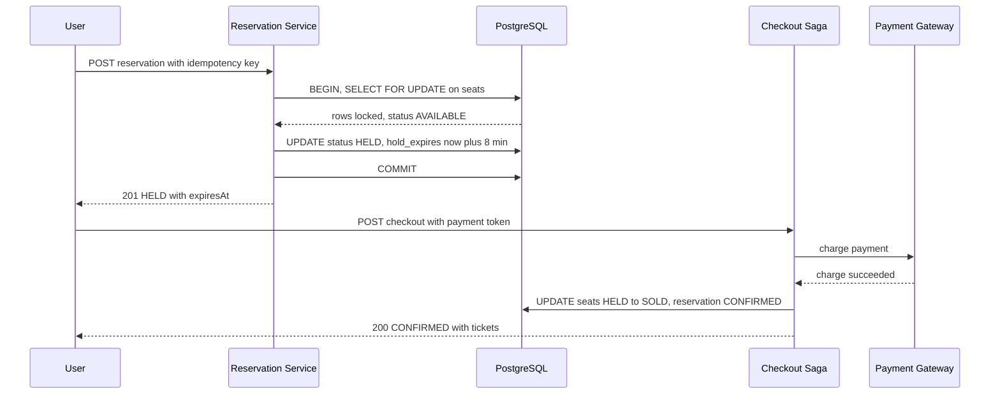

# Design Ticketmaster / Event Booking

A ticketing platform sells a **fixed, finite inventory** of seats for events (concerts, sports, theater). The defining challenge is not raw scale—it is **correctness under contention**. When a Taylor Swift tour goes on sale, hundreds of thousands of users hammer the same few thousand seats in the same minute. The system must guarantee that **each seat is sold exactly once** while staying responsive during a thundering-herd flash sale.

This is fundamentally a **strong-consistency, transactional** problem dressed up as a high-traffic web service.

## 1. Requirements

### Functional

- Browse events, venues, and a **seat map** with real-time availability (available / held / sold).
- **Reserve** specific seats, which places a temporary **hold** (e.g., 8 minutes) while the user pays.
- Complete **payment**; on success the hold converts to a confirmed booking and a ticket is issued.
- If payment fails or the hold expires, seats are **released** back to inventory.
- General-admission (GA) events sell a *quantity* rather than specific seats.
- View "my tickets" and support cancellation/refund per event policy.

### Non-functional

- **No double-booking.** This is the hard invariant—correctness beats availability for the inventory write path.
- **Low latency** for browsing (cacheable) and acceptable latency for reservation (<500 ms p99).
- **Flash-sale resilience:** absorb 10–100x normal traffic for a single event without falling over.
- **Fairness:** users who arrive first should get a fair shot (virtual waiting room).
- **Idempotency:** retries (user double-clicks, client timeouts) must not create duplicate holds or charges.
- High availability for read/browse; the booking write path may degrade gracefully (queue) but must never corrupt inventory.

### Clarifying questions

- Assigned seats or GA, or both? (Affects whether we lock rows or decrement a counter.)
- Hold duration and whether it is configurable per event?
- Do we resell seats released after expiry, and how fast must they reappear?
- Is dynamic pricing / resale marketplace in scope? (Assume out of scope for v1.)
- Per-user purchase limits (e.g., max 6 tickets) to deter scalping?

## 2. Capacity Estimation

Assume a large platform:

- **DAU:** 10M, but traffic is extremely bursty around on-sale events.
- **Events/day:** ~5,000 active; a few "mega" events drive flash sales.
- A mega on-sale: **500,000** users compete for **50,000** seats in the first 10 minutes.

**Write QPS (reservations) during a flash sale:**
500,000 users × ~3 reservation attempts each / 600 s ≈ **2,500 reservation writes/s**, concentrated on **one event's** inventory rows—an extreme hotspot.

**Read QPS (seat-map / browse):**
Each waiting user polls the seat map every ~2 s: 500,000 / 2 ≈ **250,000 reads/s** for one event. This dominates and must be served from cache, not the source-of-truth DB.

**Storage:**

- A seat row ≈ 200 bytes. A 50k-seat venue = 10 MB of seat inventory—trivial.
- Bookings: 100M tickets/year × ~500 bytes = **50 GB/year**. Tiny by modern standards.
- The data is small; the engineering is all about **concurrency and burst traffic**, not storage volume.

**Bandwidth:** Seat-map JSON ≈ 500 KB uncompressed (50k seats). At 250k reads/s that is 125 GB/s if served raw—so we send **deltas** and compressed/cached snapshots, not the full map each poll.

The API has three tiers: cacheable browse/availability reads, a waiting-room admission flow, and the strong-consistency reservation and checkout write paths. The `Idempotency-Key` header is mandatory on both reservation and checkout — clients generate one UUID per logical attempt and reuse it across retries.

```api
{
  "endpoints": [
    {
      "method": "GET",
      "path": "/v1/events/{eventId}",
      "desc": "Event metadata. Cacheable via CDN / read replicas.",
      "responses": [
        { "status": "200 OK", "body": { "eventId": "string", "name": "string", "venue": "string", "startsAt": "timestamp" } }
      ]
    },
    {
      "method": "GET",
      "path": "/v1/events/{eventId}/seatmap",
      "desc": "Static seat layout: sections, rows, and price tiers.",
      "responses": [
        { "status": "200 OK", "body": { "sections": "[...]", "priceTiers": "[...]" } }
      ],
      "notes": "Layout never changes for an event; served from CDN/edge."
    },
    {
      "method": "GET",
      "path": "/v1/events/{eventId}/availability",
      "desc": "Seat status deltas (available/held/sold) since a prior version.",
      "responses": [
        { "status": "200 OK", "body": { "deltas": "[{seatId, status}]", "etag": "version" } },
        { "status": "304 Not Modified", "desc": "ETag unchanged" }
      ],
      "notes": "Served from the availability cache; polled ~every 2s (~250k reads/s)."
    },
    {
      "method": "POST",
      "path": "/v1/events/{eventId}/queue",
      "desc": "Join the virtual waiting room for an on-sale event.",
      "responses": [
        { "status": "200 OK", "body": { "token": "uuid", "position": "int", "etaSeconds": "int" } }
      ]
    },
    {
      "method": "GET",
      "path": "/v1/queue/{token}",
      "desc": "Poll waiting-room status.",
      "responses": [
        { "status": "200 OK", "body": { "status": "WAITING | ADMITTED", "position": "int" } }
      ]
    },
    {
      "method": "POST",
      "path": "/v1/reservations",
      "auth": "Idempotency-Key: <uuid> (required)",
      "desc": "Strong-consistency write path: place a TTL hold on specific seats.",
      "request": { "eventId": "bigint", "seatIds": "[bigint]", "userId": "bigint" },
      "responses": [
        { "status": "201 Created", "body": { "reservationId": "uuid", "status": "HELD", "expiresAt": "timestamp" } },
        { "status": "409 Conflict", "desc": "any requested seat already held or sold" }
      ]
    },
    {
      "method": "DELETE",
      "path": "/v1/reservations/{reservationId}",
      "desc": "Release a hold early, returning seats to AVAILABLE.",
      "responses": [
        { "status": "204 No Content", "desc": "hold released" }
      ]
    },
    {
      "method": "POST",
      "path": "/v1/reservations/{reservationId}/checkout",
      "auth": "Idempotency-Key: <uuid> (required)",
      "desc": "Charge payment and convert the hold to a confirmed booking.",
      "request": { "paymentToken": "string" },
      "responses": [
        { "status": "200 OK", "body": { "bookingId": "uuid", "status": "CONFIRMED", "tickets": "[...]" } },
        { "status": "402 Payment Required", "desc": "charge failed; hold released" }
      ]
    }
  ]
}
```

## 4. Data Model

We choose a relational database (PostgreSQL) as the strongly-consistent source of truth for inventory. The booking flow needs ACID transactions, row-level locking, and uniqueness constraints to enforce "sold once" — a NoSQL store with eventual consistency would make double-booking nearly unavoidable. The dataset is small, so a single primary (with replicas for reads) handles it comfortably.

```datamodel
{
  "entities": [
    {
      "name": "seats",
      "store": "PostgreSQL (strong consistency)",
      "fields": [
        { "name": "seat_id", "type": "bigint", "key": "PK" },
        { "name": "event_id", "type": "bigint", "note": "indexed with status: idx_seats_event_status" },
        { "name": "section", "type": "text" },
        { "name": "row_label", "type": "text" },
        { "name": "seat_number", "type": "text" },
        { "name": "price_cents", "type": "int" },
        { "name": "status", "type": "text", "note": "AVAILABLE | HELD | SOLD, default AVAILABLE" },
        { "name": "held_by", "type": "bigint", "note": "userId currently holding it" },
        { "name": "hold_expires", "type": "timestamptz", "note": "authoritative TTL of the hold" },
        { "name": "version", "type": "int", "note": "for optimistic concurrency, default 0" }
      ],
      "notes": "UNIQUE(event_id, section, row_label, seat_number). Inventory is the hot contention point; flipped to HELD under SELECT FOR UPDATE."
    },
    {
      "name": "reservations",
      "store": "PostgreSQL (strong consistency)",
      "fields": [
        { "name": "reservation_id", "type": "uuid", "key": "PK" },
        { "name": "event_id", "type": "bigint" },
        { "name": "user_id", "type": "bigint" },
        { "name": "seat_ids", "type": "bigint[]" },
        { "name": "status", "type": "text", "note": "HELD | CONFIRMED | EXPIRED | CANCELLED" },
        { "name": "expires_at", "type": "timestamptz" },
        { "name": "idempotency_key", "type": "text", "note": "UNIQUE; de-dupes retried POSTs" },
        { "name": "created_at", "type": "timestamptz", "note": "default now()" }
      ],
      "notes": "UNIQUE(idempotency_key) is the DB-level safety net: a duplicate request fails the insert instead of creating a second hold."
    },
    {
      "name": "bookings",
      "store": "PostgreSQL (strong consistency)",
      "fields": [
        { "name": "booking_id", "type": "uuid", "key": "PK" },
        { "name": "reservation_id", "type": "uuid", "key": "FK", "note": "references reservations" },
        { "name": "user_id", "type": "bigint" },
        { "name": "payment_id", "type": "text" },
        { "name": "total_cents", "type": "int" },
        { "name": "status", "type": "text", "note": "CONFIRMED | REFUNDED" },
        { "name": "created_at", "type": "timestamptz", "note": "default now()" }
      ]
    }
  ],
  "relationships": [
    { "from": "reservations", "to": "seats", "kind": "1:N", "label": "a reservation holds many seats" },
    { "from": "reservations", "to": "bookings", "kind": "1:1", "label": "a confirmed reservation becomes a booking" }
  ]
}
```

The `UNIQUE(idempotency_key)` constraint is the database-level safety net: a duplicate reservation request fails the insert rather than creating a second hold.

## 5. High-Level Architecture

A virtual waiting room throttles the flash-sale flood, cached reads absorb seat-status polling, and a single reservation service is the only writer to a strongly-consistent PostgreSQL inventory. The arch below traces the reserve to pay to confirm flow.

```arch
{
  "title": "Ticketmaster booking — waiting room, cached reads, strongly-consistent inventory",
  "nodes": [
    { "id": "users", "label": "Users", "type": "client", "col": 0, "row": 1, "meta": "flash-sale herd: 500k users for 50k seats" },
    { "id": "cdn", "label": "CDN / Edge", "type": "cdn", "col": 1, "row": 0, "meta": "static seat-map layout, never changes per event" },
    { "id": "room", "label": "Virtual Waiting Room", "type": "service", "col": 1, "row": 2, "meta": "Redis sorted set + admission control, FIFO fairness" },
    { "id": "gateway", "label": "API Gateway", "type": "gateway", "col": 2, "row": 1, "meta": "auth, rate limit, idempotency-key check" },
    { "id": "res", "label": "Reservation Service", "type": "service", "col": 3, "row": 0, "meta": "only writer to inventory, SELECT FOR UPDATE" },
    { "id": "checkout", "label": "Checkout Saga", "type": "service", "col": 3, "row": 1, "meta": "orchestrates payment + HELD -> SOLD" },
    { "id": "expiry", "label": "Expiry Worker", "type": "worker", "col": 3, "row": 2, "meta": "sweeps hold_expires < now() back to AVAILABLE" },
    { "id": "cache", "label": "Availability Cache", "type": "cache", "col": 4, "row": 0, "meta": "Redis seat holds/status, ~250k reads/s, delta+ETag" },
    { "id": "db", "label": "PostgreSQL", "type": "db", "col": 4, "row": 1, "meta": "strong consistency, row locks, source of truth" },
    { "id": "pay", "label": "Payment Gateway", "type": "external", "col": 4, "row": 2, "meta": "external charge, idempotency-key forwarded" }
  ],
  "edges": [
    { "from": "users", "to": "room", "step": 1, "label": "join waiting room" },
    { "from": "room", "to": "gateway", "step": 2, "label": "admit at controlled rate" },
    { "from": "gateway", "to": "cache", "step": 3, "label": "read availability" },
    { "from": "gateway", "to": "res", "step": 4, "label": "reserve seats (write)" },
    { "from": "res", "to": "db", "step": 5, "label": "SELECT FOR UPDATE, flip to HELD" },
    { "from": "gateway", "to": "checkout", "step": 6, "label": "checkout" },
    { "from": "checkout", "to": "pay", "step": 7, "label": "charge payment" },
    { "from": "checkout", "to": "db", "step": 8, "label": "HELD -> SOLD, CONFIRMED" },
    { "from": "users", "to": "cdn", "label": "static seat map" },
    { "from": "res", "to": "cache", "label": "invalidate" },
    { "from": "db", "to": "expiry", "label": "hold-expiry events" },
    { "from": "expiry", "to": "db", "label": "release holds" },
    { "from": "expiry", "to": "cache", "label": "invalidate" }
  ],
  "groups": [
    { "label": "Data tier", "nodes": ["cache", "db"] }
  ]
}
```

- **CDN / Edge** serves the static seat-map layout (positions, sections) which never changes for an event—only *status* is dynamic.
- **Virtual Waiting Room** throttles the flood into a rate the reservation service can safely handle.
- **Availability Cache (Redis)** answers the 250k reads/s of "is this seat free?" so the DB isn't pummeled by browsers.
- **Reservation Service** is the only writer to inventory; it uses DB locking to atomically flip seats to `HELD`.
- **Expiry Worker** scans for `hold_expires < now()` and returns abandoned seats to `AVAILABLE`.
- **Checkout/Saga Orchestrator** coordinates payment and the final `HELD -> SOLD` transition.

**Walkthrough**:
1. During a flash sale, users join the virtual waiting room (a Redis sorted set keyed by arrival time).
2. The admission controller releases users from the front of the queue into the gateway at a controlled rate.
3. Admitted clients read seat availability from the Redis cache (deltas + ETag), never the DB.
4. To reserve, the gateway forwards the idempotency-keyed write to the Reservation Service.
5. The Reservation Service runs `SELECT ... FOR UPDATE` and atomically flips the seats to `HELD` in PostgreSQL.
6. The user proceeds to checkout through the gateway.
7. The Checkout Saga charges the external payment gateway.
8. On success it commits `HELD -> SOLD` and marks the reservation `CONFIRMED` in PostgreSQL.

Secondary paths keep the cache and inventory consistent: the Reservation Service invalidates the availability cache on every hold, and the Expiry Worker sweeps expired holds back to `AVAILABLE`, invalidating the cache so the seats reappear.

The primary flow—reserve a seat with a TTL hold, pay, then confirm—shows how the row lock prevents double-booking end to end:



## 6. Deep Dives

### 6.1 The core concurrency problem: no double-booking

Two users click seat #A12 at the same millisecond. Without coordination, both reservation transactions read `status=AVAILABLE` and both write `HELD`—a double-booking. The fix is to make the read-check-write **atomic** at the database. We use **pessimistic row locking** via `SELECT ... FOR UPDATE`:

```sql
BEGIN;
SELECT seat_id, status FROM seats
  WHERE seat_id = ANY($1) AND event_id = $2
  FOR UPDATE;                       -- locks these rows
-- application checks every seat is AVAILABLE; abort if not
UPDATE seats
  SET status='HELD', held_by=$3,
      hold_expires = now() + interval '8 minutes',
      version = version + 1
  WHERE seat_id = ANY($1) AND status='AVAILABLE';
-- row count must equal requested seat count, else ROLLBACK
INSERT INTO reservations(...) VALUES (...);
COMMIT;
```

`FOR UPDATE` serializes concurrent transactions on those exact rows: the second transaction blocks until the first commits, then sees `status=HELD` and aborts with a 409. **Always lock seats in a deterministic order** (e.g., ascending `seat_id`) to avoid deadlocks when reserving multiple seats. The lock scope is tight (a handful of rows), so even a single hot event scales to thousands of reservations/second.

An alternative is **optimistic concurrency control** using the `version` column: read without a lock, then `UPDATE ... WHERE version = $old`; if the row count is 0, someone else won—retry or fail. Optimistic works well when contention is low; under flash-sale contention, pessimistic locking avoids wasteful retry storms.

### 6.2 Seat holds with TTL, and distributed locks vs DB row locks

A **hold** is a soft reservation with a `hold_expires` timestamp. Two mechanisms enforce it:

- The DB column `hold_expires` is the **authoritative** TTL—any reservation logic treats a seat with `status=HELD AND hold_expires < now()` as effectively available and may re-grab it inside the same `FOR UPDATE` transaction (self-healing even if the worker lags).
- An **Expiry Worker** proactively sweeps expired holds back to `AVAILABLE` and emits a cache-invalidation event so the seat reappears for other buyers within a second or two.

Why DB row locks over **distributed locks** (e.g., Redis `Redlock`)? Because the inventory truth already lives in Postgres. A Redis lock would be a *separate* source of truth that can drift from the DB (Redlock has known correctness caveats under clock skew and failover). Keeping the lock and the data in the same transactional store gives a single, consistent boundary. Distributed locks make sense when the protected resource is *not* itself transactional—not the case here.

### 6.3 Flash-sale thundering herd: the virtual waiting room

When 500k users arrive for 50k seats, letting them all hit the reservation DB would melt it. A **virtual waiting room** decouples arrival rate from processing rate:

1. On event open, each user is enqueued into a **Redis sorted set** keyed by arrival timestamp, receiving a token and position.
2. An **admission controller** releases users from the front of the queue at a controlled rate (e.g., 500/s) into the active reservation flow. The rate is tuned to what Postgres + the reservation service can handle with headroom.
3. Admitted users get a short-lived session; the seat map they see is served from the **availability cache**, not the DB.

This converts a spike into a steady stream, provides **fairness** (FIFO-ish ordering), and gives honest ETAs ("you are #41,233, ~6 min"). It is essentially **load leveling** with a queue—the same pattern as a message-broker buffer in front of a slow consumer.

### 6.4 Payment, saga, and idempotency

Checkout spans two systems—our inventory DB and an external **payment gateway**—so a single ACID transaction is impossible. We use a **saga**:

```
1. Reservation is HELD (already done).
2. Charge payment gateway (external call, may be slow/uncertain).
3a. Success -> UPDATE seats SET status='SOLD'; reservation -> CONFIRMED; issue tickets.
3b. Failure  -> release seats (HELD -> AVAILABLE); reservation -> CANCELLED.
   Compensating action if charge succeeded but seat-commit failed: refund.
```

**Idempotency** is essential because step 2 is the classic ambiguous-failure case (network timeout—did the charge go through?). The `Idempotency-Key` flows to the payment gateway (Stripe et al. support it natively) so a retried charge with the same key is de-duplicated. On our side, the `UNIQUE(idempotency_key)` constraint on `reservations` ensures a double-submitted booking returns the *existing* result instead of charging twice. The rule: **every state-changing endpoint is idempotent on a client-supplied key.**

## 7. Bottlenecks & Scaling

- **Hot inventory rows:** all contention concentrates on one event's seats. Mitigate with the waiting room (caps write rate), short lock scope, and serving reads from cache. For GA tickets, replace per-seat rows with a **counter decrement** (`UPDATE events SET remaining = remaining - $n WHERE remaining >= $n`)—a single atomic statement that avoids per-seat row contention.
- **Read amplification:** seat-status polling is 100x the writes. Serve it from **Redis**, invalidated on every hold/sale/release, and push **deltas** (changed seats only) keyed by an ETag/version so clients transfer kilobytes, not the full map.
- **DB scaling:** add **read replicas** for browse traffic; keep writes on the primary. Because per-event inventory is small and self-contained, **shard by event_id** across multiple primaries—each mega event can own a dedicated shard so its load can't starve other events.
- **Expiry lag:** if the expiry worker dies, seats stay stuck as `HELD`. The self-healing reservation query (treating expired holds as available) plus a redundant, idempotent sweeper covers this.
- **Failure handling:** the saga's compensating transactions (refund, release) handle partial failures; an outbox table + retries guarantee cache invalidations and ticket issuance eventually fire.

## 8. Trade-offs & Follow-ups

| Decision | Chosen | Alternative | Why |
|---|---|---|---|
| Inventory store | SQL (Postgres) | NoSQL | ACID + row locks prevent double-booking |
| Concurrency control | Pessimistic `FOR UPDATE` | Optimistic versioning | High contention favors locking over retry storms |
| Lock location | DB row lock | Redis distributed lock | Single consistent source of truth |
| Spike handling | Virtual waiting room | Pure autoscaling | Protects DB; adds fairness |
| Hold enforcement | DB TTL + sweeper | In-memory only | Survives worker crashes |

**Likely follow-ups:**

- *How long should a hold last?* Trade conversion vs inventory liquidity; 5–10 min is typical, configurable per event.
- *How do you prevent scalper bots?* Per-user limits enforced in the reservation transaction, CAPTCHA/queue at entry, device fingerprinting.
- *What if Postgres fails over mid-sale?* Synchronous replica + the idempotency keys make retried requests safe; uncommitted holds are simply lost and re-acquirable.
- *Resale marketplace?* Re-list a `SOLD` ticket as new inventory with an ownership-transfer transaction.

## Key takeaways

- Event booking is a **strong-consistency** problem: the non-negotiable invariant is *each seat sold exactly once*, which dictates a transactional SQL store.
- Atomic **read-check-write** via `SELECT ... FOR UPDATE` (lock rows in a fixed order) is the simplest correct way to prevent double-booking under contention.
- **Holds are TTL'd reservations**; make the DB timestamp authoritative and add a self-healing sweeper so crashes never permanently leak inventory.
- A **virtual waiting room** turns a thundering-herd flash sale into a controlled stream, protecting the database and providing fairness.
- Checkout spans an external payment gateway, so use a **saga with compensating actions** and **idempotency keys** end-to-end to survive ambiguous failures without double-charging.
- The data is tiny; the engineering is all about **concurrency, burst absorption, and idempotency**, not storage scale.
