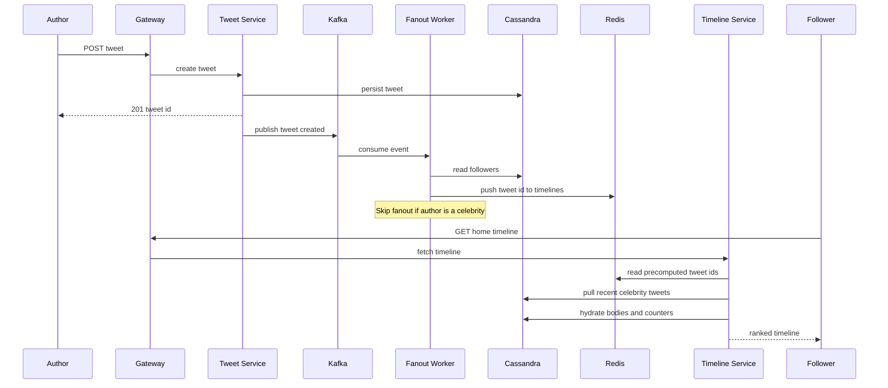

# Design Twitter / News Feed

The home timeline is one of the most studied problems in system design because it crystallizes a single tension: do you do work when content is **written**, or when it is **read**? With billions of reads per day and a power-law follower graph, no single answer wins. This case study builds a Twitter-style news feed and works through the fanout trade-offs in detail.

## 1. Requirements

### Functional
- A user can **post a tweet** (up to 280 characters, optional media).
- A user can **follow / unfollow** other users.
- A user can view their **home timeline**: a reverse-chronological-ish, ranked merge of tweets from accounts they follow.
- A user can view a **user timeline**: all tweets authored by a single account.
- Support likes, retweets, and replies (treated as lightweight tweets that reference a parent).
- Media (images, short video) is attached to tweets and served fast.

### Non-functional
- **Read-heavy**: roughly 100:1 read-to-write ratio. Timeline reads must feel instant.
- **Low latency**: home timeline p99 < 200 ms.
- **High availability** over strong consistency. A tweet appearing a few seconds late in a follower's timeline is acceptable; the timeline being *down* is not.
- **Eventual consistency** is fine for fanout; a user must always immediately see their *own* tweet.
- Massive scale and a heavily skewed follower distribution (celebrities with 100M+ followers).

### Clarifying questions
- Is the timeline strictly chronological or ranked/ML-ordered? (We support both: a chronological base merged with a ranking layer.)
- How fresh must the timeline be? (Seconds, not instant.)
- Do we need edit/delete? (Delete yes via tombstones; edit out of scope.)
- What is the max followers/following? (Following capped ~5,000; followers unbounded — this is the crux.)

## 2. Capacity Estimation

Assume **300M DAU**.

**Writes (tweets):**
- Average user posts ~2 tweets/day → 600M tweets/day.
- Write QPS = 600M / 86,400 ≈ **~7,000 tweets/sec**, peak ~3x → **~21,000/sec**.

**Reads (timeline fetches):**
- Each user refreshes the timeline ~20 times/day → 6B reads/day.
- Read QPS = 6B / 86,400 ≈ **~70,000/sec**, peak ~3x → **~210,000/sec**.
- Confirms the ~100:1 read:write ratio.

**Fanout volume:**
- Average ~200 followers per author. 600M tweets/day × 200 = **120B timeline insertions/day** under pure push.
- Fanout write QPS = 120B / 86,400 ≈ **~1.4M inserts/sec** into timeline caches. This is the number that forces a hybrid design.

**Storage (tweet metadata):**
- Per tweet ≈ 300 bytes (text + ids + timestamps + counters).
- 600M/day × 300 B ≈ **180 GB/day** ≈ **~65 TB/year** of tweet rows (before replication).

**Media storage:**
- ~10% of tweets carry media, avg 200 KB after compression → 60M × 200 KB = **12 TB/day** ≈ **~4.4 PB/year**, stored in object storage + CDN.

**Timeline cache memory:**
- Cache ~800 tweet IDs per active user. ID = 8 bytes → ~6.4 KB/user. For 300M users ≈ **~2 TB** of Redis (sharded), realistically less because we only cache active users.

## 3. API Design

The hot paths are posting a tweet and fetching the home timeline. All endpoints are bearer-authenticated and paginate with an opaque cursor.

```api
{
  "endpoints": [
    {
      "method": "POST",
      "path": "/v1/tweets",
      "auth": "bearer",
      "desc": "Post a tweet (text + optional media/reply).",
      "request": { "text": "string<=280", "media_ids": "[bigint]?", "reply_to": "bigint?" },
      "responses": [
        { "status": "201 Created", "body": { "tweet_id": "bigint", "created_at": "timestamp" } }
      ]
    },
    {
      "method": "DELETE",
      "path": "/v1/tweets/{tweet_id}",
      "auth": "bearer",
      "desc": "Delete a tweet (tombstone; filtered at hydration).",
      "responses": [
        { "status": "204 No Content" }
      ]
    },
    {
      "method": "GET",
      "path": "/v1/timeline/home?cursor=&limit=20",
      "auth": "bearer",
      "desc": "Ranked home timeline merging followed accounts.",
      "responses": [
        { "status": "200 OK", "body": { "tweets": "[Tweet]", "next_cursor": "string" } }
      ],
      "notes": "Cursor encodes last seen snowflake id + score so head inserts don't shift pages."
    },
    {
      "method": "GET",
      "path": "/v1/timeline/user/{user_id}?cursor=&limit=20",
      "auth": "bearer",
      "desc": "All tweets authored by one account (single-partition scan).",
      "responses": [
        { "status": "200 OK", "body": { "tweets": "[Tweet]", "next_cursor": "string" } }
      ]
    },
    {
      "method": "POST",
      "path": "/v1/follows",
      "auth": "bearer",
      "desc": "Follow an account.",
      "request": { "followee_id": "bigint" },
      "responses": [
        { "status": "201 Created" }
      ]
    },
    {
      "method": "DELETE",
      "path": "/v1/follows/{followee_id}",
      "auth": "bearer",
      "desc": "Unfollow an account.",
      "responses": [
        { "status": "204 No Content" }
      ]
    },
    {
      "method": "POST",
      "path": "/v1/media",
      "auth": "bearer",
      "desc": "Request a pre-signed upload URL for media.",
      "responses": [
        { "status": "200 OK", "body": { "media_id": "bigint", "upload_url": "string" } }
      ]
    },
    {
      "method": "POST",
      "path": "/v1/tweets/{id}/like",
      "auth": "bearer",
      "desc": "Like a tweet.",
      "responses": [
        { "status": "200 OK" }
      ]
    },
    {
      "method": "POST",
      "path": "/v1/tweets/{id}/retweet",
      "auth": "bearer",
      "desc": "Retweet (a lightweight tweet referencing a parent).",
      "responses": [
        { "status": "201 Created", "body": { "tweet_id": "bigint" } }
      ]
    }
  ]
}
```

Pagination uses an opaque **cursor** (encoding the last seen tweet's snowflake ID + score) rather than offset, so new tweets at the head don't shift pages.

## 4. Data Model

We split storage by access pattern. Tweets and the social graph live in a wide-column store (Cassandra / Twitter's Manhattan) for write throughput and horizontal scale; counters and timelines live in Redis.

**Why NoSQL here:** the workload is append-heavy, the access pattern is a simple key lookup ("give me tweets by user X" / "give me timeline of user Y"), and we need linear write scaling across thousands of nodes with tunable consistency. We don't need cross-entity joins or multi-row transactions, so the relational guarantees aren't worth the scaling cost.

```datamodel
{
  "entities": [
    {
      "name": "tweets_by_user",
      "store": "Cassandra",
      "fields": [
        { "name": "user_id", "type": "bigint", "key": "PK", "note": "partition: one user timeline = one partition scan" },
        { "name": "tweet_id", "type": "bigint", "key": "CK", "note": "Snowflake id, time-sortable, DESC" },
        { "name": "text", "type": "text" },
        { "name": "media_ids", "type": "list<bigint>" },
        { "name": "reply_to", "type": "bigint" },
        { "name": "created_at", "type": "timestamp" }
      ],
      "partitionKey": "(user_id) -> tweet_id DESC"
    },
    {
      "name": "tweets_by_id",
      "store": "Cassandra",
      "fields": [
        { "name": "tweet_id", "type": "bigint", "key": "PK", "note": "direct lookup for hydration" },
        { "name": "user_id", "type": "bigint" },
        { "name": "text", "type": "text" },
        { "name": "media_ids", "type": "list<bigint>" },
        { "name": "created_at", "type": "timestamp" }
      ]
    },
    {
      "name": "followers",
      "store": "Cassandra",
      "fields": [
        { "name": "user_id", "type": "bigint", "key": "PK", "note": "who follows me" },
        { "name": "follower_id", "type": "bigint", "key": "CK" }
      ],
      "partitionKey": "(user_id) -> follower_id"
    },
    {
      "name": "following",
      "store": "Cassandra",
      "fields": [
        { "name": "user_id", "type": "bigint", "key": "PK", "note": "who I follow" },
        { "name": "followee_id", "type": "bigint", "key": "CK" }
      ],
      "partitionKey": "(user_id) -> followee_id"
    },
    {
      "name": "timeline:{user_id}",
      "store": "Redis",
      "fields": [
        { "name": "member", "type": "tweet_id", "note": "ZSET, sorted set per user" },
        { "name": "score", "type": "snowflake", "note": "snowflake id as sort score" }
      ],
      "notes": "Home timeline cache; trimmed to last ~800 entries via ZREMRANGEBYRANK 0 -801."
    },
    {
      "name": "counters",
      "store": "Redis",
      "fields": [
        { "name": "like:count:{tweet_id}", "type": "counter" },
        { "name": "retweet:count:{tweet_id}", "type": "counter" }
      ]
    }
  ],
  "relationships": [
    { "from": "tweets_by_user", "to": "followers", "kind": "1:N", "label": "one author -> many followers (fanout)" },
    { "from": "tweets_by_user", "to": "timeline:{user_id}", "kind": "1:N", "label": "tweet id pushed into follower timelines" },
    { "from": "timeline:{user_id}", "to": "tweets_by_id", "kind": "N:1", "label": "hydrate ids -> bodies" }
  ]
}
```

**Snowflake IDs** are 64-bit: timestamp (41 bits) + machine id + sequence. They are globally unique *and* roughly time-sortable, so we can use them directly as both the primary key and the timeline sort score, avoiding a separate ordering field.

## 5. High-Level Architecture

The write path persists then publishes to Kafka for asynchronous fanout; the read path serves precomputed timelines from Redis and pulls celebrity tweets at read time.

```arch
{
  "title": "Twitter news feed — hybrid fanout write path and timeline read path",
  "nodes": [
    { "id": "client", "label": "Client", "type": "client", "col": 0, "row": 1, "meta": "web / mobile app" },
    { "id": "gateway", "label": "API Gateway", "type": "gateway", "col": 1, "row": 1, "meta": "auth, routing" },
    { "id": "tweet_svc", "label": "Tweet Service", "type": "service", "col": 2, "row": 0, "meta": "write path" },
    { "id": "timeline_svc", "label": "Timeline Service", "type": "service", "col": 2, "row": 1, "meta": "read path, ranking + hydration" },
    { "id": "media_svc", "label": "Media Service", "type": "service", "col": 2, "row": 2, "meta": "pre-signed uploads" },
    { "id": "tweets_db", "label": "Cassandra Tweets", "type": "db", "col": 3, "row": 0, "meta": "tweets_by_user / by_id" },
    { "id": "kafka", "label": "Kafka", "type": "queue", "col": 3, "row": 1, "meta": "tweet_created, partition by author" },
    { "id": "s3", "label": "S3", "type": "blob", "col": 3, "row": 3, "meta": "media objects" },
    { "id": "graph_db", "label": "Cassandra Graph", "type": "db", "col": 4, "row": 0, "meta": "followers / following" },
    { "id": "fanout", "label": "Fanout Workers", "type": "worker", "col": 4, "row": 1, "meta": "push to active followers" },
    { "id": "redis", "label": "Redis Timelines", "type": "cache", "col": 4, "row": 2, "meta": "sorted set per user, ~800 ids" },
    { "id": "cdn", "label": "CDN", "type": "cdn", "col": 4, "row": 3, "meta": "edge-cached media" }
  ],
  "edges": [
    { "from": "client", "to": "gateway", "step": 1, "label": "POST /tweets" },
    { "from": "gateway", "to": "tweet_svc", "step": 2, "label": "write" },
    { "from": "tweet_svc", "to": "tweets_db", "step": 3, "label": "persist" },
    { "from": "tweet_svc", "to": "kafka", "step": 4, "label": "publish tweet_created" },
    { "from": "kafka", "to": "fanout", "step": 5, "label": "consume" },
    { "from": "fanout", "to": "graph_db", "step": 6, "label": "read followers" },
    { "from": "fanout", "to": "redis", "step": 7, "label": "push tweet ids" },
    { "from": "timeline_svc", "to": "redis", "step": 8, "label": "read precomputed ids" },
    { "from": "timeline_svc", "to": "tweets_db", "step": 9, "label": "pull celebrity + hydrate" },
    { "from": "gateway", "to": "timeline_svc", "label": "GET /timeline/home" },
    { "from": "gateway", "to": "media_svc", "label": "upload" },
    { "from": "media_svc", "to": "s3", "label": "store" },
    { "from": "s3", "to": "cdn", "label": "serve" }
  ],
  "groups": [
    { "label": "Fanout pipeline", "nodes": ["kafka", "fanout"] },
    { "label": "Data tier", "nodes": ["tweets_db", "graph_db", "redis"] }
  ]
}
```

**Walkthrough.**
1. A client issues `POST /tweets` to the **API gateway**.
2. The gateway routes the write to the **tweet service**.
3. The tweet service persists to Cassandra (`tweets_by_user` + `tweets_by_id`). The user immediately sees their own tweet because the user-timeline read goes straight to Cassandra.
4. It publishes a `tweet_created` event to **Kafka**, decoupling posting from fanout.
5. **Fanout workers** consume the event.
6. They look up the author's followers in the Cassandra graph tables.
7. They push the tweet ID into each (active) follower's Redis sorted set — *except* for celebrity authors, whose tweets are not fanned out and are instead pulled at read time.
8. On a home-timeline read, the **timeline service** pulls the top N precomputed IDs from Redis.
9. It merges in recent tweets pulled from any followed celebrities and **hydrates** them from Cassandra — batch-fetching tweet bodies, author profiles, and like/retweet counts — then applies ranking before returning. (Media is uploaded separately through the media service to S3 and served via the CDN.)

The primary flow — a fanout-on-write post followed by a follower reading their timeline, including the hybrid celebrity path:



## 6. Deep Dives

### 6.1 Fanout-on-write (push) vs fanout-on-read (pull) vs hybrid

**Push (fanout-on-write):** when a tweet is posted, copy its ID into every follower's precomputed timeline. Reads are O(1) — just read the sorted set. This is what makes timeline reads fast and is right for the 99% of users with modest follower counts. The cost is write amplification: one tweet by someone with 1M followers = 1M Redis writes.

**Pull (fanout-on-read):** store nothing precomputed. At read time, gather the people the user follows, fetch each one's recent tweets, and merge-sort them. Cheap writes, expensive reads (a fan-out merge across up to 5,000 authors on every refresh). Good for inactive users (no point precomputing a timeline nobody reads) and for celebrity authors (don't fan their tweets out at all).

**Hybrid (the real answer):**
- For **normal authors**, push their tweets into follower timelines.
- For **celebrity / hot authors** (followers above a threshold, e.g. >100K), **do not** fan out. Their tweets stay only in their user timeline.
- At read time, a user's home timeline = `merge(precomputed Redis timeline, recent tweets pulled from the celebrities they follow)`.

This bounds fanout write cost (no million-write storms) while keeping reads fast for the common case. The merge of a handful of followed celebrities is cheap and cacheable.

| Strategy | Write cost | Read cost | Best for |
|---|---|---|---|
| Push | High (∝ followers) | Very low | Most users |
| Pull | Very low | High (∝ following) | Inactive users, celebrities |
| Hybrid | Bounded | Low | Production reality |

### 6.2 The celebrity / hot-user problem

A naive push design dies on celebrities: a single tweet triggering 100M Redis inserts creates a multi-second latency spike and overwhelms fanout workers. Mitigations:
- **Threshold-based exclusion** from fanout (the hybrid rule above) — their tweets are pulled, not pushed.
- **Async, throttled fanout** even for mid-size accounts: workers process follower lists in batches off Kafka, smoothing the spike over seconds.
- **Active-follower filtering**: only fan out to users active in the last ~30 days. Dormant users' timelines are rebuilt lazily on next login. This can cut fanout volume by an order of magnitude.

### 6.3 Timeline generation and caching in Redis

Each active user's home timeline is a Redis **sorted set** (`ZSET`) keyed by user, scored by snowflake ID, trimmed to ~800 entries. A read does `ZREVRANGE` for the page of IDs, then a **batched hydration**: `MGET`-style lookups against a tweet-content cache (Redis), falling back to Cassandra on misses. Storing only IDs in the timeline (not full tweets) keeps memory small and means an edited/deleted tweet is corrected once at the source, not in every copy.

To survive Redis loss, timelines are **reconstructable**: on a cache miss for a whole user, a builder recomputes the timeline from the followee set and recent tweets, then caches it. Redis is an accelerator, not the source of truth.

### 6.4 Ranking, media, and the follower graph

**Ranking.** The chronological merge is the base. A ranking layer reorders the top candidates using signals — recency, author affinity, engagement velocity, and an ML score — to produce the "Top Tweets" view. We over-fetch (e.g. 800 candidates) and rank down to the page so ranking has material to work with.

**Media** is never proxied through app servers. The client uploads directly to **S3** via a pre-signed URL; an async pipeline transcodes/creates thumbnails; the tweet stores only `media_ids`. Serving goes through a **CDN** (CloudFront) so the same popular image is edge-cached worldwide.

**Follower graph** is stored as two Cassandra tables (`followers`, `following`) for the two query directions. Fanout reads `followers`; computing a pull timeline reads `following`. At extreme scale this becomes a dedicated graph service (Twitter's FlockDB) with its own sharding.

## 7. Bottlenecks & Scaling

- **Caching.** Multi-layer: timeline ZSETs, a hot-tweet content cache, and counter caches. CDN absorbs media reads. A high cache hit rate is what keeps the read path off Cassandra.
- **Sharding.** Cassandra partitions tweets by `user_id` (consistent hashing across the ring), so a user timeline is a single-partition scan. Redis timelines are sharded by `user_id`. Kafka topics are partitioned by author so fanout parallelizes.
- **Hotspots.** A viral tweet hammers one tweet-content key and its counters. Solve with key replication / local caches and by serving counts from approximate, batched aggregates rather than per-read increments.
- **Failure handling.** Kafka decouples posting from fanout: if fanout workers lag, tweets still persist and are delivered when workers catch up (at-least-once delivery; dedupe in the ZSET via the tweet ID). Cassandra uses replication factor 3 with quorum reads/writes for durability.
- **Fanout backpressure.** Bound worker concurrency and shed/queue celebrity fanouts so a single mega-account can't starve normal fanout.

## 8. Trade-offs & Follow-ups

- **Hybrid fanout** trades implementation complexity (two code paths + a read-time merge) for bounded write cost and fast reads. Worth it at scale.
- **Eventual consistency** of timelines: a tweet may land in followers' feeds seconds later. Accepted, except for the author's own view which reads source-of-truth.
- **Store IDs, not copies, in timelines**: cheap memory and correct edits/deletes, at the cost of a hydration step per read.

**Likely follow-ups:**
- *How do you handle a user with 100M followers?* Don't fan out; pull at read time and cache the merged result.
- *How does delete propagate?* Tombstone in Cassandra; timelines store IDs so deleted tweets are filtered at hydration — no need to scrub every ZSET.
- *How do you rebuild a cold user's timeline?* Lazy reconstruction from the followee set on next login.
- *How do you keep counters accurate under viral load?* Approximate counters with periodic reconciliation.

## Key takeaways
- The core decision is **fanout-on-write vs fanout-on-read**; production uses a **hybrid** keyed on follower count.
- **Celebrities break pure push** — exclude them from fanout and pull their tweets at read time.
- **Timelines cache only tweet IDs** in Redis sorted sets; hydrate bodies/counters at read time so edits and deletes stay correct.
- **Kafka decouples** posting from fanout, giving backpressure tolerance and at-least-once delivery.
- **Snowflake IDs** double as primary key and time-sortable timeline score.
- **Media goes direct to S3 + CDN**, never through app servers, to keep the read path cheap.
