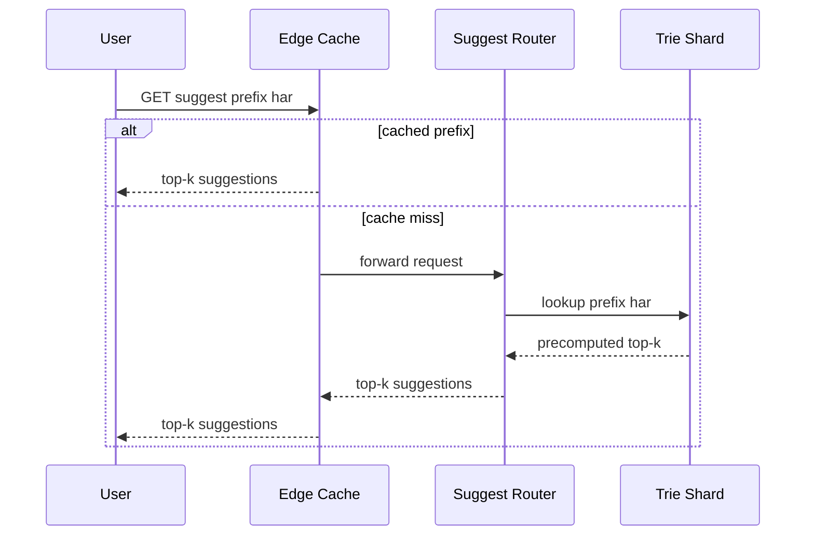
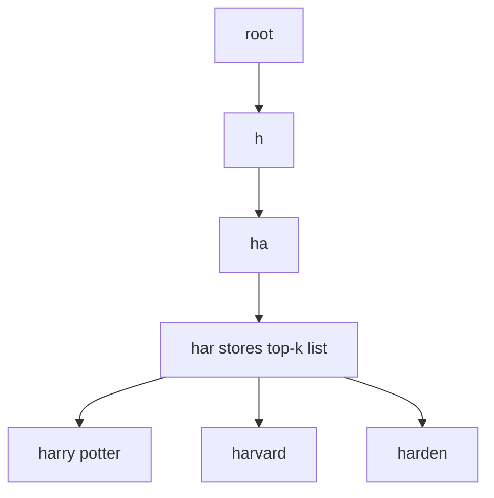

Typeahead (search autocomplete) is the feature that, as you type "har", instantly offers "harry potter", "harvard", "harden". It feels trivial but is a beautiful systems problem: every keystroke is a query, latency budgets are brutal (sub-100ms including network), and the "interesting" answers come from precomputing rankings over billions of historical queries rather than searching at request time.

## 1. Requirements

### Functional

- As the user types a **prefix**, return the top **k** (typically 5–10) most relevant complete queries that start with that prefix.
- Suggestions are ranked by **popularity** (and optionally recency and personalization).
- Results update on each keystroke.
- Handle common **typos** gracefully (optional but expected at senior level).
- The suggestion corpus is built from **what people actually search**, refreshed periodically.

### Non-functional

- **Latency:** p99 < 100ms end-to-end; the server portion should be ~10–20ms because the user types fast and stale suggestions are useless.
- **Scale:** a large search engine handles ~5B searches/day; each search generates several prefix queries.
- **Availability:** 99.9% — it degrades gracefully (empty suggestions) rather than erroring.
- **Freshness:** trending terms ("breaking news") should appear within hours, not weeks.
- **Read-heavy:** overwhelmingly reads; writes (corpus updates) are batched offline.

### Clarifying questions

- Top-k per prefix — what k? (Assume 10, return 5.)
- Personalized or global? (Start global; layer personalization.)
- Do we autocomplete arbitrary text or only previously-seen queries? (Previously-seen queries — that's what makes top-k precomputable.)
- Multi-language / Unicode? (Yes, treat as byte/char sequences.)

## 2. Capacity Estimation

```
Searches/day        = 5,000,000,000
Avg query length    = 20 chars -> ~20 keystrokes, but debounce to ~4 requests
Typeahead requests  = 5B searches * 4 prefix queries ≈ 20B/day
Read QPS (avg)      = 20B / 86,400 ≈ 231,000 QPS
Peak QPS            ≈ 2x avg ≈ 460,000 QPS
```

This is a **massive read fanout** — autocomplete can receive 4x the QPS of search itself. It must be served from memory.

**Storage / corpus.** Suppose ~100M distinct query strings worth indexing (we prune the long tail). Each trie node stores child pointers plus a precomputed top-k list. A trie over 100M phrases has on the order of a few billion nodes; the top-k payload (10 suggestions * ~30 bytes ≈ 300 B) at each node dominates. Rough estimate:

```
Trie payload ≈ few billion nodes * ~50 B amortized ≈ low hundreds of GB
```

That does not fit in one machine's RAM, so the trie is **sharded**.

**Write side.** We aggregate raw logs (5B rows/day, ~100 bytes each = ~500 GB/day) in a batch pipeline — not on the serving path.

## 3. API Design

The serving endpoint is a pure cache/trie read; logging the selected/submitted query is a separate async path that feeds the offline pipeline.

```api
{
  "endpoints": [
    {
      "method": "GET",
      "path": "/v1/suggest",
      "desc": "Return the top-k completions for a typed prefix.",
      "request": {
        "q": "string (prefix, e.g. har)",
        "limit": "int (default 5)",
        "lang": "string (e.g. en)",
        "user": "string (optional, for personalization)"
      },
      "responses": [
        {
          "status": "200 OK",
          "body": {
            "prefix": "har",
            "suggestions": [
              { "text": "harry potter", "score": 0.98 },
              { "text": "harvard", "score": 0.81 },
              { "text": "harden", "score": 0.55 }
            ]
          }
        }
      ],
      "notes": "Pure trie/cache read; target ~10-20ms server time."
    },
    {
      "method": "POST",
      "path": "/v1/log",
      "auth": "internal service",
      "desc": "Log a submitted/selected query for the offline pipeline.",
      "request": { "query": "string", "user": "string", "ts": "epoch millis" },
      "responses": [
        { "status": "202 Accepted", "desc": "Enqueued async to Kafka." }
      ],
      "notes": "Async write path; never blocks the suggest call."
    }
  ]
}
```

## 4. Data Model

The serving data structure is an in-memory **trie (prefix tree)** with **precomputed top-k at each node**. This is the single most important design decision: instead of, at query time, collecting all descendants of a prefix and sorting by score (O(descendants · log k)), we store the answer at the node so a lookup is O(prefix length).

There is no traditional database on the hot path. Two stores back the system:

- **Offline aggregate store** (the precomputed top-k, materialized): we persist serialized trie shards in **S3** and load them into serving nodes. Metadata/aggregation lives in a columnar store / data warehouse.
- **Personalization cache** in Redis if layering per-user history.

Why not SQL/Elasticsearch on the hot path? A relational `LIKE 'har%'` cannot meet 10ms p99 at 460k QPS, and full-text engines are heavier than needed for prefix top-k. The trie is purpose-built: prefix lookup is its native operation.

```datamodel
{
  "entities": [
    {
      "name": "TrieNode",
      "store": "In-memory trie (serving)",
      "fields": [
        { "name": "char_edges", "type": "map<char, TrieNode>", "note": "child pointers" },
        { "name": "top_k", "type": "list<(query, score)>", "note": "precomputed, sorted desc" },
        { "name": "is_word", "type": "bool", "note": "terminal query marker" }
      ],
      "notes": "Prefix lookup is O(prefix length); top-k stored at each node, no request-time sort."
    },
    {
      "name": "query_stats",
      "store": "Columnar warehouse (offline)",
      "fields": [
        { "name": "query", "type": "text", "key": "PK", "note": "distinct query string" },
        { "name": "count_7d", "type": "bigint", "note": "frequency, sliding window" },
        { "name": "count_1d", "type": "bigint", "note": "recency signal" },
        { "name": "last_seen", "type": "timestamp" },
        { "name": "score", "type": "double", "note": "final ranking score" }
      ],
      "notes": "Aggregate table feeding the bottom-up trie build."
    },
    {
      "name": "trie_shards",
      "store": "S3",
      "fields": [
        { "name": "shard_key", "type": "string", "key": "PK", "note": "prefix range, e.g. a-f" },
        { "name": "version", "type": "string", "note": "build version for hot-swap" },
        { "name": "payload", "type": "blob", "note": "serialized trie shard" }
      ],
      "notes": "Serving nodes download and atomically swap in new versions."
    }
  ],
  "relationships": [
    { "from": "query_stats", "to": "trie_shards", "kind": "N:1", "label": "aggregated + built into" }
  ]
}
```

## 5. High-Level Architecture

```arch
{
  "title": "Typeahead autocomplete — read path (trie shards) and offline build pipeline",
  "nodes": [
    { "id": "client", "label": "Client", "type": "client", "col": 0, "row": 1, "meta": "debounced, caches prefixes locally" },
    { "id": "cdn", "label": "CDN / Edge Cache", "type": "cdn", "col": 1, "row": 1, "meta": "absorbs hot short prefixes" },
    { "id": "router", "label": "Suggest Service", "type": "service", "col": 2, "row": 1, "meta": "routes by prefix range" },
    { "id": "trieAF", "label": "Trie Shard a-f", "type": "search", "col": 3, "row": 0, "meta": "in-RAM trie, O(len) lookup" },
    { "id": "trieGM", "label": "Trie Shard g-m", "type": "search", "col": 3, "row": 1, "meta": "in-RAM trie, O(len) lookup" },
    { "id": "trieNZ", "label": "Trie Shard n-z", "type": "search", "col": 3, "row": 2, "meta": "in-RAM trie, O(len) lookup" },
    { "id": "s3", "label": "Trie Shards Store", "type": "blob", "col": 4, "row": 1, "meta": "S3 serialized shards" },
    { "id": "kafka", "label": "Query Logs", "type": "queue", "col": 1, "row": 3, "meta": "Kafka submitted queries" },
    { "id": "build", "label": "Build Job", "type": "worker", "col": 2, "row": 3, "meta": "Spark aggregate + bottom-up top-k" }
  ],
  "edges": [
    { "from": "client", "to": "cdn", "step": 1, "label": "keystroke prefix" },
    { "from": "cdn", "to": "client", "label": "hit: top-k" },
    { "from": "cdn", "to": "router", "step": 2, "label": "miss" },
    { "from": "router", "to": "trieGM", "step": 3, "label": "lookup prefix" },
    { "from": "router", "to": "trieAF", "label": "route by range" },
    { "from": "router", "to": "trieNZ", "label": "route by range" },
    { "from": "kafka", "to": "build", "label": "consume logs" },
    { "from": "build", "to": "s3", "label": "per-node top-k shards" },
    { "from": "s3", "to": "trieAF", "label": "load + hot-swap" },
    { "from": "s3", "to": "trieGM", "label": "load + hot-swap" },
    { "from": "s3", "to": "trieNZ", "label": "load + hot-swap" }
  ],
  "groups": [
    { "label": "Trie serving tier", "nodes": ["trieAF", "trieGM", "trieNZ"] },
    { "label": "Offline build", "nodes": ["kafka", "build"] }
  ]
}
```

Walkthrough:

1. The **client** debounces keystrokes (and may cache locally), sending each prefix to the **CDN/edge cache** — many prefixes are extremely popular, so caching "a", "am", "ama" is a huge win; a cached prefix returns top-k immediately.
2. On a **miss**, the request goes to the **Suggest Service**.
3. The service routes by prefix range to the owning **trie shard**, which does an O(len) lookup and returns its precomputed top-k.

Separately, an **offline pipeline** consumes query logs from **Kafka**, aggregates frequencies and computes per-node top-k in **Spark**, writes serialized shards to **S3**, and serving nodes hot-swap to the new version.

The primary read flow — a keystroke returning top-k:



## 6. Deep Dives

### 6.1 Trie with precomputed top-k

A node's `top_k` is the best k completions among all queries in its subtree. To find suggestions for "har", we walk h→a→r (3 hops) and return that node's stored list — no subtree traversal, no sorting at request time. This converts an expensive aggregation into a constant-ish memory read, which is what makes the 10ms budget achievable.



The cost is at **build time**: computing top-k for every node. We compute it bottom-up — a parent's top-k is the merge of its children's top-k lists plus its own terminal query, keeping the best k. Because each node only merges k-sized lists from its children, the build is linear-ish in the number of nodes.

### 6.2 Building and updating the trie offline

We never mutate the serving trie per query. Instead:

1. **Collect:** every submitted query is logged to Kafka.
2. **Aggregate:** a periodic Spark/MapReduce job counts query frequencies over sliding windows (e.g. 1d and 7d), prunes the long tail (drop queries seen < N times), and computes a **score**.
3. **Build:** construct the trie, compute per-node top-k bottom-up, serialize shards.
4. **Publish:** upload to S3; serving nodes download and **atomically swap** the in-memory trie (double-buffering: build new, flip pointer, GC old).

This batch cadence (hourly for freshness, daily for full rebuild) keeps the read path immutable and lock-free. For near-real-time trending, a lightweight streaming layer can overlay recent counts.

### 6.3 Sharding the trie by prefix

A full trie doesn't fit in one machine's RAM, and one machine couldn't serve 460k QPS anyway. We **shard by prefix range** — e.g. shard the first one or two characters across nodes (a–f, g–m, n–z, balanced by traffic since "s" is far more common than "z"). The router maps a request's prefix to the owning shard.

Trade-off: sharding by first character creates **load imbalance** (popular first letters). We mitigate by splitting hot ranges further and replicating hot shards. Each shard is replicated 3x+ for availability and read scaling. Very short prefixes (1–2 chars) are so hot they live entirely in the edge cache.

### 6.4 Ranking, recency, personalization, and typos

**Ranking** combines signals: `score = w1*log(freq_7d) + w2*recency_boost + w3*personalization`. Recency uses the 1d window so trending terms rise quickly; a time-decay factor demotes stale queries.

**Personalization** is layered, not baked into the global trie: fetch the user's recent queries from Redis and merge/re-rank against global suggestions at request time, keeping the shared trie generic.

**Typo tolerance:** the trie only matches exact prefixes, so for "hatry" we'd return nothing. We handle this with (a) a separate fuzzy index using edit-distance / **n-gram** matching as a fallback when the exact prefix yields too few results, and (b) building common misspellings into the corpus since users actually search them (so they appear in logs and get their own trie paths).

## 7. Bottlenecks & Scaling

| Concern | Approach |
|---|---|
| 460k QPS reads | Serve from RAM tries + CDN/edge cache for popular prefixes |
| Trie too big for one host | Shard by prefix range, replicate hot shards |
| Hot first-letter shards | Sub-split popular ranges; balance by traffic not alphabet |
| Build cost | Bottom-up top-k merge, offline in Spark, never on read path |
| Freshness lag | Hourly incremental rebuilds + streaming recency overlay |
| Cache stampede on swap | Double-buffer + atomic pointer flip; warm new trie before serving |

**Caching layers:** browser cache → CDN/edge → service-level cache → trie shard. Because short prefixes dominate traffic (Zipfian distribution), a small cache absorbs a large fraction of QPS; the long-tail prefixes hit the tries.

**Failure handling:** if a shard is down, return empty suggestions for that range (graceful degradation) — autocomplete failing should never block the user from searching. Tries are immutable read replicas, so any replica can serve and recovery is just reloading from S3.

## 8. Trade-offs & Follow-ups

- **Precompute vs. compute-on-read.** Precomputed top-k trades build complexity and memory for blazing read latency — correct for a read-dominated, latency-critical feature.
- **Freshness vs. cost.** More frequent rebuilds = fresher trends but more compute. Hybrid batch + streaming overlay balances this.
- **Trie vs. Elasticsearch.** ES completion suggesters work and are operationally simpler, but at extreme QPS a custom in-memory trie gives better latency and cost control.
- **Memory cost.** Storing top-k at every node is memory-hungry; we prune the long tail and cap k to bound it.

**Likely interviewer follow-ups:** How do you avoid suggesting offensive/blocked terms? (Maintain a blocklist applied at build and serve time.) How do you A/B test ranking? (Version trie builds, route a traffic slice.) How do you handle multi-word vs. mid-word completion? (Index phrases; optionally index from each word boundary.) How do clients reduce QPS? (Debounce ~150ms, cache prefixes locally, only fire after the prefix grows.)

## Key takeaways

- Autocomplete is a **read-dominated, sub-100ms** problem solved by serving a **trie with precomputed top-k** entirely from RAM.
- The hard work is **offline**: aggregate query logs, compute per-node top-k bottom-up, and publish immutable trie shards — the read path never mutates.
- **Shard the trie by prefix** and replicate hot ranges; **cache popular prefixes** at the edge to absorb the Zipfian load.
- **Ranking blends frequency, recency, and personalization**, with personalization layered at request time rather than baked into the shared trie.
- **Typo tolerance** needs a separate fuzzy/n-gram fallback plus learning common misspellings from real logs.
- Degrade gracefully: a missing shard returns empty suggestions, never an error that blocks search.
