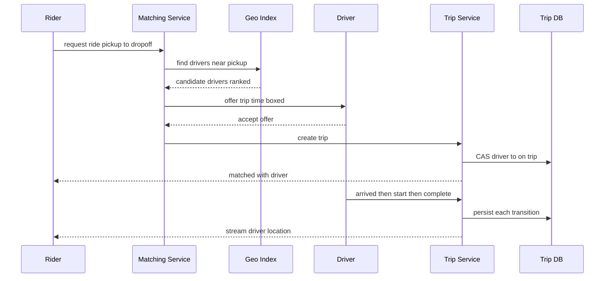

A ride-hailing platform connects riders requesting trips with nearby available drivers, in real time, at city scale. The hard parts are geospatial: ingesting a torrent of driver-location updates, answering "which drivers are near this rider right now?" in milliseconds, and matching supply to demand while both move. Layered on top are a trip lifecycle state machine, surge pricing, ETAs, live tracking, and payments. We design around a **geospatial index** (geohash / Google S2 / quadtree), a high-throughput **location ingestion** path, and a **matching service**.

## 1. Requirements

### Functional
- Drivers publish live location continuously while online.
- Riders request a ride from A to B; the system finds and offers the trip to nearby drivers.
- Matched trip transitions through a lifecycle (requested → accepted → arrived → in-progress → completed).
- Real-time location tracking of the assigned driver for the rider.
- Fare estimation, surge pricing, and payment on completion.
- ETA computation.

### Non-functional
- **Low match latency**: from request to driver offer in a few seconds.
- **High write throughput** for location updates (millions of drivers, frequent pings).
- **High availability** and graceful degradation per-city (a city is largely independent).
- **Geo-locality**: a rider in NYC should never query Tokyo's index.
- Consistency: a driver must not be offered two trips simultaneously.

### Clarifying questions
- Update frequency from drivers? Assume every ~4 seconds while online.
- Global but city-partitioned? Yes — cities are natural shards.
- Pooling/shared rides in scope? Focus on single-rider matching, note pooling as an extension.

## 2. Capacity Estimation

Assume **5M active drivers** online at peak globally and **15M riders/day**.

- **Location write QPS**: 5M drivers × (1 ping / 4 s) = **1.25M writes/sec**. This is the dominant load and shapes the whole design.
- **Ride requests**: 15M/day averages ~174/sec, but demand concentrates heavily into commute hours and dense metros. Compressing most volume into a few peak hours yields a realistic peak of **~2K requests/sec** (~10x the daily average). Each request triggers a nearby-driver query against the geo index.
- **Nearby queries**: ~2K/sec at peak, each scanning candidate drivers in a radius.

**Storage**:
- Live location is ephemeral (kept in memory / Redis), not durably stored long-term — current state only, ~5M × 100 bytes = **500 MB** hot.
- Trip records: 15M trips/day × ~2 KB = **30 GB/day → ~11 TB/year** (30 GB × 365) in a durable trip store.
- Location history (for analytics/audit), if retained: 1.25M/sec × 50 bytes ≈ 62 MB/sec → huge; usually downsampled or kept short-term in a time-series store.

**Bandwidth**: 1.25M location updates/sec × ~200 bytes (with overhead) ≈ **250 MB/sec ingress** for telemetry alone.

| Metric | Estimate |
|---|---|
| Location writes/sec | ~1.25M |
| Ride requests/sec (peak) | ~2K |
| Live location footprint | ~500 MB (in-memory) |
| Trip storage/year | ~11 TB |

## 3. API Design

The API splits into a high-frequency driver telemetry path, a rider-facing trip lifecycle, and low-latency WebSocket channels for driver offers and live tracking. Location updates are fire-and-forget over a lightweight path (often UDP-like or batched HTTP/gRPC); offers and tracking use WebSockets for bidirectional push.

```api
{
  "endpoints": [
    {
      "method": "POST",
      "path": "/v1/drivers/location",
      "auth": "driver bearer token",
      "desc": "High-frequency location ping while online (~every 4s).",
      "request": { "driverId": "string", "lat": "double", "lng": "double", "heading": "double", "speed": "double" },
      "responses": [
        { "status": "202 Accepted", "desc": "fire-and-forget, overwrites current position" }
      ],
      "notes": "Dominant write load (~1.25M/sec); not durably persisted per ping."
    },
    {
      "method": "POST",
      "path": "/v1/drivers/status",
      "auth": "driver bearer token",
      "desc": "Set driver availability.",
      "request": { "status": "online | offline | on_trip" },
      "responses": [
        { "status": "200 OK", "body": { "status": "online" } }
      ]
    },
    {
      "method": "POST",
      "path": "/v1/trips/estimate",
      "auth": "rider bearer token",
      "desc": "Fare, ETA, and surge estimate for a route.",
      "request": { "pickup": "{lat,lng}", "dropoff": "{lat,lng}" },
      "responses": [
        { "status": "200 OK", "body": { "fare": "cents", "eta": "seconds", "surge": "multiplier" } }
      ]
    },
    {
      "method": "POST",
      "path": "/v1/trips",
      "auth": "rider bearer token",
      "desc": "Request a ride; triggers matching against the geo index.",
      "request": { "pickup": "{lat,lng}", "dropoff": "{lat,lng}" },
      "responses": [
        { "status": "201 Created", "body": { "tripId": "string", "status": "requested" } }
      ]
    },
    {
      "method": "GET",
      "path": "/v1/trips/{tripId}",
      "auth": "rider bearer token",
      "desc": "Fetch current trip state plus assigned driver location.",
      "responses": [
        { "status": "200 OK", "body": { "tripId": "string", "state": "accepted", "driverLocation": "{lat,lng}" } }
      ]
    },
    {
      "method": "WS",
      "path": "/v1/drivers/offers",
      "auth": "driver bearer token",
      "desc": "Server pushes time-boxed trip offers to the driver app.",
      "responses": [
        { "status": "101 Switching Protocols", "desc": "persistent offer channel" }
      ]
    },
    {
      "method": "POST",
      "path": "/v1/trips/{tripId}/accept",
      "auth": "driver bearer token",
      "desc": "Driver accepts an offer; atomically locks the driver to the trip.",
      "request": { "driverId": "string" },
      "responses": [
        { "status": "200 OK", "body": { "status": "accepted" } },
        { "status": "409 Conflict", "desc": "offer expired or driver already on a trip" }
      ]
    },
    {
      "method": "POST",
      "path": "/v1/trips/{tripId}/arrived",
      "auth": "driver bearer token",
      "desc": "Driver arrived at pickup; advances state machine.",
      "responses": [
        { "status": "200 OK", "body": { "status": "arrived" } }
      ]
    },
    {
      "method": "POST",
      "path": "/v1/trips/{tripId}/start",
      "auth": "driver bearer token",
      "desc": "Begin the trip (rider on board).",
      "responses": [
        { "status": "200 OK", "body": { "status": "in_progress" } }
      ]
    },
    {
      "method": "POST",
      "path": "/v1/trips/{tripId}/complete",
      "auth": "driver bearer token",
      "desc": "Complete the trip; triggers payment.",
      "responses": [
        { "status": "200 OK", "body": { "status": "completed", "fare": "cents" } }
      ]
    },
    {
      "method": "WS",
      "path": "/v1/trips/{tripId}/track",
      "auth": "rider bearer token",
      "desc": "Stream the assigned driver's position to the rider for the live map.",
      "responses": [
        { "status": "101 Switching Protocols", "desc": "persistent tracking channel" }
      ]
    }
  ]
}
```

## 4. Data Model

Two very different stores. Live driver location is hot, ephemeral, and read by the geo index — Redis (with geo commands) keyed by city. Trips are durable, transactional records — PostgreSQL sharded by city for the lifecycle state machine and payments, where consistency matters.

```datamodel
{
  "entities": [
    {
      "name": "trips",
      "store": "PostgreSQL (sharded by city_id)",
      "fields": [
        { "name": "trip_id", "type": "bigint", "key": "PK" },
        { "name": "rider_id", "type": "bigint", "key": "FK", "note": "indexed with requested_at" },
        { "name": "driver_id", "type": "bigint", "key": "FK", "note": "indexed with state" },
        { "name": "city_id", "type": "int", "note": "shard key" },
        { "name": "state", "type": "enum", "note": "requested|accepted|arrived|in_progress|completed|cancelled" },
        { "name": "pickup_lat", "type": "double" },
        { "name": "pickup_lng", "type": "double" },
        { "name": "drop_lat", "type": "double" },
        { "name": "drop_lng", "type": "double" },
        { "name": "fare_cents", "type": "int" },
        { "name": "surge_mult", "type": "decimal(3,2)" },
        { "name": "requested_at", "type": "timestamp" }
      ],
      "notes": "Durable source of truth for the trip state machine and payments; atomic transitions guarded by valid predecessors."
    },
    {
      "name": "driver_locations",
      "store": "Redis (per city, GEO commands)",
      "fields": [
        { "name": "city:{id}:drivers", "type": "geo set", "key": "PK", "note": "GEOADD <lng> <lat> <driverId>; GEOSEARCH BYRADIUS for nearby" },
        { "name": "driver:meta:{id}", "type": "hash", "note": "status, car_type and other attributes" }
      ],
      "notes": "Overwritten ~1.25M times/sec; only current position matters, never needs ACID. Ephemeral hot working set (~one entry per driver)."
    }
  ],
  "relationships": [
    { "from": "driver_locations", "to": "trips", "kind": "1:N", "label": "a driver's pings feed matching that creates many trips over time" }
  ]
}
```

Why split: location is overwritten 1.25M times/sec and never needs ACID — perfect for in-memory geo structures. Trips need atomic state transitions and money handling — SQL with transactions. Trip history can later be archived to a columnar/warehouse store for analytics.

## 5. High-Level Architecture

Everything is partitioned by city: location ingestion overwrites a per-city geo index, matching queries it, and the trip service is the transactional source of truth. The arch below traces the request to match to lifecycle flow.

```arch
{
  "title": "Uber ride-hailing — location ingestion, matching, and trip lifecycle",
  "nodes": [
    { "id": "driver", "label": "Driver App", "type": "client", "col": 0, "row": 0, "meta": "pings location, receives offers over WS" },
    { "id": "rider", "label": "Rider App", "type": "client", "col": 0, "row": 1, "meta": "requests rides, live tracking over WS" },
    { "id": "ingest", "label": "Location Ingestion", "type": "service", "col": 1, "row": 0, "meta": "stateless per-city fleet, ~1.25M writes/sec" },
    { "id": "match", "label": "Matching Service", "type": "service", "col": 1, "row": 1, "meta": "geo query + ETA ranking + time-boxed offers" },
    { "id": "trip", "label": "Trip Service", "type": "service", "col": 2, "row": 1, "meta": "transactional state machine, CAS driver lock" },
    { "id": "surge", "label": "Surge and ETA", "type": "service", "col": 2, "row": 2, "meta": "per-cell supply/demand multiplier" },
    { "id": "pay", "label": "Payments", "type": "service", "col": 2, "row": 3, "meta": "charged on completion, idempotent" },
    { "id": "geo", "label": "Geo Index", "type": "cache", "col": 3, "row": 0, "meta": "Redis geo set per city, current position only" },
    { "id": "kafka", "label": "Kafka", "type": "queue", "col": 3, "row": 1, "meta": "fan-out of pings + demand signals, partitioned by city" },
    { "id": "tripdb", "label": "Trip DB", "type": "db", "col": 3, "row": 2, "meta": "PostgreSQL sharded by city, durable source of truth" }
  ],
  "edges": [
    { "from": "driver", "to": "ingest", "step": 1, "label": "location every 4s" },
    { "from": "ingest", "to": "geo", "step": 2, "label": "overwrite position" },
    { "from": "rider", "to": "match", "step": 3, "label": "request ride" },
    { "from": "match", "to": "geo", "step": 4, "label": "nearby query" },
    { "from": "match", "to": "driver", "step": 5, "label": "offer over WebSocket" },
    { "from": "match", "to": "trip", "step": 6, "label": "create trip on accept" },
    { "from": "trip", "to": "tripdb", "step": 7, "label": "CAS lock + persist state" },
    { "from": "ingest", "to": "kafka", "label": "fan out pings" },
    { "from": "trip", "to": "surge", "label": "fare + ETA" },
    { "from": "trip", "to": "pay", "label": "on complete" },
    { "from": "surge", "to": "kafka", "label": "demand signal" },
    { "from": "trip", "to": "rider", "label": "stream driver location" }
  ],
  "groups": [
    { "label": "Data tier", "nodes": ["geo", "kafka", "tripdb"] }
  ]
}
```

**Walkthrough**:
1. Driver apps ping their location every ~4s into a per-city Location Ingestion fleet.
2. Ingestion overwrites the current position in the in-memory geo index (no durable per-ping write).
3. A rider's ride request enters the Matching Service.
4. Matching queries the geo index for nearby eligible drivers within a radius.
5. It ranks candidates by road-network ETA and offers the trip over WebSocket to the best driver.
6. On acceptance, Matching asks the Trip Service to create the trip.
7. The Trip Service atomically compare-and-sets the driver to `on_trip` and persists each state transition to the trip DB.

Secondary paths run alongside: ingestion fans pings out to Kafka, the Trip Service consults Surge/ETA and Payments, surge emits demand signals back to Kafka, and the driver's position streams to the rider for the live map. Everything is **partitioned by city**, so each city is an independent failure and scaling domain.

The end-to-end request → match → trip lifecycle flow:



## 6. Deep Dives

### 6.1 Location ingestion at 1.25M writes/sec
Drivers ping every few seconds; we don't durably persist every ping. Updates land on a stateless, per-city ingestion fleet (consistent-hash by `city_id`) that writes the **current** position into the in-memory geo index, overwriting the prior value. To smooth bursts and feed downstream consumers (ETA models, analytics), pings are also published to **Kafka**, partitioned by city. Because only the latest position matters for matching, the working set stays tiny (one entry per driver) even though write volume is enormous. Sharding by geography keeps each node's index small and its queries local.

### 6.2 Geospatial indexing: geohash, S2, and quadtrees
The core query is "drivers within radius R of (lat, lng)." A naive scan is O(drivers). We need a spatial index:

- **Geohash**: interleaves latitude/longitude bits into a base-32 string; nearby points share a prefix. A 6-char geohash ≈ 1.2 km cell. To find neighbors, query the rider's cell plus its 8 adjacent cells (to avoid edge effects). Simple and Redis-native (`GEOSEARCH`).
- **Google S2**: maps the sphere onto a Hilbert curve, producing cells at 30 levels with low distortion and excellent neighbor/coverage operations — Uber's H3 (hexagonal grid) is a related approach giving uniform cell sizes and clean adjacency.
- **Quadtree**: recursively subdivides space into four quadrants until each leaf holds few points. Dense downtowns get deep subdivision; empty areas stay shallow — adaptive to density, great when driver distribution is highly skewed.

We use a **geohash/H3 grid** for the hot in-memory index (cheap prefix lookups, easy sharding) and conceptually a quadtree where density adapts. Matching looks up the rider's cell + neighbors, gathers candidate drivers, then filters by exact distance, car type, and availability.

### 6.3 Matching service and dispatch
With candidates in hand, matching is more than nearest-distance. It ranks by **ETA** (road-network travel time, not straight-line), driver rating, car type, and global efficiency (avoid stranding other riders). The chosen driver gets a time-boxed **offer**; if they decline or time out, the next candidate is offered. To prevent double-booking, accepting a trip performs an **atomic compare-and-set** on the driver's status (`online → on_trip`) — only one trip can win. Batched/global dispatch (matching many riders and drivers together every few seconds) can beat greedy nearest-first by optimizing total wait time, at the cost of slight latency.

### 6.4 Trip lifecycle state machine, surge, and real-time updates
A trip is a **state machine**: `requested → accepted → arrived → in_progress → completed` (plus `cancelled` transitions). Each transition is a transactional update guarded by valid predecessors, so retries and out-of-order events can't corrupt state (idempotent transitions keyed by event id). **Surge pricing** is computed per geohash cell from the local supply/demand ratio over a short window — when requests outstrip available drivers in a cell, a multiplier raises price to rebalance. **ETA** uses a road-network graph with live traffic. During the trip, the driver's position streams to the rider over **WebSocket** for the live map.

## 7. Bottlenecks & Scaling
- **Location write hotspot** is the headline load; solved by per-city sharding, in-memory overwrite (no durable per-ping write), and Kafka for downstream fanout.
- **Dense city cells** (downtown at rush hour) hotspot a single geohash; mitigate with finer-grained cells (deeper quadtree / smaller H3 resolution) in dense areas and replicating read load.
- **Supply/demand consistency**: a driver offered two trips — prevented by atomic CAS on driver status; a held-but-declined offer must release promptly (short TTL).
- **City partitioning** makes each city an isolated scaling and failure domain; a region outage doesn't cascade globally. Cross-city/airport boundary trips need special handling.
- **WebSocket connection scale**: millions of persistent connections on dedicated gateway nodes, routed by user/city.
- **Failure handling**: if matching or the geo node fails, fall back to a degraded radius search; trip state is the source of truth in SQL, so in-flight trips survive a matcher restart.

## 8. Trade-offs & Follow-ups
- **Geohash vs. S2/H3 vs. quadtree**: geohash is simple and prefix-friendly but has rectangular, distortion-prone cells and awkward neighbor edges; S2/H3 give uniform low-distortion cells; quadtrees adapt to density but are costlier to maintain under churn.
- **Greedy nearest vs. batched global matching**: greedy is fast and simple; batched optimizes fleet-wide efficiency at the cost of a few seconds latency.
- **In-memory location (fast, volatile) vs. durable**: we accept volatility because only current position matters and Kafka provides replay.
- **Surge granularity**: per-cell surge is responsive but can feel jumpy at boundaries.

Likely follow-ups: How do you implement **pool/shared rides** (multi-passenger routing)? How do you prevent **driver/rider gaming** of surge? How do you handle **driver going offline mid-offer**? How do you compute **ETA at scale** (precomputed road graph + live traffic)? How do you ensure a **payment** isn't double-charged (idempotency keys)? How do **airport/cross-border** trips cross city shards?

## Key takeaways
- Driver-location ingestion (~1.25M writes/sec) dominates the design: shard by city, overwrite in memory, and fan out via Kafka — never durably store every ping.
- A **geospatial index** (geohash/H3 for the hot path, quadtree where density is skewed) turns "nearby drivers" into a fast cell lookup plus exact-distance filter.
- Matching ranks by **road-network ETA** and constraints, then offers with time-boxed, atomically-locked dispatch to prevent double-booking.
- The trip is a **transactional state machine** in SQL — the durable source of truth — while live data stays ephemeral.
- **Surge** is a per-cell supply/demand multiplier; **WebSockets** carry offers and live tracking.
- **City partitioning** gives geo-locality plus isolated failure and scaling domains.
