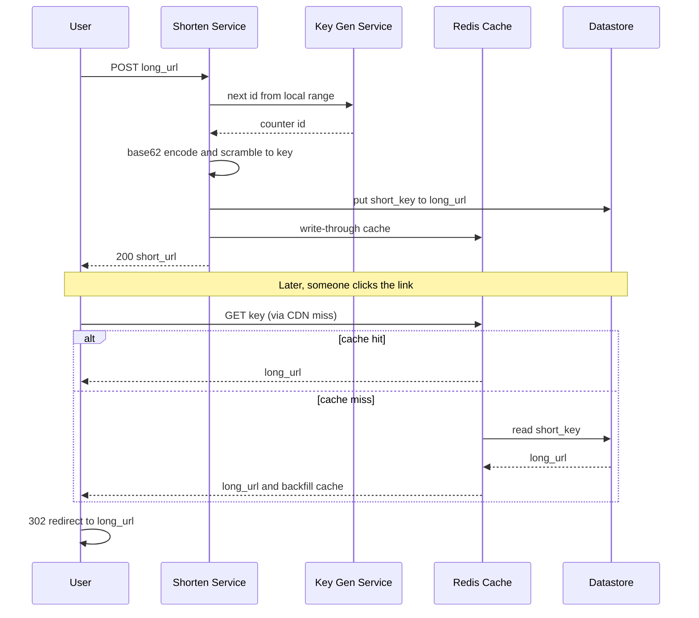

# Design a URL Shortener (TinyURL / Bit.ly)

A URL shortener takes a long URL like `https://example.com/articles/2026/very-long-path?ref=newsletter` and returns a compact alias such as `https://sho.rt/aZ4kP9`. When a user visits the short link, the service issues an HTTP redirect to the original destination. It looks trivial, but it is a classic interview warm-up because it forces you to reason about unique ID generation, an extreme read/write skew, caching, and horizontal scaling.

## 1. Requirements

### Functional

- Given a long URL, generate a unique short URL (a 6–8 character alias).
- Redirect a short URL to its original long URL.
- Optionally let users specify a **custom alias** (e.g. `sho.rt/my-brand`).
- Optionally let links **expire** after a TTL or an explicit expiry date.
- Collect basic **analytics** per link: click count, referrer, geography, device.

### Non-functional

- **High availability** — a dead redirect breaks every link ever shared. Target 99.99%.
- **Low latency** — redirects should resolve in < 50 ms p99; they sit in the user's critical path.
- **Scalability** — billions of stored URLs, tens of thousands of redirects per second.
- **Unpredictable keys** — short codes should not be trivially enumerable (security/abuse).
- **Durability** — never lose a mapping.

### Clarifying questions to scope it

- What's the expected write volume (new links/day) and the read:write ratio? *(Assume 100:1.)*
- How long should keys be? This bounds the total address space.
- Do links ever get deleted, or only expire?
- Do we need vanity/custom aliases? They change the key-generation strategy.
- Is global low latency required (multi-region), or is one region enough?

## 2. Capacity Estimation

Assume **100 million** new URLs created per month.

```
Writes/sec  = 100M / (30 * 24 * 3600) = 100M / 2,592,000 ≈ 38 writes/sec
Reads/sec   = 38 * 100 (100:1 read skew)                  ≈ 3,800 reads/sec
Peak reads  ≈ 3,800 * 3 (peak factor)                     ≈ 11,400 reads/sec
```

**Storage.** Each record: short key (8 B) + long URL (~500 B avg) + metadata (creator, created_at, expiry, click counter ≈ 100 B) ≈ ~600 B. Round to 1 KB with indexing/replication overhead.

```
New records/year = 100M * 12        = 1.2B records/year
Storage/year     = 1.2B * 1 KB      ≈ 1.2 TB/year
Over 5 years     = 1.2 TB * 5       ≈ 6 TB
```

**Key space.** With base62 (`[a-zA-Z0-9]`):

```
62^6 ≈ 56.8 billion
62^7 ≈ 3.5 trillion
62^8 ≈ 218 trillion
```

Five years of growth is `1.2B * 5 ≈ 6B` keys; `62^7 ≈ 3.5T` covers that with a ~580× safety margin, so a **7-char base62 key** is the sweet spot.

**Bandwidth.** Redirect responses are tiny (headers only, ~500 B): `11,400 * 500 B ≈ 5.7 MB/s` outbound — negligible. The system is QPS-bound, not bandwidth-bound.

| Metric | Value |
|---|---|
| New URLs/month | 100M |
| Write QPS (avg) | ~38 |
| Read QPS (peak) | ~11,400 |
| Storage/year | ~1.2 TB |
| Key length | 7 (base62) |

## 3. API Design

Writes are authenticated and rate-limited; the redirect `GET` is public and must be as cheap as possible.

```api
{
  "endpoints": [
    {
      "method": "POST",
      "path": "/api/v1/shorten",
      "auth": "API key / bearer",
      "desc": "Create a short link for a long URL, with an optional custom alias and expiry.",
      "request": {
        "long_url": "https://example.com/very/long/path",
        "custom_alias": "my-brand   (optional)",
        "expires_at": "2027-01-01T00:00:00Z   (optional)"
      },
      "responses": [
        { "status": "200 OK", "body": { "short_url": "https://sho.rt/aZ4kP9", "key": "aZ4kP9", "expires_at": "2027-01-01T00:00:00Z" } },
        { "status": "409 Conflict", "desc": "custom_alias already taken" }
      ]
    },
    {
      "method": "GET",
      "path": "/{key}",
      "desc": "Public redirect to the original URL. This is the hot path and must be as cheap as possible.",
      "responses": [
        { "status": "302 Found", "desc": "Location: <long_url>" },
        { "status": "404 Not Found", "desc": "unknown / expired / disabled" }
      ]
    },
    {
      "method": "GET",
      "path": "/api/v1/links/{key}/stats",
      "auth": "owner",
      "desc": "Aggregated click analytics for a link.",
      "responses": [
        { "status": "200 OK", "body": { "key": "aZ4kP9", "clicks": 10293, "top_referrers": ["t.co", "news.yc"], "by_country": { "US": 6012, "IN": 2210 } } }
      ]
    },
    {
      "method": "DELETE",
      "path": "/api/v1/links/{key}",
      "auth": "owner",
      "desc": "Disable or delete a link (soft delete).",
      "responses": [ { "status": "204 No Content" } ]
    }
  ]
}
```

## 4. Data Model

The access pattern is a pure **key-value lookup** by short key — no joins, no range scans on the hot path. A key-value or wide-column store (DynamoDB, Cassandra) is ideal for the mapping table because it shards trivially on the key and scales horizontally. Analytics, which are append-heavy and queried in aggregate, go to a separate store.

```datamodel
{
  "entities": [
    {
      "name": "urls",
      "store": "DynamoDB / Cassandra",
      "fields": [
        { "name": "short_key", "type": "varchar(7)", "key": "PK", "note": "base62 alias" },
        { "name": "long_url", "type": "text", "note": "destination URL" },
        { "name": "creator_id", "type": "bigint", "key": "FK", "note": "owner" },
        { "name": "created_at", "type": "timestamp" },
        { "name": "expires_at", "type": "timestamp", "note": "null = never" },
        { "name": "is_disabled", "type": "boolean", "note": "soft delete" }
      ],
      "notes": "Pure key-value lookup by short_key. Custom aliases are reserved via a conditional write (attribute_not_exists)."
    },
    {
      "name": "click_events",
      "store": "Cassandra (time-series)",
      "fields": [
        { "name": "short_key", "type": "varchar(7)", "key": "PK", "note": "partition" },
        { "name": "event_time", "type": "timestamp", "key": "CK", "note": "DESC order" },
        { "name": "referrer", "type": "text" },
        { "name": "country", "type": "varchar(2)" },
        { "name": "device", "type": "varchar(16)" }
      ],
      "partitionKey": "(short_key) → event_time DESC",
      "notes": "Append-heavy; queried in aggregate to build the stats response."
    }
  ],
  "relationships": [
    { "from": "urls", "to": "click_events", "kind": "1:N", "label": "one link → many clicks" }
  ]
}
```

Why NoSQL over a single SQL table: at billions of rows the only query we serve at 11k QPS is `get by key`. A relational DB would work, but we'd shard it manually anyway and gain nothing from joins/transactions. DynamoDB/Cassandra give us partitioning, replication, and tunable consistency out of the box.

## 5. High-Level Architecture

```arch
{
  "title": "URL Shortener — Read (redirect) and Write (shorten) paths",
  "nodes": [
    { "id": "client", "label": "Client", "type": "client", "col": 0, "row": 1, "meta": "Browser / mobile app" },
    { "id": "cdn", "label": "CDN", "type": "cdn", "col": 1, "row": 0, "meta": "Caches 302s for viral links" },
    { "id": "lb", "label": "Load Balancer", "type": "lb", "col": 1, "row": 1 },
    { "id": "redirect", "label": "Redirect Service", "type": "service", "col": 2, "row": 0, "meta": "Stateless, read-only; scales by replicas" },
    { "id": "write", "label": "Shorten Service", "type": "service", "col": 2, "row": 1, "meta": "Authenticated, rate-limited writes" },
    { "id": "kgs", "label": "Key Gen Service", "type": "service", "col": 2, "row": 2, "meta": "Hands out unique ID ranges (ZooKeeper)" },
    { "id": "cache", "label": "Redis", "type": "cache", "col": 3, "row": 0, "meta": "Hottest key → URL mappings (~95% hit)" },
    { "id": "db", "label": "DynamoDB / Cassandra", "type": "db", "col": 3, "row": 1, "meta": "Source of truth: short_key → long_url" },
    { "id": "kafka", "label": "Kafka", "type": "queue", "col": 3, "row": 2, "meta": "Decouples analytics from the redirect" },
    { "id": "analytics", "label": "Analytics Store", "type": "db", "col": 4, "row": 2, "meta": "Aggregated click stats" }
  ],
  "edges": [
    { "from": "client", "to": "cdn", "step": 1, "label": "GET /key" },
    { "from": "cdn", "to": "lb", "step": 2, "label": "miss" },
    { "from": "lb", "to": "redirect", "step": 3 },
    { "from": "redirect", "to": "cache", "step": 4, "label": "lookup" },
    { "from": "cache", "to": "db", "step": 5, "label": "on miss" },
    { "from": "client", "to": "lb", "label": "POST /shorten" },
    { "from": "lb", "to": "write" },
    { "from": "kgs", "to": "write", "label": "id range" },
    { "from": "write", "to": "db", "label": "put mapping" },
    { "from": "write", "to": "cache", "label": "write-through" },
    { "from": "redirect", "to": "kafka", "label": "async event" },
    { "from": "kafka", "to": "analytics" }
  ],
  "groups": [
    { "label": "Data tier", "nodes": ["cache", "db"] }
  ]
}
```

**Walkthrough.**

- **CDN** sits in front to absorb repeated hits on viral links. A 302 with a short cache TTL means popular links never reach our origin.
- **Redirect service** is stateless and read-only; it checks Redis, falls back to the database, fires an async analytics event, and returns the redirect. It scales by adding replicas behind the load balancer.
- **Shorten service** generates a key, persists the mapping, and does a write-through to cache.
- **Key generation service** hands out unique ID ranges (see deep dive) so writers never collide.
- **Redis** caches the hottest mappings; **Kafka** decouples analytics from the latency-critical redirect.

**Write path (shorten) and read path (redirect):**



## 6. Deep Dives

### 6.1 Short-key generation: counter+base62 vs hashing

**Option A — hash the URL.** Take `MD5(long_url)`, base62-encode, truncate to 7 chars. Simple and stateless, but truncation creates **collisions**; you must do a read-before-write and retry with a salt on conflict, which adds a round trip and degrades under load. Identical URLs also map to the same key, which leaks information and breaks per-user analytics.

**Option B — distributed counter + base62 (preferred).** Maintain a globally increasing 64-bit integer and base62-encode it. Encoding `3,521,614,606,208` yields `aZ4kP9`. The counter guarantees uniqueness *by construction* — no collision checks. The challenge is generating it without a single bottleneck:

- **ZooKeeper range allocation:** each write node claims a block (e.g. 1,000,000 IDs) from a central counter in ZooKeeper, then serves them locally. It only talks to ZooKeeper once per block, so the coordination cost is amortized to near zero. If a node dies mid-block it just wastes that range — harmless.
- **Snowflake-style IDs:** compose a 64-bit ID from `timestamp | machine_id | sequence`. Fully decentralized, no coordinator, but produces larger numbers (longer keys) and embeds time, which can leak creation order.

To avoid sequential, enumerable keys, **bijective scrambling** (e.g. multiply the counter by a large coprime modulo 62^7, or use a Feistel permutation) preserves uniqueness while making the output look random. We pick **ZooKeeper range allocation + scrambling**: cheap, collision-free, and non-enumerable.

### 6.2 The redirect path: 301 vs 302

A **301 (Permanent)** lets browsers and proxies cache the redirect, so subsequent clicks may never hit our servers — great for latency and load, terrible for **analytics** (we stop seeing the clicks) and impossible to update if the destination changes. A **302 (Found / temporary)** forces the browser to ask us every time, preserving click tracking and letting us disable or repoint links. Because analytics and link control are core features, we use **302** and rely on our own CDN/Redis layer for performance instead of the browser cache.

### 6.3 Caching hot URLs

Link popularity follows a heavy power-law: a tiny fraction of links (a viral tweet, a marketing campaign) drive the majority of traffic. We keep a **Redis** cache of `short_key → long_url` with an **LRU** eviction policy. A modest cache (tens of GB) holding the top few million keys can serve **>90%** of redirects from memory at sub-millisecond latency. On a cache miss, the redirect service reads the database and back-fills Redis. Writes use **write-through** so a freshly created link is immediately resolvable. This is textbook **caching** of a read-heavy workload.

### 6.4 Analytics without slowing redirects

We never write analytics synchronously on the redirect path. The redirect service emits a lightweight event (`key`, timestamp, referrer, geo, UA) to **Kafka** and returns immediately. Downstream consumers aggregate into per-link counters (clicks/hour, by country) in the analytics store. This keeps the hot path at one cache read + one network response, and lets analytics scale and fail independently — if the consumer lags, redirects are unaffected.

## 7. Bottlenecks & Scaling

- **Read scaling.** The redirect service is stateless, so we scale horizontally behind a load balancer and front it with CDN + Redis. The database rarely sees read traffic thanks to the cache hit rate.
- **Sharding.** The `urls` table is partitioned by `short_key` using **consistent hashing** (native in DynamoDB/Cassandra). Because keys come from a counter and are then scrambled, they distribute uniformly across partitions — no natural hotspot.
- **Write scaling.** Range pre-allocation from ZooKeeper means write nodes generate keys locally; the only shared write is the final put, which the data store shards automatically.
- **Hotspots.** A single viral link is a read hotspot on one partition. The CDN + Redis layer absorbs it before it reaches the partition. For extreme cases we can replicate that key across multiple cache nodes.
- **Failure handling.** Multi-AZ replication for the database; Redis runs in a replicated cluster so a node loss doesn't cause a cache stampede (and we can use request coalescing on misses). If Kafka is down, analytics events buffer or drop — never blocking redirects (analytics is best-effort).

## 8. Trade-offs & Follow-ups

| Decision | Choice | Trade-off |
|---|---|---|
| Key generation | Counter + base62 | Needs a coordinator (ZK), but collision-free vs hashing's retry cost |
| Redirect code | 302 | Slightly more origin load, but keeps analytics + link control |
| Datastore | NoSQL KV | No joins/transactions, but effortless horizontal scale |
| Enumerability | Scramble the counter | Extra step, but keys aren't guessable |

**Likely interviewer follow-ups.**

- *How do you support custom aliases?* Reserve them with a conditional write (`attribute_not_exists`) so two users can't claim the same alias; keep them in the same table, just skip counter generation.
- *How do you expire links?* Store `expires_at` and use DynamoDB **TTL** (or a Cassandra TTL) for automatic deletion; the redirect service also checks expiry on read (lazy enforcement).
- *How do you stop abuse / spam links?* **Rate limiting** on the shorten API per API key/IP (token bucket), plus a malware/phishing check against a safe-browsing list before persisting.
- *Multi-region?* Replicate read-only data globally (DynamoDB Global Tables) and serve redirects from the nearest region; route writes to a home region or use a region-prefixed key space to avoid counter conflicts.

## Key takeaways

- A URL shortener is fundamentally a **read-heavy key-value lookup** (≈100:1), so the design centers on caching and cheap redirects, not complex queries.
- Prefer a **counter + base62 + scrambling** scheme over hashing — it's collision-free and avoids read-before-write, while ZooKeeper range allocation removes the central bottleneck.
- Choose **302 over 301** when analytics and link control matter; lean on your own CDN/Redis for speed instead of browser caches.
- A **CDN + Redis (LRU)** tier serves the power-law hot links and keeps the database almost untouched on reads.
- Decouple **analytics via Kafka** so the redirect path stays at one cache read; never let best-effort tracking block the critical path.
- Partition the store on the short key with **consistent hashing** for uniform, horizontally scalable storage.
