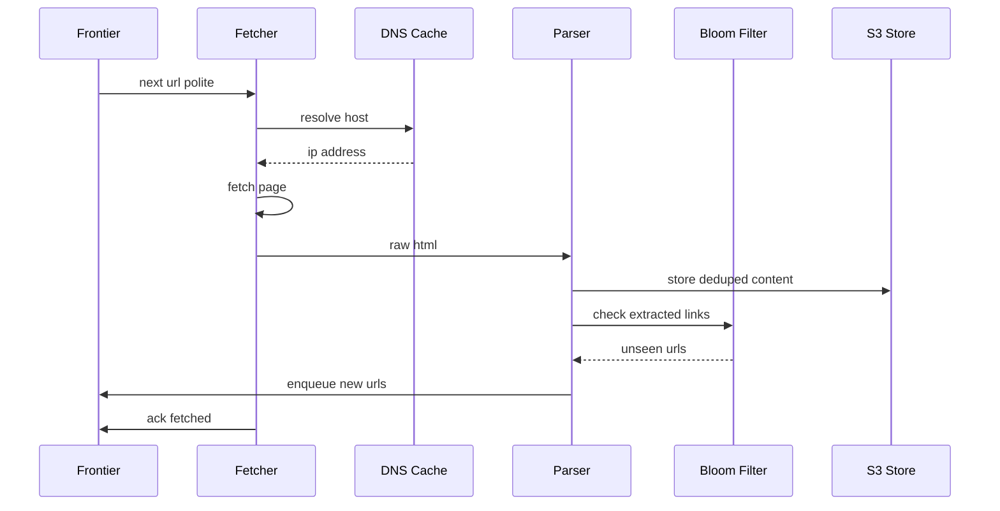

A web crawler (spider) systematically downloads pages from the web to build a corpus — for a search index, a price aggregator, an ML training set, or web archiving. The naive version is a five-line BFS loop. The real one must crawl **billions of pages**, be **polite** to every server, avoid **infinite traps**, deduplicate near-identical content, and keep the corpus **fresh** — all across a fleet of machines coordinating through a shared URL frontier. It is one of the classic "deceptively simple" interview problems.

## 1. Requirements

### Functional

- Start from **seed URLs**, fetch each page, **parse** it, **extract** links, and enqueue newly discovered URLs (BFS traversal of the web graph).
- Store fetched page content for downstream consumers (indexer, etc.).
- Respect **robots.txt** and crawl-delay directives.
- Be **polite**: never overwhelm a single domain.
- **Deduplicate** URLs (don't re-fetch the same URL) and **content** (don't store identical pages reachable via many URLs).
- **Recrawl** pages periodically to stay fresh.

### Non-functional

- **Scale:** crawl ~1B pages/month (extensible to tens of billions).
- **Politeness > raw speed:** correctness and not getting blocked matter more than peak throughput.
- **Robustness:** survive malformed HTML, slow servers, redirect loops, crawler traps, and machine failures.
- **Extensibility:** pluggable parsers (HTML, later PDF/images), pluggable content filters.
- **Freshness:** important/fast-changing pages recrawled more often than static ones.

### Clarifying questions

- HTML only, or other media? (HTML first, extensible.)
- One-shot crawl or continuous? (Continuous with recrawl.)
- How fresh? (Tiered: news hourly, static monthly.)
- Render JavaScript? (Initially raw HTML; headless rendering is an expensive add-on for SPA-heavy sites.)

## 2. Capacity Estimation

```
Pages/month     = 1,000,000,000
Pages/sec (avg) = 1B / (30 * 86,400) ≈ 386 pages/s
With recrawl 2x = ~772 fetches/s sustained
Peak (3x)       ≈ ~2,300 fetches/s
```

**Storage.** Average raw HTML ~500 KB, gzip ~10:1, so ~50–100 KB stored. Take 100 KB:

```
1B pages * 100 KB = 100 TB / month of new content
```

Over a year with recrawls and historical versions this reaches **petabytes** — so page storage goes to object storage (S3/HDFS), not a database.

**Frontier / metadata.** 1B URLs * ~200 bytes of metadata = 200 GB just for the URL table, plus the **seen-set** of all URLs ever discovered (tens of billions) — which is why we use a **Bloom filter** rather than storing every URL string in memory.

**Bandwidth.** 772 fetches/s * 500 KB raw ≈ 386 MB/s ≈ 3 Gbps sustained inbound. Significant but manageable across a fleet; DNS and politeness, not bandwidth, are the usual limits.

## 3. API Design

A crawler is mostly internal, but components expose interfaces. Workers pull work via `GET /frontier/next` (which enforces politeness by only handing out a domain's URL when its crawl-delay has elapsed) and acknowledge completion.

```api
{
  "endpoints": [
    {
      "method": "POST",
      "path": "/frontier/add",
      "auth": "internal service",
      "desc": "Add a discovered URL to the frontier.",
      "request": { "url": "string", "priority": "int", "depth": "int" },
      "responses": [
        { "status": "202 Accepted", "desc": "Enqueued (or skipped if already seen)." }
      ]
    },
    {
      "method": "GET",
      "path": "/frontier/next",
      "auth": "internal service",
      "desc": "Lease the next politeness-eligible URL for a worker.",
      "request": { "worker": "string (worker id)" },
      "responses": [
        { "status": "200 OK", "body": { "url": "...", "domain": "..." } },
        { "status": "204 No Content", "desc": "No domain currently eligible (crawl-delay)." }
      ],
      "notes": "Only hands out a domain's URL when its crawl-delay has elapsed."
    },
    {
      "method": "POST",
      "path": "/frontier/ack",
      "auth": "internal service",
      "desc": "Acknowledge a leased URL so it is not re-handed-out.",
      "request": { "url": "string", "status": "fetched | failed" },
      "responses": [
        { "status": "200 OK", "desc": "Lease cleared; unacked URLs are re-queued on timeout." }
      ]
    },
    {
      "method": "POST",
      "path": "/seeds",
      "auth": "admin",
      "desc": "Seed the crawl with starting URLs.",
      "request": { "urls": ["string"] },
      "responses": [
        { "status": "202 Accepted" }
      ]
    },
    {
      "method": "GET",
      "path": "/stats",
      "auth": "admin",
      "desc": "Crawl progress and frontier metrics.",
      "responses": [
        { "status": "200 OK", "body": { "pages_crawled": "int", "frontier_size": "int" } }
      ]
    }
  ]
}
```

## 4. Data Model

Mixed storage, each chosen for its access pattern:

- **Page content → S3 / object store.** Immutable blobs, petabyte scale, cheap, no query needs beyond key lookup. Key = content hash or URL hash.
- **URL frontier → priority queues** (per-domain) backed by **Kafka/RocksDB**, sharded by domain.
- **URL metadata + seen-set → Cassandra** (wide, write-heavy, key = url_hash) plus an in-memory **Bloom filter** for fast "have I seen this?" checks.
- **robots.txt / DNS → Redis** cache.

Why not one SQL database? At tens of billions of URLs with ~772 writes/s of metadata and petabytes of pages, a relational DB is the wrong tool. Key-value/wide-column stores and object storage match the access patterns (point lookups by hash, append-heavy, no joins).

```datamodel
{
  "entities": [
    {
      "name": "url_meta",
      "store": "Cassandra",
      "fields": [
        { "name": "url_hash", "type": "blob", "key": "PK", "note": "128-bit hash of normalized URL" },
        { "name": "url", "type": "text" },
        { "name": "domain", "type": "text", "note": "shard key for politeness" },
        { "name": "last_crawled", "type": "timestamp" },
        { "name": "http_status", "type": "int" },
        { "name": "content_hash", "type": "blob", "note": "content dedup (simhash/md5)" },
        { "name": "change_freq", "type": "int", "note": "estimated, drives recrawl" },
        { "name": "priority", "type": "int" }
      ],
      "notes": "Authoritative seen-set + metadata; point lookups by url_hash, write-heavy."
    },
    {
      "name": "seen_set",
      "store": "Bloom filter (in-memory)",
      "fields": [
        { "name": "url_hash", "type": "bits", "note": "~10 bits/element, tunable FP rate" }
      ],
      "notes": "Fast 'have I seen this?' front line; Cassandra is source of truth. No false negatives."
    },
    {
      "name": "page_content",
      "store": "S3 / object store",
      "fields": [
        { "name": "key", "type": "string", "key": "PK", "note": "s3://crawl-corpus/{domain}/{url_hash}/{timestamp}.html.gz" },
        { "name": "body", "type": "blob", "note": "gzipped raw HTML, immutable" }
      ],
      "notes": "Petabyte-scale immutable blobs; key lookup only, no queries."
    },
    {
      "name": "url_frontier",
      "store": "Kafka / RocksDB",
      "fields": [
        { "name": "domain", "type": "string", "key": "PK", "note": "per-domain priority queues, sharded by domain" },
        { "name": "url", "type": "string" },
        { "name": "priority", "type": "int" },
        { "name": "next_fetch_at", "type": "timestamp", "note": "enforces crawl-delay" }
      ]
    },
    {
      "name": "robots_dns_cache",
      "store": "Redis",
      "fields": [
        { "name": "key", "type": "string", "key": "PK", "note": "domain (robots.txt) or host (DNS)" },
        { "name": "value", "type": "text", "note": "robots rules / resolved IP" },
        { "name": "ttl", "type": "int", "note": "refresh periodically" }
      ]
    }
  ],
  "relationships": [
    { "from": "url_frontier", "to": "url_meta", "kind": "1:1", "label": "URL -> metadata by url_hash" },
    { "from": "url_meta", "to": "page_content", "kind": "1:N", "label": "one URL -> many timestamped versions" }
  ]
}
```

## 5. High-Level Architecture

```arch
{
  "title": "Web crawler — distributed BFS loop through the URL frontier",
  "nodes": [
    { "id": "seed", "label": "Seed URLs", "type": "external", "col": 0, "row": 0, "meta": "high-PageRank starting points" },
    { "id": "frontier", "label": "URL Frontier", "type": "queue", "col": 1, "row": 1, "meta": "per-domain priority queues, sharded by domain" },
    { "id": "dns", "label": "DNS Cache", "type": "cache", "col": 1, "row": 3, "meta": "Redis caching resolver" },
    { "id": "fetcher", "label": "Fetcher Workers", "type": "worker", "col": 2, "row": 1, "meta": "stateless, lease/ack" },
    { "id": "robots", "label": "robots.txt Cache", "type": "cache", "col": 2, "row": 3, "meta": "Redis, per-domain rules" },
    { "id": "parser", "label": "Parser / Extractor", "type": "worker", "col": 3, "row": 1, "meta": "extracts text + links" },
    { "id": "urlfilter", "label": "URL Filter + Bloom Dedup", "type": "service", "col": 3, "row": 3, "meta": "normalize, seen-set check" },
    { "id": "dedup", "label": "Content Dedup", "type": "worker", "col": 4, "row": 0, "meta": "simhash / md5 near-dup detection" },
    { "id": "s3", "label": "Page Store", "type": "blob", "col": 4, "row": 1, "meta": "S3/HDFS gzipped pages" },
    { "id": "indexer", "label": "Indexer Stream", "type": "queue", "col": 4, "row": 2, "meta": "Kafka to downstream consumers" }
  ],
  "edges": [
    { "from": "seed", "to": "frontier", "step": 1, "label": "seed urls" },
    { "from": "frontier", "to": "fetcher", "step": 2, "label": "next url (polite)" },
    { "from": "fetcher", "to": "parser", "step": 3, "label": "raw html" },
    { "from": "parser", "to": "urlfilter", "step": 4, "label": "extracted links" },
    { "from": "urlfilter", "to": "frontier", "step": 5, "label": "new urls (BFS loop)" },
    { "from": "dns", "to": "fetcher", "label": "resolve host" },
    { "from": "robots", "to": "urlfilter", "label": "Disallow / crawl-delay" },
    { "from": "parser", "to": "dedup", "label": "page text" },
    { "from": "dedup", "to": "s3", "label": "store deduped content" },
    { "from": "dedup", "to": "indexer", "label": "new content" }
  ],
  "groups": [
    { "label": "Per-domain caches", "nodes": ["dns", "robots"] },
    { "label": "Content sink", "nodes": ["dedup", "s3", "indexer"] }
  ]
}
```

Walkthrough:

1. **Seed URLs** prime the **URL Frontier** (per-domain priority queues, sharded by domain).
2. The frontier hands a **Fetcher** the next URL, respecting per-domain politeness (crawl-delay); the fetcher resolves the host via the **DNS cache** and downloads the page.
3. The **Parser/Extractor** receives the raw HTML and extracts text and links.
4. Links flow into the **URL Filter** — normalized, checked against the **Bloom filter** seen-set and **robots.txt** rules.
5. Surviving new URLs are added back to the frontier, closing the **BFS loop**.

In parallel, fetched page text goes through **content dedup** (simhash/md5) before being written to **S3** and announced to downstream consumers via **Kafka**.

The core fetch→parse→extract→enqueue loop:



## 6. Deep Dives

### 6.1 The URL frontier: BFS + priority + politeness

The frontier is the heart of the crawler and must satisfy two competing goals: **prioritize** important URLs and stay **polite** per domain. The classic **Mercator** design uses two stages:

- **Front queues** (priority): N queues by priority; a URL's priority comes from PageRank-like importance, freshness need, and depth. A prioritizer assigns each URL to a front queue.
- **Back queues** (politeness): M queues, each mapped to exactly one host at a time. A back-queue is only eligible to be read when its host's **crawl-delay** has elapsed. A min-heap keyed by "next-fetch-allowed-time" picks which back-queue to serve next.

This decouples *what to crawl next* (priority) from *when we're allowed to* (politeness). Sharding by domain ensures all of a host's URLs route to one node, so per-host rate limiting is local and correct.

### 6.2 URL dedup with a Bloom filter

We discover the same URL via many pages, so before adding to the frontier we ask "seen before?". Storing tens of billions of URL strings in memory is infeasible. A **Bloom filter** answers set-membership in ~10 bits/element with a tunable false-positive rate (e.g. 1%): for 10B URLs that's ~10B * 10 bits ≈ 12.5 GB, vs. terabytes for raw strings. False positives mean we occasionally skip a genuinely new URL — an acceptable loss; false negatives never happen. The authoritative seen-set lives in Cassandra; the Bloom filter is the fast front line. URLs are **normalized** first (lowercase host, strip default ports, sort query params, remove fragments) so equivalent URLs collapse.

### 6.3 Content dedup, DNS caching, and robots.txt

**Content dedup:** many distinct URLs serve identical or near-identical pages (mirrors, session-id URLs, printer-friendly versions). We compute a checksum (MD5) for exact dupes and **simhash** for near-duplicates — simhash maps similar documents to similar fingerprints, so a small Hamming distance means "basically the same page." Duplicate content isn't re-stored or re-indexed.

**DNS caching:** DNS resolution is a hidden bottleneck — a synchronous lookup per fetch can dominate latency. We run a local caching resolver (Redis-backed) with TTLs; at hundreds of fetches/sec, caching is essential.

**robots.txt:** before crawling a host we fetch and cache its `robots.txt`, honoring `Disallow` rules and `Crawl-delay`. Cached per-domain (Redis, refreshed periodically). Ignoring robots.txt gets the crawler IP-banned — politeness is self-interest.

### 6.4 Freshness, recrawl scheduling, and trap avoidance

**Freshness:** pages change at different rates. We estimate `change_freq` per URL by comparing content hashes across crawls; frequently-changing, high-importance pages (news homepages) are recrawled hourly, static pages monthly. Recrawl is just re-enqueuing into the frontier with a scheduled time and priority.

**Crawler traps:** some sites generate infinite URL spaces — calendars ("next month" forever), faceted-search permutations, or session-id loops. Defenses: cap **crawl depth**, cap URLs **per domain**, detect URL patterns with excessive parameters, and use content dedup to notice we're fetching the same page under different URLs. Soft 404s (200 status on error pages) are caught by content dedup too.

## 7. Bottlenecks & Scaling

| Concern | Approach |
|---|---|
| Politeness vs. throughput | Per-domain back-queues; crawl many domains concurrently, each slowly |
| Seen-set memory | Bloom filter (~12.5 GB for 10B URLs) + Cassandra source of truth |
| DNS latency | Local caching resolver (Redis), prefetch |
| Hot/huge domains | Cap per-domain budget; shard domain across sub-queues carefully |
| Page storage volume | S3/HDFS, gzip, content dedup avoids storing mirrors |
| Worker failures | Stateless fetchers; frontier ack/lease so unacked URLs are re-queued |
| Coordination | Shard frontier by domain-hash; ZooKeeper/consistent hashing for assignment |

**Distributed coordination:** the frontier is sharded by `hash(domain)` across nodes; consistent hashing (or a coordinator like ZooKeeper) assigns domain ranges to workers and reassigns on failure. Because all URLs of a domain land on one shard, politeness is enforced without cross-node coordination. Fetchers are stateless and horizontally scalable; the frontier uses a **lease/ack** model so a crashed fetcher's in-flight URL is re-handed-out after a timeout (at-least-once crawl, dedup prevents reprocessing waste).

**Hotspots:** a giant domain (millions of pages) can starve others or overflow one shard; we cap per-domain budgets and spread a domain's URLs across several back-queues while still rate-limiting the host globally.

## 8. Trade-offs & Follow-ups

- **BFS vs. priority crawling.** Pure BFS is simple but wastes capacity on low-value pages; priority crawling (importance-weighted) yields a better corpus at the cost of needing a scoring signal.
- **Politeness vs. speed.** Aggressive crawling gets you banned; we deliberately leave throughput on the table to stay welcome.
- **Bloom filter false positives.** We accept occasionally missing a new URL in exchange for massive memory savings — the right trade at web scale.
- **Render JS or not.** Headless rendering captures SPA content but is 10–100x more expensive; reserve it for sites that need it.
- **Freshness vs. cost.** Recrawling everything often is wasteful; adaptive recrawl by change-frequency focuses budget where it matters.

**Likely interviewer follow-ups:** How do you detect that a page changed without re-downloading? (HTTP `If-Modified-Since`/ETag conditional GETs.) How do you avoid two workers crawling the same domain? (Domain-sharded frontier.) How do you handle redirects? (Follow with a hop limit, dedup the final URL.) How would you crawl the deep/auth-gated web? (Out of scope — needs credentials/forms.) How do you prioritize at cold start? (Seed with high-PageRank sites.)

## Key takeaways

- A web crawler is a **distributed BFS** over the web graph whose core is a **URL frontier** balancing priority against per-domain politeness.
- **Politeness (robots.txt + crawl-delay)** is non-negotiable — sharding the frontier by domain makes per-host rate limiting local and correct.
- A **Bloom filter** makes the tens-of-billions URL seen-set fit in memory (~12.5 GB for 10B); Cassandra holds the authoritative set.
- **Content dedup via simhash/checksums** and **DNS caching** are the unglamorous pieces that decide whether the crawler is efficient or wasteful.
- **Crawler traps and freshness** require depth/budget caps and **adaptive, change-frequency-driven recrawl** scheduling.
- Store pages in **object storage (S3/HDFS)**, not a database; keep fetchers **stateless** with a lease/ack frontier so failures simply re-enqueue work.
