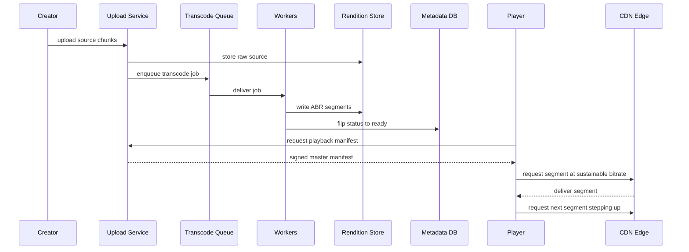

Video streaming platforms like YouTube and Netflix solve two hard problems at once: ingesting and processing enormous volumes of source video, and delivering that video smoothly to hundreds of millions of viewers on heterogeneous networks and devices. YouTube is upload-heavy with user-generated content; Netflix is a curated catalog. We design a system that covers both, leaning toward the YouTube model (open uploads) while borrowing Netflix's delivery techniques (Open Connect appliances, pre-positioning).

## 1. Requirements

### Functional
- Creators upload videos of arbitrary length and format.
- The system transcodes each upload into multiple resolutions (240p–4K) and codecs (H.264, VP9, AV1).
- Viewers stream video with adaptive bitrate (ABR), seeking, and pause/resume.
- Search and browse by title, channel, and metadata.
- View counts, likes, and comments.
- Recommendations on the home and watch pages.

### Non-functional
- **Low startup latency**: time-to-first-frame under ~2 seconds.
- **High availability** for playback (99.95%+); uploads can tolerate brief degradation.
- **Durability** of source and rendition files (11 nines via object storage).
- **Global scale** with low rebuffering across regions.
- Cost efficiency — bandwidth and storage dominate the bill.

### Clarifying questions
- Average vs. max video length? (Assume mostly < 15 min, but support hours.)
- Do we need DRM (Netflix yes, YouTube partial)? Assume optional DRM for premium content.
- Live streaming in scope? We focus on VOD (video on demand) but note live differences.
- Global audience or single region? Global.

## 2. Capacity Estimation

Assume **500M DAU**, each watching **5 videos/day** → **2.5B video starts/day** ≈ **29K play QPS** average (2.5B ÷ 86,400 s), and at ~3x peak ≈ **87K QPS**.

**Uploads**: assume 1 upload per 1,000 DAU per day → 500K uploads/day ≈ **6 uploads/sec** average. Each raw upload averages 300 MB.

**Storage per year (source + renditions)**:
- 500K uploads/day × 300 MB = **150 TB/day** of raw source.
- Each source generates ~6 renditions; the full encoded ladder is roughly 1.5–2x the source size → ~250 TB/day of renditions.
- Combined ≈ **400 TB/day → ~146 PB/year** (400 TB × 365).

**Bandwidth (egress dominates)**: audience-weighted average bitrate ≈ 3 Mbps; average watch time per start ≈ 5 min.
- Bytes per view = 3 Mbps × 300 s ÷ 8 = **~112 MB**.
- 2.5B views/day × 112 MB ≈ **280 PB/day egress** → 280 PB ÷ 86,400 s ≈ **3.2 TB/sec average egress**, with multi-Tbps peaks.

This egress number is why a CDN is non-negotiable: serving 3+ TB/sec directly from origin object storage would be ruinously expensive and slow.

| Metric | Estimate |
|---|---|
| Play QPS (avg / peak) | 29K / 87K |
| Uploads/day | 500K (~6/sec) |
| New storage/year | ~146 PB |
| Avg egress | ~3.2 TB/sec |

## 3. API Design

```api
{
  "endpoints": [
    {
      "method": "POST",
      "path": "/v1/uploads",
      "auth": "bearer",
      "desc": "Begin a resumable, chunked upload session.",
      "responses": [
        { "status": "200 OK", "body": { "uploadId": "string", "uploadUrls": ["signed part URLs"] } }
      ]
    },
    {
      "method": "PUT",
      "path": "/v1/uploads/{uploadId}/parts/{n}",
      "auth": "bearer",
      "desc": "Upload one binary chunk; resumes from the last completed part.",
      "request": { "body": "binary chunk" },
      "responses": [
        { "status": "200 OK", "body": { "part": "n", "etag": "string" } }
      ]
    },
    {
      "method": "POST",
      "path": "/v1/uploads/{uploadId}/complete",
      "auth": "bearer",
      "desc": "Finalize the upload and kick off transcoding.",
      "responses": [
        { "status": "202 Accepted", "body": { "videoId": "string", "status": "processing" } }
      ]
    },
    {
      "method": "POST",
      "path": "/v1/videos",
      "auth": "bearer",
      "desc": "Create video metadata.",
      "request": { "title": "string", "description": "string", "tags": ["string"], "visibility": "public|unlisted|private" },
      "responses": [
        { "status": "201 Created", "body": { "videoId": "string" } }
      ]
    },
    {
      "method": "GET",
      "path": "/v1/videos/{videoId}",
      "desc": "Fetch metadata, processing status, and available renditions.",
      "responses": [
        { "status": "200 OK", "body": { "videoId": "string", "status": "ready", "renditions": ["240p", "1080p", "4K"] } },
        { "status": "404 Not Found", "desc": "Unknown videoId" }
      ]
    },
    {
      "method": "PATCH",
      "path": "/v1/videos/{videoId}",
      "auth": "bearer",
      "desc": "Edit title, description, tags, or visibility.",
      "request": { "title": "string", "visibility": "public|unlisted|private" },
      "responses": [
        { "status": "200 OK" }
      ]
    },
    {
      "method": "GET",
      "path": "/v1/videos/{videoId}/manifest",
      "desc": "Return a short-lived signed HLS/DASH master manifest URL.",
      "responses": [
        { "status": "200 OK", "body": { "manifestUrl": "signed URL", "expiresInSec": 300 } }
      ],
      "notes": "Signed to prevent hotlinking and enforce entitlements/DRM."
    },
    {
      "method": "GET",
      "path": "/cdn/{videoId}/{rendition}/{segment}.ts",
      "desc": "Fetch an ABR media segment; served directly by the CDN edge.",
      "responses": [
        { "status": "200 OK", "body": { "body": "binary segment" } }
      ]
    },
    {
      "method": "POST",
      "path": "/v1/videos/{videoId}/views",
      "desc": "Report a view/heartbeat event for the streaming pipeline.",
      "request": { "positionMs": "int", "sessionId": "string" },
      "responses": [
        { "status": "202 Accepted" }
      ]
    },
    {
      "method": "POST",
      "path": "/v1/videos/{videoId}/reactions",
      "auth": "bearer",
      "desc": "Like or react to a video.",
      "request": { "type": "like" },
      "responses": [
        { "status": "200 OK" }
      ]
    },
    {
      "method": "GET",
      "path": "/v1/feed/home",
      "auth": "bearer",
      "desc": "Return recommended videos for the home feed.",
      "responses": [
        { "status": "200 OK", "body": { "videos": ["videoId"] } }
      ]
    }
  ]
}
```

Uploads use **resumable multipart** so a dropped connection resumes from the last completed part. The manifest endpoint returns short-lived signed URLs to prevent hotlinking and enforce entitlements/DRM.

## 4. Data Model

Metadata is relational-ish but read-heavy and large; we split by access pattern. Core video metadata lives in a sharded SQL store (strong consistency for ownership/edits); the playback rendition index and view counters live in NoSQL stores tuned for scale.

```datamodel
{
  "entities": [
    {
      "name": "videos",
      "store": "PostgreSQL / Vitess-sharded MySQL",
      "fields": [
        { "name": "video_id", "type": "bigint", "key": "PK" },
        { "name": "channel_id", "type": "bigint", "note": "indexed with created_at for channel pages" },
        { "name": "title", "type": "varchar(200)" },
        { "name": "description", "type": "text" },
        { "name": "duration_ms", "type": "int" },
        { "name": "visibility", "type": "enum(public,unlisted,private)" },
        { "name": "status", "type": "enum(uploading,processing,ready,failed)" },
        { "name": "source_key", "type": "varchar(512)", "note": "object store key" },
        { "name": "created_at", "type": "timestamp" }
      ],
      "notes": "Sharded by video_id; chosen for transactional edits and joins for channel pages."
    },
    {
      "name": "renditions",
      "store": "PostgreSQL / Vitess-sharded MySQL",
      "fields": [
        { "name": "video_id", "type": "bigint", "key": "PK" },
        { "name": "resolution", "type": "smallint", "key": "PK", "note": "240,480,720,1080,2160" },
        { "name": "codec", "type": "varchar(16)", "key": "PK", "note": "h264, vp9, av1" },
        { "name": "bitrate_kbps", "type": "int" },
        { "name": "manifest_key", "type": "varchar(512)" }
      ],
      "notes": "Playback rendition index; one row per (resolution, codec) in the ABR ladder."
    },
    {
      "name": "view_counts",
      "store": "Cassandra / DynamoDB",
      "fields": [
        { "name": "video_id", "type": "bigint", "key": "PK" },
        { "name": "count", "type": "counter", "note": "approximate; stream-aggregated" }
      ],
      "notes": "Counter table or, better, an approximate streaming aggregate (see deep dive)."
    },
    {
      "name": "comments",
      "store": "Cassandra (wide-column)",
      "fields": [
        { "name": "video_id", "type": "bigint", "key": "PK", "note": "partition key" },
        { "name": "comment_id", "type": "timeuuid", "key": "CK" },
        { "name": "author_id", "type": "bigint" },
        { "name": "body", "type": "text" }
      ],
      "partitionKey": "(video_id) -> comment_id DESC",
      "notes": "Append-heavy; partitioned by video_id and tolerant of eventual consistency."
    }
  ],
  "relationships": [
    { "from": "videos", "to": "renditions", "kind": "1:N", "label": "one video -> many renditions" },
    { "from": "videos", "to": "view_counts", "kind": "1:1", "label": "one counter per video" },
    { "from": "videos", "to": "comments", "kind": "1:N", "label": "one video -> many comments" }
  ]
}
```

Why mixed SQL/NoSQL: ownership and catalog edits need transactions and secondary indexes (SQL), while counters and comments are append-heavy, hot-key-prone, and tolerate eventual consistency (NoSQL).

## 5. High-Level Architecture

```arch
{
  "title": "Video streaming — async publish pipeline and adaptive playback",
  "nodes": [
    { "id": "creator", "label": "Creator", "type": "client", "col": 0, "row": 0, "meta": "uploads source video" },
    { "id": "player", "label": "Player", "type": "client", "col": 0, "row": 3, "meta": "ABR client" },
    { "id": "upload", "label": "Upload Service", "type": "service", "col": 1, "row": 0, "meta": "resumable multipart ingest" },
    { "id": "edge", "label": "CDN Edge", "type": "cdn", "col": 1, "row": 3, "meta": "serves segments near viewer" },
    { "id": "queue", "label": "Transcode Queue", "type": "queue", "col": 2, "row": 0, "meta": "Kafka job queue" },
    { "id": "views", "label": "View Pipeline", "type": "worker", "col": 2, "row": 1, "meta": "streaming view aggregation" },
    { "id": "playback", "label": "Playback Service", "type": "service", "col": 2, "row": 2, "meta": "issues signed manifests" },
    { "id": "shield", "label": "Origin Shield", "type": "cdn", "col": 2, "row": 3, "meta": "regional cache, absorbs misses" },
    { "id": "workers", "label": "Transcode Workers", "type": "worker", "col": 3, "row": 0, "meta": "ffmpeg, spot instances" },
    { "id": "rawstore", "label": "Raw Object Store", "type": "blob", "col": 3, "row": 1, "meta": "S3 source files" },
    { "id": "meta", "label": "Metadata DB", "type": "db", "col": 3, "row": 2, "meta": "Vitess-sharded MySQL" },
    { "id": "rendition", "label": "Rendition Store", "type": "blob", "col": 4, "row": 1, "meta": "S3 origin for ABR segments" }
  ],
  "edges": [
    { "from": "creator", "to": "upload", "step": 1, "label": "resumable upload" },
    { "from": "upload", "to": "rawstore", "step": 2, "label": "store source" },
    { "from": "upload", "to": "queue", "step": 3, "label": "enqueue job" },
    { "from": "queue", "to": "workers", "step": 4, "label": "deliver job" },
    { "from": "workers", "to": "rendition", "step": 5, "label": "write renditions + segments" },
    { "from": "player", "to": "playback", "step": 6, "label": "request manifest" },
    { "from": "edge", "to": "player", "step": 7, "label": "deliver segments" },
    { "from": "rawstore", "to": "workers", "label": "read source" },
    { "from": "workers", "to": "meta", "label": "flip status to ready" },
    { "from": "playback", "to": "meta", "label": "read metadata" },
    { "from": "playback", "to": "player", "label": "signed manifest" },
    { "from": "rendition", "to": "shield", "label": "origin miss" },
    { "from": "shield", "to": "edge", "label": "cache fill" },
    { "from": "player", "to": "views", "label": "view events" }
  ],
  "groups": [
    { "label": "Transcode pipeline", "nodes": ["queue", "workers"] },
    { "label": "Edge tier", "nodes": ["shield", "edge"] },
    { "label": "Data tier", "nodes": ["rawstore", "rendition", "meta"] }
  ]
}
```

**Walkthrough**:
1. The **Creator** sends a resumable, chunked upload to the **Upload Service**.
2. The Upload Service writes the raw file to the **Raw Object Store** (S3).
3. It then emits a transcode job onto the **Transcode Queue** (Kafka).
4. The queue delivers the job to a fleet of stateless **Transcode Workers** (ffmpeg), which also read the source back from the raw store.
5. Workers produce the rendition ladder + ABR segments and write them to the **Rendition Store**, the CDN origin; a fan-in step flips the video's `status` to `ready` in the **Metadata DB**.
6. For playback, the **Player** requests a manifest from the **Playback Service**, which reads metadata and returns a short-lived signed master manifest.
7. The Player then fetches ABR segments directly from the nearest **CDN Edge**, which fills cold segments from the **Origin Shield** in front of the rendition store. View events flow asynchronously into the **View Pipeline**; recommendations are served by a separate ML service.

The two primary flows — async publish and adaptive playback — look like this:



## 6. Deep Dives

### 6.1 Upload + async transcoding pipeline
Source files arrive in many formats. We never serve the raw upload. Instead:
1. Upload Service validates and stores the source, emits a job to **Kafka**.
2. A **DAG orchestrator** (one workflow per video) splits the source into GOP-aligned chunks so transcoding parallelizes — a 1-hour film is cut into hundreds of segments encoded concurrently, collapsing wall-clock time from hours to minutes.
3. For each (resolution, codec) in the ladder, a worker runs ffmpeg to produce **HLS/DASH segments** (typically 2–6 s each) plus a per-rendition manifest.
4. A fan-in step writes the master manifest and flips `status` to `ready`.

Workers are spot/preemptible instances for cost; jobs are idempotent and retried, since a killed worker just loses one chunk. Priority queues let short videos and premium creators jump ahead of long batch jobs.

### 6.2 Adaptive bitrate streaming (HLS / DASH)
The player downloads a **master manifest** listing renditions and their bitrates. It measures throughput and buffer level, then requests the next 2–6 s segment at the bitrate it can sustain — stepping down on a congested mobile link, stepping up on Wi-Fi. Because each rendition is independently segmented and time-aligned, the player can switch bitrate at any segment boundary without re-buffering. Short segments improve adaptivity and seek granularity but add request overhead; ~4 s is a common balance. DRM (Widevine/FairPlay/PlayReady) encrypts segments and gates keys behind license servers for premium content.

### 6.3 CDN distribution, edge caching, and popularity-based pre-positioning
Edge servers (CloudFront, or Netflix's **Open Connect** appliances embedded in ISPs) cache segments close to viewers. The first request for a cold segment pulls from an **origin shield** layer (a regional cache that absorbs origin misses), preventing thundering-herd hits on object storage.

The key optimization is **pre-positioning**: popularity is highly skewed (a small head of viral/new content drives most traffic). Netflix predicts demand and pushes popular titles to edge appliances during off-peak hours, so launch night is served entirely from local disk. For long-tail content, lazy pull-through caching suffices. We track per-segment hit ratios and use them to size cache tiers; a 90%+ edge hit ratio is the difference between affordable and bankrupt.

### 6.4 View counting at scale
A naive `UPDATE videos SET views = views + 1` creates a write hotspot on viral videos. Instead, view events flow into **Kafka**, are de-duplicated by `(sessionId, videoId)`, aggregated in **Flink** over short windows, and periodically flushed to a counter store. Displayed counts are eventually consistent (acceptable — nobody needs exact real-time counts), and qualified views (e.g., watched > 30 s) are computed from the same stream. **HyperLogLog** gives cheap unique-viewer estimates.

## 7. Bottlenecks & Scaling
- **Egress/bandwidth** is the dominant cost and the primary scaling concern; solved by high CDN hit ratios, pre-positioning, and modern codecs (AV1 cuts bitrate ~30% vs. H.264 at equal quality).
- **Hot videos** create metadata and counter hotspots; mitigate with read replicas, edge/CDN caching of manifests, and stream-based counting.
- **Transcode burst** when many large uploads land together; absorb with queue backpressure and autoscaling worker fleets on spot capacity.
- **Origin protection**: origin shield + request collapsing so a viral cold start doesn't stampede object storage.
- **Metadata DB scaling**: shard by `video_id` (Vitess), keep channel pages on read replicas, cache hot rows in Redis.
- **Failure handling**: transcode jobs are idempotent and retried; playback degrades gracefully by serving a lower rendition if a high one is unavailable.

## 8. Trade-offs & Follow-ups
- **Pre-transcode the full ladder vs. just-in-time encoding**: pre-transcoding wastes compute/storage on rarely watched long-tail videos. A hybrid encodes a couple of common renditions eagerly and generates the rest on demand for cold content.
- **Segment length**: shorter = better adaptivity and seeking, more requests and overhead.
- **Codec spread**: more codecs (AV1) save bandwidth but cost CPU-hours to encode and storage to keep.
- **Strong vs. eventual consistency** for counts/comments: we chose eventual to scale.

Likely interviewer follow-ups: How would you support **live streaming**? (Low-latency HLS/LL-DASH, smaller segments, near-real-time transcode, no pre-positioning.) How do you handle **DRM and piracy**? How do you do **thumbnail generation and per-thumbnail A/B testing**? How do recommendations stay fresh? How do you **delete** content for copyright takedowns across all edges (cache invalidation)?

## Key takeaways
- Never serve the raw upload: an async, chunk-parallel ffmpeg pipeline produces an ABR rendition ladder of segments.
- Adaptive bitrate (HLS/DASH) lets the client pick quality per segment based on measured bandwidth and buffer.
- The CDN — with origin shield and popularity-based pre-positioning — is what makes multi-Tbps egress economically viable.
- Bandwidth, not compute or storage, is the dominant cost; high edge hit ratios and efficient codecs drive the bill.
- Split storage by access pattern: SQL for transactional metadata, NoSQL/streaming for views and comments.
- View counts are approximate and stream-computed to avoid write hotspots on viral content.
