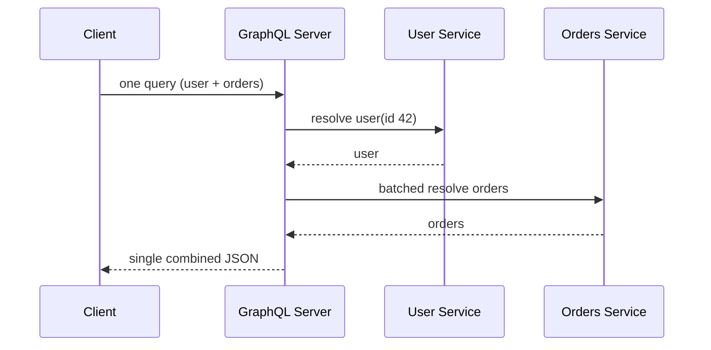
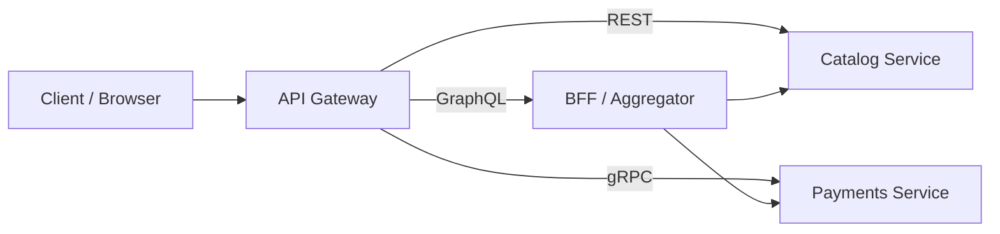

The API is the contract between services and clients. A good API is predictable, evolvable, and hard to misuse. This chapter compares the three dominant styles — REST, gRPC, and GraphQL — and the cross-cutting design decisions (pagination, versioning, idempotency, auth) that apply to all of them.

## REST principles and resource modeling

REST models your domain as **resources** identified by URLs, manipulated with standard HTTP verbs. Resources are nouns, not verbs: `/users/42/orders`, not `/getOrdersForUser`. Collections are plural. Relationships can nest, but avoid going more than two levels deep — beyond that, prefer query parameters or hypermedia links.

HTTP verbs carry semantics. *Safe* means no server-state change; *idempotent* means repeating the request has the same effect as making it once:

| Verb | Meaning | Safe | Idempotent |
|------|---------|------|-----------|
| GET | Read | Yes | Yes |
| POST | Create / action | No | No |
| PUT | Replace (full) | No | Yes |
| PATCH | Partial update | No | No (usually) |
| DELETE | Remove | No | Yes |

Use status codes precisely: `200` OK, `201` Created (with a `Location` header), `204` No Content, `400` bad request, `401` unauthenticated, `403` forbidden, `404` not found, `409` conflict, `422` unprocessable, `429` rate-limited, `500` server error, `503` unavailable. Returning `200` with an error buried in the body is an anti-pattern — it breaks every client that trusts the status line.

```json
// POST /users  ->  201 Created
// Request
{ "name": "Ada Lovelace", "email": "ada@example.com" }

// Response  (Location: /users/42)
{
  "id": 42,
  "name": "Ada Lovelace",
  "email": "ada@example.com",
  "createdAt": "2026-06-27T10:00:00Z"
}
```

## Idempotency

Idempotent requests can be safely retried without extra side effects — critical for unreliable networks. GET, PUT, and DELETE are idempotent by definition. POST is not, which is dangerous for payments: a timed-out "charge card" retry could double-charge. The fix is an **idempotency key**: the client sends a unique key, the server records the result against it, and replays the *same* response on retry instead of repeating the work (Stripe popularized this).

```http
POST /charges
Idempotency-Key: 7f3c1e22-9a4b-4d11-b0f2-2c9e6a8d1234
```

## Pagination: offset vs cursor

Never return an unbounded list. Two strategies:

- **Offset/limit** (`?offset=40&limit=20`) — simple, allows jumping to any page. But it slows on large tables (`OFFSET 100000` still scans and discards those rows) and is unstable: if rows are inserted or deleted mid-scroll, items shift or repeat across pages.
- **Cursor/keyset** (`?after=eyJpZCI6NDJ9&limit=20`) — the cursor encodes the last-seen sort key (e.g., `id` or `created_at`). The query becomes `WHERE id > :cursor ORDER BY id LIMIT 20`, which rides an index and stays O(limit) regardless of depth, and is stable under inserts. The trade-off: no random page jumps and the sort key must be unique/total (tie-break on a secondary key).

Use cursor pagination for large, frequently changing datasets and infinite-scroll feeds; offset is fine for small, stable admin tables.

## Versioning

APIs evolve; clients break. Version explicitly:

- **URL path** — `/v1/users`, `/v2/users`. Most visible and cache-friendly; the common choice.
- **Header** — `Accept: application/vnd.api+json; version=2`. Keeps URLs clean but is harder to test by hand and to cache.

Whatever you pick, treat additions (new optional fields) as backward-compatible, and never repurpose or remove a field within a published version. Deprecate with a clear sunset date and signal it via `Deprecation` / `Sunset` headers.

## Rate limiting and auth

Protect APIs with rate limits (e.g., a token bucket of 1000 requests/min/key, which also permits short bursts). Communicate limits via headers:

```http
X-RateLimit-Limit: 1000
X-RateLimit-Remaining: 994
X-RateLimit-Reset: 1719484800
Retry-After: 30
```

Return `429 Too Many Requests` when exceeded. For auth, prefer OAuth 2.0 / OpenID Connect with short-lived JWT access tokens plus refresh tokens; use API keys (or mTLS) for service-to-service. Always over TLS.

## gRPC: protobuf, HTTP/2, streaming

gRPC is a binary RPC framework using **Protocol Buffers** for schema and serialization over **HTTP/2**. You define a service in a `.proto` file and generate strongly typed client/server stubs in many languages.

```protobuf
syntax = "proto3";
package users.v1;

service UserService {
  rpc GetUser(GetUserRequest) returns (User);
  rpc StreamUsers(StreamRequest) returns (stream User); // server streaming
}

message GetUserRequest { string id = 1; }

message User {
  string id    = 1;
  string name  = 2;
  string email = 3;
}
```

Strengths: compact binary payloads (often several times smaller than equivalent JSON), low latency, code-generated type safety, and four call types — unary, server-streaming, client-streaming, and bidirectional streaming over a single multiplexed HTTP/2 connection. Weaknesses: not human-readable, no native browser support (needs gRPC-Web plus a proxy), and harder to debug with curl. Use gRPC for **internal east-west microservice traffic** and low-latency/streaming needs; use REST/JSON for public-facing and browser APIs.

## GraphQL: single endpoint, fetching, N+1

GraphQL exposes a single endpoint (`POST /graphql`) and a typed schema; clients ask for exactly the fields they need:

```graphql
query {
  user(id: "42") {
    name
    orders(first: 3) { id total }
  }
}
```

This eliminates **over-fetching** (REST returns a fixed shape, often more than you need) and **under-fetching** (REST often needs multiple round trips; GraphQL resolves a graph in one request). A single query can fan out to several backing data sources server-side:



The cost is server complexity: arbitrary queries are hard to cache (everything is one `POST`), and naive resolvers cause the **N+1 problem** — fetching 1 user, then issuing N separate queries for their orders. The standard fix is a batching layer like **DataLoader** that coalesces per-tick lookups into one batched query (shown above). You also need query depth/complexity limits to block abusive queries.

## Comparison

| Dimension | REST | gRPC | GraphQL |
|-----------|------|------|---------|
| Transport | HTTP/1.1+ | HTTP/2 | HTTP (usually POST) |
| Payload | JSON (text) | Protobuf (binary) | JSON |
| Schema/contract | Optional (OpenAPI) | Required (.proto) | Required (SDL) |
| Fetching | Fixed per endpoint | Fixed per method | Client-specified |
| Streaming | Limited (SSE/WS) | First-class (bidi) | Subscriptions |
| Browser support | Native | Needs gRPC-Web | Native |
| Caching | Easy (HTTP/URL) | Hard | Hard |
| Best for | Public/CRUD APIs | Internal microservices | Flexible client data needs |

## API gateways

In practice, these styles sit behind an **API gateway** (Kong, AWS API Gateway, Envoy, Apigee) that centralizes cross-cutting concerns: TLS termination, authn/z, rate limiting, request routing, protocol translation (REST ⇄ gRPC), and observability — keeping individual services focused on business logic.



## Key takeaways

- REST models resources with URLs and HTTP verbs; use precise status codes and never bury errors in a `200`.
- Make unsafe operations retry-safe with idempotency keys, especially for payments and creates.
- Prefer cursor (keyset) pagination over offset for large, changing datasets; it stays fast and stable.
- Version explicitly (URL path is most common), add fields compatibly, and deprecate with a clear timeline.
- gRPC wins for internal, low-latency, streaming microservice calls; GraphQL wins for flexible client-driven fetching (watch the N+1 with DataLoader); REST remains the default for public, cacheable APIs.
- Put an API gateway in front to centralize auth, rate limiting, routing, and protocol translation.
