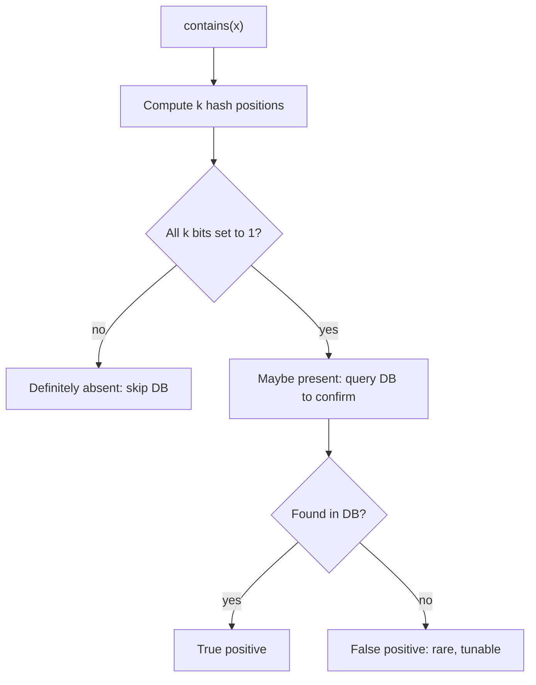

Probabilistic data structures trade a small, tunable error rate for dramatic savings in memory. When you have billions of items and exact answers are too expensive to store, structures like Bloom filters, Count-Min sketches, and HyperLogLog let you answer "have I seen this?", "how often?", and "how many distinct?" using kilobytes instead of gigabytes.

## Bloom filter mechanics

A Bloom filter answers set membership: *is element X possibly in the set?* It is a bit array of `m` bits (all initially 0) plus `k` independent hash functions. To **add** an element, hash it with each of the `k` functions, map each result to a bit position mod `m`, and set those bits to 1. To **query**, hash the same way and check whether *all* `k` bits are set.

```
m = 16 bits, k = 3 hashes

add("cat")  -> bits 2, 7, 11
add("dog")  -> bits 4, 7, 14

index: 0 1 2 3 4 5 6 7 8 9 10 11 12 13 14 15
bits:  0 0 1 0 1 0 0 1 0 0  0  1  0  0  1  0

query("cat") -> check 2,7,11 -> all 1 -> "maybe present"
query("fox") -> hashes to 4,9,11 -> bit 9 is 0 -> "definitely NOT present"
```

```
add(x):
    for i in 0..k-1:
        bits[ hash_i(x) % m ] = 1

contains(x):
    for i in 0..k-1:
        if bits[ hash_i(x) % m ] == 0:
            return False        # certain: absent
    return True                 # probable: present
```



### No false negatives, but false positives

The asymmetry is the whole point. If a query returns "absent," the element was **definitely never added** — at least one of its bits is 0, and bits only ever go from 0 to 1. So there are **no false negatives**. But "present" can be wrong: as the array fills, an element's `k` bits may all happen to be set by *other* insertions, giving a **false positive**. You can never delete from a standard Bloom filter (clearing a bit might break another element's membership).

### Tuning m and k

For `n` inserted elements and `m` bits, the optimal number of hash functions is:

```
k = (m / n) * ln(2)
```

and the resulting false-positive probability is approximately:

```
p ≈ (1 - e^(-k·n/m))^k
```

Inverting to size the array for a target `p`:

```
m = - (n * ln p) / (ln 2)^2
```

Concrete: for `n = 1,000,000` items and a target `p = 1%`, you need `m ≈ 9.6 million bits ≈ 1.2 MB` and `k ≈ 7` hashes — about **9.6 bits per element** regardless of how big each element actually is. Dropping the target to 0.1% costs ~14.4 bits/element. A naive hash set of 1M 64-byte strings would be ~64 MB; the Bloom filter is ~50× smaller.

### Use cases

- **Cache penetration guard**: before hitting a database for a key that is almost always absent (e.g. checking if a username is taken), consult a Bloom filter. A "definitely not present" answer skips the DB entirely. This shields the DB from floods of lookups for non-existent keys.
- **LSM-tree / SSTable reads**: Cassandra, RocksDB, LevelDB, and HBase keep a Bloom filter per on-disk SSTable. A read first asks each filter "could this key be here?"; only segments that say "maybe" are read from disk. This avoids most useless disk seeks on point lookups.
- **Deduplication**: web crawlers test "have I already fetched this URL?" against a Bloom filter before queuing it. A false positive occasionally skips a new URL — usually acceptable.
- **Distributed systems**: quickly checking whether a peer might hold a piece of content before requesting it.

### Counting Bloom filters

To support deletion, replace each bit with a small counter (typically 4 bits). Adds increment the `k` counters; deletes decrement them. An element is present if all `k` counters are nonzero. The cost is ~4× the memory and a small risk of counter overflow. Cuckoo filters are a modern alternative offering deletion and often better space efficiency at low false-positive rates.

## Count-Min Sketch: frequency estimation

A Count-Min sketch estimates *how many times* an item has appeared in a stream, using a 2D array of counters: `d` rows, each with `w` columns and its own hash function.

```
increment(x, c):
    for row in 0..d-1:
        table[row][ hash_row(x) % w ] += c

estimate(x):
    return min over rows of table[row][ hash_row(x) % w ]
```

Because hash collisions only ever *add* to a counter, taking the **minimum** across rows gives a count that may be over-estimated but never under-estimated. With `w = e/ε` and `d = ln(1/δ)`, the error is bounded by `ε · N` (total count) with probability `1 − δ`. Used for heavy-hitter detection — finding the most frequent IPs in a DDoS, trending search terms, or per-key traffic in a network — in fixed memory regardless of key cardinality.

## HyperLogLog: cardinality estimation

HyperLogLog answers *how many distinct elements?* using a few kilobytes for billions of items. The intuition: hash each element to a uniformly random bit string; the more distinct elements you see, the more likely you are to observe a long run of leading zeros. Tracking the maximum run length `ρ` gives ~`2^ρ` as a rough cardinality estimate. HLL reduces variance by splitting the hash into `2^p` buckets ("registers"), each storing the max leading-zero count it has seen, then combining them with a harmonic mean and bias correction.

Redis ships HLL (`PFADD`, `PFCOUNT`): with `p = 14` it uses **~12 KB** and achieves a standard error of about **0.81%** for cardinalities into the billions. Registers are also mergeable, so you can compute distinct counts across shards by combining their HLLs — perfect for "unique visitors per day" rolled up across many servers.

## Comparison

| Structure | Answers | Error type | Typical memory | Mergeable | Deletes |
|---|---|---|---|---|---|
| Bloom filter | Membership (yes/no) | False positives only | ~10 bits/item @ 1% | Yes (OR) | No |
| Counting Bloom | Membership + delete | False positives only | ~40 bits/item | Yes | Yes |
| Count-Min sketch | Frequency of an item | Over-estimates only | KB, fixed | Yes (add) | With care |
| HyperLogLog | Distinct cardinality | ±~0.8% std error | ~12 KB total | Yes | No |

The common thread: all replace an exact structure whose size grows with data volume with a fixed (or log-scaled) approximation whose error you choose up front.

## Key takeaways

- A Bloom filter gives space-efficient membership with **no false negatives** but tunable false positives; you can never remove from the basic variant.
- Size it with `m = -(n·ln p)/(ln2)²` and `k = (m/n)·ln2`; ~10 bits/element buys a 1% false-positive rate, independent of element size.
- The killer use cases are guarding databases and caches from lookups of absent keys, and skipping irrelevant SSTables in LSM-based stores like Cassandra and RocksDB.
- Count-Min sketch estimates item frequencies (over-estimate only) for heavy-hitter detection in fixed memory.
- HyperLogLog counts distinct elements within ~0.8% using ~12 KB, and its registers merge cleanly across shards.
- These structures are about controlled, quantified inaccuracy — choose the error budget that your use case can tolerate.
