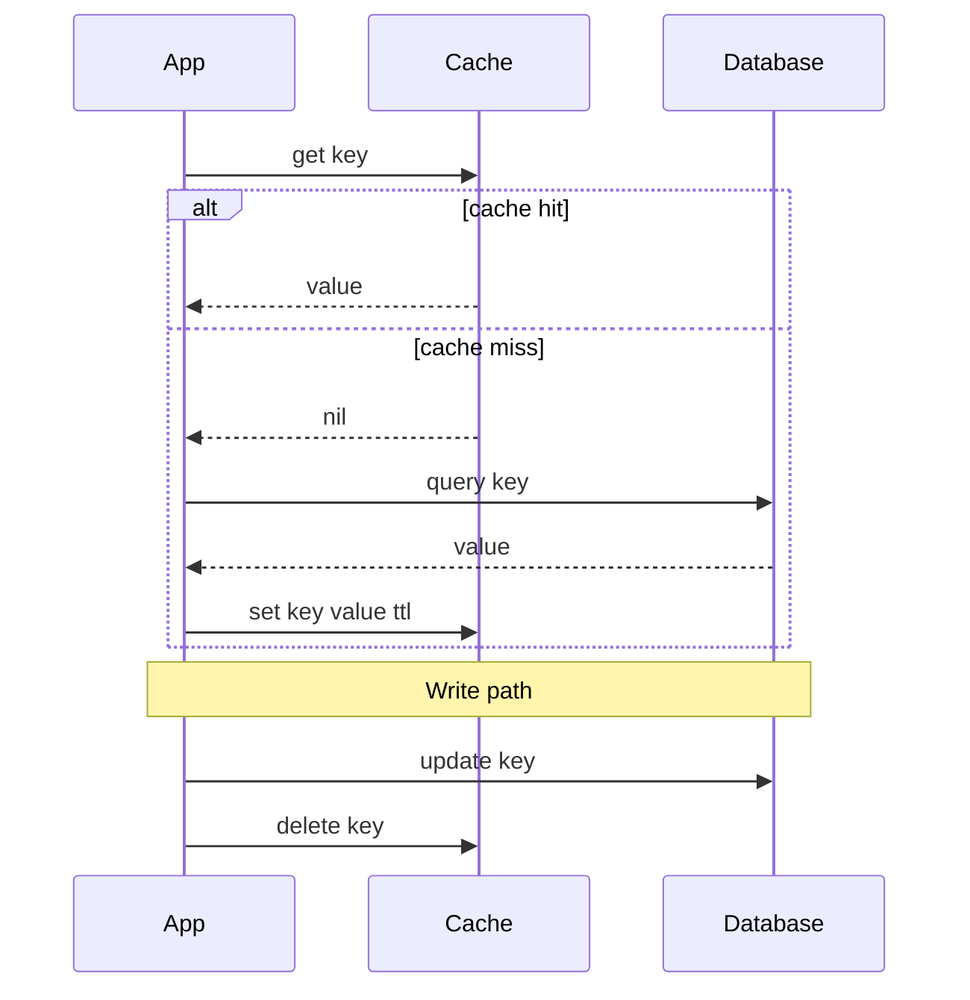

Caching keeps frequently accessed data close to where it's needed so you avoid recomputing or refetching it. Done well, it's the single highest-leverage performance lever in a system; done badly, it's a source of stale data and spectacular outages.

## Where caches live

Caching happens at every layer between the user and the source of truth. Each layer trades a bit of staleness for a large latency win.

```
[Browser cache] → [CDN edge] → [API gateway] → [App-tier cache] → [DB buffer pool] → [Disk]
  ~0 ms            ~10-30 ms     local           ~0.5 ms RAM        in-memory          ~10 ms
```

| Layer | Example | What it caches | Typical latency |
|---|---|---|---|
| Client | Browser HTTP cache, mobile app store | Static assets, API responses | ~0 ms |
| CDN | Cloudflare, Akamai, CloudFront | Images, JS/CSS, cacheable API | 10–30 ms (near user) |
| Application | Redis, Memcached | Query results, sessions, computed views | 0.5–1 ms |
| Local/in-process | Caffeine, Guava, app heap | Hot objects, config | nanoseconds |
| Database | Postgres buffer pool, MySQL InnoDB | Recently read pages | sub-ms (RAM hit) |

The closer to the user, the cheaper and faster the hit — but the harder it is to invalidate. A CDN serving a stale image to millions is much worse than a 1 ms-stale Redis entry.

## Cache hit ratio

The headline metric. `hit_ratio = hits / (hits + misses)`. It determines the effective latency:

```
effective_latency = hit_ratio × cache_latency + (1 - hit_ratio) × source_latency

Example: cache hit = 1 ms, DB = 50 ms
  95% hit ratio → 0.95×1 + 0.05×50 = 3.45 ms
  80% hit ratio → 0.80×1 + 0.20×50 = 10.8 ms
```

Notice the steep cliff: dropping from 95% to 80% triples latency. A cache is only worth its complexity if the hit ratio is high, which requires enough memory and good key locality (the workload must actually reuse keys).

## Read patterns

**Cache-aside (lazy loading)** — the application owns the logic. The most common pattern. On a read the app checks the cache first and populates it on a miss; on a write it updates the DB and invalidates the key so the next read repopulates fresh.



```
read(key):
    val = cache.get(key)
    if val is not None:        # hit
        return val
    val = db.query(key)        # miss
    cache.set(key, val, ttl)   # populate
    return val
```

Pros: only requested data is cached; cache failure isn't fatal (you fall back to the DB). Cons: every miss costs a DB hit, and code must handle population everywhere.

**Read-through** — the cache itself loads from the DB on a miss (the cache library/proxy owns the logic). Simpler app code, but you're coupled to a cache that supports it. Both patterns leave the cache cold initially, so a deploy can cause a miss storm.

## Write patterns

How writes propagate to the cache and the database determines your consistency and durability trade-offs.

| Pattern | Flow | Consistency | Durability | Best for |
|---|---|---|---|---|
| Write-through | Write to cache and DB synchronously | Strong (cache fresh) | High | Read-heavy, needs fresh cache |
| Write-back (write-behind) | Write to cache, flush to DB async | Cache leads DB | Risk: data lost if cache dies before flush | Write-heavy, tolerant of loss |
| Write-around | Write straight to DB, skip cache | Cache may be stale until next read | High | Write-once/read-rarely data |

- **Write-through** keeps the cache always consistent with the DB but adds latency to every write (two writes) and caches data that may never be read.
- **Write-back** is fastest for write bursts and coalesces multiple writes, but a cache crash before the flush loses data — only for data you can afford to lose or with a durable cache.
- **Write-around** avoids polluting the cache with write-heavy data that won't be read soon; the downside is the next read is a guaranteed miss.

## Eviction policies

Caches are bounded; when full, something must go.

- **LRU (Least Recently Used):** evict the entry untouched longest. The sensible default — assumes recent use predicts future use.
- **LFU (Least Frequently Used):** evict the least-accessed entry. Better when popularity is stable, but a once-hot key can linger.
- **FIFO:** evict the oldest inserted, ignoring access. Simple, rarely optimal.
- **TTL (time to live):** every entry expires after a set duration regardless of use — the primary tool for bounding staleness. Often combined with LRU (Redis's `volatile-lru`).

A TTL is your safety net: even if invalidation logic fails, stale data self-heals after the TTL. Pick it to match tolerance — 30 s for a feed, hours for a product catalog.

## Invalidation: the hardest problem

> "There are only two hard things in Computer Science: cache invalidation and naming things." — Phil Karlton

When the source of truth changes, cached copies become stale. Keeping them correct is genuinely hard because the data exists in multiple places at once. Strategies:

- **TTL expiry:** simplest; accept bounded staleness. Always have one as a backstop.
- **Write-through / explicit delete:** on update, write or delete the cache key (`cache.delete(key)`). Delete-on-write (rather than update) is safer — it forces a fresh read and avoids races where two writers leave a wrong value.
- **Event-driven:** publish change events (e.g., via Kafka or a DB change-data-capture stream) so caches invalidate reactively across services.
- **Versioned keys:** embed a version in the key (`user:42:v7`); bumping the version atomically invalidates without deleting.

There is a real race in cache-aside: thread A reads a stale DB value and is about to cache it just as thread B writes a new value and deletes the (empty) key — A then caches the stale value. Delete-after-write plus short TTLs, or techniques like delayed double-delete, mitigate this.

## Classic failure modes

- **Thundering herd / cache stampede:** a hot key expires and thousands of concurrent requests all miss and hit the DB at once, potentially crushing it. Fixes: a **mutex/lock** so only one request recomputes while others wait, **request coalescing** (single-flight), **probabilistic early expiration** (refresh slightly before TTL), or serving stale while one worker refreshes.
- **Cache penetration:** requests for keys that *don't exist* always miss and hammer the DB (often malicious). Fix: cache the negative result (`null` with a short TTL), or front the cache with a **Bloom filter** to reject keys that can't exist.
- **Hot keys:** one key (a celebrity's profile, a viral post) gets so much traffic it saturates a single cache node. Fix: replicate the key across nodes, add a local in-process cache layer, or shard the key with suffixes.
- **Stale data:** the cache disagrees with the source of truth. Bound it with TTLs and explicit invalidation; decide per-dataset how much staleness is acceptable.
- **Cache avalanche:** many keys expire simultaneously (e.g., all set with the same TTL after a bulk load), causing a mass miss. Fix: **jitter** the TTLs (add a random ±10%).

```
Stampede protection (single-flight):
get(key):
    val = cache.get(key)
    if val: return val
    if acquire_lock(key):          # only one wins
        val = db.query(key)
        cache.set(key, val, ttl + jitter())
        release_lock(key)
    else:
        sleep(20ms); return get(key)   # others wait & retry
```

## Distributed caching and consistent hashing

When data exceeds one node's RAM, shard the cache across many nodes. The question is *which node holds which key*. Naive `hash(key) % N` reshuffles nearly every key when N changes (a node added or lost), causing a mass miss storm. **Consistent hashing** maps keys and nodes onto a ring so adding/removing a node only remaps ~1/N of keys. Virtual nodes smooth out the distribution. (See the Load Balancing page for the ring mechanics.)

## Redis vs Memcached

| | Redis | Memcached |
|---|---|---|
| Data structures | Strings, hashes, lists, sets, sorted sets, streams | Strings (blobs) only |
| Persistence | RDB snapshots + AOF log (optional) | None — pure in-memory |
| Replication / HA | Replicas, Sentinel, Cluster mode | None built-in |
| Threading | Mostly single-threaded core (multi-threaded I/O in 6+) | Multi-threaded |
| Eviction | Many policies (LRU, LFU, TTL variants) | LRU |
| Use when | You need rich types, persistence, pub/sub, atomic ops | Simple, huge, pure key-value cache with multi-core scaling |

Redis is the default for most needs — richer features, persistence, clustering, and atomic operations (great for the stampede lock above). Memcached shines as a dead-simple, multi-threaded blob cache where you want maximum throughput per node and don't need durability or data structures.

## Key takeaways

- Cache at every layer (client → CDN → app → DB); closer to the user is faster but harder to invalidate.
- Hit ratio drives effective latency on a steep curve — 95% vs 80% can triple it, so size for locality.
- Choose read pattern (cache-aside is the default) and write pattern (write-through/back/around) by your consistency, durability, and write-load needs.
- Always pair invalidation with a **TTL backstop**; prefer delete-on-write and add jitter to avoid synchronized expiry.
- Design for the classic failures up front: stampede (locks/coalescing), penetration (negative caching/Bloom filter), hot keys (replication), avalanche (TTL jitter).
- Shard large caches with **consistent hashing**; reach for **Redis** when you need data structures/persistence/HA, **Memcached** for a simple multi-threaded blob cache.
