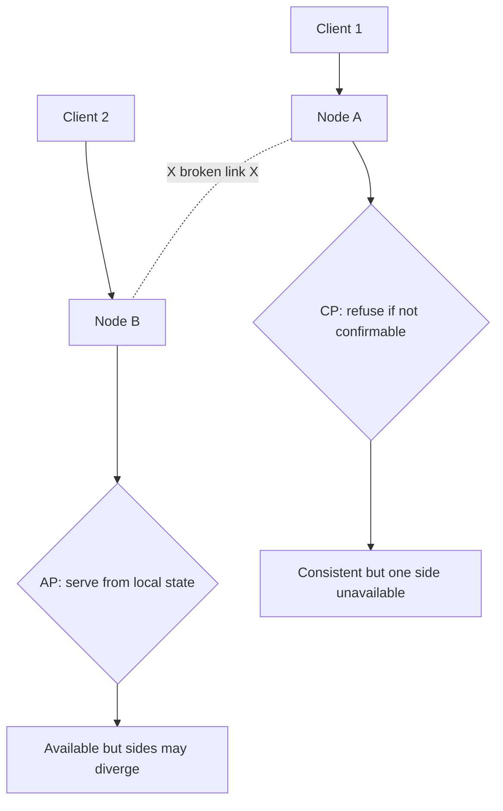

The CAP theorem is the most cited — and most misunderstood — result in distributed systems. It says something narrow but important about what a distributed data store can guarantee when the network between its nodes breaks. PACELC then extends it to the case that matters far more often: when the network is fine.

## The three properties

Proved by Eric Brewer (conjecture) and Gilbert and Lynch (formalization), CAP concerns a distributed data store with data replicated across nodes:

- **Consistency (C):** every read receives the most recent write or an error. All nodes agree on the data — this is *linearizability*, a strong guarantee. (Note: this is **not** the "C" in ACID, which is about transaction invariants.)
- **Availability (A):** every request to a non-failing node receives a non-error response — but not necessarily the most recent data.
- **Partition tolerance (P):** the system keeps operating even when the network drops or delays messages between nodes (a "partition").

The theorem: during a network partition, you can guarantee **at most two** of the three. In practice, since P is forced on you, the real choice is between C and A.

## Why partition tolerance is non-negotiable

The classic "pick 2 of 3" framing misleads people into thinking you might choose CA and drop P. You can't — not in a real distributed system.

Networks are unreliable. Packets get lost, switches fail, cables get cut, GC pauses and overloaded nodes look like network failures. If your data lives on more than one machine, partitions *will* happen. A system that gives up partition tolerance simply stops working (or corrupts data) the moment the network hiccups — that's not a design option for anything that must stay up.

So **P is mandatory**. CAP becomes a binary choice you make *for the duration of a partition*: stay **Consistent** (refuse requests you can't safely serve) or stay **Available** (serve possibly-stale data).

A single-node database is the only true "CA" system — and only because it isn't distributed, so partitions between replicas can't occur. It trades partition tolerance for not being distributed at all.

## CP vs AP during a partition



When the link between Node A and Node B breaks, each side faces the same dilemma. A **CP** system refuses operations it can't confirm against the other side — staying correct at the cost of availability on the minority side. An **AP** system keeps answering from local state — staying up at the cost of letting the two sides temporarily diverge.

**CP (Consistency over Availability):** when a partition happens, the system rejects operations that can't guarantee the latest data rather than risk returning stale or conflicting values. The minority side becomes unavailable. Choose this when correctness is non-negotiable — financial ledgers, inventory counts, leader election, configuration.

- **ZooKeeper / etcd:** coordination stores; a minority partition can't reach quorum and stops serving writes to stay consistent.
- **HBase:** a region is served by exactly one region server; if it's unreachable, that data is unavailable until reassigned.
- **MongoDB (majority writes):** with `writeConcern: majority`, writes need a majority of replicas; the minority side can't accept writes.

**AP (Availability over Consistency):** every node keeps answering from its local replica during a partition, accepting that replicas may temporarily disagree, then reconciling later (eventual consistency). Choose this when uptime and low latency beat strict freshness — shopping carts, social feeds, telemetry, DNS.

- **Cassandra:** every node can serve reads/writes; conflicts resolved by last-write-wins timestamps and read repair.
- **DynamoDB:** highly available by default; offers eventually consistent reads (and optional strongly consistent reads when you ask).
- **Riak, Voldemort:** Dynamo-style stores built for availability.

## The common misunderstanding

CAP describes behavior **only during a partition**. When the network is healthy (which is almost always), a system can provide *both* strong consistency and high availability — CAP says nothing about the normal case.

So "Cassandra is AP" doesn't mean Cassandra is always inconsistent. It means *if a partition occurs*, Cassandra chooses to stay available and may serve stale data. Likewise a "CP" system isn't unavailable in normal operation — only the partitioned minority is, and only while the partition lasts. The classification is about the **choice made under failure**, not steady-state behavior.

## PACELC: the part that matters daily

CAP ignores the common case, so Daniel Abadi proposed **PACELC** to complete it:

> **If** there is a **P**artition, trade off **A**vailability vs **C**onsistency; **E**lse (normal operation), trade off **L**atency vs **C**onsistency.

The insight: even with no partition, keeping replicas strongly consistent costs latency. To guarantee a read sees the latest write, you must coordinate across replicas (wait for a quorum, talk to a leader, run consensus) — and that round trip adds milliseconds, more across regions. If you relax consistency, you can answer from the nearest replica immediately.

```
PACELC = P → (A or C)  ELSE  (L or C)

EL/C  : choose consistency even at latency cost
EL/L  : choose low latency, accept weaker consistency
```

This is the trade-off you actually live with every day, since partitions are rare but every single request pays the latency-vs-consistency cost.

## Systems by CAP and PACELC

| System | CAP (partition) | PACELC | Notes |
|---|---|---|---|
| ZooKeeper / etcd | CP | PC/EL | Consistent under partition; favors latency when healthy |
| HBase | CP | PC/EC | Strong consistency throughout |
| MongoDB (majority) | CP | PC/EC | Tunable; default leans consistent |
| Spanner / CockroachDB | CP | PC/EC | TrueTime/Raft give global strong consistency at latency cost |
| Cassandra | AP | PA/EL | Tunable; default favors availability + low latency |
| DynamoDB | AP | PA/EL | Eventually consistent default; strong reads optional |
| Riak | AP | PA/EL | Dynamo-style, highly available |
| Single-node RDBMS | CA* | — | Not distributed, so no real partitions |

\*"CA" only because it isn't distributed.

## Tunable consistency

Many stores don't force a global choice — you tune it per operation. Dynamo-style quorums let you set **N** (replicas), **W** (replicas that must ack a write), and **R** (replicas that must respond to a read):

```
Strong consistency when:  R + W > N

N=3, W=2, R=2  → R+W=4 > 3  → strong (read sees latest write)
N=3, W=1, R=1  → R+W=2 < 3  → fast but eventually consistent
N=3, W=3, R=1  → fast reads, slow/less-available writes
```

Cassandra exposes this as consistency levels (`ONE`, `QUORUM`, `ALL`) per query; DynamoDB offers eventually vs strongly consistent reads. This lets one cluster be AP for a low-stakes feed and effectively CP for a critical write — you choose where each operation sits on the spectrum.

## Where this shows up in design decisions

- **Money and inventory → lean CP.** A double-spend or overselling is worse than a brief error. Use strong consistency, quorum writes, or a single-leader DB.
- **Feeds, carts, likes, presence → lean AP.** A slightly stale like count is fine; an unavailable cart loses sales. Favor availability and eventual consistency.
- **Coordination/config/locks → CP, always.** Leader election and service discovery must never disagree; that's why etcd and ZooKeeper are CP.
- **Multi-region reads → PACELC's "else" dominates.** Cross-region quorums add 75–150 ms per op. Decide whether each path needs strong consistency or can read a nearby replica.
- **Mix per-operation.** Real systems aren't purely CP or AP — use tunable consistency so each request gets exactly the guarantee it needs.

Interviewers love asking "is this CP or AP?" The strong answer names the property you're protecting (correctness vs uptime), states what happens *during a partition*, and then mentions the *normal-case* latency cost via PACELC.

## Key takeaways

- CAP: during a network **partition** you can keep at most two of Consistency, Availability, Partition tolerance — and P is mandatory for any distributed store, so the real choice is **C vs A**.
- CAP is about behavior **during a partition only**; healthy systems can be both consistent and available. "AP" means *stale-but-up under failure*, not always inconsistent.
- **CP** examples (ZooKeeper, etcd, HBase, MongoDB-majority, Spanner) protect correctness; **AP** examples (Cassandra, DynamoDB, Riak) protect uptime.
- **PACELC** adds the everyday trade-off: even without a partition, strong consistency costs **latency** (Else: L vs C) — the cost you pay on every request.
- **Tunable consistency** (quorum `R + W > N`, Cassandra levels, DynamoDB read modes) lets a single system pick its guarantee per operation.
- Match the choice to the data: money/inventory/coordination → CP; feeds/carts/telemetry → AP; multi-region designs are dominated by the latency-vs-consistency dimension.
