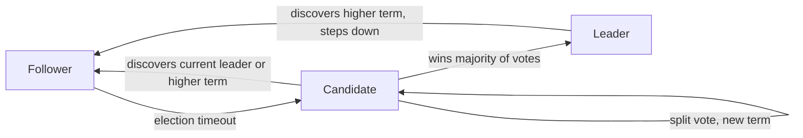
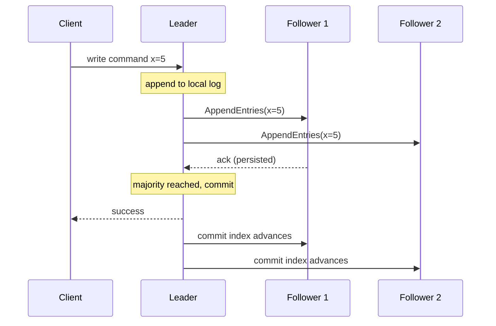

Consensus is the problem of getting a group of unreliable, independently failing machines to agree on a single value or an ordered sequence of values — and to keep agreeing even when some of them crash or messages are delayed. It underpins leader election, replicated state machines, distributed locks, and strongly consistent databases.

## The consensus problem

Formally, a consensus protocol must satisfy three properties:

- **Agreement** — no two correct nodes decide different values.
- **Validity** (integrity) — the decided value was actually proposed by some node.
- **Termination** — every correct node eventually decides.

The challenge is doing this over an **asynchronous network** with crashes: messages can be arbitrarily delayed, reordered, or lost, and you cannot reliably tell a crashed node from a slow one. Consensus lets you build a **replicated state machine**: if every replica applies the same commands in the same order, they all reach identical state. That ordered command sequence is exactly what a consensus log provides.

## Quorums and majorities

Most consensus systems require a **quorum** — a majority of nodes — to agree before committing. With `N` nodes, a majority quorum is `floor(N/2) + 1`. The key property: any two majority quorums **overlap** in at least one node, so a new decision can always "see" the previous one, which prevents divergence.

This is why you run an **odd number** of nodes. Compare:

| Nodes | Quorum | Failures tolerated |
|-------|--------|--------------------|
| 3 | 2 | 1 |
| 4 | 3 | 1 |
| 5 | 3 | 2 |
| 6 | 4 | 2 |

Going from 3 to 4 nodes does **not** improve fault tolerance (still tolerates 1 failure) but increases the quorum size and write latency. Odd counts give the best resilience per node, so production clusters are almost always 3, 5, or 7.

## Paxos, briefly

**Paxos** (Lamport, published 1998) was the first proven-correct consensus algorithm. It runs in two phases: a **prepare/promise** phase where a proposer picks a ballot number and asks acceptors to promise not to accept lower-numbered proposals (and to report any value they have already accepted), and an **accept** phase where it asks them to accept its value. A majority of acceptors accepting means the value is chosen. Paxos is correct but notoriously hard to understand and to extend into a continuous *log* of values (Multi-Paxos). Its reputation for opacity is precisely what motivated Raft.

## Raft

**Raft** was designed for understandability while being equivalent in power and fault tolerance to Multi-Paxos. It decomposes consensus into three subproblems: **leader election**, **log replication**, and **safety**.

### Terms and roles

Time is divided into **terms** — monotonically increasing integers acting as a logical clock. Each node is in one of three states:



- **Follower** — passive; responds to leaders and candidates, never initiates.
- **Candidate** — seeks votes to become leader.
- **Leader** — handles all client writes and replicates them; sends periodic heartbeats.

### Leader election

A follower that hears no heartbeat within a randomized **election timeout** (typically 150–300 ms) becomes a candidate, increments the term, votes for itself, and requests votes from peers. Each node grants at most one vote per term. A candidate that collects a majority becomes leader and immediately starts heartbeating. **Randomized timeouts** make simultaneous candidacies (split votes) rare; if a split happens, those terms expire and a fresh election starts, usually resolving within a round or two.

### Log replication and commit

Clients send commands to the leader, which appends each to its log and replicates it via `AppendEntries`. Once a **majority** of nodes have persisted an entry, the leader marks it **committed**, applies it to its state machine, and tells followers to apply it too. Safety rests on the **election restriction**: a candidate can only win if its log is at least as up-to-date as the voter's, so any future leader is guaranteed to already hold every committed entry. This is what keeps the committed log from ever diverging.



## Split-brain and fencing tokens

A **split-brain** occurs when a network partition leaves two nodes each believing they are leader. Quorums prevent two leaders from both *committing* — only one side can hold a majority — but a paused or partitioned old leader might still try to act on stale authority. The defense is a **fencing token**: a monotonically increasing number issued with leadership (Raft's term serves this role). Downstream resources (a storage service, a lock manager) reject any request carrying a token lower than the highest they have already seen, so a stale leader's writes are fenced off.

```
Lock service issues token 33 -> Client A (then A pauses)
Lock expires, issues token 34 -> Client B writes (token 34 accepted)
Client A wakes, writes with token 33 -> REJECTED (33 < 34)
```

## FLP impossibility (intuition)

The **FLP result** (Fischer, Lynch, Paterson, 1985) proves that in a fully asynchronous system, no deterministic consensus protocol can guarantee termination if even one node may crash — because you can never distinguish a crashed node from an infinitely slow one. Real systems sidestep this with **timeouts and randomization**: they relax the pure-asynchrony assumption to *partial synchrony*, sacrificing guaranteed termination in pathological cases (an election could in theory retry forever) to keep agreement and validity always safe. In practice, randomized timeouts make non-termination vanishingly unlikely. The lesson: consensus is always **safe** but only **eventually live** under partial synchrony.

## Coordination services

Rather than embed Raft/Paxos in every application, teams delegate coordination to a hardened, off-the-shelf service:

| Service | Algorithm | Common uses | Ecosystem |
|---------|-----------|-------------|-----------|
| ZooKeeper | ZAB (Paxos-like) | Leader election, config, locks | Kafka (legacy), Hadoop, HBase |
| etcd | Raft | Config, service discovery, locks | Kubernetes (its datastore) |
| Consul | Raft | Service discovery, health, KV, DNS | HashiCorp stack |

These provide a small, strongly consistent, hierarchical key-value store with primitives like watches and ephemeral nodes. Typical jobs:

- **Leader election** — contend to create an ephemeral node; whoever wins is leader, and the node disappears automatically if that process dies.
- **Configuration management** — a single source of truth that clients watch for live changes.
- **Service discovery** — services register themselves; clients look up healthy instances.
- **Distributed locks** — coordinate exclusive access, ideally guarded with fencing tokens.

Keep these clusters small (3 or 5 nodes) and do not put high-throughput data in them — they are for coordination metadata, not bulk storage. (Note: newer Kafka uses its own Raft-based KRaft mode instead of ZooKeeper.)

## Key takeaways

- Consensus delivers agreement, validity, and termination over crash-prone, asynchronous networks, enabling replicated state machines.
- Quorums (majorities) overlap to prevent divergence; run odd node counts (3/5/7) since even counts add latency without more fault tolerance.
- Raft is the understandable workhorse: randomized election timeouts elect one leader per term, and entries commit once a majority persists them.
- Quorums stop two leaders from both committing; fencing tokens neutralize a stale leader's lingering writes.
- FLP proves async consensus cannot guarantee both safety and termination, so real systems use timeouts to stay safe and almost always live.
- Use ZooKeeper, etcd, or Consul for leader election, config, service discovery, and locks instead of rolling your own consensus.
