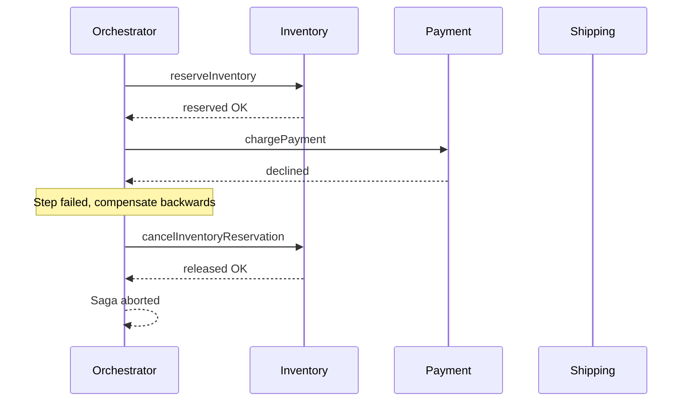

A consistency model is the contract a data system offers about *what a read can observe* relative to prior writes. Picking the right point on the spectrum — and the right mechanism for writing across services — is one of the highest-leverage decisions in distributed system design, because it directly trades correctness guarantees against latency and availability.

## The consistency spectrum

Models range from the strictest (behaves like a single machine) to the loosest (converges eventually):

- **Linearizable (strong)**: every operation appears to take effect instantaneously at some point between its invocation and completion, and once a write is acknowledged, *all* subsequent reads see it. It is the gold standard — and the most expensive, requiring coordination (consensus) that costs latency and limits availability during partitions (the CP corner of CAP).
- **Sequential**: all clients see operations in *some* single global order, but that order need not match real time. Weaker than linearizable, rarely the exact target in practice.
- **Causal**: operations that are causally related (a reply after a post) are seen in order by everyone; concurrent, unrelated operations may be seen in different orders. The strongest model still achievable while remaining available under partitions — a sweet spot for collaborative and social systems.
- **Read-your-writes**: a client always sees its own prior writes (even if others lag). Often implemented by routing a user's reads to the primary or to a replica known to have their writes. Critical for UX: you should see your own comment immediately after posting it.
- **Eventual**: if writes stop, all replicas eventually converge to the same value. Cheapest and most available, but a read may return stale data for some window. Backs Amazon DynamoDB (default), Cassandra, and DNS.

```
strong ─────────────────────────────────► weak
linearizable > sequential > causal > read-your-writes > eventual
   (most coordination, least available)   (least coordination, most available)
```

| Model | Sees latest write? | Coordination cost | Available under partition? | Example |
|---|---|---|---|---|
| Linearizable | Always | High (consensus) | No | etcd, Spanner, ZooKeeper |
| Causal | Causally-related only | Medium | Yes | MongoDB causal sessions |
| Read-your-writes | Your own writes | Low–medium | Yes | Session-routed replicas |
| Eventual | Eventually | Low | Yes | Dynamo, Cassandra, DNS |

## ACID isolation levels

Within a single database, transactions provide ACID guarantees; **isolation** specifically governs how concurrent transactions interfere. Weaker isolation permits certain anomalies in exchange for more concurrency:

| Isolation level | Dirty read | Non-repeatable read | Phantom | Write skew |
|---|---|---|---|---|
| Read committed | No | Possible | Possible | Possible |
| Repeatable read / Snapshot | No | No | Possible* | Possible |
| Serializable | No | No | No | No |

- **Dirty read**: reading another transaction's uncommitted change.
- **Non-repeatable read**: re-reading a row returns a different value because another transaction committed in between.
- **Phantom**: a re-run query returns new rows that matched after a concurrent insert.
- **Write skew**: two transactions each read an overlapping set, then make disjoint writes that together violate an invariant (e.g. both on-call doctors leave a shift at once) — snapshot isolation does *not* prevent this.

PostgreSQL and MySQL default to **Read committed** and **Repeatable read** respectively. Snapshot isolation (MVCC) gives each transaction a consistent point-in-time view without read locks. **Serializable** is the only level that guarantees transactions behave as if run one at a time — via strict two-phase locking or Serializable Snapshot Isolation — at the cost of more aborts and contention.

## Distributed transactions

When a single logical operation must atomically update *multiple* databases or services, a local ACID transaction no longer suffices.

### Two-phase commit (2PC)

A coordinator drives an all-or-nothing commit across participants in two rounds:

```
Phase 1 (prepare):  coordinator -> all: "PREPARE"
                    each participant locks rows, writes to log, replies VOTE-YES/NO
Phase 2 (commit):   if all YES -> coordinator: "COMMIT" to all
                    if any NO  -> coordinator: "ABORT" to all
```

2PC gives atomicity, but it has a fatal flaw: it is **blocking**. After voting YES, a participant must hold its locks and wait. If the coordinator crashes between phases, participants are stuck — they cannot unilaterally commit or abort, so resources stay locked until it recovers. This couples availability to the slowest/least-reliable participant and the coordinator, which is why 2PC is avoided in high-scale, loosely-coupled microservice architectures (though it lives on in XA and in tightly-coupled systems like distributed databases).

### Saga pattern

A Saga replaces one distributed transaction with a sequence of **local** transactions, each in its own service, plus a **compensating transaction** to undo each step if a later one fails. It gives up atomicity and isolation for availability — the system passes through intermediate states that others can observe.

```
Order saga (happy path):
  reserveInventory -> chargePayment -> scheduleShipping
On failure of chargePayment, compensate backwards:
  cancelInventoryReservation  (undo step 1)
```



Two coordination styles:

- **Choreography**: each service emits events and reacts to others' events; no central brain. Simple for short flows, but logic is smeared across services and hard to follow as it grows.
- **Orchestration**: a central orchestrator explicitly invokes each step and triggers compensations. Easier to reason about, monitor, and modify; the orchestrator is a component you must build and operate (e.g. Temporal, AWS Step Functions, Netflix Conductor).

Compensations must be *semantic* undos — you cannot un-charge a card by deleting a row; you issue a refund. Design for the fact that "undo" is itself a real business action.

## Reliable cross-service writes

### Outbox pattern

A classic bug: a service commits to its database, then publishes an event to Kafka — but crashes in between, so the event is lost (or the publish succeeds and the DB commit rolls back, creating a phantom event). This is the dual-write problem. The **transactional outbox** fixes it: write the event into an `outbox` table *in the same local transaction* as the business change. A separate relay process (often via Change Data Capture, e.g. Debezium reading the DB log) reads the outbox and publishes to the broker. Now the business write and the intent-to-publish commit atomically.

### Idempotency keys

Sagas, retries, and at-least-once message delivery all mean an operation may be executed more than once. **Idempotency** makes a repeat harmless. The client sends a unique `Idempotency-Key`; the server records it and the result on first execution, and on any retry with the same key returns the stored result instead of re-running.

```sql
-- atomic: only the first request with this key inserts and proceeds
INSERT INTO processed_requests (idempotency_key, status)
VALUES ('req-abc-123', 'in_progress')
ON CONFLICT (idempotency_key) DO NOTHING;
-- 0 rows affected => already seen => return prior response
```

Stripe and most payment APIs require idempotency keys for exactly this reason — a network timeout must never cause a double charge.

### Tunable / quorum consistency

Dynamo-style stores (Cassandra, DynamoDB) let you dial consistency per request via quorums: with `N` replicas, requiring `W` acks on write and `R` on read, you get strong-ish consistency when `W + R > N` (read and write sets overlap), or lower latency and higher availability when they do not. This per-operation tuning — covered in the replication chapter — lets one cluster serve both strict and lax workloads.

## Key takeaways

- Consistency is a spectrum from linearizable (correct, coordination-heavy, less available) to eventual (available, possibly stale); causal and read-your-writes are practical middle grounds.
- Isolation levels trade anomalies for concurrency; snapshot isolation still allows write skew, so reach for serializable when invariants span rows.
- 2PC provides cross-service atomicity but blocks on coordinator failure, making it a poor fit for large microservice systems.
- Sagas trade atomicity for availability using local transactions plus semantic compensating actions; prefer orchestration when flows get complex.
- Use the transactional outbox (with CDC) to avoid the dual-write problem, and idempotency keys to make retries and at-least-once delivery safe.
- Match the mechanism to the requirement: not every write needs a distributed transaction, and not every read needs strong consistency.
