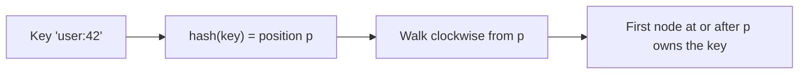
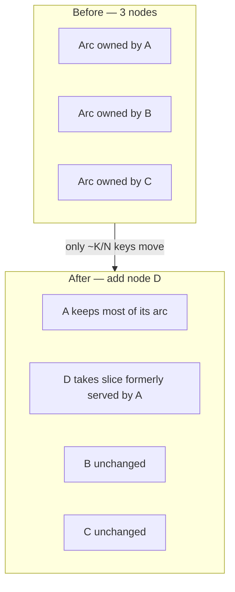

Consistent hashing is a technique for distributing keys across a changing set of nodes so that adding or removing a node moves only a small fraction of keys instead of nearly all of them. It is the quiet engine behind distributed caches, sharded databases, and many load balancers, and it shows up constantly in system design interviews.

## The problem with mod-N hashing

The obvious way to assign a key to one of N servers is:

```
server_index = hash(key) % N
```

This is balanced and fast — until N changes. Suppose you cache across 4 servers and add a 5th. Now the formula becomes `% 5`, and almost every key maps somewhere new:

```
hash(key)=100:  100 % 4 = 0   →   100 % 5 = 0   (stayed)
hash(key)=101:  101 % 4 = 1   →   101 % 5 = 1   (stayed)
hash(key)=102:  102 % 4 = 2   →   102 % 5 = 2   (stayed)
hash(key)=103:  103 % 4 = 3   →   103 % 5 = 3   (stayed)
hash(key)=104:  104 % 4 = 0   →   104 % 5 = 4   (MOVED)
```

In general, going from N to N+1 servers remaps roughly **N/(N+1)** of all keys — about 80% when growing from 4 to 5. For a cache that means a near-total **cache stampede**: almost every lookup misses and hammers the backing database at once. For a sharded store it means shuffling almost the entire dataset across the network. Mod-N is simply unusable when membership changes.

## The hash ring

Consistent hashing fixes this by mapping both keys *and* nodes onto the same circular hash space — imagine the output of the hash function (say 0 to 2³²−1) bent into a ring where the largest value wraps around to 0.

```
                 0 / 2^32
                    │
          NodeC ●   │   ● NodeA
              ╲     │     ╱
               ╲    │    ╱
        ────────●───┼───────────  ring
               ╱    │    ╲
              ╱     │     ╲
          k2 ○      │      ○ k1
                    │
                  NodeB ●

   key → walk clockwise → first node encountered owns it
```

Each node is hashed (e.g., `hash("10.0.0.7:6379")`) to a point on the ring. Each key is hashed to a point too. To find which node owns a key, you start at the key's position and walk **clockwise** until you hit the first node — that node is responsible for the key. Each node thus owns the arc of the ring between itself and its predecessor.

The lookup itself is a simple pipeline: hash the key, then find the first node clockwise.



## How lookups work

In practice the ring is stored as a sorted structure of node hash positions, and a lookup is a binary search for the first position ≥ the key's hash (wrapping to the first node if none is larger).

```python
import bisect, hashlib

class HashRing:
    def __init__(self, nodes, vnodes=150):
        self.vnodes = vnodes
        self.ring = {}          # position -> node
        self.sorted_keys = []   # sorted positions
        for n in nodes:
            self.add(n)

    def _hash(self, key):
        return int(hashlib.md5(key.encode()).hexdigest(), 16)

    def add(self, node):
        for i in range(self.vnodes):           # many virtual points per node
            pos = self._hash(f"{node}#{i}")
            self.ring[pos] = node
            bisect.insort(self.sorted_keys, pos)

    def remove(self, node):
        for i in range(self.vnodes):
            pos = self._hash(f"{node}#{i}")
            del self.ring[pos]
            self.sorted_keys.remove(pos)

    def get(self, key):
        if not self.ring:
            return None
        h = self._hash(key)
        idx = bisect.bisect(self.sorted_keys, h)   # first node clockwise
        if idx == len(self.sorted_keys):           # wrap around
            idx = 0
        return self.ring[self.sorted_keys[idx]]
```

Lookup is O(log V) where V is the number of points on the ring.

## Adding and removing nodes: only K/N keys move

The whole payoff: when a node joins or leaves, only the keys in *its* arc are affected. When a new node D lands between B and A, it claims just the slice of A's old arc that now falls behind it — every other key stays exactly where it was.



- **Adding a node** D: D hashes to some point on the ring and takes over only the arc between it and its predecessor. The keys that move are exactly those that previously belonged to D's clockwise neighbor in that arc — on average **K/N keys** for K keys and N nodes. Every other key stays put.
- **Removing a node** (or a node crashing): its arc is absorbed by the next node clockwise. Again only that node's keys move; the rest are untouched.

So scaling from 100 to 101 nodes relocates ~1% of keys instead of ~99%. That is the difference between a smooth rolling change and an outage.

## Virtual nodes for balance

A naive ring with one point per node distributes load poorly: with few nodes, the random arcs vary wildly in size, so some nodes own 2–3× more keys than others. And when a node dies, *all* its load dumps onto a single successor.

The fix is **virtual nodes (vnodes)**: each physical node is hashed to many points on the ring (commonly 100–256, sometimes more). Now each physical node owns many small scattered arcs instead of one big one. Benefits:

- **Smoother distribution.** With ~150 vnodes per node, load variance drops to a few percent.
- **Graceful failure.** A dead node's many arcs are absorbed by many different successors, spreading the extra load instead of crushing one neighbor.
- **Heterogeneous capacity.** Give a beefier machine more vnodes so it gets proportionally more keys.

| Approach | Distribution evenness | Failure load spread | Lookup cost |
|----------|----------------------|---------------------|-------------|
| mod-N | Even (until resize) | N/A — mass remap | O(1) |
| Ring, 1 point/node | Poor (high variance) | All onto one successor | O(log N) |
| Ring + vnodes | Good (low variance) | Spread across many nodes | O(log V) |

## Replication on the ring

Consistent hashing also makes replication natural. To keep N replicas of a key, store it on the node that owns it *plus the next N−1 distinct physical nodes clockwise* around the ring — Dynamo calls this the key's **preference list**. Skipping vnodes that map back to a physical node already chosen ensures the replicas land on distinct machines (and ideally distinct racks/AZs). When a node fails, its keys are already replicated on the following nodes, so reads continue seamlessly.

## Where it is used in the real world

- **Apache Cassandra** and **ScyllaDB** place rows on a token ring; vnodes are configured via `num_tokens`.
- **Amazon DynamoDB** descends directly from the Dynamo paper's consistent-hashing-plus-preference-list design.
- **Memcached clients** (ketama/libketama, and the same in mcrouter and many Redis client libraries) use consistent hashing so a downed cache server invalidates only its own slice, not the whole cache.
- **Load balancers and proxies** — Envoy's and HAProxy's `ring_hash`/consistent-hash policies pin a client or session to the same backend across membership changes (useful for sticky sessions and cache affinity).
- **CDNs** route URLs to edge cache nodes via consistent hashing.

A common interview nuance: Redis Cluster does *not* use a ring — it uses 16384 fixed hash slots, which is a related "fixed partition count" idea that achieves the same goal of avoiding mass remaps.

## Key takeaways

- Mod-N hashing remaps ~N/(N+1) of all keys when the cluster resizes, causing cache stampedes and giant data shuffles.
- Consistent hashing maps keys and nodes onto a ring; a key is owned by the first node clockwise from it.
- Adding or removing a node moves only ~K/N keys — the rest stay exactly where they were.
- Virtual nodes (often 100–256 per node) smooth out load imbalance and spread a failed node's keys across many successors.
- Replication uses a preference list: the owning node plus the next N−1 distinct physical nodes clockwise.
- It powers Cassandra, DynamoDB, Memcached clients, and consistent-hash load balancers; Redis Cluster uses the cousin approach of fixed hash slots.
