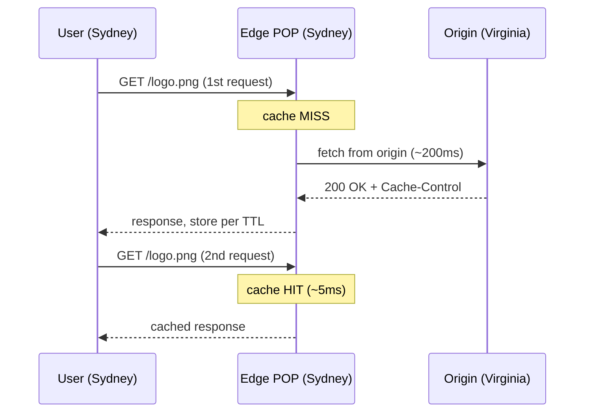
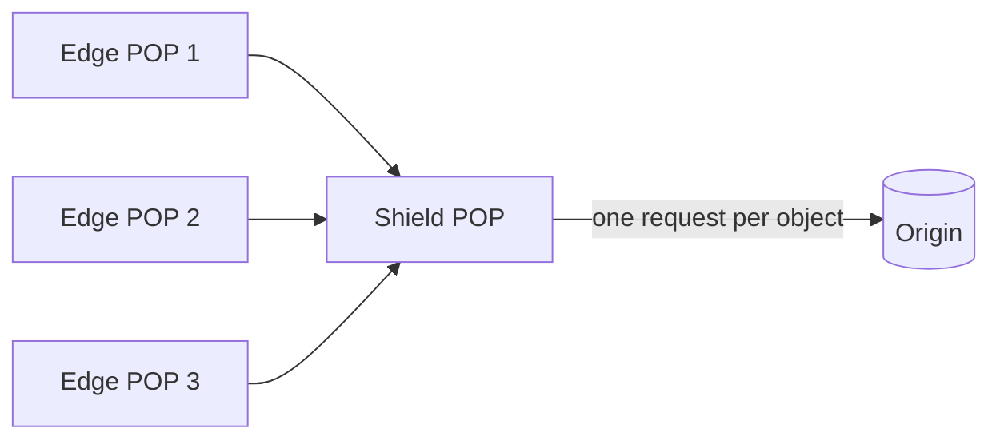

A Content Delivery Network is a globally distributed fleet of caching servers that sit between users and your origin servers. By serving content from a location physically close to the user, a CDN cuts latency, offloads traffic from your origin, and absorbs spikes and attacks.

## What a CDN is and why it matters

The dominant cost in fetching a web asset is often not bandwidth but round-trip time (RTT). Light in glass fiber travels roughly 200 km per millisecond (about two-thirds of light speed in vacuum), and real networks add routing, congestion, and queuing overhead. A user in Sydney hitting an origin in Virginia pays on the order of ~200 ms RTT per round trip; TCP and TLS handshakes each add round trips before the first byte of data arrives. A CDN places **Points of Presence (POPs)** — clusters of edge servers — in hundreds of cities worldwide, so the Sydney user now talks to a Sydney edge with single-digit-millisecond RTT.

Benefits:

- **Latency** — content served from the nearest POP, and handshakes terminate at the edge.
- **Origin offload** — a 95% cache hit ratio means your origin handles roughly 1/20th of the traffic.
- **Resilience** — edges absorb DDoS volume and flash crowds before they reach origin.
- **Bandwidth cost** — edge egress is often cheaper than origin egress, and cached/compressed responses reduce transfer.



## Push vs pull CDNs

There are two ways content gets onto the edge:

- **Pull CDN (origin pull)** — the edge fetches from origin lazily on the first request (a cache miss), caches it per TTL, and serves subsequent requests from cache. You change nothing on origin except cache headers. The first user *per POP* pays the miss penalty. Best for large catalogs where most content is rarely accessed. This is the default mode for Cloudflare, CloudFront, and Fastly.
- **Push CDN** — you proactively upload assets to the CDN (or it ingests on publish). The edge always has the content; no cold-miss penalty. You manage what is stored and when it expires. Best for predictable, high-value assets like a software release or a video VOD library.

| Aspect | Pull | Push |
|--------|------|------|
| Setup | Minimal (set headers) | You upload/sync content |
| First request | Slow (cache miss) | Fast (pre-warmed) |
| Storage control | CDN-managed, TTL-driven | You control |
| Best for | Large/long-tail catalogs | Few large, popular files |

## Caching static assets and cache headers

CDNs key the cache on the request URL (and optionally query string and any headers named in `Vary`). Caching behavior is driven by HTTP headers from the origin:

```http
Cache-Control: public, max-age=31536000, immutable   # 1 year, never revalidate
ETag: "a1b2c3d4"
Last-Modified: Wed, 24 Jun 2026 10:00:00 GMT
```

- **`Cache-Control: max-age`** — how long (seconds) the response is fresh. `s-maxage` overrides `max-age` specifically for shared caches like CDNs.
- **`public` vs `private`** — `private` (e.g., per-user pages) must not be stored by the CDN, only by the browser.
- **`no-store`** — never cache anywhere (sensitive data).
- **TTL expiry** — once freshness elapses, the edge revalidates with origin rather than blindly refetching.
- **ETag / Last-Modified** — on revalidation the edge sends `If-None-Match` / `If-Modified-Since`; the origin replies `304 Not Modified` with no body, saving bandwidth while confirming freshness.

The standard pattern for static assets is **content hashing in the filename** (`app.a1b2c3.js`) with a one-year `immutable` TTL. When the file changes, the hash changes, so the URL changes — new URL, fresh fetch, no invalidation needed.

## Cache invalidation and purging

When you must update a cached resource before its TTL expires, you **purge**. Options:

- **Purge by URL** — invalidate a specific path. Fast and surgical.
- **Purge by tag / surrogate key** — Fastly and Cloudflare let you tag responses (`Surrogate-Key: product-42`) and purge everything carrying that tag in one call — ideal for invalidating every page that shows a given product.
- **Purge everything** — flushes the whole cache; expensive (origin gets hammered as every POP re-misses) and rarely needed.

Fastly is known for near-instant (sub-second) global purges; many others take seconds to minutes. Cache invalidation is famously hard — prefer versioned/hashed URLs over purging wherever possible.

## Dynamic content acceleration and edge compute

CDNs are not only for static files. **Dynamic content acceleration** keeps a warm, optimized connection from the edge to the origin (reused TCP/TLS, congestion-tuned routes over the CDN's private backbone), shaving latency even for uncacheable responses.

**Edge compute** runs your code at the POP: Cloudflare Workers, Fastly Compute, AWS Lambda@Edge / CloudFront Functions. Use cases: A/B testing, auth checks, request rewriting, personalization, and assembling responses from cached fragments — all without a round trip to origin.

## Origin shielding

In a plain pull CDN, every POP that has a miss independently calls the origin. With hundreds of POPs, a popular-but-just-expired object can trigger many simultaneous origin fetches (a thundering herd). **Origin shielding** designates one POP as a mid-tier cache that all other edges funnel their misses through, so the origin sees at most one request per object. This sharply reduces origin load and lifts the effective hit ratio.



## Signed URLs and security

To serve private content (paid video, user uploads) through a public CDN, use **signed URLs** or **signed cookies**: a time-limited, cryptographically signed token in the URL or cookie. The edge validates the signature and expiry before serving and never exposes the origin. CloudFront and Cloudflare both support this. CDNs also provide TLS termination, WAF rules, bot mitigation, and DDoS absorption at the edge.

## Real providers compared

| Provider | Strengths | Notes |
|----------|-----------|-------|
| Cloudflare | Huge anycast network, free tier, Workers, strong security/WAF | Easy DNS integration |
| Akamai | Largest legacy footprint, enterprise media delivery | Mature, complex, premium pricing |
| AWS CloudFront | Deep AWS integration (S3, Lambda@Edge) | Convenient if already on AWS |
| Fastly | Instant purge, VCL/Compute, real-time logs | Developer favorite for dynamic/edge logic |

## Key takeaways

- A CDN serves content from edge POPs near users, cutting RTT from hundreds of milliseconds to single digits and offloading the origin.
- Pull CDNs fetch lazily on first miss (default, easy); push CDNs pre-load content (no cold miss, more management).
- Control caching with `Cache-Control`/`max-age`/`s-maxage`, validate with ETag/Last-Modified, and prefer hashed/versioned URLs over manual purges.
- Invalidate precisely with URL or surrogate-key purges; "purge everything" is a last resort.
- Edge compute, dynamic acceleration, and origin shielding extend CDNs beyond static files and protect the origin from thundering herds.
- Use signed URLs for private content; CDNs also deliver TLS, WAF, and DDoS protection at the edge.
