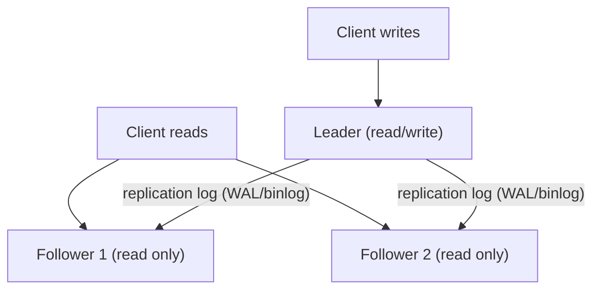
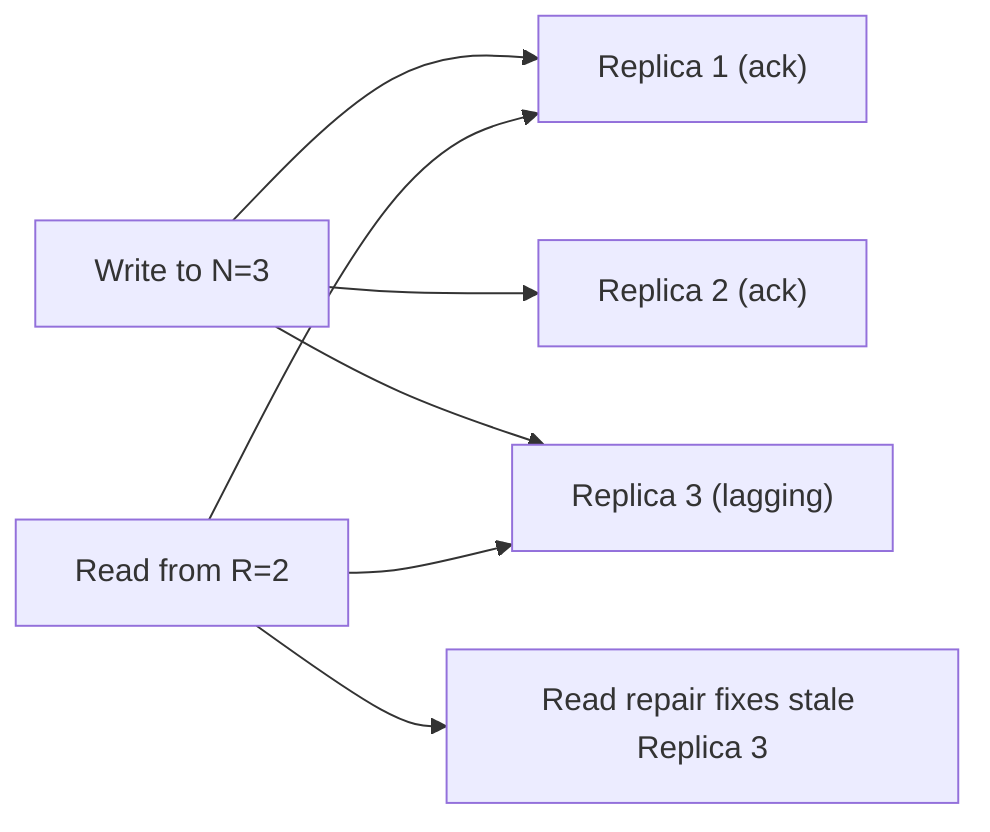

Replication means keeping copies of the same data on multiple machines connected by a network. It is one of the most fundamental tools in distributed data systems, and almost every production database you will encounter uses it in some form. The hard part is not copying bytes around — it is deciding what happens when writes occur and nodes fail.

## Why replicate at all

There are three classic motivations, and a real system usually wants all three:

- **High availability (HA).** If one machine dies, another copy can keep serving requests. A single un-replicated database is a single point of failure.
- **Read scaling.** Read-heavy workloads (often 90%+ reads in social, e-commerce, and content systems) can spread reads across many replicas while a smaller number of nodes accept writes.
- **Geographic locality.** Putting a copy near users in Europe, the US, and Asia cuts read latency from ~150 ms cross-continent round trips to single-digit milliseconds, and provides regional disaster recovery.

The difficulty is keeping the copies consistent as data changes. The three dominant architectures — single-leader, multi-leader, and leaderless — are really three different answers to "who is allowed to accept a write?"

## Single-leader (primary–replica) replication

This is the default model in **PostgreSQL**, **MySQL**, **SQL Server**, **MongoDB** (replica sets), and most managed relational services (Amazon RDS, Cloud SQL).



One node is the **leader** (primary/master). All writes go to the leader, which appends them to a **replication log** — the WAL (write-ahead log) in Postgres, the binlog in MySQL. Followers (replicas/secondaries) replay that log in order and serve read-only queries. Because every node applies writes in the same order from a single source, conflicts are impossible — that is the big advantage of single-leader.

The cost is that the leader is a write bottleneck and a failover risk.

### Synchronous vs asynchronous

The critical tuning knob is *when* the leader considers a write done:

| Mode | Leader waits for | Durability | Write latency | Risk |
|------|------------------|-----------|---------------|------|
| Asynchronous | nobody (fire and forget) | Weakest | Lowest | Acked writes can be lost on leader crash |
| Semi-synchronous | 1 follower to ack | Good | Moderate | One slow follower stalls writes |
| Synchronous | all followers to ack | Strongest | Highest | Any down follower blocks all writes |

Fully synchronous replication to every follower is almost never used — a single slow or dead replica would halt all writes. The practical sweet spot is **semi-synchronous**: at least one follower must confirm the write before the client gets an ack, so the data survives a leader failure, while the remaining followers stay async. MySQL supports `rpl_semi_sync` plugins; PostgreSQL offers `synchronous_commit` with `synchronous_standby_names` and quorum settings like `ANY 1 (s1, s2, s3)`.

```sql
-- PostgreSQL: require any 1 of 3 standbys to confirm before commit returns
ALTER SYSTEM SET synchronous_standby_names = 'ANY 1 (s1, s2, s3)';
ALTER SYSTEM SET synchronous_commit = 'on';
```

### Replication lag and its anomalies

With async replication, followers are always slightly behind — typically milliseconds, but seconds or minutes under load or network trouble. This lag produces user-visible anomalies if you naively route reads to any replica:

- **Read-your-own-writes:** A user updates their profile, the read goes to a lagging replica, and they see the old value — looks like the save failed. Fix: route a user's reads to the leader (or a known up-to-date replica) for a short window after they write, or track an LSN/timestamp and only read from replicas caught up past it.
- **Monotonic reads:** Successive reads hit replicas at different lag, so a user sees a comment appear, then vanish on refresh. Fix: pin each user to the same replica (e.g., hash the user ID) so they never move backward in time.
- **Consistent prefix reads:** With partitioned data, reads can show effects before their causes. Fix: keep causally related writes together or track causal dependencies.

These guarantees are weaker than linearizability but far cheaper, and naming them explicitly in an interview signals you understand the trade-offs.

### Failover and split-brain

When the leader fails, the system must promote a follower. Automatic failover involves: detecting the failure (heartbeat timeout, often 10–30 s), choosing the most up-to-date follower (highest applied LSN), and reconfiguring clients to send writes to the new leader.

This is dangerous. The classic failure is **split-brain**: the old leader was only network-partitioned, not dead, and now two nodes both believe they are leader and accept conflicting writes. Guards include **fencing** (STONITH — "shoot the other node in the head"), requiring a quorum/witness to elect a leader, and using a coordination service like **ZooKeeper**, **etcd**, or tools such as Patroni, Orchestrator, or MySQL Group Replication. Any async writes the old leader had not shipped before crashing are typically discarded, which is real data loss.

## Multi-leader replication

Here multiple nodes accept writes, each acting as a leader and as a follower for the others. The common use case is **multi-datacenter**: one leader per region, so writes are local and fast, with cross-region async replication in the background. Examples include MySQL/MariaDB with circular replication, BDR for PostgreSQL, and CouchDB.

The hard problem is **write conflicts**: the same record edited in two regions concurrently. Resolution strategies:

- **Last-write-wins (LWW)** by timestamp — simple but silently drops data and is sensitive to clock skew.
- **Application-defined merge** — e.g., union of shopping-cart items.
- **CRDTs** (conflict-free replicated data types) that merge deterministically by construction.

Multi-leader gives low write latency and survives a full datacenter loss, but conflict handling makes it operationally tricky.

## Leaderless replication (Dynamo-style quorums)

**Cassandra**, **Amazon DynamoDB**, **Riak**, and **ScyllaDB** popularized the leaderless model from Amazon's Dynamo paper. There is no leader: clients (or a coordinator node) send each write to *all* N replicas and consider it successful once **W** of them ack. Reads query **R** replicas and reconcile.



The key invariant is the **quorum condition**:

```
W + R > N   ⟹  read and write sets overlap, so reads see the latest write
```

With **N = 3**, common choices are **W = 2, R = 2** (overlap guaranteed), or **W = 3, R = 1** for fast reads, or **W = 1, R = 1** (no overlap — fast but eventually consistent). Because no single node must be up, writes proceed as long as W nodes are reachable, giving excellent availability.

Stale replicas catch up via **read repair** (the coordinator notices a stale value during a read and writes back the fresh one) and **anti-entropy** background processes using Merkle trees. Concurrent writes are detected with **version vectors**, and conflicts resolved by LWW or merge.

| Architecture | Who writes | Conflicts | Best for | Examples |
|--------------|-----------|-----------|----------|----------|
| Single-leader | 1 node | None | Strong consistency, simple | PostgreSQL, MySQL, MongoDB |
| Multi-leader | N nodes | Must resolve | Multi-region low-latency writes | MySQL circular, CouchDB |
| Leaderless | Any replica | Version vectors / LWW | High availability, write scaling | Cassandra, DynamoDB, Riak |

## Key takeaways

- Replicate for high availability, read scaling, and geographic latency — most systems want all three at once.
- Single-leader is the simplest and conflict-free, but the leader is a write bottleneck and failover is the risky part.
- Async replication is fast but loses acked writes on failover; semi-synchronous (at least one follower confirms) is the common compromise.
- Replication lag causes read-your-writes, monotonic-read, and consistent-prefix anomalies — name the guarantee you need and route reads accordingly.
- Multi-leader and leaderless trade away conflict-freedom for availability and low write latency; both need explicit conflict resolution (LWW, merge, CRDTs).
- Leaderless quorums obey W + R > N for overlap; tune W and R to bias toward consistency, read speed, or write speed.
