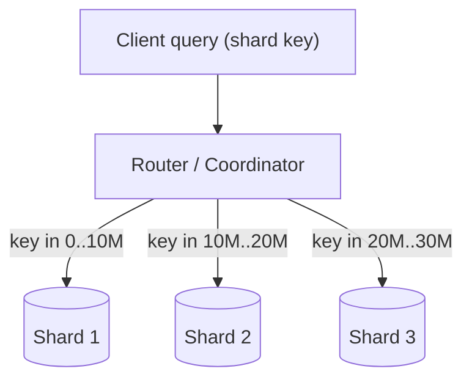

Replication gives you copies of the *whole* dataset; sharding splits the dataset so that no single node has to hold or serve all of it. Once a table grows past what one machine's disk, memory, or write throughput can handle — think tens of terabytes or hundreds of thousands of writes per second — you partition it across many machines. This doc covers how to split, how to pick the split key, and the operational pain of moving data later.

## Partitioning: vertical vs horizontal

Two very different things share the word "partitioning":

- **Vertical partitioning** splits a table *by columns*. Hot, frequently-accessed columns (a user's name, status) go in one table; large, rarely-read columns (a profile blob, avatar) go in another. It is also used loosely to mean splitting a monolith's tables into separate per-service databases.
- **Horizontal partitioning (sharding)** splits a table *by rows*. Each shard holds a disjoint subset of rows with the same schema. User IDs 1–10M live on shard A, 10M–20M on shard B, and so on. This is what people mean by "sharding," and it is the only way to scale writes and storage beyond one node.

```
Vertical                         Horizontal (sharding)
┌──────┬────────────┐            ┌──────────────┐  ┌──────────────┐
│ id,  │  big_blob, │            │ rows 1..10M  │  │ rows 10M..20M│
│ name │  settings  │            │  (shard A)   │  │  (shard B)   │
└──────┴────────────┘            └──────────────┘  └──────────────┘
 split by column                    split by row range
```

## How requests reach a shard

A **router** (or coordinator) maps each request's shard key to the shard that owns it, then forwards the query. The router may be a separate proxy (Vitess `vtgate`), a library inside the client, or a coordinator node in the cluster.



## Sharding strategies

How you map a row to a shard determines your query performance, your hotspot risk, and how painful resharding will be.

### Range-based

Partition by contiguous ranges of the shard key (e.g., `user_id 0–10M`, dates `2026-01`, `2026-02`). Used by **HBase**, **MongoDB** (range sharding), and **Google Bigtable**.

- Pro: efficient range scans — "all orders in January" hits one shard.
- Con: prone to hotspots. If you shard by timestamp, *all* new writes land on the newest shard while old shards sit idle.

### Hash-based

Apply a hash function to the shard key and use it to assign a shard: `shard = hash(key) % N`, or better, place the hash on a consistent-hashing ring. Used by **Cassandra**, **DynamoDB**, and **MongoDB** (hashed sharding).

- Pro: spreads load evenly; no natural hotspot from sequential keys.
- Con: destroys locality — a range scan must fan out to every shard.

### Directory / lookup-based

Keep an explicit lookup table mapping key → shard, maintained by a coordinator. **Vitess** and many in-house systems work this way.

- Pro: maximum flexibility — move any key anywhere, rebalance gracefully.
- Con: the lookup service is an extra hop and a potential single point of failure; it must be highly available and cached.

### Geo / entity-based

Shard by region or by a top-level entity (tenant, user) so related data colocates. Multi-tenant SaaS often gives each large customer its own shard; chat systems shard by conversation so all messages in a thread are together.

| Strategy | Lookup cost | Range scans | Hotspot risk | Rebalancing | Examples |
|----------|------------|-------------|--------------|-------------|----------|
| Range | O(1) via map | Excellent | High (sequential keys) | Split/merge ranges | HBase, MongoDB, Bigtable |
| Hash | O(1) compute | Poor (fan-out) | Low | Hard with mod-N; easy with consistent hashing | Cassandra, DynamoDB |
| Directory | O(1) lookup hop | Depends | Low (movable) | Easiest | Vitess, Citus |
| Geo/entity | O(1) | Good within entity | Medium | Per-tenant moves | SaaS multi-tenant |

## Choosing a shard key

This is the single most consequential decision, and it is hard to change later. A good shard key:

1. **Has high cardinality** — many distinct values so data spreads across all shards.
2. **Distributes evenly** — no value dominates the volume.
3. **Matches your access patterns** — most queries should be answerable from a single shard. If you shard by `user_id` but query by `email`, every email lookup becomes a scatter-gather.

Often a **composite key** balances these, e.g., `(tenant_id, user_id)` keeps a tenant together while spreading users.

## The hot-shard / celebrity problem

Even a well-chosen key can skew. The famous **celebrity problem**: shard a social graph by user, and Cristiano Ronaldo's 600M-follower row turns one shard into a furnace while others idle. Symptoms are one node at 100% CPU while the cluster average is 20%.

Mitigations:

- **Salt the key**: append a random suffix (`celebId#0..9`) to spread a hot key across 10 logical sub-keys, then gather on read.
- **Cache** the hot entity in Redis/Memcached so most reads never touch the shard.
- **Split out** known hot tenants onto dedicated hardware.
- DynamoDB's **adaptive capacity** auto-isolates hot partitions, masking some skew transparently.

## Cross-shard queries, joins, and transactions

Sharding's tax is that anything spanning shards gets expensive:

- **Cross-shard reads (scatter-gather):** the router queries every shard and merges results. Latency is bounded by the *slowest* shard, and tail latency dominates. Aggregations, `ORDER BY` across shards, and secondary-index lookups all suffer.
- **Joins:** you usually cannot join across shards efficiently. The fixes are denormalization, colocating joinable data on the same shard (e.g., shard orders by `customer_id` so a customer joins locally), or doing the join in the application/a query layer.
- **Distributed transactions:** an atomic write touching two shards needs **two-phase commit (2PC)** or a **Saga**. 2PC blocks on a coordinator and harms availability and throughput; Sagas trade atomicity for eventual consistency with compensating actions. Most high-scale systems deliberately design schemas so a transaction stays within one shard.

```python
# Scatter-gather: fan a query to all shards and merge
def query_all_shards(sql, shards):
    futures = [shard.execute_async(sql) for shard in shards]
    rows = []
    for f in futures:
        rows.extend(f.result())      # waits on the slowest shard
    return merge_sort(rows)          # re-sort / re-aggregate in the router
```

## Rebalancing and resharding

Clusters grow, and you eventually need more shards. The naive `hash(key) % N` is a trap: changing N from 4 to 5 remaps almost *every* key, forcing a massive data shuffle and cache invalidation. Two ways out:

- **Fixed number of partitions:** create far more partitions than nodes up front (e.g., 1024 partitions on 8 nodes). Adding a node just moves whole partitions, never re-hashes keys. This is how Riak, Elasticsearch, and Couchbase work.
- **Consistent hashing:** placing nodes and keys on a ring so adding/removing a node moves only ~K/N keys. See the dedicated *Consistent Hashing* chapter.

Resharding must be online and incremental: copy data to the new shard while the old one still serves, dual-write or replay the change log to catch up, then atomically flip the routing pointer and backfill-verify. **Vitess** (which shards MySQL behind YouTube) and **Citus** (Postgres extension) automate much of this; MongoDB's balancer migrates chunks between shards in the background; DynamoDB splits partitions automatically as data and throughput grow.

## Key takeaways

- Shard when one node can no longer hold the data or absorb the write throughput; until then, replication plus read replicas is simpler.
- Horizontal partitioning (by row) is what scales writes and storage; vertical partitioning just separates columns or tables.
- Pick a shard key with high cardinality, even distribution, and alignment to your dominant query — single-shard queries are cheap, cross-shard scatter-gather is not.
- Hotspots and the celebrity problem are inevitable at scale; mitigate with salting, caching, and dedicated capacity.
- Avoid cross-shard joins and distributed transactions by colocating related data; 2PC and Sagas are last resorts.
- Never reshard with plain `mod N` — use a large fixed partition count or consistent hashing so only K/N keys move.
