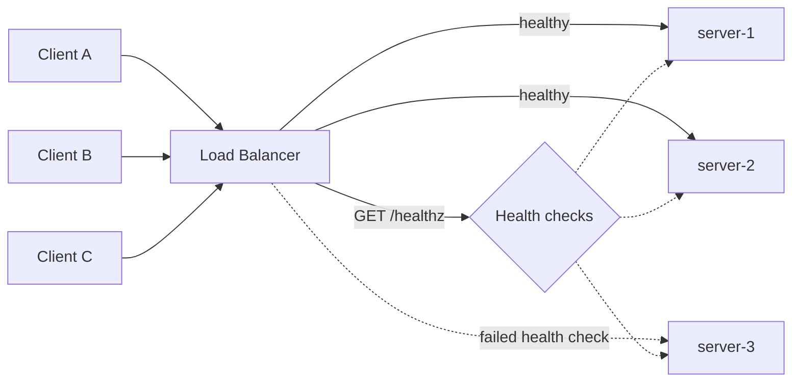
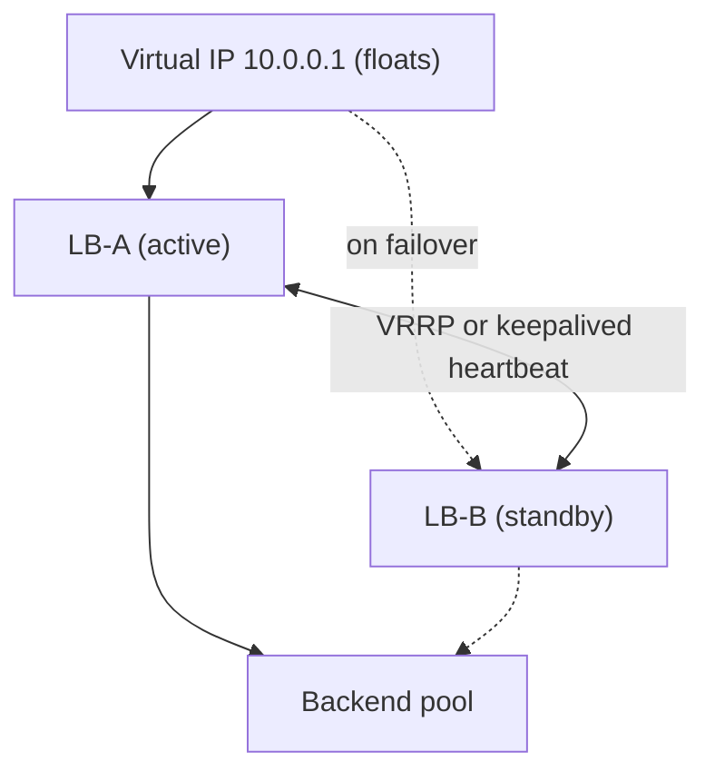

A load balancer is the traffic cop that sits in front of a pool of servers and spreads incoming requests across them. It's the single most important building block for turning one machine into a horizontally scalable, highly available service.

## Why load balance

A single server has a hard ceiling on connections, CPU, and memory, and if it dies your whole service is down. Putting a load balancer (LB) in front of a pool of identical servers buys you four things at once:

- **Scalability:** add or remove backend instances to match demand; the LB spreads load across them.
- **Availability:** when an instance fails a health check, the LB stops routing to it, so users don't hit a dead box.
- **Maintainability:** drain a node for deploys or patching without downtime (rolling deploys, blue-green).
- **Performance:** route requests to the least-busy or nearest instance to keep latency low.

The backends must be stateless (or share state externally) for any instance to handle any request — otherwise routing becomes constrained.



The load balancer continuously probes each backend and only routes to nodes that pass their health check; `server-3` here has failed and is pulled from rotation until it recovers.

## Layer 4 vs Layer 7

Load balancers operate at different layers of the network stack, and the choice shapes what they can do.

| | L4 (Transport) | L7 (Application) |
|---|---|---|
| Operates on | TCP/UDP, IP + port | HTTP/HTTPS, headers, URLs, cookies |
| Visibility | Cannot read request content | Reads full request, can inspect/modify |
| Routing decisions | By IP/port/connection | By path, host, header, cookie |
| TLS | Pass-through (or simple) | Terminates TLS, re-encrypts to backend |
| Throughput | Higher — minimal processing | Lower — parses each request |
| Latency overhead | Microseconds | Sub-millisecond to low ms |
| Examples | AWS NLB, IPVS, HAProxy (TCP mode) | Nginx, Envoy, AWS ALB, HAProxy (HTTP mode) |

**L4** forwards packets based on IP and port without looking inside. It's fast and protocol-agnostic, ideal for raw TCP/UDP or when you need millions of connections cheaply. It can't do content-based routing.

**L7** understands HTTP. It can route `/api/*` to one pool and `/images/*` to another, terminate TLS, rewrite headers, do sticky sessions by cookie, retry failed requests, and apply per-route rate limits. The cost is more CPU per request. Most modern web stacks use L7 (Nginx, Envoy, ALB) at the edge, sometimes with an L4 LB in front for raw scale.

## Balancing algorithms

How the LB picks which backend gets the next request:

- **Round robin:** rotate through servers in order. Simple; assumes servers and requests are uniform.
- **Weighted round robin:** assign weights so beefier servers get proportionally more traffic (e.g., a 16-core box gets weight 2 vs an 8-core box's weight 1).
- **Least connections:** send to the server with the fewest active connections. Adapts to uneven request durations — the right default when request cost varies (e.g., some requests stream, some are quick).
- **Least response time:** combine active connections with measured latency; route to the fastest-responding healthy node.
- **IP hash:** hash the client IP to pick a server, giving the same client the same backend (a crude form of session affinity).
- **Consistent hashing:** map both servers and keys onto a hash ring so adding/removing a server only remaps ~1/N of keys instead of reshuffling everything. Essential for sticky routing to caches and shards. See the Caching page for the ring mechanics.

```
Round robin:        req1→A, req2→B, req3→C, req4→A ...
Least connections:  pick server with min(active_conns)
Consistent hash:
        hash ring (0..2^32)
        ┌───────────────────────────┐
        │   keyX → [A] ... [B] ...[C]│   add D → only keys
        └───────────────────────────┘   between C and D move
```

## Health checks

A load balancer only helps availability if it knows which backends are alive. It probes each one continuously.

- **Passive checks:** observe real traffic — if a backend returns 5xx or times out repeatedly, mark it unhealthy.
- **Active checks:** the LB periodically hits a dedicated endpoint, e.g. `GET /healthz`, expecting `200 OK`.

A good health endpoint checks real dependencies (DB reachable, cache reachable) but stays cheap so probes don't add load. Typical config:

```yaml
health_check:
  path: /healthz
  interval: 5s          # probe every 5 seconds
  timeout: 2s           # fail if no response in 2s
  healthy_threshold: 2  # 2 passes → back in rotation
  unhealthy_threshold: 3 # 3 fails → pulled from rotation
```

Tune the thresholds: too aggressive and a brief GC pause ejects a healthy node (flapping); too lax and users keep hitting a dead box for many seconds. With the above, a hard failure takes the node out after ~15 s.

## Sticky sessions

Sometimes you *want* a client pinned to one backend — for example, when in-memory session state lives on that server. The LB uses a cookie (L7) or source-IP hash (L4) to send a given client back to the same instance.

Stickiness is a smell, not a feature. It defeats even load distribution (a few "whale" clients can hotspot one node), and it makes that node a single point of failure for those users — if it dies, their session is gone. Prefer **externalizing session state** to Redis or a signed JWT, keep backends fully stateless, and avoid stickiness. Use it only as a pragmatic bridge for legacy apps.

## Active-active vs active-passive

How you run *multiple load balancers or sites* for redundancy:

| | Active-active | Active-passive |
|---|---|---|
| Traffic | All nodes serve simultaneously | Primary serves; standby idle |
| Capacity used | Full pool | Half (standby wasted) |
| Failover | Already balanced, instant | Promote standby (seconds) |
| Complexity | Higher (state/sync) | Lower |
| Cost efficiency | Better | Worse |

Active-active maximizes utilization and survives a node loss with no failover delay, but both nodes must handle shared state correctly. Active-passive is simpler and common for stateful systems (a hot standby database), accepting that the standby sits idle and failover takes a few seconds.

## Global server load balancing and DNS

A single-region LB can't help if the whole region is down or if users are continents away. **Global Server Load Balancing (GSLB)** distributes traffic across datacenters, usually via DNS.

```
user (Tokyo) → DNS query for api.example.com
            → GeoDNS returns ap-northeast IP (nearest, healthy region)
            → regional ALB → app pool
```

DNS-based GSLB (e.g., AWS Route 53, Cloudflare, NS1) supports **geo-routing** (send users to the nearest region), **latency-based routing**, and **health-based failover** (drop a region's records when it's down). The catch is **DNS caching/TTL**: clients and resolvers cache the answer for the TTL (often 30–60 s), so failover isn't instant. Anycast IPs avoid this by advertising one IP from many locations and letting BGP route to the nearest healthy edge.

## The load balancer as a single point of failure

If you put one LB in front of everything, you've just moved your single point of failure (SPOF) — the LB itself. Eliminate it:

- Run **at least two LBs** in active-active or active-passive.
- Use a **floating/virtual IP (VIP)** that fails over between them via VRRP / keepalived, so clients keep using one address.
- Or rely on the cloud: AWS ALB/NLB are managed, run across multiple Availability Zones, and scale/heal automatically — the redundancy is built in.



Clients always target the virtual IP. The active LB owns it; if its heartbeat to the standby stops, the standby claims the VIP and takes over within seconds — no client-side change required.

## Real tools

- **Nginx** — battle-tested L7 reverse proxy and LB; also web server and TLS terminator. Great default for HTTP.
- **HAProxy** — extremely fast L4/L7 proxy; rich health checks and observability; common for high-throughput TCP and HTTP.
- **Envoy** — modern L7 proxy with dynamic config (xDS), built for service meshes (Istio); per-request retries, circuit breaking, gRPC.
- **AWS ELB family** — ALB (L7, HTTP/gRPC, path routing), NLB (L4, ultra-high throughput, static IPs), all managed and multi-AZ.
- **Cloud GSLB** — Route 53, Cloudflare, Google Cloud Load Balancing for global, DNS/anycast-based distribution.

## Key takeaways

- Load balancers deliver scalability, availability, zero-downtime deploys, and lower latency by spreading traffic over a stateless backend pool.
- **L4** routes fast by IP/port without reading content; **L7** routes by URL/header/cookie and terminates TLS at higher CPU cost.
- Pick the algorithm to fit the workload: round robin for uniform requests, **least connections** when request cost varies, **consistent hashing** for sticky cache/shard routing.
- Health checks (active + passive) with tuned thresholds determine how fast a dead node is ejected — balance flapping vs slow failover.
- Avoid sticky sessions; externalize state to Redis or JWTs so any node can serve any request.
- Always run redundant LBs (VIP/VRRP or managed multi-AZ ALB/NLB) so the load balancer isn't your single point of failure; use GSLB/GeoDNS for cross-region routing and failover.
