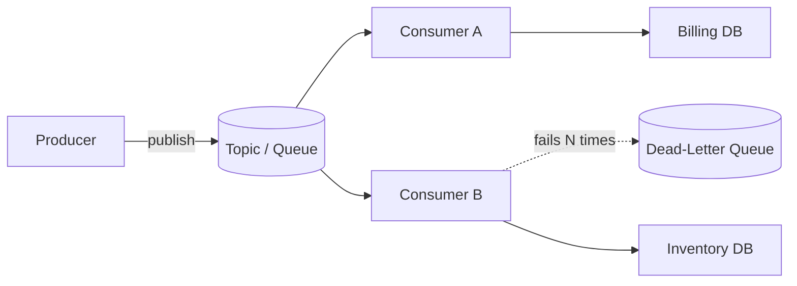
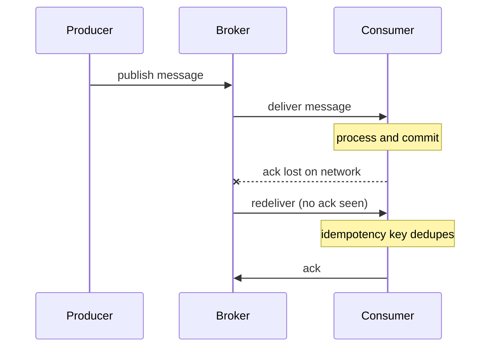

Message queues let services talk without waiting on each other. Instead of a synchronous call that blocks until a response arrives, a producer hands a message to a broker and moves on; one or more consumers process it later. This decoupling is the backbone of event-driven architecture.

## Why async and decoupling

A synchronous call chain (A calls B calls C) couples availability and latency: if C is slow or down, A is slow or down, and end-to-end latency is the *sum* of every hop. Inserting a broker buys you three things:

- **Temporal decoupling** — the consumer can be offline; messages wait durably until it returns.
- **Load leveling** — a burst of 50,000 requests/sec can drain into a queue and be processed at a steady 5,000/sec, protecting downstream databases from spikes.
- **Fan-out** — one event (`OrderPlaced`) can trigger billing, inventory, email, and analytics independently, each evolving on its own.

The cost is complexity: you now reason about ordering, duplicates, retries, lag, and eventual consistency instead of a simple request/response. Async is not free — it trades synchronous failure for operational and cognitive overhead.



## Queue vs pub-sub vs log

These three models are often conflated but behave differently:

- **Point-to-point queue** — each message is delivered to exactly one consumer in a competing-consumers group. Used for work distribution (task queues). Once acknowledged, the message is gone. Example: SQS, RabbitMQ queues.
- **Pub-sub (topics)** — each message is delivered to *every* subscriber. Used for fan-out/broadcast. Subscribers that are offline miss messages unless a durable subscription is configured. Example: RabbitMQ fanout/topic exchanges, SNS, Google Pub/Sub.
- **Log** — an append-only, ordered, retained sequence. Consumers track their own offset and can replay from any point. The log is *not* deleted on consumption; it is retained by time or size (e.g., 7 days). Example: Kafka, Pulsar, Kinesis.

The log model is the key mental shift: in Kafka the broker is "dumb" (it just stores ordered bytes and serves offsets) and the consumer is "smart" (it owns its position). In RabbitMQ the broker is "smart" (it routes, tracks per-message acks, redelivers) and consumers are "dumb."

## Delivery guarantees

Networks fail, so brokers must choose what happens under uncertainty — specifically, whether to ack *before* or *after* processing, and whether to retry:

| Guarantee | Behavior | When to use |
|-----------|----------|-------------|
| At-most-once | Send, never retry. Messages may be lost. | Metrics, logs where loss is tolerable |
| At-least-once | Retry until ack. Duplicates possible. | Default for most systems |
| Exactly-once | No loss, no duplicates. | Financial ledgers, dedup-critical flows |

At-least-once is the practical default. True exactly-once delivery across independent systems is impossible in general (it reduces to the two-generals problem), but you can get *effective* exactly-once by combining at-least-once delivery with **idempotent** consumers. Kafka offers exactly-once *within Kafka* (idempotent producer plus transactions spanning consume-process-produce), but the moment you write to an external database outside that transaction, you are back to needing idempotency.



### Idempotency

An idempotent operation produces the same result whether applied once or five times — the cure for at-least-once duplicates. Strategy:

```python
# Dedup using an idempotency key stored in the same DB transaction
def handle(msg):
    key = msg["idempotency_key"]      # producer-generated UUID
    with db.transaction():
        if db.exists("processed", key):
            return                     # already done; ack and skip
        apply_business_logic(msg)
        db.insert("processed", key)    # same txn -> atomic with the work
```

Use a natural key (order ID) or a producer-assigned UUID. Upserts (`INSERT ... ON CONFLICT DO NOTHING`) are naturally idempotent. The critical detail: the dedup record and the business write must commit in the *same* transaction, or a crash between them reintroduces duplicates.

## Ordering and partitions

Global total ordering across a high-throughput topic is expensive, so logs shard into **partitions**. Ordering is guaranteed *only within a partition*. Kafka routes a keyed message to a partition by hashing its key: `partition = hash(key) % numPartitions`. All events for `user_42` land in the same partition and stay ordered relative to each other; events for different users may interleave.

```
Topic "orders" (3 partitions)
P0: [m1][m4][m7]  <- key=userA, ordered
P1: [m2][m5]      <- key=userB, ordered
P2: [m3][m6][m8]  <- key=userC, ordered
```

Trade-off: more partitions = more parallelism but a weaker ordering scope and more overhead (open file handles, rebalance time, end-to-end latency). Note that changing the partition count rehashes keys, so existing per-key ordering breaks at the boundary — choose a partition key (per-user, per-account) that matches your ordering requirement up front.

## Consumer groups and scaling

A consumer group is a set of consumers that share the work of a topic. Kafka assigns each partition to exactly one consumer in the group, so the maximum useful parallelism equals the partition count: 12 partitions can feed at most 12 active consumers in one group (extra consumers sit idle). Add a *second* group and it gets its own independent copy of every message — that is how fan-out and the queue model coexist in one system.

## Backpressure

When producers outpace consumers, the queue grows. Unbounded growth eventually exhausts memory or disk. Backpressure mechanisms:

- **Bounded queues** with blocking or rejection (RabbitMQ `x-max-length`, then drop-head or dead-letter the overflow).
- **Consumer lag monitoring** — watch the gap between the latest produced offset and the committed offset; alert when lag exceeds, say, 100k messages or 5 minutes of processing time.
- **Autoscaling consumers** based on lag (e.g., KEDA scaling on Kafka lag), bounded by the partition count.
- **Flow control** — RabbitMQ blocks publishers when memory or disk crosses a watermark.

Kafka handles slow consumers gracefully because messages sit on disk and retention is time-based; the consumer just falls behind and catches up. A traditional broker that holds undelivered messages in memory builds pressure far faster and can stall publishers.

## Dead-letter queues

A message that fails repeatedly (a "poison" message) should not block its partition or queue forever. After N retries (often 3–5, ideally with exponential backoff), route it to a **dead-letter queue (DLQ)** for inspection. SQS supports this via a redrive policy with `maxReceiveCount`; Kafka typically uses a separate retry/DLQ topic. Always alert on DLQ depth — a growing DLQ signals a bug or a bad deploy, not a transient blip.

## Log model vs traditional broker

Kafka (log) shines for high-throughput event streaming, replay, and multiple independent consumers. RabbitMQ (broker) shines for complex routing, per-message acknowledgment, priorities, and request/reply RPC. SQS trades features for near-zero operational burden.

| Feature | Kafka | RabbitMQ | Amazon SQS |
|---------|-------|----------|-----------|
| Model | Distributed log | Smart broker (AMQP) | Managed queue |
| Throughput | Millions/sec | ~tens of thousands/sec/node | High, auto-scaled |
| Ordering | Per partition | Per queue | FIFO queues only |
| Retention/replay | Yes (time/size based) | No (gone after ack) | Up to 14 days, no replay |
| Routing | Key-based partitioning | Exchanges, bindings, topics | None (basic) |
| Delivery | At-least / exactly-once (internal) | At-least-once | At-least-once (FIFO: exactly-once-ish) |
| Ops burden | High (KRaft/ZK, partitions) | Medium | None (serverless) |
| Best for | Streaming, analytics, event sourcing | Task queues, RPC, complex routing | Simple decoupling on AWS |

A common pattern: use Kafka for the durable event backbone and analytics, and SQS/RabbitMQ for discrete background jobs.

## Key takeaways

- Queues decouple services in time and absorb bursts, at the cost of reasoning about duplicates, ordering, and lag.
- Three models: point-to-point queue (one consumer), pub-sub (all subscribers), and log (retained, replayable, offset-based).
- At-least-once delivery plus idempotent consumers is the practical recipe; true cross-system exactly-once is a myth.
- Ordering is only guaranteed within a partition; choose your partition key to match your ordering needs before you scale.
- Monitor consumer lag and DLQ depth, and apply backpressure with bounded queues or lag-based autoscaling.
- Kafka (dumb broker, smart consumer, replayable log) vs RabbitMQ/SQS (smart broker, no replay) is the core architectural choice.
