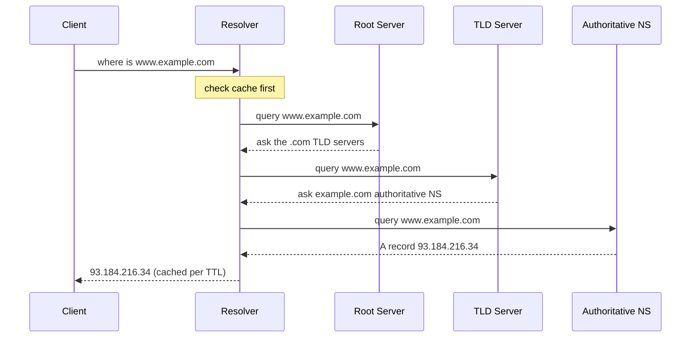
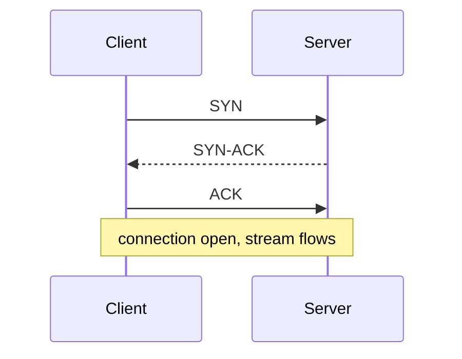

Every system design ultimately moves bytes between machines. Knowing what happens between typing a URL and seeing a response—name resolution, transport, encryption, and the HTTP conversation—lets you reason about latency, reliability, and the right protocol for the job.

## The layered model

Networking is organized in layers so each can evolve independently. The 7-layer OSI model is the textbook reference, but engineers mostly use the 4-layer TCP/IP model.

| TCP/IP layer | Job | Examples |
|--------------|-----|----------|
| Application | App-level data | HTTP, DNS, gRPC, SMTP |
| Transport | Process-to-process delivery | TCP, UDP |
| Internet | Host-to-host routing | IP, ICMP |
| Link | Physical/local network | Ethernet, Wi-Fi |

Data is wrapped (encapsulated) with a header at each layer on the way out and unwrapped on the way in. An HTTP request becomes a TCP segment, inside an IP packet, inside an Ethernet frame.

## IP, ports, and NAT

An **IP address** identifies a host (IPv4 like `93.184.216.34`, or IPv6). A **port** (0–65535) identifies a process on that host—web servers default to 443 (HTTPS) and 80 (HTTP). The pair `IP:port` plus protocol defines a socket endpoint.

**NAT (Network Address Translation)** lets many devices behind a router share one public IP. The router rewrites the source `IP:port` on outbound packets and maps replies back. This is why your laptop has a private `192.168.x.x` address but the internet sees your router's public IP—and why incoming connections need port forwarding.

## DNS resolution

Humans use names; the network needs IP addresses. **DNS** translates `www.example.com` into an IP through a hierarchy of servers, heavily cached at every step. A recursive resolver does the legwork; the root, TLD, and authoritative servers each answer for their slice of the namespace.

Steps:
1. The **recursive resolver** (run by your ISP or a public one like `8.8.8.8`) does the legwork and caches results.
2. A **root server** points to the right **TLD server** (`.com`, `.org`).
3. The **TLD server** points to the domain's **authoritative nameserver**.
4. The authoritative server returns the actual record (A/AAAA for IPs, CNAME for aliases).

**Caching and TTL** are what make this fast. Each record has a **TTL** (time-to-live, e.g., 300 s); resolvers and the OS cache it until expiry. A short TTL (60 s) enables quick failover/changes; a long TTL (86400 s) reduces lookups but slows propagation. The first lookup may cost 20–120 ms; cached ones are near-zero.

## TCP vs UDP

Both are transport protocols, but they make opposite trade-offs.

**TCP** is connection-oriented and reliable. It starts with a **three-way handshake** (SYN → SYN-ACK → ACK), guarantees in-order delivery, retransmits lost packets, and does flow/congestion control. The cost is at least one round trip of setup latency plus head-of-line blocking on loss.

**UDP** is connectionless: fire-and-forget datagrams with no handshake, no retransmission, no ordering. Lower latency and overhead, but the application must handle loss if it cares.

| | TCP | UDP |
|---|-----|-----|
| Connection | Yes (handshake) | No |
| Reliability | Guaranteed delivery | Best-effort |
| Ordering | In-order | None |
| Overhead | Higher | Lower |
| Use when | Correctness matters | Speed > completeness |
| Examples | HTTP, DB, email | DNS, VoIP, gaming, video, QUIC |

Rule of thumb: use TCP when every byte must arrive correctly (web pages, file transfer, databases); use UDP when low latency beats perfection and stale data is useless anyway (live video, voice, gaming).

## TLS handshake

**TLS** encrypts traffic on top of TCP (HTTPS = HTTP over TLS). After the TCP handshake, the client and server negotiate a cipher, the server presents a certificate (verified against a trusted CA), and they derive a shared session key. TLS 1.2 needs two round trips; **TLS 1.3** cuts this to one round trip (and 0-RTT for resumed sessions), meaningfully reducing connection latency.

## HTTP versions

HTTP is the application-layer request/response protocol of the web. It has evolved to attack latency.

- **HTTP/1.1** — text-based, one request per connection at a time. **Keep-alive** reuses a TCP connection for multiple requests, avoiding repeated handshakes, but requests on a connection are serialized—**head-of-line blocking**. Browsers work around this by opening ~6 parallel connections per host.
- **HTTP/2** — binary framing with **multiplexing**: many concurrent streams over a single TCP connection, plus header compression (HPACK). Solves HTTP-level head-of-line blocking, but a single lost TCP packet still stalls all streams (TCP-level blocking). (Server push existed but is deprecated and removed from major browsers.)
- **HTTP/3** — runs over **QUIC**, which is built on **UDP**. QUIC implements reliability and ordering per-stream in user space, so packet loss only stalls the affected stream, and it merges transport+TLS setup into one round trip (0-RTT on resume). Great on lossy/mobile networks.

| | HTTP/1.1 | HTTP/2 | HTTP/3 |
|---|----------|--------|--------|
| Transport | TCP | TCP | QUIC/UDP |
| Multiplexing | No | Yes | Yes |
| Head-of-line block | HTTP + TCP | TCP only | None |
| Setup round trips | 1–3 | 1–3 | 0–1 |

### Methods and status codes

Methods convey intent: `GET` (read, safe), `POST` (create), `PUT` (replace, idempotent), `PATCH` (partial update), `DELETE`. Status codes group by class: **2xx** success (200 OK, 201 Created), **3xx** redirect (301, 304 Not Modified), **4xx** client error (400, 401, 403, 404, 429 Too Many Requests), **5xx** server error (500, 502, 503).

## Real-time: WebSockets vs long polling vs SSE

Plain HTTP is client-initiated. For server-pushed updates you need one of:

- **Long polling** — client sends a request that the server holds open until data is ready, then immediately re-requests. Works everywhere but is request-heavy and clumsy.
- **Server-Sent Events (SSE)** — a single long-lived HTTP response streaming text events server→client. One-directional, auto-reconnects, simple. Good for notifications and live feeds.
- **WebSockets** — upgrades an HTTP connection to a persistent, full-duplex TCP channel. Bidirectional, low overhead per message. Best for chat, multiplayer, collaborative editing.

| | Long polling | SSE | WebSocket |
|---|-------------|-----|-----------|
| Direction | Server→client (faked) | Server→client | Bidirectional |
| Transport | Repeated HTTP | One HTTP stream | Upgraded TCP |
| Overhead | High | Low | Lowest |
| Use case | Legacy fallback | Live feeds, notifications | Chat, gaming |

## Key takeaways

- Networking is layered (TCP/IP: link, internet, transport, application); each layer wraps the one above it.
- DNS resolves names via recursive resolver → root → TLD → authoritative, with TTL-based caching making repeat lookups near-free.
- TCP is reliable and ordered but adds a handshake round trip; UDP is fast and lossy—choose by whether correctness or latency wins.
- TLS (especially 1.3 with one round trip) encrypts traffic; HTTPS is HTTP over TLS over TCP.
- HTTP evolved to kill latency: 1.1 keep-alive, HTTP/2 multiplexing over TCP, HTTP/3 multiplexing over QUIC/UDP with no head-of-line blocking.
- For real-time, pick SSE for one-way streams, WebSockets for bidirectional, and long polling only as a fallback.
