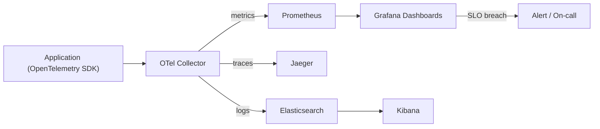
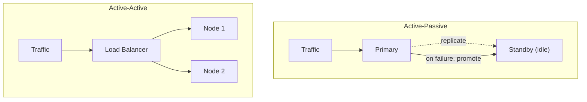
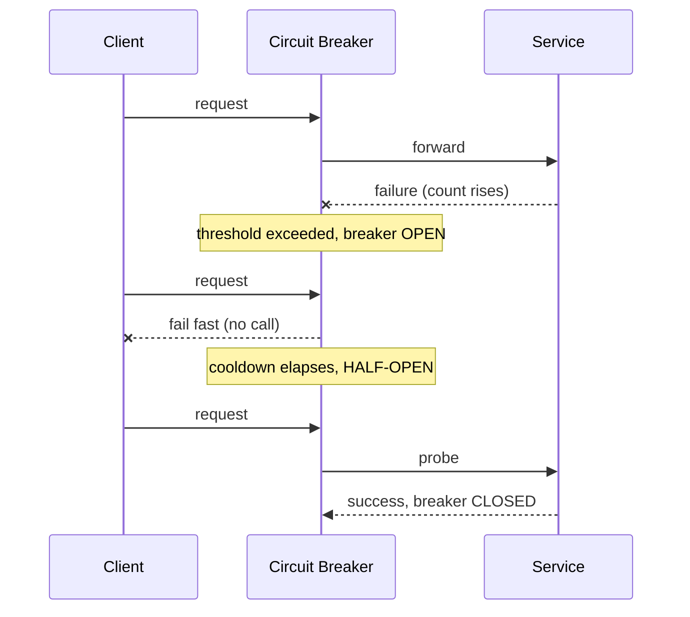
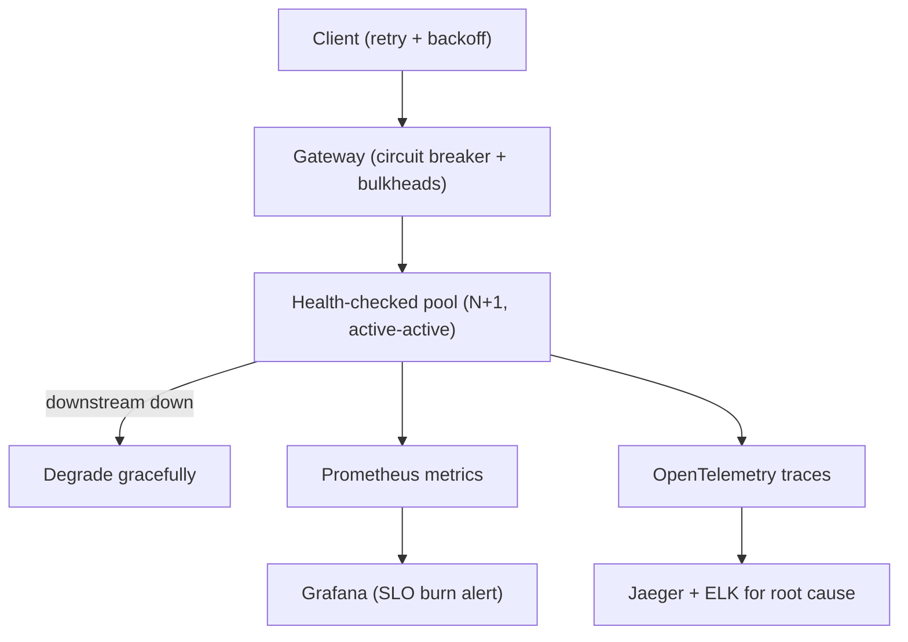

You cannot operate what you cannot see, and you cannot promise what you cannot measure. Observability tells you what the system is doing; reliability engineering keeps it doing the right thing when parts fail.

## The three pillars of observability

Monitoring asks known questions ("is CPU high?"). Observability lets you ask *new* questions about a running system without shipping new code. It rests on three pillars.

- **Logs** — discrete, timestamped events. Structured (JSON) logs are queryable; plain text mostly is not. Tools: the **ELK/Elastic stack** (Elasticsearch, Logstash, Kibana), Loki, Splunk.
- **Metrics** — numeric time series, cheap to store and aggregate. A counter, gauge, or histogram sampled on a fixed interval (e.g., every 15 s). Tools: **Prometheus** for collection, **Grafana** for dashboards.
- **Traces** — the path of a single request across services, showing where time went. Essential in microservices. Tools: **OpenTelemetry** (vendor-neutral instrumentation) feeding **Jaeger** or Zipkin.

| Pillar | Answers | Storage cost driver | Tools |
|--------|---------|---------------------|-------|
| Logs | "What exactly happened?" | Volume (every event) | ELK, Loki, Splunk |
| Metrics | "Is something wrong, how much?" | Cardinality (label combos) | Prometheus, Grafana |
| Traces | "Where in the call chain?" | Sampling rate | OpenTelemetry, Jaeger |

A practical default: alert on metrics, jump to traces to localize the failing service, then read logs for that service to find the root cause. **OpenTelemetry** is now the standard way to emit all three from one instrumentation library.



## SLI, SLO, SLA, and error budgets

These terms are often confused but form a hierarchy:

- **SLI (Indicator)** — a measured number. e.g., "proportion of HTTP requests served in <300 ms" or "successful requests / total."
- **SLO (Objective)** — your internal target for an SLI. e.g., "99.9% of requests succeed over 30 days." Drives engineering decisions.
- **SLA (Agreement)** — a contractual promise to customers, usually looser than the SLO, with penalties (refunds/credits) if breached. e.g., "99.5% uptime or you get a credit."

The gap matters: set the SLO *stricter* than the SLA so you get paged and fix things before violating a contract.

An **error budget** is `100% - SLO`. A 99.9% monthly SLO permits ~43 minutes of badness per month. If you've spent the budget, you freeze risky launches and focus on stability; if you have budget to spare, you can ship faster. It turns "how reliable?" from an argument into math.

## The nines of availability

Availability is usually quoted in "nines." Each extra nine is roughly 10x harder and more expensive. (Figures below use a 365.25-day year and a 30.44-day average month.)

| Availability | Downtime / year | Downtime / month | Downtime / day |
|--------------|-----------------|------------------|----------------|
| 99% (two nines) | 3.65 days | 7.31 hours | 14.4 min |
| 99.9% (three nines) | 8.77 hours | 43.8 min | 1.44 min |
| 99.95% | 4.38 hours | 21.9 min | 43.2 s |
| 99.99% (four nines) | 52.6 min | 4.38 min | 8.64 s |
| 99.999% (five nines) | 5.26 min | 26.3 s | 0.86 s |

Five nines (~5 minutes/year) is extremely demanding—it usually forbids any single point of failure and any maintenance window that drops traffic. Most web services target three to four nines.

> Note: a chain of dependencies multiplies. A request that touches five independent services each at 99.9% has a ceiling of `0.999^5 ≈ 99.5%`. Composite availability is almost always worse than any single component's.

## Redundancy and N+1

Availability comes from removing single points of failure. **Redundancy** means provisioning spare capacity:

- **N+1** — one extra unit beyond what load requires, so one failure is survivable.
- **N+2** — survive two simultaneous failures (or a failure during maintenance).
- **2N** — full duplication.

If three servers handle peak load, run four (N+1). The math works in your favor: with per-node availability `a`, two independent nodes in parallel are unavailable only when *both* are down, so availability is `1 - (1 - a)^2`. Two 99% nodes reach `1 - 0.01^2 = 99.99%`. Independence is the catch—shared power, network, or a shared dependency defeats it.

## Failover: active-active vs active-passive

**Failover** is automatically shifting work off a failed component.

- **Active-passive** — a standby stays idle (or warm) and takes over when the primary dies. Simpler, but the standby is wasted capacity and failover takes seconds to minutes (DNS/connection re-establishment, replica promotion).
- **Active-active** — all nodes serve traffic simultaneously; losing one just sheds its share. Better resource use and near-instant failover, but requires the system to handle concurrent writes/state across nodes (harder for databases).



## Patterns for graceful failure

Reliable systems assume dependencies *will* fail and contain the blast radius.

- **Health checks.** Liveness (is the process up?) and readiness (can it serve traffic?) probes let load balancers and orchestrators (Kubernetes) route around sick instances.
- **Circuit breakers.** After a threshold of failures to a dependency, "open" the breaker and fail fast for a cooldown instead of piling up requests on a dying service. A half-open state then probes recovery.
- **Retries with exponential backoff + jitter.** Retrying helps with transient errors, but naive retries cause *retry storms*. Back off exponentially and add randomness so clients don't synchronize.



```python
import random, time
def call_with_retry(fn, attempts=5, base=0.1, cap=10):
    for i in range(attempts):
        try:
            return fn()
        except TransientError:
            if i == attempts - 1:
                raise
            # exponential backoff capped, with full jitter
            delay = min(cap, base * 2 ** i)
            time.sleep(random.uniform(0, delay))
```

- **Bulkheads.** Isolate resources (separate thread/connection pools per dependency) so one slow downstream can't exhaust everything—like watertight compartments in a ship.
- **Graceful degradation.** Shed non-essential features under load: serve stale cache, hide recommendations, disable search filters—keep the core working rather than returning errors.
- **Idempotency.** Make operations safe to repeat (via idempotency keys) so retries and failovers don't double-charge or double-create. Essential whenever retries exist.
- **Chaos engineering.** Deliberately inject failures in production (Netflix's Chaos Monkey kills instances) to verify the above patterns actually work before a real outage tests them.

## How it fits together



## Key takeaways

- The three pillars—logs, metrics, traces—answer different questions; OpenTelemetry unifies how you emit them.
- SLI is measured, SLO is your target, SLA is the contract; keep the SLO stricter than the SLA and manage an error budget.
- Each extra "nine" cuts downtime ~10x: 99.9% allows ~8.8 hours/year, 99.999% only ~5 minutes—and dependency chains multiply, lowering the composite.
- Eliminate single points of failure with N+1 redundancy and failover (active-active for instant recovery, active-passive for simplicity).
- Contain failures with circuit breakers, backoff+jitter retries, bulkheads, graceful degradation, and idempotency.
- Verify resilience proactively with health checks and chaos engineering—don't let a real outage be the first test.
