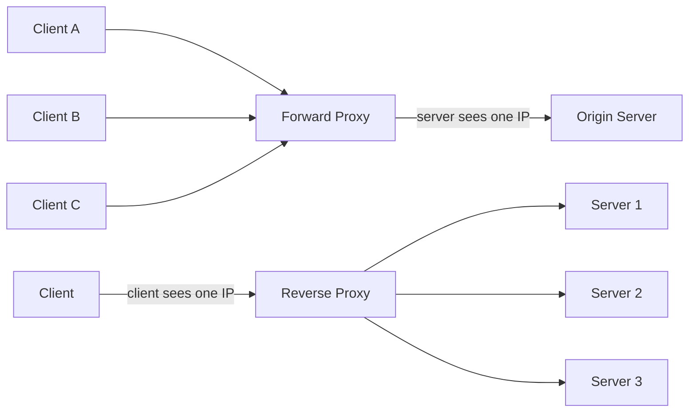
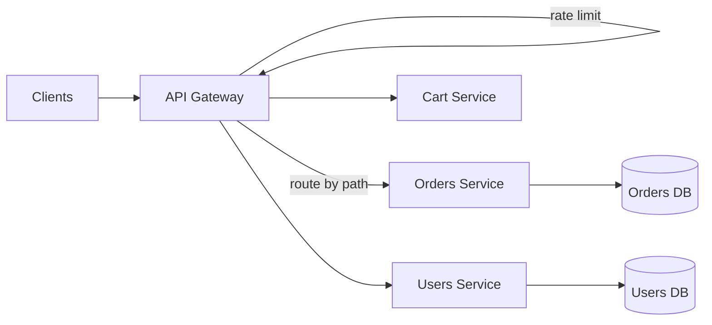
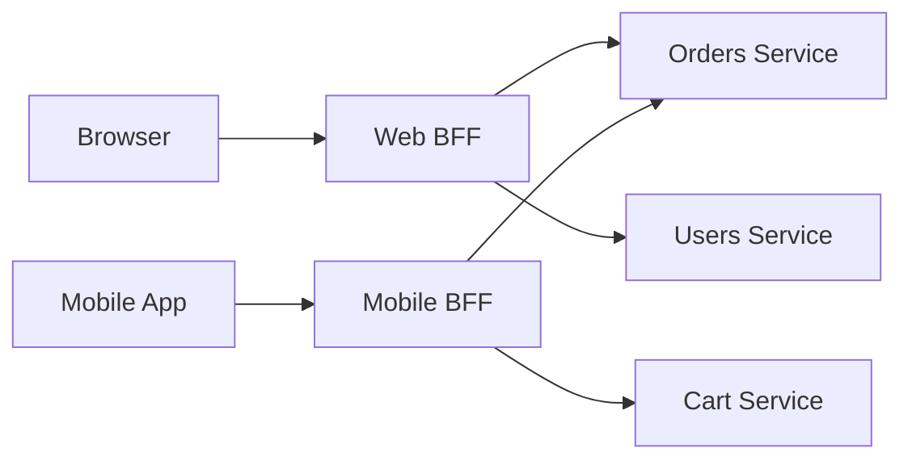
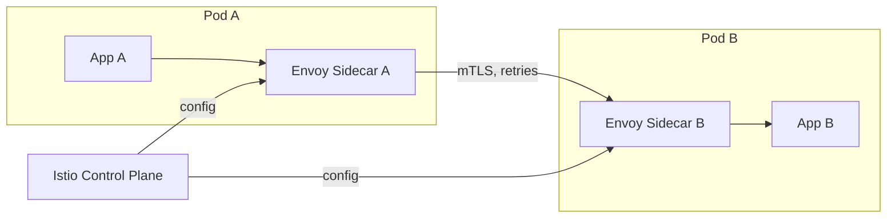
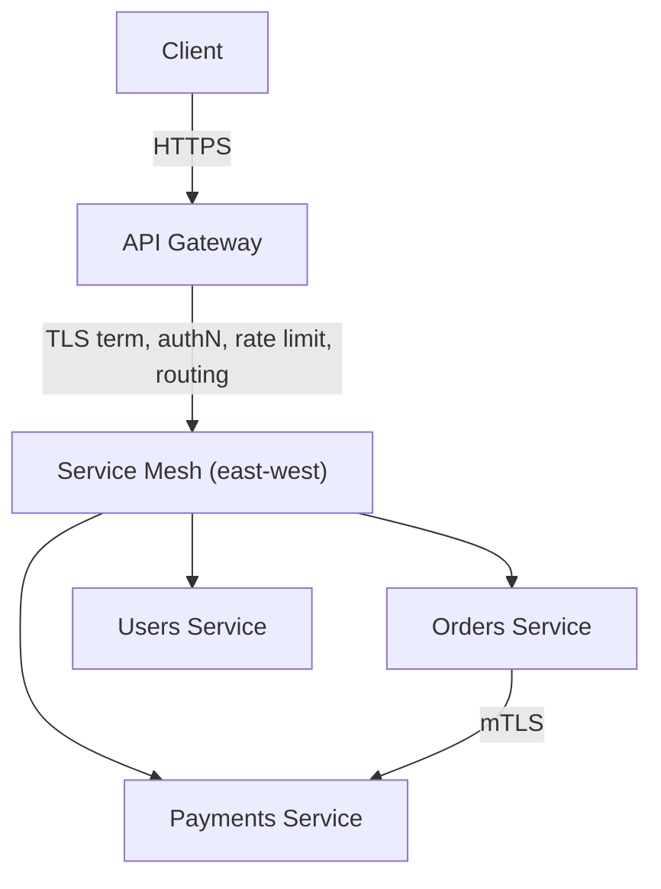

Almost every production request passes through at least one intermediary before it reaches the code that actually answers it. Understanding what those intermediaries do—and which one you need—is foundational to system design.

## Forward proxy vs reverse proxy

A proxy is a server that sits between a client and a destination and relays traffic on someone's behalf. The key distinction is *who it represents and who it hides*.

A **forward proxy** sits in front of clients and acts on their behalf. The destination server sees the proxy's IP, not the client's. Forward proxies hide the *client*. Common uses: corporate egress filtering, content caching for a campus, bypassing geo-restrictions (VPNs), and crawler IP rotation. The client is explicitly configured to use it.

A **reverse proxy** sits in front of servers and acts on their behalf. The client thinks it is talking to a single host, but the proxy fans requests out to a pool of backends. Reverse proxies hide the *servers*. This is the workhorse of web architecture—Nginx, HAProxy, and Envoy are most often deployed this way, and the client is unaware it exists.



| Aspect | Forward proxy | Reverse proxy |
|--------|--------------|---------------|
| Sits in front of | Clients | Servers |
| Configured by | Client/network admin | Service operator |
| Hides | Client identity | Backend topology |
| Client aware of it | Yes (explicit) | No (transparent) |
| Typical use | Egress filtering, VPN | TLS termination, LB, caching |
| Example | Squid, corporate proxy | Nginx, Envoy, HAProxy |

## What reverse proxies do

A reverse proxy is rarely "just" a relay. Typical responsibilities:

- **TLS termination.** Decrypt HTTPS at the edge so backends speak plain HTTP internally. Offloads expensive crypto from app servers and centralizes certificate management. A single Nginx box can terminate tens of thousands of TLS handshakes per second on modern CPUs.
- **Load balancing.** Distribute requests across a backend pool (round-robin, least-connections, IP-hash).
- **Caching.** Serve cacheable responses (static assets, public API GETs) without hitting the origin, cutting latency from ~100 ms to a few ms.
- **Compression.** gzip/Brotli responses to shrink text payloads by roughly 60–80%.
- **Security.** Hide internal IPs, enforce rate limits, integrate a WAF, block bad paths, and absorb slow-loris attacks via timeouts.
- **Header rewriting and routing** based on `Host`, path, or cookies.

```nginx
# Minimal reverse proxy + TLS termination + caching in Nginx
upstream app { server 10.0.0.11:8080; server 10.0.0.12:8080; }

server {
    listen 443 ssl;
    server_name api.example.com;
    ssl_certificate     /etc/ssl/api.crt;
    ssl_certificate_key /etc/ssl/api.key;

    location /static/ { proxy_cache assets; proxy_pass http://app; }
    location /        { proxy_pass http://app; }
}
```

## API gateway responsibilities

An **API gateway** is a specialized reverse proxy that operates at the application/API layer. Where a plain reverse proxy mostly moves bytes (it routes by host/path and balances load), a gateway understands requests as API calls and applies cross-cutting concerns so each microservice doesn't reimplement them. Every reverse proxy capability above is still available; the gateway adds policy on top.

Core responsibilities:

- **Routing.** Map `POST /orders` to the orders service, `GET /users/{id}` to the users service. Path-, header-, and version-based routing.
- **Authentication & authorization.** Validate JWTs/API keys, call an auth service, and reject unauthenticated traffic before it reaches business logic.
- **Rate limiting & throttling.** Per-key/per-IP quotas (e.g., 1000 req/min) to protect backends and enforce billing tiers.
- **Request aggregation.** Fan out one client call to several services and merge the results, so a mobile client makes one request instead of five.
- **Protocol translation.** Accept REST/JSON from clients and speak gRPC, SOAP, or message queues to backends.
- **Observability.** Centralized logging, metrics, request IDs, and trace-context propagation.



A plain reverse proxy would forward those same requests but stop at routing and load balancing—the auth, rate-limit, and aggregation boxes above are what make it a *gateway*.

### The BFF (Backend for Frontend) pattern

A single generic gateway often serves wildly different clients. The **Backend for Frontend** pattern deploys one gateway *per client type*—a web BFF, a mobile BFF, a partner-API BFF. Each tailors aggregation and payload shape to its consumer: the mobile BFF returns trimmed payloads to save bandwidth, while the web BFF returns richer responses. This avoids bloating a single gateway with conditional logic and lets teams own their edge independently. The trade-off is more gateways to deploy and some duplicated routing logic.



## Gateway vs load balancer

These overlap but live at different layers. A load balancer is mostly about *distributing connections* (often L4/TCP); a gateway is about *understanding and shaping API traffic* (L7/HTTP). In practice you often run both: an L4 load balancer in front of multiple gateway instances for horizontal scale and HA.

| | Load balancer | API gateway |
|---|---|---|
| OSI layer | L4 (TCP) or L7 | L7 (HTTP/gRPC) |
| Primary job | Spread traffic across nodes | Auth, routing, rate limit, aggregate |
| Awareness of API | Usually none | Per-endpoint |
| Examples | AWS NLB, HAProxy (L4) | Kong, AWS API Gateway, Apigee |

## Service mesh and the sidecar pattern

Gateways handle **north-south** traffic (clients ↔ your system). Inside a microservice cluster, services also call each other constantly—**east-west** traffic. A **service mesh** manages that internal communication.

The mesh uses a **sidecar**: a proxy container (commonly **Envoy**) deployed next to every service instance. The application talks only to its local sidecar (`localhost`), and the sidecars handle service discovery, mutual TLS (mTLS), retries, circuit breaking, and telemetry between them. A control plane like **Istio** or **Linkerd** configures all sidecars centrally.



The benefit: zero-trust networking, uniform retries/timeouts, and rich metrics without touching application code. The cost: extra latency (a few ms per hop), memory per sidecar (~50–100 MB each), and significant operational complexity. Small systems rarely need a mesh; it pays off at dozens-plus of services.

## Real technologies

- **Nginx** — battle-tested reverse proxy, LB, and cache; also the base of several Nginx-based gateways.
- **Envoy** — modern L7 proxy built for dynamic config; the data plane behind Istio and many gateways.
- **Kong** — open-source API gateway (Nginx + plugins) for auth, rate limiting, transformations.
- **AWS API Gateway** — managed gateway integrating with Lambda, IAM, and usage plans; pay-per-request, no servers to run.

## Putting it together: client → gateway → services



North-south (client to gateway) is shaped by the gateway; east-west (service to service) is secured and made resilient by the mesh sidecars.

## Key takeaways

- Forward proxies hide clients; reverse proxies hide servers—the difference is whose side the proxy is on, and whether the client knows it's there.
- Reverse proxies do TLS termination, load balancing, caching, compression, and security at the edge.
- An API gateway is an L7 reverse proxy that adds routing, auth, rate limiting, aggregation, and protocol translation on top of plain proxying.
- The BFF pattern gives each client type (web, mobile) its own tailored gateway, trading extra deployments for cleaner per-client logic.
- Load balancers distribute connections; gateways understand and shape API calls—often used together.
- Service meshes (Envoy sidecars + Istio/Linkerd) manage east-west traffic with mTLS and resilience, at the cost of latency and complexity.
