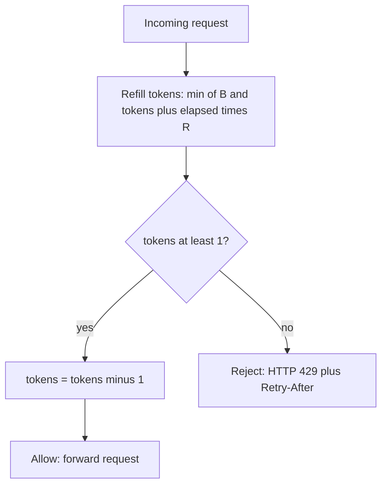
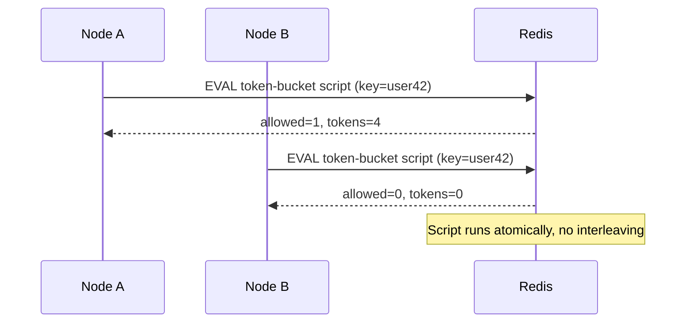

Rate limiting caps how many requests a client may make in a time window. It is a core reliability and fairness tool: a single misbehaving caller should not be able to exhaust a shared resource that thousands of well-behaved callers depend on.

## Why rate limit

Without a limiter, your service is at the mercy of whoever calls it hardest. Four distinct motivations overlap:

- **Abuse and security**: throttle credential-stuffing, scraping, and brute-force login attempts. A login endpoint capped at 5 attempts/minute/IP makes password guessing impractical.
- **Fairness**: in a multi-tenant SaaS, one customer running a batch job should not starve everyone else. Per-tenant quotas enforce isolation.
- **Cost control**: downstream calls cost money (a third-party SMS API at $0.0075/message, or LLM tokens). Limits bound your spend.
- **Cascading failure prevention**: when a dependency slows down, retries pile up and amplify load. A limiter sheds excess traffic early so the system degrades gracefully instead of collapsing. This is closely related to load shedding and circuit breaking.

A useful mental model: rate limiting protects you from *too many* requests; admission control and backpressure protect you from requests that are *too expensive*.

## Where to enforce

You can enforce at several layers, and mature systems use more than one:

| Layer | Pros | Cons |
|---|---|---|
| Client SDK | Cheap, avoids wasted network round-trips | Untrusted; easily bypassed |
| API gateway / edge (Kong, Envoy, Nginx, Cloudflare) | Centralized, protects all services, offloads work | Coarse-grained; may not know per-feature cost |
| Service / middleware | Aware of business context (per-endpoint cost, plan tier) | Each service reimplements; harder to coordinate |

Client-side limiting is an optimization, never a security control — assume clients lie. The gateway is the typical enforcement point for global, per-API-key limits; the service layer adds fine-grained rules like "10 expensive search queries/min but 1000 cheap reads/min."

## Algorithms

### Fixed window counter

Divide time into fixed buckets (e.g. each calendar minute) and count requests per bucket.

```
key = userId + ":" + floor(now / 60)   # bucket per minute
count = INCR(key)
if count == 1: EXPIRE(key, 60)
if count > LIMIT: reject(429)
```

Simple and memory-cheap (one integer per window). The flaw is the **boundary burst**: a client can send `LIMIT` requests at 11:59:59 and another `LIMIT` at 12:00:00 — `2 × LIMIT` in one second while never violating any single window.

### Sliding window log

Store a timestamp for every request in a sorted set. To check, drop entries older than the window and count what remains.

```
ZREMRANGEBYSCORE(key, 0, now - WINDOW)   # evict old
count = ZCARD(key)
if count < LIMIT:
    ZADD(key, now, uniqueId)
    allow()
else: reject(429)
```

Perfectly accurate and burst-free, but memory grows with request volume — storing one entry per request is expensive at scale (imagine 10k req/s).

### Sliding window counter

A practical hybrid. Keep counters for the current and previous fixed windows and interpolate based on how far into the current window you are.

```
weight = (WINDOW - elapsed_in_current) / WINDOW
estimate = prev_count * weight + curr_count
if estimate < LIMIT: allow() else reject()
```

Roughly O(1) memory like fixed window, but smooths the boundary burst to within a few percent of accuracy. This is what Cloudflare popularized and a great default.

### Token bucket

A bucket holds up to `B` tokens and refills at `R` tokens/second. Each request consumes one token; if the bucket is empty, reject (or queue).

```
refill = (now - last_refill) * R
tokens = min(B, tokens + refill)
last_refill = now
if tokens >= 1:
    tokens -= 1; allow()
else: reject(429)
```

Token bucket **allows controlled bursts** up to `B` while enforcing an average rate `R`. With `B=100, R=10/s`, an idle client can fire 100 requests instantly, then settles to 10/s. This bursty-but-bounded behavior matches real traffic well, which is why AWS API Gateway, Stripe, and most public APIs use it.



### Leaky bucket

Requests enter a fixed-size FIFO queue and drain (leak) at a constant rate. If the queue is full, new requests are dropped.

```
ASCII: leaky bucket
   requests in (bursty)
        | | |
        v v v
      ┌────────┐
      │ ■■■■   │  fixed-size queue
      └───┬────┘
          | drips out at constant rate R
          v
       processed
```

Leaky bucket **smooths output to a perfectly constant rate** — ideal when the downstream needs steady, predictable load (e.g. a payment processor). The trade-off versus token bucket: it does not permit bursts, and queuing adds latency.

### Comparison

| Algorithm | Memory | Burst handling | Accuracy | Typical use |
|---|---|---|---|---|
| Fixed window | O(1) | Allows 2× boundary burst | Low | Quick-and-dirty internal limits |
| Sliding window log | O(requests) | None (exact) | Exact | Low-volume, strict limits |
| Sliding window counter | O(1) | Minor | ~99% | General-purpose API default |
| Token bucket | O(1) | Bounded bursts (size B) | High | Public APIs, allowing spikes |
| Leaky bucket | O(queue) | Smooths, no burst | High | Steady downstream load |

## Distributed rate limiting with Redis

A single server's in-memory counter breaks when you run N replicas behind a load balancer — each only sees 1/N of the traffic, so the effective limit becomes N× too high. You need a shared store. Redis is the standard choice: fast (sub-millisecond), and crucially, atomic.

The danger is the **read-modify-write race**: two requests both read `count=99`, both decide they are under a limit of 100, both write `100` — letting two through when one should be rejected. Solve it by making the check-and-update a single atomic operation. A Lua script runs server-side in Redis without interruption:



```lua
-- token bucket, atomic. KEYS[1]=bucket, ARGV: rate, cap, now, cost
local data = redis.call('HMGET', KEYS[1], 'tokens', 'ts')
local tokens = tonumber(data[1]) or tonumber(ARGV[2])
local ts     = tonumber(data[2]) or tonumber(ARGV[3])
local refill = (tonumber(ARGV[3]) - ts) * tonumber(ARGV[1])
tokens = math.min(tonumber(ARGV[2]), tokens + refill)
local allowed = tokens >= tonumber(ARGV[4])
if allowed then tokens = tokens - tonumber(ARGV[4]) end
redis.call('HMSET', KEYS[1], 'tokens', tokens, 'ts', ARGV[3])
redis.call('EXPIRE', KEYS[1], 3600)
return { allowed and 1 or 0, tokens }
```

For fixed/sliding windows, `INCR` + `EXPIRE` or `ZADD` + `ZREMRANGEBYSCORE` are similarly atomic when wrapped in one script or `MULTI`.

### Local vs global limits

A round-trip to Redis on every request adds latency and makes Redis a single point of contention. The common optimization is a **two-tier** scheme: each node grabs a batch of tokens from Redis (say 20 at a time) and serves them locally, refilling when low. This trades a little precision (a node may slightly overshoot during a refill window) for far fewer Redis calls. Sticky-session routing or consistent hashing of keys to specific limiter nodes is an alternative that keeps state local but complicates failover.

## Response semantics

When you reject, be a good API citizen. Return HTTP **429 Too Many Requests** with a **Retry-After** header (seconds or an HTTP date) so clients back off intelligently instead of hammering.

```
HTTP/1.1 429 Too Many Requests
Retry-After: 12
X-RateLimit-Limit: 100
X-RateLimit-Remaining: 0
X-RateLimit-Reset: 1719500000
```

Exposing `X-RateLimit-*` headers on *successful* responses lets well-behaved clients self-throttle before they ever hit a 429. Pair this with jittered exponential backoff on the client to avoid synchronized retry storms.

## Key takeaways

- Rate limiting serves abuse prevention, fairness, cost control, and overload protection — often all at once.
- Enforce at the gateway for global API-key limits and at the service for business-aware, per-endpoint rules; never trust client-side limits for security.
- Token bucket (bounded bursts) and sliding window counter (smooth, O(1) memory) are the best general-purpose defaults; leaky bucket gives perfectly steady output.
- In a distributed deployment, share state in Redis and make check-and-update atomic with Lua to avoid races; use local token batching to cut Redis round-trips.
- Always respond with 429 + Retry-After and expose `X-RateLimit-*` headers so clients can back off cooperatively.
