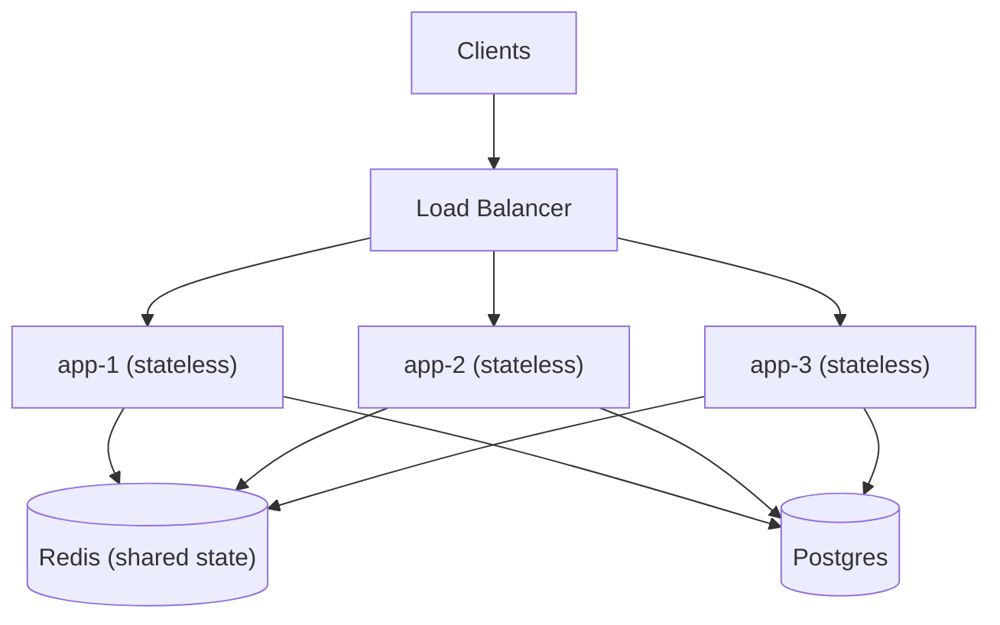

Before you can design a system that serves millions of users, you need a shared vocabulary for *how fast* it is, *how much* it can handle, and *where it breaks*. This page covers the core mental models — latency, throughput, scaling strategies, and the arithmetic of capacity estimation — that every system design conversation builds on.

## Latency vs throughput

These two words get used interchangeably in casual conversation, but they measure different things and you can be good at one while terrible at the other.

- **Latency** is the time to service a single request, end to end. Measured in milliseconds (ms) or microseconds (µs). "How long does one page load take?"
- **Throughput** is how many requests the system completes per unit of time. Measured in requests/sec (QPS), transactions/sec (TPS), or bytes/sec. "How many page loads per second can we sustain?"

A useful analogy is a highway. Latency is how long it takes one car to drive from A to B. Throughput is how many cars pass a checkpoint per minute. Adding lanes (parallelism) raises throughput without making any single car faster. Raising the speed limit lowers latency.

The two are linked under load. As you push a system toward its throughput ceiling, queues form and latency spikes — often non-linearly. A server that responds in 20 ms at 1,000 QPS may respond in 800 ms at 9,500 QPS even though it has not technically "failed."

## Response time percentiles: p50, p95, p99

Averages lie. If 99 requests take 10 ms and one takes 5,000 ms, the average is ~60 ms — which describes none of the actual experiences. Use **percentiles** instead.

- **p50 (median):** half of requests are faster than this. Describes the typical user.
- **p95 / p99:** 95% / 99% of requests are faster. Describes the tail — your unhappiest users.
- **p999 (three nines):** important at scale, because a single page may fan out to dozens of backend calls, and the *slowest* of those calls dominates page latency. If one backend call has a p99 of 100 ms and a page makes 10 such calls, roughly 1 - 0.99^10 ≈ 10% of pages hit at least one 100 ms call.

This "tail amplification" is why teams obsess over p99 latency, not averages. An SLO is typically written as "p99 < 200 ms," not "average < 200 ms."

## Vertical vs horizontal scaling

| Dimension | Vertical (scale up) | Horizontal (scale out) |
|---|---|---|
| Method | Bigger machine: more CPU, RAM, faster disk | More machines behind a load balancer |
| Ceiling | Hard physical limit per box | Effectively unlimited |
| Complexity | Simple — no app changes | Needs load balancing, coordination |
| Failure blast radius | Whole box is one failure domain | Lose one node, keep serving |
| Cost curve | Super-linear (big boxes cost a premium) | Roughly linear with commodity hardware |
| Example | Move Postgres to a 128-core, 2 TB RAM host | Add read replicas / shard across nodes |

Vertical scaling is the easy first move and often the right one — modern single servers are enormous. But it has a wall, and a single big box is a single point of failure. Horizontal scaling is how you reach internet scale, and it's the default assumption in most interviews. The catch: it only works cleanly if your tier is **stateless**.

## Statelessness enables horizontal scaling

A **stateless** service keeps no client-specific data in local memory between requests; any instance can handle any request. State is pushed to shared stores: a database, Redis, or a distributed cache.



The app tier scales horizontally: every box is identical and interchangeable, so handling more traffic is just adding more nodes behind the load balancer. The state they share lives in the cache and database below them. If app-2 dies, the load balancer reroutes to app-1 or app-3 and the user notices nothing. If instead each app server held session data in local memory (sticky sessions), losing a node logs out everyone on it. Externalize state, and scaling out becomes "add more identical boxes."

## Numbers every engineer should know

Approximate latencies, ordered by magnitude. Internalize the *ratios*, not exact figures.

| Operation | Latency | Relative scale |
|---|---|---|
| L1 cache reference | ~1 ns | 1× |
| L2 cache reference | ~4 ns | 4× |
| Main memory (RAM) reference | ~100 ns | 100× |
| Read 1 MB sequentially from RAM | ~3 µs | — |
| SSD random read | ~16 µs | — |
| Read 1 MB sequentially from SSD | ~50 µs | — |
| Round trip within same datacenter | ~0.5 ms | — |
| Read 1 MB from SSD | ~1 ms | — |
| Disk (HDD) seek | ~5–10 ms | — |
| Cross-region round trip (US ↔ Europe) | ~75–150 ms | — |

Key takeaways from the table: main memory (~100 ns) is ~100× slower than an L1 cache hit; an SSD random read (~16 µs) is ~160× slower than RAM. A same-DC network hop (0.5 ms) costs ~5,000× an L1 hit but is cheap next to a cross-region hop (100+ ms), which is ~200× a local hop. This is why a chatty service making many cross-region calls feels broken — physics, specifically the speed of light, sets a floor.

## Little's Law

Little's Law relates concurrency, throughput, and latency:

```
L = λ × W

L = average number of requests in the system (concurrency)
λ = arrival rate (throughput, requests/sec)
W = average time a request spends in the system (latency, sec)
```

It's deceptively powerful for capacity planning. Say each request takes 200 ms (W = 0.2 s) and you want to serve 5,000 QPS (λ = 5,000). Then L = 5,000 × 0.2 = **1,000 concurrent requests in flight**. If each thread handles one request and a server runs 100 threads, you need at least 10 servers just to hold that concurrency — before headroom. Conversely, if you cut latency to 50 ms, L drops to 250 and you need a quarter of the capacity. Reducing latency reduces the hardware needed for a given throughput.

## Back-of-the-envelope estimation

Interviewers and real capacity plans both want quick order-of-magnitude math. A repeatable method:

1. **Start from users.** State DAU (daily active users) and actions per user per day.
2. **Derive QPS.** `QPS = total_daily_requests / 86,400`. Peak is usually 2–3× average.
3. **Size storage.** `bytes_per_record × records_per_day × retention_days`.
4. **Size bandwidth.** `QPS × payload_size`.

Worked example — a photo-sharing service:

```
Users:        100M DAU
Writes:       each user uploads 1 photo/day
              → 100M writes/day ÷ 86,400 ≈ 1,160 writes/sec avg
              → peak ~3,000 writes/sec
Reads:        each user views 50 photos/day (read-heavy, 50:1)
              → 5B reads/day ÷ 86,400 ≈ 58,000 reads/sec avg
              → peak ~150,000 reads/sec

Storage:      avg photo = 2 MB
              100M × 2 MB = 200 TB/day of new photos
              over 5 years ≈ 365 PB (before replication; ×3 for replicas)

Bandwidth:    read egress = 58,000 reads/sec × 2 MB ≈ 116 GB/sec
```

These numbers immediately shape the design: 50:1 read/write ratio screams *caching and CDN*; hundreds of petabytes screams *object storage (S3) + sharded metadata DB*, not a single Postgres instance.

## Reasoning about bottlenecks

A system is only as fast as its slowest serial stage. To find it:

- **Follow the critical path.** Trace one request through every hop and add up the latencies. The biggest term dominates.
- **Identify the saturated resource.** Bottlenecks are almost always one of four: **CPU, memory, disk I/O, or network**. Watch utilization; the resource pinned at ~100% is your constraint.
- **Watch for queueing.** When utilization passes ~70–80%, queue wait time climbs steeply (queueing theory: wait ∝ 1/(1-utilization)). Latency exploding while throughput plateaus means you've hit a queue.
- **Fix the real one.** Optimizing a non-bottleneck stage buys nothing — Amdahl's Law. Removing one bottleneck just exposes the next, so this is iterative.

## Key takeaways

- Latency is per-request time; throughput is requests per second. Optimize and measure them separately.
- Report and SLO against **p99**, not averages — tail latency dominates real user experience, especially with request fan-out.
- Vertical scaling is simpler but capped; horizontal scaling is unbounded but requires **stateless** services with externalized state.
- Memorize the latency ladder: RAM ~100 ns, SSD ~16 µs, same-DC hop ~0.5 ms, cross-region ~100 ms.
- Use **Little's Law (L = λ × W)** to convert latency and throughput targets into concurrency and server counts.
- Estimate top-down (users → QPS → storage → bandwidth), then let the numbers and the read/write ratio drive architecture; find the bottleneck by following the critical path to the saturated resource.
