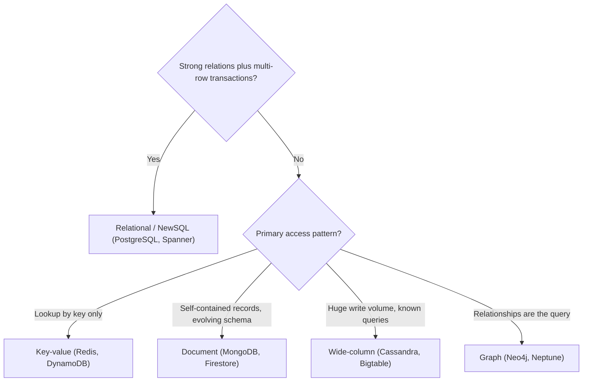

"Should I use SQL or NoSQL?" is one of the most common — and most mangled — questions in system design. NoSQL is not one thing, and SQL is not obsolete. The honest answer is that your **access patterns** should drive the choice, and this chapter gives you the vocabulary to make that call deliberately.

## Relational databases and ACID

Relational databases — **PostgreSQL**, **MySQL**, **Oracle**, **SQL Server** — model data as tables of rows and columns with a fixed, declared schema, linked by foreign keys. You query them with SQL, and the engine's optimizer figures out *how* to execute your declarative query.

Their defining strength is **ACID** transactions:

- **Atomicity** — a transaction's writes all apply or none do.
- **Consistency** — every commit moves the database from one valid state to another, honoring constraints.
- **Isolation** — concurrent transactions behave as if run one at a time (tunable via isolation levels like Read Committed and Serializable).
- **Durability** — once committed, data survives crashes (via the write-ahead log).

This makes relational databases the default for anything where correctness under concurrency matters — money, inventory, bookings, ledgers.

### Normalization

Relational schemas favor **normalization**: store each fact exactly once and reference it by key, eliminating redundancy. A customer's address lives in one `customers` row, not copied onto every order.

```sql
-- Normalized: no duplicated customer data, joined at read time
SELECT o.id, o.total, c.name, c.city
FROM orders o
JOIN customers c ON c.id = o.customer_id
WHERE o.created_at > '2026-06-01';
```

Normalization keeps writes simple and consistent (update one place) at the cost of **joins** at read time, which can get expensive at scale and are hard to perform across shards. NoSQL stores typically flip this trade-off, **denormalizing** so a read touches one record.

## The NoSQL families

"NoSQL" ("Not Only SQL") covers four broadly different data models. They generally relax schema rigidity and joins in exchange for horizontal scalability and flexible structure.

### Key-value stores

The simplest model: a giant distributed hash map of `key → opaque value`. Operations are essentially `get`, `put`, `delete`. Examples: **Redis**, **Amazon DynamoDB** (at its core), **Riak**, **etcd**. Blazing fast, trivially partitionable. Used for caching, session stores, feature flags, rate-limit counters. The limitation: you can only look things up by key — no querying by value.

### Document stores

Store self-contained, semi-structured documents (JSON/BSON), each potentially with a different shape. Examples: **MongoDB**, **Couchbase**, **Amazon DocumentDB**, **Firestore**. You can query and index on fields inside the document, and you denormalize related data into one document so a read is a single fetch.

```json
{
  "_id": "u_8675309",
  "name": "Jenny",
  "addresses": [
    { "type": "home", "city": "Reno" }
  ],
  "orders": [ { "id": "o_1", "total": 42.00 } ]
}
```

Great for catalogs, user profiles, content, and rapidly evolving schemas. Weaker for many-to-many relationships and multi-document transactions (though MongoDB now supports them).

### Wide-column stores

Data is organized by row key into column families; rows can have billions of columns and need not share the same columns. Examples: **Apache Cassandra**, **HBase**, **Google Bigtable**, **ScyllaDB**. Built for enormous write throughput and linear horizontal scale across commodity nodes. Crucially, you design the table **around the query you will run** — there are no flexible ad-hoc joins. Ideal for time-series, event logging, IoT, and messaging at petabyte scale.

### Graph databases

Model data as nodes and edges, both with properties, so relationships are first-class. Examples: **Neo4j**, **Amazon Neptune**, **JanusGraph**. They make traversals like "friends of friends who liked X" cheap, whereas the same query in SQL is a pile of recursive self-joins. Used for social graphs, fraud rings, recommendation engines, and knowledge graphs.

## ACID vs BASE

Many NoSQL systems trade strict ACID for **BASE**:

- **Basically Available** — the system answers, even if some nodes are down.
- **Soft state** — data may be in flux as it propagates.
- **Eventually consistent** — replicas converge to the same value given enough time, but a read may briefly return stale data.

This is the **CAP**-driven trade-off: under a network partition you choose availability (BASE, e.g., Cassandra/Dynamo) or strong consistency (CP-leaning relational). Note the line is blurry today — many "NoSQL" systems offer tunable consistency, and **NewSQL** databases (**Google Spanner**, **CockroachDB**, **YugabyteDB**) deliver ACID *and* horizontal scale.

## Schema-on-write vs schema-on-read

- **Schema-on-write** (relational): structure is enforced at insert time; bad data is rejected at the door. Predictable, validated, but migrations are heavy.
- **Schema-on-read** (most NoSQL): you store whatever shape you like; the *application* interprets structure when reading. Flexible and migration-light, but the burden of handling variation moves into your code, and inconsistency can creep in.

## Choosing: let access patterns decide

Start by asking whether you need strong relational integrity and multi-row transactions. If yes, default to relational (or NewSQL when you also need horizontal scale). If not, let the dominant access pattern pick the NoSQL family.



| Model | Best for | Example DBs | Strengths | Weaknesses |
|-------|----------|-------------|-----------|------------|
| Relational | Transactions, complex queries, strong consistency | PostgreSQL, MySQL, Oracle | ACID, joins, mature tooling, ad-hoc SQL | Harder to scale writes horizontally; rigid schema |
| Key-value | Caching, sessions, counters | Redis, DynamoDB, etcd | Fastest, simple, easy to shard | Lookup by key only; no rich queries |
| Document | Profiles, catalogs, content, evolving schemas | MongoDB, Couchbase, Firestore | Flexible schema, indexed fields, one-fetch reads | Weak cross-document joins/transactions |
| Wide-column | Time-series, logs, IoT, huge write volume | Cassandra, HBase, Bigtable | Massive write throughput, linear scale | Query-first design; no ad-hoc joins |
| Graph | Highly connected data, traversals | Neo4j, Neptune, JanusGraph | Fast relationship traversal | Hard to scale horizontally; niche query language |

Practical guidance:

- **Default to relational** unless you have a concrete reason not to. It is well understood, ACID-safe, and handles surprising scale; you rarely regret starting here.
- **Reach for key-value** when you only ever fetch by a known key and need extreme speed.
- **Reach for document** when each entity is self-contained and your schema evolves fast.
- **Reach for wide-column** when write volume and horizontal scale dominate and queries are known in advance.
- **Reach for graph** when the *relationships* are the product (social, fraud, recommendations).

## Polyglot persistence

Real systems rarely pick one. **Polyglot persistence** means using the right store per workload: PostgreSQL for orders and payments, Redis for sessions and caching, Elasticsearch for search, Cassandra for the activity feed, and Neo4j for the social graph — all in one product. The cost is operational complexity and keeping data in sync across stores (often via change-data-capture and event streams). The benefit is that each workload runs on a database actually suited to it.

## Key takeaways

- "NoSQL" is four distinct models — key-value, document, wide-column, graph — not a single alternative to SQL.
- Relational databases give you ACID, joins, and ad-hoc SQL; they are the right default for transactional correctness.
- NoSQL stores trade joins and strict schemas for horizontal scale and flexibility, often under BASE/eventual consistency.
- Your **access patterns**, not hype, should drive the choice: query by key, by document field, by partition, or by relationship.
- Schema-on-write validates up front; schema-on-read pushes flexibility (and responsibility) into application code.
- Mature systems use polyglot persistence and, increasingly, NewSQL (Spanner, CockroachDB) to get ACID plus scale.
