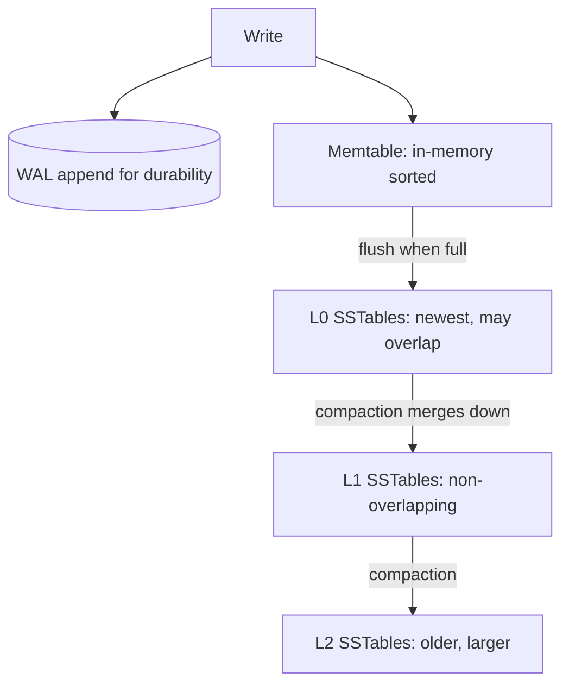

Underneath every database is a storage engine deciding how bytes are laid out on disk and how they are found again. The two dominant designs — B-Trees and LSM-Trees — make opposite bets about whether your workload reads more or writes more, and understanding that bet explains most of the performance behavior you will ever observe.

## The role of indexes

A table without an index is a heap: finding a row means scanning every row, O(n). An index is an auxiliary data structure that maps a key to the location of its data, turning a full scan into a logarithmic lookup. The catch is that every index must be kept in sync on writes, so each index you add speeds reads but taxes inserts, updates, and deletes — and consumes extra space. Choosing a storage engine is largely choosing how that index is structured and maintained.

## B-Tree: read-optimized, in-place

A B-Tree (technically a B+Tree in most databases) is a balanced tree of fixed-size **pages** (typically 4–16 KB). Internal pages hold keys that route you toward leaf pages, where the actual rows (or row pointers) live. With a high fan-out — hundreds of keys per page — even a billion-row table is only 3–4 levels deep, so a lookup is a handful of page reads.

```
            [ 30 | 70 ]                  internal (router)
           /     |     \
     [10|20] [40|50|60] [80|90]          leaf pages (data)
```

Writes happen **in place**: to update a row, the engine finds its leaf page and overwrites it. To stay crash-safe, the page modification is first recorded in a **write-ahead log (WAL)**, then the page is updated. When a page fills, it splits into two and a separator key is pushed up. Because updates overwrite, a B-Tree keeps roughly one copy of each row, giving low space amplification and predictable, low-latency reads. The downsides: every write may turn into a random disk write (the leaf page can be anywhere), and concurrency requires careful page-level latching. Used by **MySQL/InnoDB, PostgreSQL, Oracle, SQL Server** — the classic OLTP engines.

## LSM-Tree: write-optimized, append + merge

A Log-Structured Merge-Tree turns random writes into sequential ones by never modifying data in place. Writes go to an in-memory sorted structure (the **memtable**, often a skip list or red-black tree) and are simultaneously appended to a WAL for durability. When the memtable fills (e.g. 64 MB), it is flushed to disk as an immutable, sorted file called an **SSTable** (Sorted String Table). Later background **compaction** merges SSTables, discarding overwritten and deleted entries.



A **read** must check the memtable first, then SSTables from newest to oldest, because a key may exist in several files with the newest copy winning. To avoid touching every file, each SSTable carries a **Bloom filter** (see the probabilistic structures chapter): the engine asks "could this key be here?" and only reads files that say "maybe," eliminating most useless disk seeks on point lookups. Deletes are written as **tombstone** markers and only physically removed during compaction.

Because flushes and compactions are large sequential writes, LSMs sustain very high write throughput and compress well (sorted data + no in-place holes), giving low space amplification when compaction keeps up. Used by **Cassandra, RocksDB, LevelDB, HBase, ScyllaDB**, and as an option in MySQL (MyRocks) and MongoDB (WiredTiger uses a hybrid).

## The three amplifications

Storage engines are judged on three "amplification" factors — how much extra work or space they incur per logical operation:

- **Write amplification**: bytes written to disk per byte of user data. LSM compaction rewrites the same data many times as it moves down levels (can be 10–30×). B-Trees rewrite the whole page for a small change, plus the WAL.
- **Read amplification**: disk reads per logical read. LSMs may probe multiple levels (mitigated by Bloom filters and block caches). B-Trees pay ~tree-height reads — consistently low.
- **Space amplification**: disk used per byte of live data. B-Trees leave pages partially full (fragmentation, ~1.3×). LSMs temporarily hold obsolete and tombstoned data until compaction reclaims it.

You cannot minimize all three at once — it is a fundamental trilemma (the "RUM conjecture": Read, Update, Memory — optimize two, pay on the third).

## Compaction strategies

How an LSM compacts is the main knob for trading write vs read/space amplification:

- **Size-tiered (STCS)**: merge SSTables of similar size into a bigger one. Low write amplification, high space and read amplification (many overlapping files). Cassandra's default for write-heavy workloads.
- **Leveled (LCS)**: keep each level a set of non-overlapping SSTables, each level ~10× the previous. Low read and space amplification (a key is in at most one file per level), higher write amplification. RocksDB/LevelDB default; good for read-heavy or update-heavy data.

## Comparison

| Dimension | B-Tree | LSM-Tree |
|---|---|---|
| Write pattern | In-place, random | Append-only, sequential |
| Write throughput | Moderate | High |
| Read latency | Low, predictable | Higher; helped by Bloom filters/cache |
| Write amplification | Page + WAL | High (compaction) |
| Space amplification | Fragmentation (~1.3×) | Obsolete data until compaction |
| Deletes | Update in place | Tombstone + later compaction |
| Concurrency | Page latching | Immutable files = easy concurrency |
| Examples | InnoDB, Postgres, Oracle | Cassandra, RocksDB, HBase |

## Secondary indexes and clustering

The discussion so far covers the **primary** index keyed on the row's identifier. A **secondary index** indexes some other column; its entries point at rows either by primary key or by physical location.

- **Clustered index**: the table's rows are stored *inside* the primary index's leaf nodes, in key order (InnoDB's primary key, SQL Server clustered index). A primary-key lookup returns the row directly — no second hop. Secondary indexes then store the primary key as the pointer, so a secondary lookup costs two index traversals.
- **Non-clustered / heap-organized**: the index holds a pointer to a separately-stored row (PostgreSQL's heap + `ctid`). All indexes are equal; lookups always do an extra fetch to the heap.

## OLTP vs OLAP and columnar storage

Everything above is **row-oriented**, ideal for OLTP: read or write whole rows by key, low latency, high concurrency. Analytical workloads (OLAP) instead scan a few columns across billions of rows ("average revenue by region last quarter"). There, **columnar** storage wins: store each column contiguously so a query reads only the columns it needs, and compresses brilliantly (run-length, dictionary encoding on similar adjacent values). This is the model behind Parquet/ORC files and warehouses like **ClickHouse, Apache Druid, Snowflake, BigQuery, and Amazon Redshift** — covered in depth in the OLAP chapter.

## Key takeaways

- An index trades faster reads for slower writes and more space; the storage engine decides how that index is structured.
- B-Trees update in place, give low and predictable read latency, and power traditional OLTP databases (Postgres, MySQL/InnoDB).
- LSM-Trees append to a memtable + WAL, flush immutable SSTables, and compact in the background — maximizing write throughput, at the cost of compaction-driven write amplification.
- Every engine balances read, write, and space amplification; you optimize two and pay on the third (the RUM trade-off).
- Bloom filters per SSTable and leveled vs size-tiered compaction are the practical levers that make LSM reads tolerable.
- Choose clustered indexes to avoid an extra fetch on primary lookups, and reach for columnar storage when the workload is analytical scans, not point operations.
